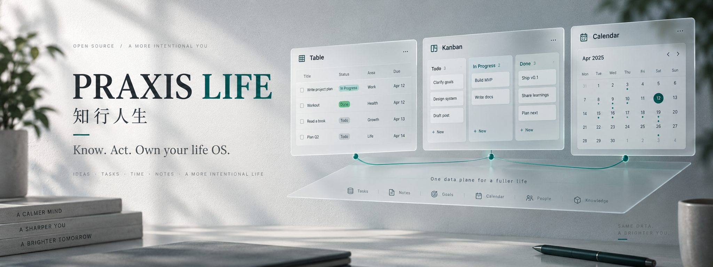

<p align="center">
  
</p>

<h1 align="center">Praxis Life</h1>

<p align="center">
  <em>知行人生</em> — know, then act; refine life through practice.<br/>
  <strong>Self-hosted life OS</strong> for humans and agents on one private data plane.
</p>

<p align="center">
  <a href="#english">English</a> ·
  <a href="#中文">中文</a> ·
  <a href="./docs/MCP_AGENT_GUIDE.md">MCP Agent Guide</a>
</p>

---

<a id="english"></a>

## English

### Why this exists

Most life tools either lock your data in a SaaS silo, or give agents a chatbot with no durable structure. **Praxis Life** takes the opposite bet: a **self-hosted bitable** you own, with views humans already understand (grid / kanban / calendar / gallery / form / gantt), plus a first-class **MCP + REST** surface so external agents operate on the *same* records — under ACL, not vibes.

*Praxis* is the classical word for uniting knowing and doing — the same spirit as 知行. The product tagline: *Don't wait for perfect. Refine through knowing and doing.*

### Highlights

- **Owned data plane** — SQLite on disk (`data/duowei.db`). No tenant rent. Back up with files or WebDAV.
- **Views that matter** — Grid, Kanban, Calendar, Gallery, Form, Gantt; filters, groups, color rules, protected views.
- **Human + Agent** — Register MCP agents (`dwa_…`), scope them to bases/tables, automate and approve like prod.
- **Ops-ready auth** — Invite-only (no public signup), captcha, optional email OTP, lockout, role model (admin / member × owner / editor / viewer).
- **Ship paths** — Local `npm run dev`, production Node, or Docker Compose on port 80.

### Stack

| Layer | Choice |
| --- | --- |
| API | Hono + Node |
| Storage | libSQL / SQLite |
| Web | React 19 + Vite |
| Agents | Model Context Protocol (`src/mcp.ts`) |

### Requirements

- **Node.js 22+** (Docker image uses `node:22`)
- macOS / Linux / WSL recommended

### Quick start (local)

```bash
git clone https://github.com/zhaopeinan/praxis-life.git
cd praxis-life
npm install
npm run dev
```

| Surface | URL |
| --- | --- |
| Web UI | http://127.0.0.1:5174 |
| API | http://127.0.0.1:8787 |

Database file: `data/duowei.db` (gitignored).

**First boot:** registration is closed. On an empty database, the UI walks you through creating the **first admin**, or bootstrap via env:

```bash
export DUOWEI_BOOTSTRAP_EMAIL=admin@example.com
export DUOWEI_BOOTSTRAP_PASSWORD='choose-a-strong-password'
export DUOWEI_BOOTSTRAP_NAME=Admin
npm run dev
```

Login always requires a **captcha**. Email OTP is optional (see Configuration).

### Production (Node)

```bash
npm ci
npm run build:web
DUOWEI_HOST=0.0.0.0 \
DUOWEI_WEB_ROOT=./dist-web \
DUOWEI_DEV_CODES=0 \
DUOWEI_COOKIE_SECURE=1 \
npm start
```

Serve TLS at your reverse proxy. Set `DUOWEI_COOKIE_SECURE=1` when cookies travel over HTTPS.

### Production (Docker)

```bash
docker compose up -d --build
# http://localhost/  → container :8787
```

Persist `./data`. Optional bootstrap vars are commented in `docker-compose.yml`.

### Deploying to Aliyun (`http://47.122.123.1/`)

That host is in mainland China (Aliyun) and has **no ICP filing**, so reaching it by domain is blocked at the edge: plain HTTP returns a 403 ICP interstitial, and HTTPS is reset during the TLS handshake because Aliyun matches on the Host / TLS SNI value. **Access it by IP instead** — the edge does not intercept requests whose Host is the bare IP. Caddy on that box exposes DuoWei at `http://47.122.123.1/`.

The box runs **podman** and has no compose provider, so images are built locally and shipped over SSH instead of pulled:

```bash
scripts/deploy-aliyun.sh            # build linux/amd64 + deploy + smoke check
scripts/deploy-aliyun.sh --no-build # reuse the local duowei:latest
```

The script reads `aliyun.env` (gitignored; four lines: note / host / user / password), tars the live SQLite files on the server before restarting, then recreates the container with the same port, env vars, and `./data` bind mount. Requires `sshpass`.

### Configuration

| Variable | Purpose |
| --- | --- |
| `DUOWEI_HOST` / `DUOWEI_PORT` | Bind address (default `127.0.0.1:8787`) |
| `DUOWEI_WEB_ROOT` | Built SPA directory in production |
| `DUOWEI_COOKIE_SECURE` | `1` behind HTTPS; **`0` on the Aliyun IP entry, which is plain HTTP** |
| `DUOWEI_DEV_CODES` | `0` in prod — never echo OTP in the UI |
| `DUOWEI_BOOTSTRAP_*` | Seed first admin on empty DB |
| `SMTP_HOST` `SMTP_PORT` `SMTP_SECURE` `SMTP_USER` `SMTP_PASS` `SMTP_FROM` | Email OTP |

Without SMTP, OTP codes appear in the login form (**dev only**). Production must set `DUOWEI_DEV_CODES=0` and real SMTP.

### Agents & MCP

1. Admin creates/approves an agent in **Agent 管理**, or the agent calls `POST /api/mcp-agents/register`.
2. Get the agent token `dwa_…` — always visible and copyable in **Agent 管理** (personal `dw_…` tokens are **not** accepted by MCP).
3. Point your client at this repo:

```json
{
  "mcpServers": {
    "praxis-life": {
      "command": "npx",
      "args": ["tsx", "src/mcp.ts"],
      "cwd": "/absolute/path/to/praxis-life",
      "env": { "DUOWEI_TOKEN": "dwa_..." }
    }
  }
}
```

For the **deployed** instance, use `http://47.122.123.1` as the REST base — not a domain, which the Chinese edge blocks (see the Aliyun section). Field writes use **field names**, not internal ids. Full tool contract: [`docs/MCP_AGENT_GUIDE.md`](./docs/MCP_AGENT_GUIDE.md).

### Security posture (short)

- No self-serve signup after bootstrap
- Failed logins lock for 10 minutes
- Captcha is single-use; email OTP TTL 10 minutes (rate-limited)
- Table ACL: owner / editor / viewer; row rules available for finer isolation

### Develop & test

```bash
npm run typecheck
npm test
npm run build:web
```

### Status

Actively developed open source. Capability map vs. Feishu-style bitable: [`docs/IMPLEMENTATION_STATUS.md`](./docs/IMPLEMENTATION_STATUS.md).

---

<a id="中文"></a>

## 中文

### 它解决什么问题

多数人生工具要么把数据锁进 SaaS，要么只给 Agent 一个没有结构的对话框。**Praxis Life（知行人生）**反过来做：你自托管一份**多维表格数据面**，人类用熟悉的视图工作；外部 Agent 通过 **MCP / REST** 在同一 ACL 下读写同一批记录——事实只有一份。

*Praxis* 即「知行」：把认知落到行动里。产品一句话：**不要为完美而等待，在知行中完善。**

### 能力摘要

- **数据在自己机器上** — SQLite（`data/duowei.db`），可文件备份 / 坚果云 WebDAV
- **完整视图** — 表格、看板、日历、画廊、表单、甘特；筛选、分组、填色、视图保护
- **人机共管** — 注册 MCP Agent（`dwa_…`）、按表授权、可审批启用
- **可上线的鉴权** — 不开放自助注册；图形验证码；可选邮箱验证码；锁定与角色模型
- **多种部署** — 本地开发、Node 生产、Docker Compose

### 环境要求

- **Node.js 22+**
- 推荐 macOS / Linux / WSL

### 本地启动

```bash
git clone https://github.com/zhaopeinan/praxis-life.git
cd praxis-life
npm install
npm run dev
```

| 入口 | 地址 |
| --- | --- |
| 网页 | http://127.0.0.1:5174 |
| API | http://127.0.0.1:8787 |

数据文件：`data/duowei.db`（已在 `.gitignore`）。

**首次使用：** 不开放公开注册。空库时浏览器会引导创建首位管理员，也可用环境变量引导：

```bash
export DUOWEI_BOOTSTRAP_EMAIL=admin@example.com
export DUOWEI_BOOTSTRAP_PASSWORD='换成足够长的密码'
export DUOWEI_BOOTSTRAP_NAME=管理员
npm run dev
```

登录必须填写**图形验证码**。邮箱验证码见下方配置。

### 生产部署（Node）

```bash
npm ci
npm run build:web
DUOWEI_HOST=0.0.0.0 \
DUOWEI_WEB_ROOT=./dist-web \
DUOWEI_DEV_CODES=0 \
DUOWEI_COOKIE_SECURE=1 \
npm start
```

TLS 交给反向代理；HTTPS 下请开启 `DUOWEI_COOKIE_SECURE=1`。

### 生产部署（Docker）

```bash
docker compose up -d --build
# 浏览器访问 http://localhost/
```

持久化目录 `./data`。首次管理员可用 `docker-compose.yml` 中注释的引导变量。

### 部署到阿里云（http://47.122.123.1/）

这台主机在国内（阿里云）且**未备案**，用域名访问会在边缘被拦：HTTP 返回 403 备案拦截页，
HTTPS 在 TLS 握手阶段被重置（阿里云按 Host / TLS SNI 里的域名匹配）。**请直接用 IP 访问**——
Host 是裸 IP 的请求不会被拦截。该机的 Caddy 已把 DuoWei 暴露在 `http://47.122.123.1/`，
容器本身仍只绑 `127.0.0.1:8787`，由 Caddy 反代。

那台机器用的是 **podman**，没有 compose provider，所以镜像不在服务器上构建，而是本机构建后经 SSH 送过去：

```bash
scripts/deploy-aliyun.sh            # 构建 linux/amd64 + 部署 + 冒烟检查
scripts/deploy-aliyun.sh --no-build # 复用本机已有的 duowei:latest
```

脚本从 `aliyun.env` 读取连接信息（已被 gitignore；四行依次为 备注 / 主机 / 用户 / 密码），重启前会先在服务器上打包当前的 SQLite 文件，然后用同样的端口、环境变量和 `./data` 挂载重建容器。依赖 `sshpass`。

### 配置项

| 变量 | 含义 |
| --- | --- |
| `DUOWEI_HOST` / `DUOWEI_PORT` | 监听地址（默认 `127.0.0.1:8787`） |
| `DUOWEI_WEB_ROOT` | 生产环境前端构建目录 |
| `DUOWEI_COOKIE_SECURE` | HTTPS 下设为 `1`；**阿里云 IP 入口是明文 HTTP，必须设为 `0`** |
| `DUOWEI_DEV_CODES` | 生产必须 `0`，禁止在页面回显验证码 |
| `DUOWEI_BOOTSTRAP_*` | 空库时自动创建管理员 |
| `SMTP_*` | 邮箱验证码发信 |

未配置 SMTP 时，验证码会显示在登录表单（仅适合开发）。生产务必 `DUOWEI_DEV_CODES=0` 并配置真实 SMTP。

### Agent / MCP

1. 管理员在「Agent 管理」创建并启用，或 Agent 调用 `POST /api/mcp-agents/register` 后等待批准。
2. 获得 Agent 令牌 `dwa_…`，在「Agent 管理」列表里随时可查看与复制（个人访问令牌 `dw_…` **不能**用于 MCP）。
3. 客户端配置示例：

```json
{
  "mcpServers": {
    "praxis-life": {
      "command": "npx",
      "args": ["tsx", "src/mcp.ts"],
      "cwd": "/绝对路径/praxis-life",
      "env": { "DUOWEI_TOKEN": "dwa_..." }
    }
  }
}
```

**线上实例**的 REST 根地址用 `http://47.122.123.1`，不要用域名（会被国内边缘按未备案域名拦截，见上文阿里云部署）。写记录时使用**字段名**，不要用内部 id。完整协议见 [`docs/MCP_AGENT_GUIDE.md`](./docs/MCP_AGENT_GUIDE.md)。

### 权限与安全（摘要）

- 引导完成后不可自助注册
- 登录失败累计锁定 10 分钟
- 图形验证码一次性；邮箱验证码 10 分钟有效，发送有速率限制
- 系统角色：管理员 / 成员；表格角色：所有者 / 可编辑 / 可查看

### 开发与测试

```bash
npm run typecheck
npm test
npm run build:web
```

### 现状

持续开源演进。相对飞书多维表格能力的落地对照：[`docs/IMPLEMENTATION_STATUS.md`](./docs/IMPLEMENTATION_STATUS.md)。

---

<p align="center">
  <sub>Praxis Life · 知行人生 — self-hosted life OS for humans and agents.</sub>
</p>
