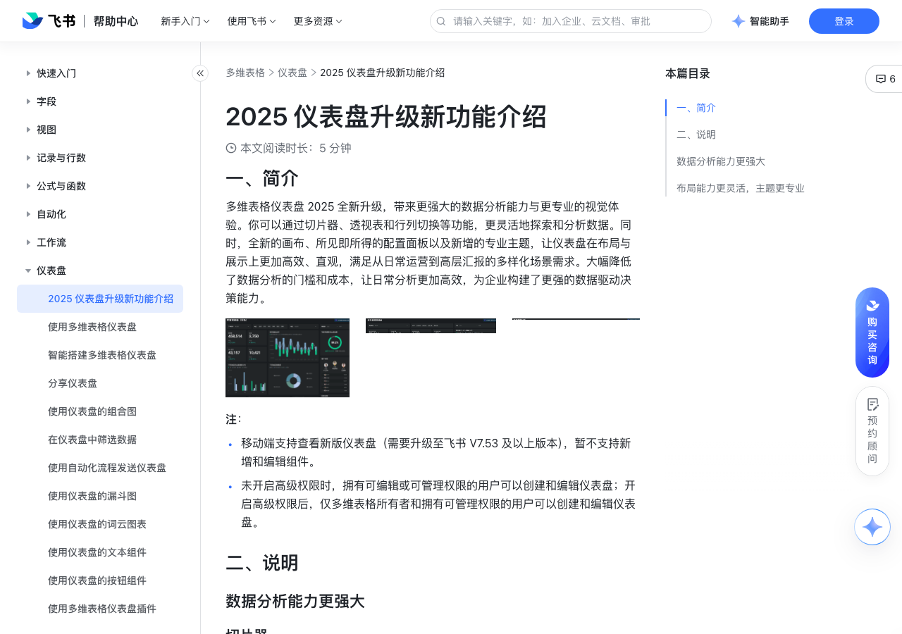

# 2025 仪表盘升级新功能介绍

> 来源：[飞书帮助中心](https://www.feishu.cn/hc/zh-CN/articles/014911128008)  
> 分类：多维表格 / 仪表盘  
> 抓取时间：2026-09-22T01:27:03.408Z

## 界面截图

### 文档内配图

1. 配图：https://p1-hera.feishucdn.com/tos-cn-i-jbbdkfciu3/5760113a166e4931a5750429c59aa9ec~tplv-jbbdkfciu3-image:0:0.image
2. 配图：https://p1-hera.feishucdn.com/tos-cn-i-jbbdkfciu3/a9074019e4744721b743227ea6c31b6c~tplv-jbbdkfciu3-image:0:0.image
3. 配图：https://p1-hera.feishucdn.com/tos-cn-i-jbbdkfciu3/1ed7f10467ba4760907a6ae5b8d51081~tplv-jbbdkfciu3-image:0:0.image
4. 配图：https://p1-hera.feishucdn.com/tos-cn-i-jbbdkfciu3/1d5cd1fd24614afa918664071c6eafa4~tplv-jbbdkfciu3-image:0:0.image
5. 配图：https://p1-hera.feishucdn.com/tos-cn-i-jbbdkfciu3/1c2925afa90c45a6a55881c01b5da694~tplv-jbbdkfciu3-image:0:0.image
6. 配图：https://p1-hera.feishucdn.com/tos-cn-i-jbbdkfciu3/0fc0f41188aa482191c07180587120f8~tplv-jbbdkfciu3-image:0:0.image
7. 配图：https://p1-hera.feishucdn.com/tos-cn-i-jbbdkfciu3/08b04ac42c3a429888b803617c19df59~tplv-jbbdkfciu3-image:0:0.image
8. 配图：https://p1-hera.feishucdn.com/tos-cn-i-jbbdkfciu3/366b856c468f4b1b980978b9690c3b6b~tplv-jbbdkfciu3-image:0:0.image
9. 配图：https://p1-hera.feishucdn.com/tos-cn-i-jbbdkfciu3/8bc043bb79b543bfb38945e37655dd8f~tplv-jbbdkfciu3-image:0:0.image
10. 配图：https://p1-hera.feishucdn.com/tos-cn-i-jbbdkfciu3/7a17c6e5f23d4f46a3d4311bf6fc15ad~tplv-jbbdkfciu3-image:0:0.image
11. 配图：https://p1-hera.feishucdn.com/tos-cn-i-jbbdkfciu3/18205d6663874c9bb73ac616169db755~tplv-jbbdkfciu3-image:0:0.image

## 功能定位

本页对应飞书帮助中心「多维表格 / 仪表盘」下的「2025 仪表盘升级新功能介绍」。以下需求描述依据官方说明文档提炼，用于指导 DuoWei 对标实现。

## 功能目标

一、简介

## 文档结构（官方章节）

- 一、简介​
- 二、说明​
- 数据分析能力更强大​
- 切片器​
- TopN​
- 透视表​
- 切换行/列​
- 布局能力更灵活，主题更专业​
- 画布​
- 配置面板​
- 主题​

## 详细功能说明

一、简介

移动端支持查看新版仪表盘（需要升级至飞书 V7.53 及以上版本），暂不支持新增和编辑组件。

未开启高级权限时，拥有可编辑或可管理权限的用户可以创建和编辑仪表盘；开启高级权限后，仅多维表格所有者和拥有可管理权限的用户可以创建和编辑仪表盘。

二、说明

数据分析能力更强大

TopN

切换行/列

布局能力更灵活，主题更专业

配置面板

## 实现要点（对标 DuoWei）

1. **入口与信息架构**：在产品中明确该能力所属模块（仪表盘），并保证用户可从对应导航触达。
2. **核心交互**：按上文「详细功能说明」还原主要操作路径；截图中出现的按钮、字段、面板命名尽量与飞书语义一致或可映射。
3. **数据与权限**：若文档涉及可见范围、可编辑范围、分享或高级权限，实现时需落到角色/成员模型，并保证 API/MCP 与 UI 权限一致。
4. **边界与上限**：若文档提到数量上限、格式限制、导入导出约束，需在实现与错误提示中体现。
5. **验收**：以本页截图场景为用例，完成「能打开 / 能配置 / 能保存 / 能被 Agent 读写（如适用）」四项检查。

## 原始摘录摘要

> 一、简介 移动端支持查看新版仪表盘（需要升级至飞书 V7.53 及以上版本），暂不支持新增和编辑组件。 未开启高级权限时，拥有可编辑或可管理权限的用户可以创建和编辑仪表盘；开启高级权限后，仅多维表格所有者和拥有可管理权限的用户可以创建和编辑仪表盘。 二、说明 数据分析能力更强大 TopN 切换行/列 布局能力更灵活，主题更专业 配置面板

## 元数据

- article_id: `7425498152629239809`
- category_id: `7165754521875005468`
- path: `/hc/zh-CN/articles/014911128008`
- extracted_text_length: 169
