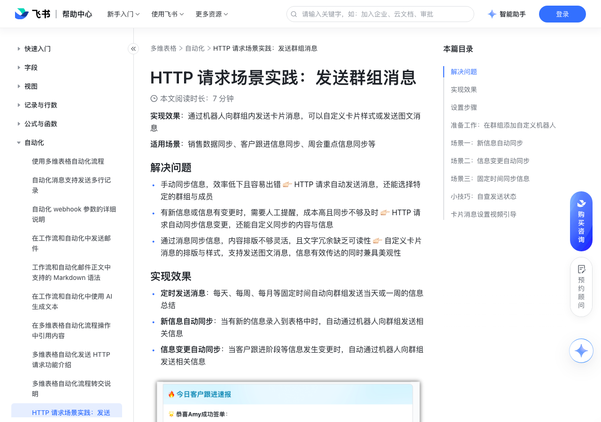

# HTTP 请求场景实践：发送群组消息

> 来源：[飞书帮助中心](https://www.feishu.cn/hc/zh-CN/articles/210379139574)  
> 分类：多维表格 / 自动化  
> 抓取时间：2026-09-22T01:24:02.144Z

## 界面截图

### 文档内配图

1. 配图：https://p1-hera.feishucdn.com/tos-cn-i-jbbdkfciu3/e9f53bc2262f4fe0b55718cb910d3219~tplv-jbbdkfciu3-image:0:0.image
2. 配图：https://p1-hera.feishucdn.com/tos-cn-i-jbbdkfciu3/cd5d0ac61c264875aac8ca9f529b29ac~tplv-jbbdkfciu3-image:0:0.image
3. 配图：https://p1-hera.feishucdn.com/tos-cn-i-jbbdkfciu3/306127f8a00c4286913fe11c6ba6457b~tplv-jbbdkfciu3-image:0:0.image
4. 配图：https://p1-hera.feishucdn.com/tos-cn-i-jbbdkfciu3/29d317af8ffa428b8851964522819a2a~tplv-jbbdkfciu3-image:0:0.image
5. 配图：https://p1-hera.feishucdn.com/tos-cn-i-jbbdkfciu3/bd4735fd724f4c058c65ad0cf4217e6c~tplv-jbbdkfciu3-image:0:0.image
6. 配图：https://p1-hera.feishucdn.com/tos-cn-i-jbbdkfciu3/2587e3b638134079ba808036d32ccf5a~tplv-jbbdkfciu3-image:0:0.image
7. 配图：https://p1-hera.feishucdn.com/tos-cn-i-jbbdkfciu3/090b848d3e20420892c5a4f97a9f461d~tplv-jbbdkfciu3-image:0:0.image
8. image.png：https://p1-hera.feishucdn.com/tos-cn-i-jbbdkfciu3/f6c0e27cc4be4dafaa83aff6557d1191~tplv-jbbdkfciu3-image:0:0.image
9. 配图：https://p1-hera.feishucdn.com/tos-cn-i-jbbdkfciu3/b51335eac3b64823a04bfb144918b0b4~tplv-jbbdkfciu3-image:0:0.image
10. 配图：https://p1-hera.feishucdn.com/tos-cn-i-jbbdkfciu3/b31f119fc4eb4decaf9d6e959a8da875~tplv-jbbdkfciu3-image:0:0.image
11. 配图：https://p1-hera.feishucdn.com/tos-cn-i-jbbdkfciu3/a110e721f0bf42ddb38f1900041efeaf~tplv-jbbdkfciu3-image:0:0.image
12. 配图：https://p1-hera.feishucdn.com/tos-cn-i-jbbdkfciu3/e35da2e77d8442d68b7a59b5888c9c12~tplv-jbbdkfciu3-image:0:0.image
13. image.png：https://p1-hera.feishucdn.com/tos-cn-i-jbbdkfciu3/4ed0e82f3eb240228c38846ec1c36124~tplv-jbbdkfciu3-image:0:0.image
14. 配图：https://p1-hera.feishucdn.com/tos-cn-i-jbbdkfciu3/5a0fc83d8792488995a47d809243ed40~tplv-jbbdkfciu3-image:0:0.image
15. 配图：https://p1-hera.feishucdn.com/tos-cn-i-jbbdkfciu3/f3df2794f4c34100b5908baed9f2e886~tplv-jbbdkfciu3-image:0:0.image
16. 配图：https://p1-hera.feishucdn.com/tos-cn-i-jbbdkfciu3/f6db909ea4844f80953659607093820d~tplv-jbbdkfciu3-image:0:0.image
17. 配图：https://p1-hera.feishucdn.com/tos-cn-i-jbbdkfciu3/9ca668e5314e4535901622e4dae59ece~tplv-jbbdkfciu3-image:0:0.image
18. image.png：https://p1-hera.feishucdn.com/tos-cn-i-jbbdkfciu3/2669fea524df4f4bb7281a2a7a0780db~tplv-jbbdkfciu3-image:0:0.image
19. 配图：https://p1-hera.feishucdn.com/tos-cn-i-jbbdkfciu3/e8e225081cd245bf93ebc37fcc894aaa~tplv-jbbdkfciu3-image:0:0.image
20. 配图：https://p1-hera.feishucdn.com/tos-cn-i-jbbdkfciu3/bb8d672e020c4051b26916aa807eafc9~tplv-jbbdkfciu3-image:0:0.image
21. 配图：https://p1-hera.feishucdn.com/tos-cn-i-jbbdkfciu3/fd882643a37b49018e6422d38d674e70~tplv-jbbdkfciu3-image:0:0.image
22. 配图：https://p1-hera.feishucdn.com/tos-cn-i-jbbdkfciu3/ff8032df8fb44cab99f6663f8c80bd56~tplv-jbbdkfciu3-image:0:0.image
23. 配图：https://p1-hera.feishucdn.com/tos-cn-i-jbbdkfciu3/f1a075c47519464e9f120d1637a221f5~tplv-jbbdkfciu3-image:0:0.image
24. 配图：https://p1-hera.feishucdn.com/tos-cn-i-jbbdkfciu3/eed21b442db04c80b33e8eb08325ca28~tplv-jbbdkfciu3-image:0:0.image

## 功能定位

本页对应飞书帮助中心「多维表格 / 自动化」下的「HTTP 请求场景实践：发送群组消息」。以下需求描述依据官方说明文档提炼，用于指导 DuoWei 对标实现。

## 功能目标

适用场景：销售数据同步、客户跟进信息同步、周会重点信息同步等

## 文档结构（官方章节）

- 解决问题​
- 实现效果​
- 设置步骤​
- 准备工作：在群组添加自定义机器人​
- 场景一：新信息自动同步​
- 场景二：信息变更自动同步​
- 场景三：固定时间同步信息​
- 小技巧：自查发送状态​
- 卡片消息设置视频引导​

## 详细功能说明

适用场景：销售数据同步、客户跟进信息同步、周会重点信息同步等

解决问题

手动同步信息，效率低下且容易出错 👉🏻 HTTP 请求自动发送消息，还能选择特定的群组与成员

有新信息或信息有变更时，需要人工提醒，成本高且同步不够及时 👉🏻 HTTP 请求自动同步信息变更，还能自定义同步的内容与信息

通过消息同步信息，内容排版不够灵活，且文字冗余缺乏可读性 👉🏻 自定义卡片消息的排版与样式，支持发送图文消息，信息有效传达的同时兼具美观性

实现效果

定时发送消息：每天、每周、每月等固定时间自动向群组发送当天或一周的信息总结

新信息自动同步：当有新的信息录入到表格中时，自动通过机器人向群组发送相关信息

信息变更自动同步：当客户跟进阶段等信息发生变更时，自动通过机器人向群组发送相关信息

设置步骤

准备工作：在群组添加自定义机器人

在需要发送消息的群组中，进入 群设置 > 群机器人 > 添加机器人 > 自定义机器人 添加一个自定义机器人

配置机器人并获取机器人的 webhook 地址

场景一：新信息自动同步

适用场景：每日商机录入情况同步，及时分配跟进线索

实现流程：成员每天通过表单填写商机情况，提交表单后自动通过机器人向群组同步相关信息

详细设置

截图示意

触发条件 - 添加新记录时注：推荐通过表单新增记录

250px|700px|reset

执行操作 - 发送 HTTP 请求

请求方法 - POST

请求 URL - 自定义机器人的 webhook 地址

250px|700px|reset250px|700px|reset

请求体 - raw在开放平台设置卡片样式并复制卡片代码将复制的代码填入右侧高亮处，并复制完整代码到请求体中即可

在开放平台设置卡片样式并复制卡片代码

将复制的代码填入右侧高亮处，并复制完整代码到请求体中即可

响应体 - JSON

场景二：信息变更自动同步

适用场景：销售战报同步，及时向成员同步赢客情况

实现流程：当客户跟进阶段变为赢得客户时，就向群里发送卡片消息

设置步骤：

触发条件 - 记录内容变更时

关注以下任一字段的变更 - 跟进阶段变更为等于赢得客户

请求体 - raw在开放平台设置卡片样式并复制卡片代码将复制的代码填入右侧高亮区内，并复制完整代码到请求体中即可

将复制的代码填入右侧高亮区内，并复制完整代码到请求体中即可

场景三：固定时间同步信息

适用场景：每日或每周客户信息汇总同步

实现流程：设置在每周固定的时间向群里发送消息

触发条件 - 定时触发

设置触发时间 - 选择发送消息的日期，并自定义重复的周期

小技巧：自查发送状态

在数据表中新增一个字段，用来记录 HTTP 请求发送详情

在发送 HTTP 请求的步骤之后点击 添加操作 > 修改记录

选择记录 > 第一步修改/新增/触发的记录

设置记录内容 > + 设置字段值 > 选择刚才添加的用来记录发送日志的字段

点击 + > 选择之前步骤产生的数据 > 选择上一步 HTTP 请求的返回值

保存并启用自动化后，即可查看每一次发送 HTTP 请求的详情

卡片消息设置视频引导

0.5x

0.75x

1.5x

设置项 | 详细设置 | 截图示意

触发条件 - 添加新记录时注：推荐通过表单新增记录 | / | 250px|700px|reset

执行操作 - 发送 HTTP 请求 | 请求方法 - POST | 250px|700px|reset

| 请求 URL - 自定义机器人的 webhook 地址 | 250px|700px|reset250px|700px|reset

| 请求体 - raw在开放平台设置卡片样式并复制卡片代码将复制的代码填入右侧高亮处，并复制完整代码到请求体中即可 | 250px|700px|reset

| 响应体 - JSON | /

| 返回值 | {}

触发条件 - 记录内容变更时 | 关注以下任一字段的变更 - 跟进阶段变更为等于赢得客户 | 250px|700px|reset

| 请求体 - raw在开放平台设置卡片样式并复制卡片代码将复制的代码填入右侧高亮区内，并复制完整代码到请求体中即可 | 250px|700px|reset

触发条件 - 定时触发 | 设置触发时间 - 选择发送消息的日期，并自定义重复的周期 | 250px|700px|reset

设置项 | 示意

在数据表中新增一个字段，用来记录 HTTP 请求发送详情 | 250px|700px|reset

在发送 HTTP 请求的步骤之后点击 添加操作 > 修改记录 | 250px|700px|reset

选择记录 > 第一步修改/新增/触发的记录 | 250px|700px|reset

设置记录内容 > + 设置字段值 > 选择刚才添加的用来记录发送日志的字段 | 250px|700px|reset

点击 + > 选择之前步骤产生的数据 > 选择上一步 HTTP 请求的返回值 | 250px|700px|reset

保存并启用自动化后，即可查看每一次发送 HTTP 请求的详情 | 250px|700px|reset

## 实现要点（对标 DuoWei）

1. **入口与信息架构**：在产品中明确该能力所属模块（自动化），并保证用户可从对应导航触达。
2. **核心交互**：按上文「详细功能说明」还原主要操作路径；截图中出现的按钮、字段、面板命名尽量与飞书语义一致或可映射。
3. **数据与权限**：若文档涉及可见范围、可编辑范围、分享或高级权限，实现时需落到角色/成员模型，并保证 API/MCP 与 UI 权限一致。
4. **边界与上限**：若文档提到数量上限、格式限制、导入导出约束，需在实现与错误提示中体现。
5. **验收**：以本页截图场景为用例，完成「能打开 / 能配置 / 能保存 / 能被 Agent 读写（如适用）」四项检查。

## 原始摘录摘要

> 适用场景：销售数据同步、客户跟进信息同步、周会重点信息同步等 解决问题 手动同步信息，效率低下且容易出错 👉🏻 HTTP 请求自动发送消息，还能选择特定的群组与成员 有新信息或信息有变更时，需要人工提醒，成本高且同步不够及时 👉🏻 HTTP 请求自动同步信息变更，还能自定义同步的内容与信息 通过消息同步信息，内容排版不够灵活，且文字冗余缺乏可读性 👉🏻 自定义卡片消息的排版与样式，支持发送图文消息，信息有效传达的同时兼具美观性 实现效果 定时发送消息：每天、每周、每月等固定时间自动向群组发送当天或一周的信息总结 新信息自动同步：当有新的信息录入到表格中时，自动通过机器人向群组发送相关信息 信息变更自动同步：当客户跟进阶段等信息发生变更时，自动通过机器人向群组发送相关信息 设置步骤 准备工作：在群组添加自定义机器人 在需要发送消息的群组中，进入 群设置 > 群机器人 > 添加机器人 > 自定义机器人 添加一个自定义机器人 配置机器人并获取机器人的 webhook 地址 场景一：新信息自动同步 适用场景：每日商机录入情况同步，及时分配跟进线索 实现流程：成员每天通过表单填写商机情况，提交表单后自动通过机器人向群组同步相关信息 详细设置 截图示意 触发条件 - 添加新记录时注：推荐通过表单新增记录 250px|700px|reset 执行操作 - 发送 HTTP 请求 请求方法 - POST 请求 URL - 自定义机器人的 webhook 地址 250px|700px|reset250px|700px|reset 请求体 - raw在开放平台设置卡片样式并复制卡片代码将复制的代码填入右侧高亮处，并复制完整代码到请求体中即可 在开放平台设置卡片样式并复制卡片代码 将复制的代码填入右侧高亮处，并复制完整代码到请求体中即可 响应体 - JSON 场景二：信息变更自动同步 …

## 元数据

- article_id: `7114187615562760194`
- category_id: `7165751270974767105`
- path: `/hc/zh-CN/articles/210379139574`
- extracted_text_length: 2133
