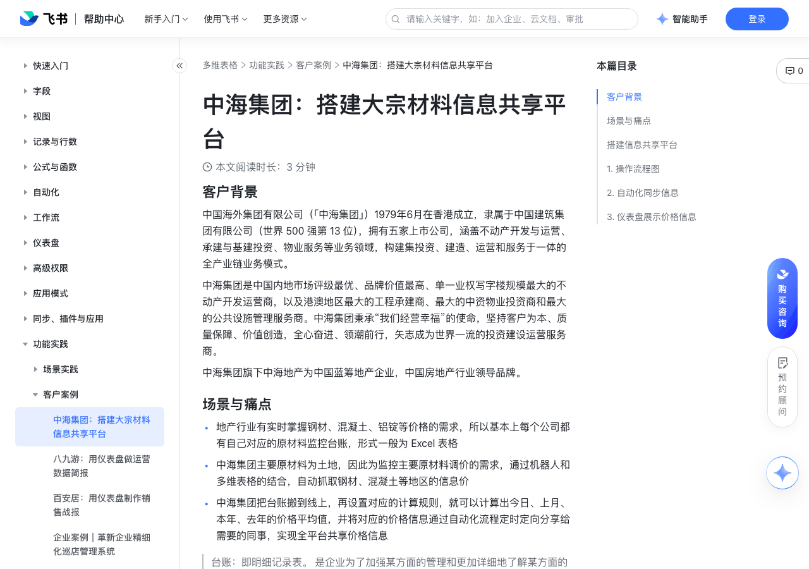

# 中海集团：搭建大宗材料信息共享平台

> 来源：[飞书帮助中心](https://www.feishu.cn/hc/zh-CN/articles/838582997494)  
> 分类：多维表格 / 功能实践 / 客户案例  
> 抓取时间：2026-09-22T01:26:50.770Z

## 界面截图

### 文档内配图

1. 配图：https://p1-hera.feishucdn.com/tos-cn-i-jbbdkfciu3/bb39047f0e164e95b3b273919194ec93~tplv-jbbdkfciu3-image:0:0.image
2. 配图：https://p1-hera.feishucdn.com/tos-cn-i-jbbdkfciu3/10c7e3ea3f0a4689b58b954719280817~tplv-jbbdkfciu3-image:0:0.image
3. 配图：https://p1-hera.feishucdn.com/tos-cn-i-jbbdkfciu3/88675c0bc04f452a9994fc9f9302dd6f~tplv-jbbdkfciu3-image:0:0.image

## 功能定位

本页对应飞书帮助中心「多维表格 / 功能实践 / 客户案例」下的「中海集团：搭建大宗材料信息共享平台」。以下需求描述依据官方说明文档提炼，用于指导 DuoWei 对标实现。

## 功能目标

客户背景

## 文档结构（官方章节）

- 客户背景​
- 场景与痛点​
- 痛点​
- 旧方式​
- 使用多维表格解决方案后​
- 搭建信息共享平台​
- 操作流程图​
- 自动化同步信息​
- 仪表盘展示价格信息​

## 详细功能说明

客户背景

场景与痛点

地产行业有实时掌握钢材、混凝土、铝锭等价格的需求，所以基本上每个公司都有自己对应的原材料监控台账，形式一般为 Excel 表格

中海集团主要原材料为土地，因此为监控主要原材料调价的需求，通过机器人和多维表格的结合，自动抓取钢材、混凝土等地区的信息价

中海集团把台账搬到线上，再设置对应的计算规则，就可以计算出今日、上月、本年、去年的价格平均值，并将对应的价格信息通过自动化流程定时定向分享给需要的同事，实现全平台共享价格信息

使用多维表格解决方案后

台账有多个版本，难以快速定位信息

多个时间版本的台账，且台账只保留在个人电脑里面，信息定位查找难数据量级变大后，数字繁多、公式混乱，可读性差

多个时间版本的台账，且台账只保留在个人电脑里面，信息定位查找难

数据量级变大后，数字繁多、公式混乱，可读性差

所有信息与数据汇总在一个表格中，便于定位历史修改有迹可循，快捷回溯历史改动多种维度呈现数据，仪表盘可以可视化展示与分析数据

所有信息与数据汇总在一个表格中，便于定位

历史修改有迹可循，快捷回溯历史改动

多种维度呈现数据，仪表盘可以可视化展示与分析数据

台账需要定期同步与发送，耗费人力和时间

通过聊天方式同步，常常被其他消息淹没

无需人工同步，自动化流程定时、定向将最新的价格信息同步给相关成员

台账录入方式原始，手动重复性操作多

信息录入需要手动在各个文档中修改保存，长此以往，文档越来越大，打开越来越慢

台账信息通过表单视图即可便捷提交，一键汇总到表格

搭建信息共享平台

操作流程图

自动化同步信息

仪表盘展示价格信息

痛点 | 旧方式 | 使用多维表格解决方案后

台账有多个版本，难以快速定位信息 | 多个时间版本的台账，且台账只保留在个人电脑里面，信息定位查找难数据量级变大后，数字繁多、公式混乱，可读性差 | 所有信息与数据汇总在一个表格中，便于定位历史修改有迹可循，快捷回溯历史改动多种维度呈现数据，仪表盘可以可视化展示与分析数据

台账需要定期同步与发送，耗费人力和时间 | 通过聊天方式同步，常常被其他消息淹没 | 无需人工同步，自动化流程定时、定向将最新的价格信息同步给相关成员

台账录入方式原始，手动重复性操作多 | 信息录入需要手动在各个文档中修改保存，长此以往，文档越来越大，打开越来越慢 | 台账信息通过表单视图即可便捷提交，一键汇总到表格

## 实现要点（对标 DuoWei）

1. **入口与信息架构**：在产品中明确该能力所属模块（功能实践 / 客户案例），并保证用户可从对应导航触达。
2. **核心交互**：按上文「详细功能说明」还原主要操作路径；截图中出现的按钮、字段、面板命名尽量与飞书语义一致或可映射。
3. **数据与权限**：若文档涉及可见范围、可编辑范围、分享或高级权限，实现时需落到角色/成员模型，并保证 API/MCP 与 UI 权限一致。
4. **边界与上限**：若文档提到数量上限、格式限制、导入导出约束，需在实现与错误提示中体现。
5. **验收**：以本页截图场景为用例，完成「能打开 / 能配置 / 能保存 / 能被 Agent 读写（如适用）」四项检查。

## 原始摘录摘要

> 客户背景 场景与痛点 地产行业有实时掌握钢材、混凝土、铝锭等价格的需求，所以基本上每个公司都有自己对应的原材料监控台账，形式一般为 Excel 表格 中海集团主要原材料为土地，因此为监控主要原材料调价的需求，通过机器人和多维表格的结合，自动抓取钢材、混凝土等地区的信息价 中海集团把台账搬到线上，再设置对应的计算规则，就可以计算出今日、上月、本年、去年的价格平均值，并将对应的价格信息通过自动化流程定时定向分享给需要的同事，实现全平台共享价格信息 使用多维表格解决方案后 台账有多个版本，难以快速定位信息 多个时间版本的台账，且台账只保留在个人电脑里面，信息定位查找难数据量级变大后，数字繁多、公式混乱，可读性差 多个时间版本的台账，且台账只保留在个人电脑里面，信息定位查找难 数据量级变大后，数字繁多、公式混乱，可读性差 所有信息与数据汇总在一个表格中，便于定位历史修改有迹可循，快捷回溯历史改动多种维度呈现数据，仪表盘可以可视化展示与分析数据 所有信息与数据汇总在一个表格中，便于定位 历史修改有迹可循，快捷回溯历史改动 多种维度呈现数据，仪表盘可以可视化展示与分析数据 台账需要定期同步与发送，耗费人力和时间 通过聊天方式同步，常常被其他消息淹没 无需人工同步，自动化流程定时、定向将最新的价格信息同步给相关成员 台账录入方式原始，手动重复性操作多 信息录入需要手动在各个文档中修改保存，长此以往，文档越来越大，打开越来越慢 台账信息通过表单视图即可便捷提交，一键汇总到表格 搭建信息共享平台 操作流程图 自动化同步信息 仪表盘展示价格信息 痛点 | 旧方式 | 使用多维表格解决方案后 台账有多个版本，难以快速定位信息 | 多个时间版本的台账，且台账只保留在个人电脑里面，信息定位查找难数据量级变大后，数字繁多、公式混乱，可读性差 | 所有信息与数据汇总在一个表格中，便于定位历史修改有迹可循…

## 元数据

- article_id: `7116515276729434113`
- category_id: `7225155397370363906`
- path: `/hc/zh-CN/articles/838582997494`
- extracted_text_length: 994
