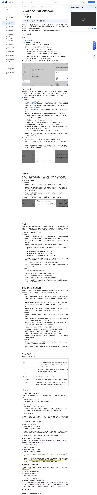

# 为多维表格智能体配置触发器

> 来源：[飞书帮助中心](https://www.feishu.cn/hc/zh-CN/articles/610686468172)  
> 分类：多维表格 / 快速入门 / 多维表格 AI  
> 抓取时间：2026-09-22T01:16:04.007Z

## 界面截图

### 文档内配图

1. 配图：https://p1-hera.feishucdn.com/tos-cn-i-jbbdkfciu3/4febf76036c446b492b7de97dc63f987~tplv-jbbdkfciu3-image:0:0.image
2. 配图：https://p1-hera.feishucdn.com/tos-cn-i-jbbdkfciu3/605d00eb77bd4caa8d33c5d8fb04295c~tplv-jbbdkfciu3-image:0:0.image
3. 配图：https://p1-hera.feishucdn.com/tos-cn-i-jbbdkfciu3/b4128660f421413e896003a581b04715~tplv-jbbdkfciu3-image:0:0.image
4. 配图：https://p1-hera.feishucdn.com/tos-cn-i-jbbdkfciu3/b8130c98d5264e0ba2d0495208e1aae1~tplv-jbbdkfciu3-image:0:0.image
5. 配图：https://p1-hera.feishucdn.com/tos-cn-i-jbbdkfciu3/446db21bc196491387fae4c2ef0e4f03~tplv-jbbdkfciu3-image:0:0.image

## 功能定位

本页对应飞书帮助中心「多维表格 / 快速入门 / 多维表格 AI」下的「为多维表格智能体配置触发器」。以下需求描述依据官方说明文档提炼，用于指导 DuoWei 对标实现。

## 功能目标

一、功能简介

## 文档结构（官方章节）

- 一、功能简介​
- 二、操作流程​
- 配置入口​
- 飞书消息触发​
- 定时触发​
- 评论触发​
- 新增、修改、删除记录时触发​
- 三、通用说明​
- 四、应用案例​
- 自动生成并推送电商运营日报​
- 自动处理客户反馈​
- 销售线索智能分配与跟进提醒​
- 库存预警自动补货申请触发​
- 五、常见问题​

## 详细功能说明

一、功能简介

二、操作流程

配置入口

进入多维表格主页。

在左侧 智能体 列表下点击需要配置的对象。

在右侧触发器区域新增触发器，或修改已有触发器的配置。

新增触发器：点击 添加 新增触发器，参考下文按需配置。

修改已有触发器：触发器创建后默认启用，支持以下操作。

停用或启用：在触发器右侧点击对应的滑块即可切换开关状态。

修改配置：点击对应的触发器进入配置页面，参考下文按需配置。

重命名：进入触发器配置页面，将鼠标悬停在顶部的现有名称上，点击 编辑 图标。

删除：进入触发器配置页面，在底部点击 删除 图标。

飞书消息触发

触发器类型：飞书机器人

触发器配置：

可用范围：和智能体的分享范围一致。如需修改可用范围，需调整分享范围，具体信息请参考搭建多维表格智能体。触发器启用后，系统会自动创建对应的机器人，并将可用人员添加到机器人的可用范围内。如需在群组中使用，需要手动将机器人添加到可用群组中，具体信息请参考在群组中使用机器人。

注：可用范围最大支持 5000 人，外部用户及超出 5000 人后添加的用户无法使用此触发器。

触发规则：支持勾选多个触发条件，可设置满足所有条件或满足任一条件时触发智能体。

消息中包含任意指定关键词时：同时对单聊和群聊消息生效，最多支持 50 个关键词，关键词含字母时不区分大小写。

消息中包含图片或文件时：同时对单聊和群聊消息生效。

群消息由指定的人发送时：仅对群聊消息生效，最多支持添加 50 个群成员。

群消息为新话题消息时：仅对话题群生效，回复已有话题时不会触发。

AI 筛选规则：描述哪些消息类型可以触发智能体，AI 会根据你的描述进行智能筛选。例如，仅处理与运营数据相关的问题，忽略闲聊内容。

默认回复：触发失败时的默认回复内容。如不配置，则失败时自动回复“我不能回答这样的问题，换个问题试试吧”。

触发器说明：

每个智能体预置 1 个“飞书机器人”触发器，不支持删除或新增此类触发器。

机器人发送的消息和通过其他自动化流程发送的消息，即使满足触发条件也不会触发智能体。

如果消息不满足触发条件，你需要重新发送一条满足条件的消息。编辑已发送的消息即使满足了触发条件，也不会触发智能体。

定时触发

触发器类型：定时触发

触发时区：触发时区默认是你所在的当地时区。如需跨时区协作，可以切换触发时区。

设置触发时间：选择首次触发的日期、时间、重复周期。默认不重复。如需修改重复频率，可选择预设的每天、每周、每月等重复频率，也可以自定义重复规则。设置完成后可以预览最近 5 次的执行时间。

任务要求：描述智能体在被触发后需要执行的具体任务。例如，查询昨天的销售数据并生成总结日报发送到运营群。

触发器说明：每个智能体最多可创建 10 个定时触发器（无论是否处于启用状态）。

评论触发

触发器类型：接收到多维表格评论时

选择数据表：选择需要监听的多维表格，可选范围为触发器创建人有权阅读的多维表格及其数据表。可以选择不同的多维表格，或者同一个多维表格中的不同数据表。

注：若选中多维表格下的全部数据表，后续新增的数据表将自动纳入监听范围，无需手动更新触发器。

触发规则：勾选触发条件，可设置满足所有条件或满足任一条件时触发智能体。

评论中包含任意指定关键词时：最多添加 50 个关键词，关键词包含字母时不区分大小写。

评论由指定的人员发起时：最多支持选择 50 个用户。

评论中提及了指定的人员时：最多支持选择 50 个用户。

评论为新评论时：仅新创建的评论触发，回复已有评论不触发。

AI 筛选规则：描述哪些类型的评论可以触发智能体，AI 会根据你的描述过滤不符合规则的评论。例如：仅处理包含投诉、故障反馈的评论，忽略询问性内容。

注：只有同时满足已勾选的触发规则和 AI 筛选规则，才能触发智能体。

任务要求：描述智能体被触发后需要执行的任务。例如，识别评论中的投诉或故障情况，生成处理建议并回复。

每个智能体最多支持启用 10 个评论触发器。

如果多维表格开启了高级权限，智能体无法在该多维表格中回复评论。

机器人发送的评论即使满足触发条件，也不会触发智能体。

仅当触发器创建人有权阅读被评论的多维表格记录时，才能触发流程。

如果评论不满足触发条件，需要重新发送一条满足条件的评论。编辑已发送的评论即使满足了触发条件，也不会触发智能体。

新增、修改、删除记录时触发

触发器类型：

新增记录首次满足条件时：当指定数据表中有新增记录，且记录首次满足触发条件时，智能体自动执行预设任务。适用于新增线索自动分配、新订单自动通知、新反馈自动处理等场景。

数据表记录变更时：当指定数据表的记录发生变更，且关注字段发生变化并满足触发条件时，智能体自动执行预设任务。适用于状态流转通知、数据变更审计、跨系统数据同步等场景。

数据表删除记录时：当指定数据表中有记录被删除，且删除前的记录满足触发条件时，智能体自动执行预设任务。适用于删除事件通知、数据审计、资源回收等场景。

选择数据表：单选需要监听的多维表格数据表，可选范围为触发器创建人有权阅读的所有数据表。

选择不为空的字段：仅“新增记录首次满足条件时”触发器需要配置此项。选择一个或多个字段，只有当所选字段全部不为空时，才符合触发条件。

关注的字段：仅“数据表记录变更时”触发器时需要配置此项。选择需要监听变更的字段，关注的字段中至少有一个字段的值发生变化时才符合触发条件。

设置满足的条件：配置更具体的触发条件，例如某个字段为空、字段包含某个关键词等。

AI 筛选规则：描述期望触发智能体的内容特征，AI 会根据你的描述进行智能判断。例如，当新增记录的申请说明体现出紧急采购需求时触发。支持引用数据表字段。

任务要求：描述智能体被触发后需要执行的具体任务，支持引用数据表字段。

高级设置：按需勾选不需要触发智能体的场景，例如大批量复制粘贴时不触发、导入多维表格数据时不触发等。

每个智能体支持分别启用最多 10 个“新增记录首次满足条件时”触发器、“数据表记录变更时”触发器，或“数据表删除记录时”触发器。

若新增记录超过 24 小时仍未满足触发条件，则后续即使满足了触发条件也不会再触发智能体。

三、通用说明

配置权限

飞书机器人：任何编辑者均可查看、编辑、启用、禁用触发器，不支持删除。其他触发器：仅触发器的创建人可以查看、编辑、启用、禁用、删除触发器，智能体的其他管理员仅可浏览、禁用、删除触发器。

飞书机器人：任何编辑者均可查看、编辑、启用、禁用触发器，不支持删除。

其他触发器：仅触发器的创建人可以查看、编辑、启用、禁用、删除触发器，智能体的其他管理员仅可浏览、禁用、删除触发器。

运行身份

网页内对话、飞书机器人、接收到多维表格评论时：使用触发者的身份执行任务。其他触发器：使用触发器创建人的身份执行任务。

网页内对话、飞书机器人、接收到多维表格评论时：使用触发者的身份执行任务。

其他触发器：使用触发器创建人的身份执行任务。

权限失效

若触发器的创建人对所配置的数据表失去访问权限，触发器会自动失效，需要重新配置。

触发器上限

同一数据表最多支持同时启用 200 个触发器。

命中多个触发器

同一事件命中多个触发器时，每个触发器会独立触发一次智能体运行，互不干扰。

工具自动挂载

创建触发器时，系统会自动添加对应场景所需的工具。例如，“飞书机器人”触发器会自动挂载飞书消息工具、“数据表记录变更时”触发器会自动挂载多维表格记录管理工具。

四、应用案例

自动生成并推送电商运营日报

分享范围：运营群的所有群成员。

监听的数据表：销售数据表、订单数据表、库存数据表

触发器：定时触发

触发时间设置：每个工作日 09:00，重复执行。

任务要求示例：查询昨天的销售数据表、订单数据表、库存数据表，统计总销售额、订单量、热销商品 TOP 3、库存预警商品清单，生成简洁的运营日报，发送到运营中心群。

自动处理客户反馈

分享范围：客户成功团队的所有成员。

监听的数据表：客户反馈表

触发器：新增记录首次满足条件时

触发条件：“反馈状态”等于“待处理”

任务要求示例：获取新增反馈的问题内容，判断反馈类型和问题负责人，在知识库中查询对应解决方案，更新反馈表的“问题类型”和“跟进人”字段，通过飞书消息 @ 对应的负责人跟进。

知识库配置：上传常见问题、解决方案、产品手册等内容到智能体知识库。

销售线索智能分配与跟进提醒

分享范围：所有销售团队成员。

监听数据表：销售线索表

触发器：新增记录首次满足条件时。

触发条件：“线索状态”等于“待分配”。

知识库配置：上传销售负责区域或行业分配规则、线索跟进 SOP、常见客户问题解答到智能体知识库。

任务要求示例：获取新增线索的行业、地区、预计金额信息，匹配对应负责销售，更新线索表的“跟进人”字段为分配的销售，向销售发送飞书消息提醒跟进，包含线索详细信息和跟进建议，超过 24 小时未更新跟进状态的线索自动二次提醒并同步通知销售主管。

库存预警自动补货申请触发

分享范围：仓储和采购团队成员。

监听数据表：库存数据表

触发器：数据表记录变更时

字段：“当前库存”字段变更

触发条件：“当前库存”小于“安全库存阈值”。

任务要求示例：获取库存低于阈值的商品信息、历史补货周期、当前在途采购量，计算建议补货数量，自动在采购申请表中新增一条补货记录，向采购负责人发送飞书消息通知，包含商品信息、当前库存、建议补货量和预计到货时间要求，更新库存表的“补货状态”为“待采购”。

五、常见问题

问：为什么多维表格智能体触发失败了？

答：可能有以下原因。你的评论或操作未命中已配置的触发规则，或者命中了过滤规则。你评论或操作的数据表不是触发器所监听的数据表，或者触发器的创建者对该数据表没有阅读权限。相关触发器的创建者已离职、失去管理员身份，或失去对应多维表格的阅读权限，导致触发器无法正常运行。机器人自动发送或回复的评论或消息不会触发智能体。群管理员已将该机器人移出群组，或智能体创建者已退出当前群组。机器人权限变更：管理后台修改了“多维表格应用机器人管理”配置，导致机器人失去了对应权限，具体信息请参考管理员设置多维表格应用机器人权限。

规则 | 说明

配置权限 | 飞书机器人：任何编辑者均可查看、编辑、启用、禁用触发器，不支持删除。其他触发器：仅触发器的创建人可以查看、编辑、启用、禁用、删除触发器，智能体的其他管理员仅可浏览、禁用、删除触发器。

运行身份 | 网页内对话、飞书机器人、接收到多维表格评论时：使用触发者的身份执行任务。其他触发器：使用触发器创建人的身份执行任务。

权限失效 | 若触发器的创建人对所配置的数据表失去访问权限，触发器会自动失效，需要重新配置。

触发器上限 | 同一数据表最多支持同时启用 200 个触发器。

命中多个触发器 | 同一事件命中多个触发器时，每个触发器会独立触发一次智能体运行，互不干扰。

工具自动挂载 | 创建触发器时，系统会自动添加对应场景所需的工具。例如，“飞书机器人”触发器会自动挂载飞书消息工具、“数据表记录变更时”触发器会自动挂载多维表格记录管理工具。

## 实现要点（对标 DuoWei）

1. **入口与信息架构**：在产品中明确该能力所属模块（快速入门 / 多维表格 AI），并保证用户可从对应导航触达。
2. **核心交互**：按上文「详细功能说明」还原主要操作路径；截图中出现的按钮、字段、面板命名尽量与飞书语义一致或可映射。
3. **数据与权限**：若文档涉及可见范围、可编辑范围、分享或高级权限，实现时需落到角色/成员模型，并保证 API/MCP 与 UI 权限一致。
4. **边界与上限**：若文档提到数量上限、格式限制、导入导出约束，需在实现与错误提示中体现。
5. **验收**：以本页截图场景为用例，完成「能打开 / 能配置 / 能保存 / 能被 Agent 读写（如适用）」四项检查。

## 原始摘录摘要

> 一、功能简介 二、操作流程 配置入口 进入多维表格主页。 在左侧 智能体 列表下点击需要配置的对象。 在右侧触发器区域新增触发器，或修改已有触发器的配置。 新增触发器：点击 添加 新增触发器，参考下文按需配置。 修改已有触发器：触发器创建后默认启用，支持以下操作。 停用或启用：在触发器右侧点击对应的滑块即可切换开关状态。 修改配置：点击对应的触发器进入配置页面，参考下文按需配置。 重命名：进入触发器配置页面，将鼠标悬停在顶部的现有名称上，点击 编辑 图标。 删除：进入触发器配置页面，在底部点击 删除 图标。 飞书消息触发 触发器类型：飞书机器人 触发器配置： 可用范围：和智能体的分享范围一致。如需修改可用范围，需调整分享范围，具体信息请参考搭建多维表格智能体。触发器启用后，系统会自动创建对应的机器人，并将可用人员添加到机器人的可用范围内。如需在群组中使用，需要手动将机器人添加到可用群组中，具体信息请参考在群组中使用机器人。 注：可用范围最大支持 5000 人，外部用户及超出 5000 人后添加的用户无法使用此触发器。 触发规则：支持勾选多个触发条件，可设置满足所有条件或满足任一条件时触发智能体。 消息中包含任意指定关键词时：同时对单聊和群聊消息生效，最多支持 50 个关键词，关键词含字母时不区分大小写。 消息中包含图片或文件时：同时对单聊和群聊消息生效。 群消息由指定的人发送时：仅对群聊消息生效，最多支持添加 50 个群成员。 群消息为新话题消息时：仅对话题群生效，回复已有话题时不会触发。 AI 筛选规则：描述哪些消息类型可以触发智能体，AI 会根据你的描述进行智能筛选。例如，仅处理与运营数据相关的问题，忽略闲聊内容。 默认回复：触发失败时的默认回复内容。如不配置，则失败时自动回复“我不能回答这样的问题，换个问题试试吧”。 触发器说明： 每个智能体预置 1 个“飞书机器人”…

## 元数据

- article_id: `7637720193518668748`
- category_id: `7630766419524717789`
- path: `/hc/zh-CN/articles/610686468172`
- extracted_text_length: 4568
