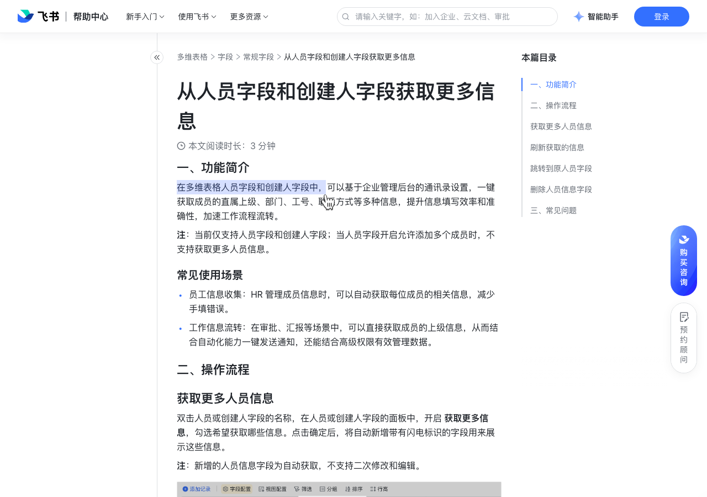

# 从人员字段和创建人字段获取更多信息

> 来源：[飞书帮助中心](https://www.feishu.cn/hc/zh-CN/articles/415453604525)  
> 分类：多维表格 / 字段 / 常规字段  
> 抓取时间：2026-09-22T01:21:35.569Z

## 界面截图

### 文档内配图

1. 配图：https://p1-hera.feishucdn.com/tos-cn-i-jbbdkfciu3/583cbf42357a442482ae8e243fb9d6d8~tplv-jbbdkfciu3-image:0:0.image
2. 配图：https://p1-hera.feishucdn.com/tos-cn-i-jbbdkfciu3/c05e9af41f2f4a07a9f68b5ea8f24f23~tplv-jbbdkfciu3-image:0:0.image
3. 配图：https://p1-hera.feishucdn.com/tos-cn-i-jbbdkfciu3/10b644a675164f03a100e14119d0965c~tplv-jbbdkfciu3-image:0:0.image

## 功能定位

本页对应飞书帮助中心「多维表格 / 字段 / 常规字段」下的「从人员字段和创建人字段获取更多信息」。以下需求描述依据官方说明文档提炼，用于指导 DuoWei 对标实现。

## 功能目标

一、功能简介

## 文档结构（官方章节）

- 一、功能简介​
- 常见使用场景​
- 二、操作流程​
- 获取更多人员信息​
- 刷新获取的信息​
- 跳转到原人员字段​
- 删除人员信息字段​
- 三、常见问题​

## 详细功能说明

一、功能简介

常见使用场景

员工信息收集：HR 管理成员信息时，可以自动获取每位成员的相关信息，减少手填错误。

工作信息流转：在审批、汇报等场景中，可以直接获取成员的上级信息，从而结合自动化能力一键发送通知，还能结合高级权限有效管理数据。

二、操作流程

获取更多人员信息

支持获取的人员信息如下：

获取的信息

对应字段类型

直属上级

人员类型

联系邮箱

刷新获取的信息

跳转到原人员字段

删除人员信息字段

选中希望删除的字段，点击鼠标右键，选择 删除字段。

双击原人员字段的名称，关闭 获取更多信息，点击确定后，所有人员信息字段将被自动删除。

三、常见问题

问：可以获取外部人员的相关信息吗？

答：不可以。

问：谁可以设置获取人员通讯录信息？

答：当前仅多维表格所有者可开启获取更多人员信息。

问：为什么部分信息显示无权限或为空？

答：可获取的人员通讯录信息和管理员在管理后台设置的名片页字段可见范围有关，如有需要可向管理员申请。更多信息请参考：管理员如何管理名片页字段可见范围、管理员如何设置成员名片页？

问：从多维表格的人员字段和创建人字段获取部门信息时，是否可以获取人员的完整组织架构信息？

答：暂不支持获取除直属上级部门、团队外的其他组织架构信息。

获取的信息 | 对应字段类型

部门 | 多选

直属上级 | 人员

工号 | 文本

职务 | 单选

人员类型 | 单选

联系邮箱 | 文本

## 实现要点（对标 DuoWei）

1. **入口与信息架构**：在产品中明确该能力所属模块（字段 / 常规字段），并保证用户可从对应导航触达。
2. **核心交互**：按上文「详细功能说明」还原主要操作路径；截图中出现的按钮、字段、面板命名尽量与飞书语义一致或可映射。
3. **数据与权限**：若文档涉及可见范围、可编辑范围、分享或高级权限，实现时需落到角色/成员模型，并保证 API/MCP 与 UI 权限一致。
4. **边界与上限**：若文档提到数量上限、格式限制、导入导出约束，需在实现与错误提示中体现。
5. **验收**：以本页截图场景为用例，完成「能打开 / 能配置 / 能保存 / 能被 Agent 读写（如适用）」四项检查。

## 原始摘录摘要

> 一、功能简介 常见使用场景 员工信息收集：HR 管理成员信息时，可以自动获取每位成员的相关信息，减少手填错误。 工作信息流转：在审批、汇报等场景中，可以直接获取成员的上级信息，从而结合自动化能力一键发送通知，还能结合高级权限有效管理数据。 二、操作流程 获取更多人员信息 支持获取的人员信息如下： 获取的信息 对应字段类型 直属上级 人员类型 联系邮箱 刷新获取的信息 跳转到原人员字段 删除人员信息字段 选中希望删除的字段，点击鼠标右键，选择 删除字段。 双击原人员字段的名称，关闭 获取更多信息，点击确定后，所有人员信息字段将被自动删除。 三、常见问题 问：可以获取外部人员的相关信息吗？ 答：不可以。 问：谁可以设置获取人员通讯录信息？ 答：当前仅多维表格所有者可开启获取更多人员信息。 问：为什么部分信息显示无权限或为空？ 答：可获取的人员通讯录信息和管理员在管理后台设置的名片页字段可见范围有关，如有需要可向管理员申请。更多信息请参考：管理员如何管理名片页字段可见范围、管理员如何设置成员名片页？ 问：从多维表格的人员字段和创建人字段获取部门信息时，是否可以获取人员的完整组织架构信息？ 答：暂不支持获取除直属上级部门、团队外的其他组织架构信息。 获取的信息 | 对应字段类型 部门 | 多选 直属上级 | 人员 工号 | 文本 职务 | 单选 人员类型 | 单选 联系邮箱 | 文本

## 元数据

- article_id: `7239612470443147265`
- category_id: `7187711716854464540`
- path: `/hc/zh-CN/articles/415453604525`
- extracted_text_length: 597
