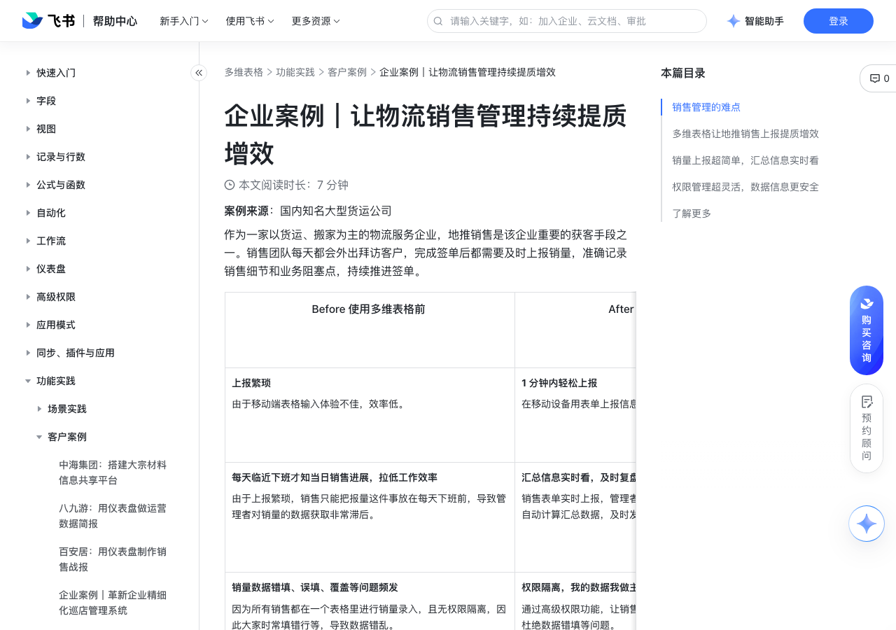

# 企业案例｜让物流销售管理持续提质增效

> 来源：[飞书帮助中心](https://www.feishu.cn/hc/zh-CN/articles/412463980068)  
> 分类：多维表格 / 功能实践 / 客户案例  
> 抓取时间：2026-09-22T01:26:51.801Z

## 界面截图

### 文档内配图

1. 配图：https://p1-hera.feishucdn.com/tos-cn-i-jbbdkfciu3/f1ca1a0672904e3cb86b129d6b14c889~tplv-jbbdkfciu3-image:0:0.image

## 功能定位

本页对应飞书帮助中心「多维表格 / 功能实践 / 客户案例」下的「企业案例｜让物流销售管理持续提质增效」。以下需求描述依据官方说明文档提炼，用于指导 DuoWei 对标实现。

## 功能目标

Before 使用多维表格前

## 文档结构（官方章节）

- Before 使用多维表格前 ​
- After 使用多维表格后 ​
- 销售管理的难点​
- 无法保障信息的及时性​
- 缺失分级管控，导致业务数据安全风险高​
- 多维表格让地推销售上报提质增效​
- 销量上报超简单，汇总信息实时看​
- 权限管理超灵活，数据信息更安全​
- 了解更多​

## 详细功能说明

Before 使用多维表格前

After 使用多维表格后

上报繁琐由于移动端表格输入体验不佳，效率低。

1 分钟内轻松上报在移动设备用表单上报信息，填问卷一样简单，一步搞定。

每天临近下班才知当日销售进展，拉低工作效率由于上报繁琐，销售只能把报量这件事放在每天下班前，导致管理者对销量的数据获取非常滞后。

汇总信息实时看，及时复盘调优销售表单实时上报，管理者使用表格视图实时查看，还可用公式自动计算汇总数据，及时发现不同时间段的问题，进行调优。

销量数据错填、误填、覆盖等问题频发因为所有销售都在一个表格里进行销量录入，且无权限隔离，因此大家时常填错行等，导致数据错乱。

权限隔离，我的数据我做主通过高级权限功能，让销售组员仅可编辑自己录入的数据，彻底杜绝数据错填等问题。

数据泄露风险高无法分组员、组长权限管控，使得人人都可查看所有销量数据，数据安全隐患大。

分级管控，数据更安全通过高级权限功能，让组员仅可看自己的数据，组长可看整组数据，让数据既安全又灵活。

手动催上报，费时费力每天在十几个个小群里手动所有人，管理成本较高。

全自动提醒上报，省心省力通过API + 机器人的功能，自动定点在指定的群内提醒上报，让管理者的重复劳动彻底解放。

销售管理的难点

无法保障信息的及时性

缺失分级管控，导致业务数据安全风险高

多维表格让地推销售上报提质增效

销量上报超简单，汇总信息实时看

权限管理超灵活，数据信息更安全

了解更多

Before 使用多维表格前 | After 使用多维表格后

上报繁琐由于移动端表格输入体验不佳，效率低。 | 1 分钟内轻松上报在移动设备用表单上报信息，填问卷一样简单，一步搞定。

每天临近下班才知当日销售进展，拉低工作效率由于上报繁琐，销售只能把报量这件事放在每天下班前，导致管理者对销量的数据获取非常滞后。 | 汇总信息实时看，及时复盘调优销售表单实时上报，管理者使用表格视图实时查看，还可用公式自动计算汇总数据，及时发现不同时间段的问题，进行调优。

销量数据错填、误填、覆盖等问题频发因为所有销售都在一个表格里进行销量录入，且无权限隔离，因此大家时常填错行等，导致数据错乱。 | 权限隔离，我的数据我做主通过高级权限功能，让销售组员仅可编辑自己录入的数据，彻底杜绝数据错填等问题。

数据泄露风险高无法分组员、组长权限管控，使得人人都可查看所有销量数据，数据安全隐患大。 | 分级管控，数据更安全通过高级权限功能，让组员仅可看自己的数据，组长可看整组数据，让数据既安全又灵活。

手动催上报，费时费力每天在十几个个小群里手动所有人，管理成本较高。 | 全自动提醒上报，省心省力通过API + 机器人的功能，自动定点在指定的群内提醒上报，让管理者的重复劳动彻底解放。

## 实现要点（对标 DuoWei）

1. **入口与信息架构**：在产品中明确该能力所属模块（功能实践 / 客户案例），并保证用户可从对应导航触达。
2. **核心交互**：按上文「详细功能说明」还原主要操作路径；截图中出现的按钮、字段、面板命名尽量与飞书语义一致或可映射。
3. **数据与权限**：若文档涉及可见范围、可编辑范围、分享或高级权限，实现时需落到角色/成员模型，并保证 API/MCP 与 UI 权限一致。
4. **边界与上限**：若文档提到数量上限、格式限制、导入导出约束，需在实现与错误提示中体现。
5. **验收**：以本页截图场景为用例，完成「能打开 / 能配置 / 能保存 / 能被 Agent 读写（如适用）」四项检查。

## 原始摘录摘要

> Before 使用多维表格前 After 使用多维表格后 上报繁琐由于移动端表格输入体验不佳，效率低。 1 分钟内轻松上报在移动设备用表单上报信息，填问卷一样简单，一步搞定。 每天临近下班才知当日销售进展，拉低工作效率由于上报繁琐，销售只能把报量这件事放在每天下班前，导致管理者对销量的数据获取非常滞后。 汇总信息实时看，及时复盘调优销售表单实时上报，管理者使用表格视图实时查看，还可用公式自动计算汇总数据，及时发现不同时间段的问题，进行调优。 销量数据错填、误填、覆盖等问题频发因为所有销售都在一个表格里进行销量录入，且无权限隔离，因此大家时常填错行等，导致数据错乱。 权限隔离，我的数据我做主通过高级权限功能，让销售组员仅可编辑自己录入的数据，彻底杜绝数据错填等问题。 数据泄露风险高无法分组员、组长权限管控，使得人人都可查看所有销量数据，数据安全隐患大。 分级管控，数据更安全通过高级权限功能，让组员仅可看自己的数据，组长可看整组数据，让数据既安全又灵活。 手动催上报，费时费力每天在十几个个小群里手动所有人，管理成本较高。 全自动提醒上报，省心省力通过API + 机器人的功能，自动定点在指定的群内提醒上报，让管理者的重复劳动彻底解放。 销售管理的难点 无法保障信息的及时性 缺失分级管控，导致业务数据安全风险高 多维表格让地推销售上报提质增效 销量上报超简单，汇总信息实时看 权限管理超灵活，数据信息更安全 了解更多 Before 使用多维表格前 | After 使用多维表格后 上报繁琐由于移动端表格输入体验不佳，效率低。 | 1 分钟内轻松上报在移动设备用表单上报信息，填问卷一样简单，一步搞定。 每天临近下班才知当日销售进展，拉低工作效率由于上报繁琐，销售只能把报量这件事放在每天下班前，导致管理者对销量的数据获取非常滞后。 | 汇总信息实时看，及时复盘调优销售表单实时上报，管理者使…

## 元数据

- article_id: `7031001348715888641`
- category_id: `7225155397370363906`
- path: `/hc/zh-CN/articles/412463980068`
- extracted_text_length: 1148
