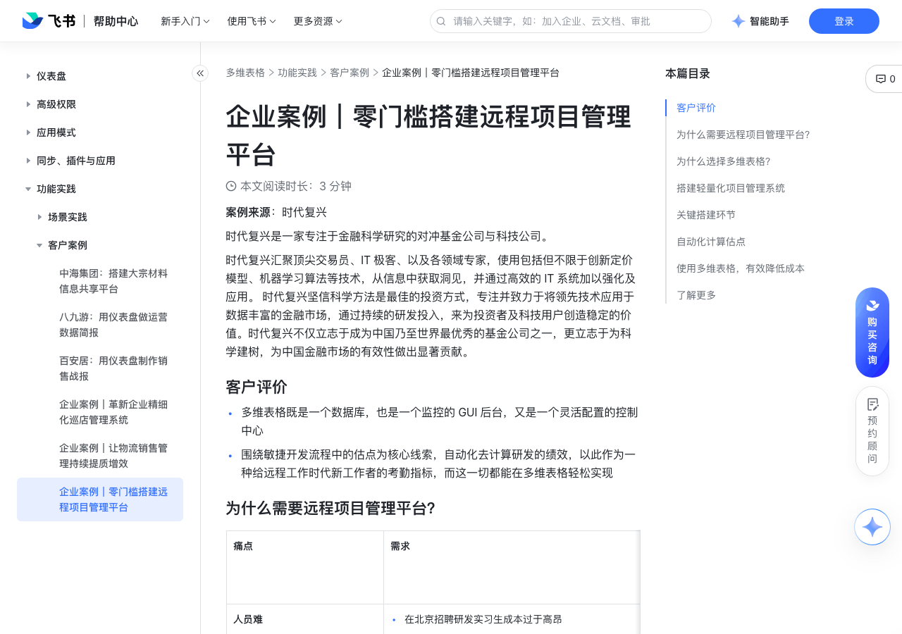

# 企业案例｜零门槛搭建远程项目管理平台

> 来源：[飞书帮助中心](https://www.feishu.cn/hc/zh-CN/articles/140833786240)  
> 分类：多维表格 / 功能实践 / 客户案例  
> 抓取时间：2026-09-22T01:26:51.927Z

## 界面截图

### 文档内配图

1. 配图：https://p1-hera.feishucdn.com/tos-cn-i-jbbdkfciu3/96afd8a3a81847688596e6d54246073a~tplv-jbbdkfciu3-image:0:0.image
2. 配图：https://p1-hera.feishucdn.com/tos-cn-i-jbbdkfciu3/c501d1f84ccc4b249038dfa9713cc598~tplv-jbbdkfciu3-image:0:0.image
3. 配图：https://p1-hera.feishucdn.com/tos-cn-i-jbbdkfciu3/bc54758c55fd4398bc0bbece81963a74~tplv-jbbdkfciu3-image:0:0.image
4. 配图：https://p1-hera.feishucdn.com/tos-cn-i-jbbdkfciu3/82ed54824e4b4a14abd66fff02276221~tplv-jbbdkfciu3-image:0:0.image

## 功能定位

本页对应飞书帮助中心「多维表格 / 功能实践 / 客户案例」下的「企业案例｜零门槛搭建远程项目管理平台」。以下需求描述依据官方说明文档提炼，用于指导 DuoWei 对标实现。

## 功能目标

客户评价

## 文档结构（官方章节）

- 客户评价​
- 为什么需要远程项目管理平台？​
- 为什么选择多维表格？​
- 搭建轻量化项目管理系统​
- 关键搭建环节​
- 自动化计算估点​
- 使用多维表格，有效降低成本 ​
- 了解更多​

## 详细功能说明

客户评价

多维表格既是一个数据库，也是一个监控的 GUI 后台，又是一个灵活配置的控制中心

围绕敏捷开发流程中的估点为核心线索，自动化去计算研发的绩效，以此作为一种给远程工作时代新工作者的考勤指标，而这一切都能在多维表格轻松实现

为什么需要远程项目管理平台？

人员难招聘成本高

在北京招聘研发实习生成本过于高昂招聘外埠实习生，实习生经济能力有限，不愿意来到北京现场办公

在北京招聘研发实习生成本过于高昂

招聘外埠实习生，实习生经济能力有限，不愿意来到北京现场办公

工作绩效量化标准难不以实际上班时间作为考勤

远程工作者不以上班时间作为考量依据实际完成任务数据和完成耗时作为一种新的考勤的量化标准

远程工作者不以上班时间作为考量

依据实际完成任务数据和完成耗时作为一种新的考勤的量化标准

远程协作平台难产品使用需求

远程协作研发平台选择困难用过 JIRA 和 Trello，都无法满足需求

远程协作研发平台选择困难

用过 JIRA 和 Trello，都无法满足需求

为什么选择多维表格？

其他工具

多维表格

缺乏细节的管理不便于管理开发的迭代工作以及质量把控

精细管理结构化的数据库设计, 让看板具有一定的约束，便于管理

配置成本高配置成本非常高，且需要专人配置并多次培训

配置成本低一个人即可完成配置，全员一分钟就上手

手动维护需要研发人员自己填写，往往最后填写的人越来越少

全自动计算全自动计算，帮助研发人员大幅提效，节省人力成本

缺乏数据统一性无法做细节化的流程管理，也不方便以估点为核心线索来统一上下游数据

估点线索统一便于把估点为核心线索的研发数据指标统一起来，在多维表格中查看全部统计数据

搭建轻量化项目管理系统

研发同学可关注特定的表格中的 Issue 看板视图

250px|700px|reset

产品人员只需关注用户故事视图

管理者可创建自己的视图统计需求的估点

查看任务状态移动的详细记录，便于统计开发者在一个 Issue 上的开发时长以及 Issue 在其他状态的流转时长

关键搭建环节

关键步骤

关键关节

首轮迭代

在看板视图中，将卡片从“今日待做”列，拖动到“开发中”列

机器人开始统计 Issue 流转状态的耗时这些状态的变化作为日志形式记录在多维表格中

机器人开始统计 Issue 流转状态的耗时

这些状态的变化作为日志形式记录在多维表格中

机器人可以计算比较分发任务时候预估的估点和研发真实的估点，并计算差异当发现预估的估点大的时候，可以重新给研发分配新工作

机器人可以计算比较分发任务时候预估的估点和研发真实的估点，并计算差异

当发现预估的估点大的时候，可以重新给研发分配新工作

二次迭代

研发最适合提交 Issue 不是在多维表格上，而是在 GitLab 上

GitLab 有 webhook 的 API，利用这个 APIGitLab 一提交，即在多维表格上新建一条记录，GitLab 与多维表格做到实时同步

GitLab 有 webhook 的 API，利用这个 API

GitLab 一提交，即在多维表格上新建一条记录，GitLab 与多维表格做到实时同步

后续迭代

集成 GitLab 之后，后续各种在用的系统都可以与多维表格做类似的处理

自动化计算估点

远程工作者的核心绩效的计算，都完全基于这些自动化的估点来进行计算的。

帮助管理比较确定性知道实际的投入产出，所以在底层监控每一个动作状态的日志。

量化数据将拿来做绩效以及新的考勤管理办法。

调用使用多维表格 API，每 10 秒钟去刷新 Issue 的状态，刷新全量 Issue, 对比 Issue 是开发中, 开发完成等。

变动会发消息到队列中进行计算处理（利用多维表格的查询 API 实现了一套 webhook 功能）新增 Issue Issue 完成状态变化

新增 Issue

Issue 完成状态变化

会在多维表格中新增一个日志，利用多维表格的公式计算日志之中的不同状态之间的耗时和估点计算。

使用多维表格，有效降低成本

Before：使用多维表格前

After：使用多维表格后

原来需要搭建一套功能相似的系统从 0 到 1，需要十几个人 1 个月以上的研发成本

原来需要搭建一套功能相似的系统

从 0 到 1，需要十几个人 1 个月以上的研发成本

多维表格既是一个数据库，也是一个监控的 GUI 后台，又是一个灵活配置的控制中心，天然具备系统能力，无需开发成本看板机器人的研发成本，一个全职的实习生同学，大概三周左右的时间 目前用来管理分布在全国的几十研发人员，同时也能为这些人员核算研发工作的绩效

多维表格既是一个数据库，也是一个监控的 GUI 后台，又是一个灵活配置的控制中心，天然具备系统能力，无需开发成本

看板机器人的研发成本，一个全职的实习生同学，大概三周左右的时间

目前用来管理分布在全国的几十研发人员，同时也能为这些人员核算研发工作的绩效

了解更多

痛点 | 需求

人员难招聘成本高 | 在北京招聘研发实习生成本过于高昂招聘外埠实习生，实习生经济能力有限，不愿意来到北京现场办公

工作绩效量化标准难不以实际上班时间作为考勤 | 远程工作者不以上班时间作为考量依据实际完成任务数据和完成耗时作为一种新的考勤的量化标准

远程协作平台难产品使用需求 | 远程协作研发平台选择困难用过 JIRA 和 Trello，都无法满足需求

其他工具 | 多维表格

缺乏细节的管理不便于管理开发的迭代工作以及质量把控 | 精细管理结构化的数据库设计, 让看板具有一定的约束，便于管理

配置成本高配置成本非常高，且需要专人配置并多次培训 | 配置成本低一个人即可完成配置，全员一分钟就上手

手动维护需要研发人员自己填写，往往最后填写的人越来越少 | 全自动计算全自动计算，帮助研发人员大幅提效，节省人力成本

缺乏数据统一性无法做细节化的流程管理，也不方便以估点为核心线索来统一上下游数据 | 估点线索统一便于把估点为核心线索的研发数据指标统一起来，在多维表格中查看全部统计数据

研发同学可关注特定的表格中的 Issue 看板视图 | 250px|700px|reset

产品人员只需关注用户故事视图 | 250px|700px|reset

管理者可创建自己的视图统计需求的估点 | 250px|700px|reset

查看任务状态移动的详细记录，便于统计开发者在一个 Issue 上的开发时长以及 Issue 在其他状态的流转时长 | 250px|700px|reset

关键步骤 | 关键关节

首轮迭代 | 在看板视图中，将卡片从“今日待做”列，拖动到“开发中”列

二次迭代 | 研发最适合提交 Issue 不是在多维表格上，而是在 GitLab 上

后续迭代 | 集成 GitLab 之后，后续各种在用的系统都可以与多维表格做类似的处理

Before：使用多维表格前 | After：使用多维表格后

原来需要搭建一套功能相似的系统从 0 到 1，需要十几个人 1 个月以上的研发成本 | 多维表格既是一个数据库，也是一个监控的 GUI 后台，又是一个灵活配置的控制中心，天然具备系统能力，无需开发成本看板机器人的研发成本，一个全职的实习生同学，大概三周左右的时间 目前用来管理分布在全国的几十研发人员，同时也能为这些人员核算研发工作的绩效

## 实现要点（对标 DuoWei）

1. **入口与信息架构**：在产品中明确该能力所属模块（功能实践 / 客户案例），并保证用户可从对应导航触达。
2. **核心交互**：按上文「详细功能说明」还原主要操作路径；截图中出现的按钮、字段、面板命名尽量与飞书语义一致或可映射。
3. **数据与权限**：若文档涉及可见范围、可编辑范围、分享或高级权限，实现时需落到角色/成员模型，并保证 API/MCP 与 UI 权限一致。
4. **边界与上限**：若文档提到数量上限、格式限制、导入导出约束，需在实现与错误提示中体现。
5. **验收**：以本页截图场景为用例，完成「能打开 / 能配置 / 能保存 / 能被 Agent 读写（如适用）」四项检查。

## 原始摘录摘要

> 客户评价 多维表格既是一个数据库，也是一个监控的 GUI 后台，又是一个灵活配置的控制中心 围绕敏捷开发流程中的估点为核心线索，自动化去计算研发的绩效，以此作为一种给远程工作时代新工作者的考勤指标，而这一切都能在多维表格轻松实现 为什么需要远程项目管理平台？ 人员难招聘成本高 在北京招聘研发实习生成本过于高昂招聘外埠实习生，实习生经济能力有限，不愿意来到北京现场办公 在北京招聘研发实习生成本过于高昂 招聘外埠实习生，实习生经济能力有限，不愿意来到北京现场办公 工作绩效量化标准难不以实际上班时间作为考勤 远程工作者不以上班时间作为考量依据实际完成任务数据和完成耗时作为一种新的考勤的量化标准 远程工作者不以上班时间作为考量 依据实际完成任务数据和完成耗时作为一种新的考勤的量化标准 远程协作平台难产品使用需求 远程协作研发平台选择困难用过 JIRA 和 Trello，都无法满足需求 远程协作研发平台选择困难 用过 JIRA 和 Trello，都无法满足需求 为什么选择多维表格？ 其他工具 多维表格 缺乏细节的管理不便于管理开发的迭代工作以及质量把控 精细管理结构化的数据库设计, 让看板具有一定的约束，便于管理 配置成本高配置成本非常高，且需要专人配置并多次培训 配置成本低一个人即可完成配置，全员一分钟就上手 手动维护需要研发人员自己填写，往往最后填写的人越来越少 全自动计算全自动计算，帮助研发人员大幅提效，节省人力成本 缺乏数据统一性无法做细节化的流程管理，也不方便以估点为核心线索来统一上下游数据 估点线索统一便于把估点为核心线索的研发数据指标统一起来，在多维表格中查看全部统计数据 搭建轻量化项目管理系统 研发同学可关注特定的表格中的 Issue 看板视图 250px|700px|reset 产品人员只需关注用户故事视图 管理者可创建自己的视图统计需求的估点 查看任务状态移动的详…

## 元数据

- article_id: `7031001549174358017`
- category_id: `7225155397370363906`
- path: `/hc/zh-CN/articles/140833786240`
- extracted_text_length: 3020
