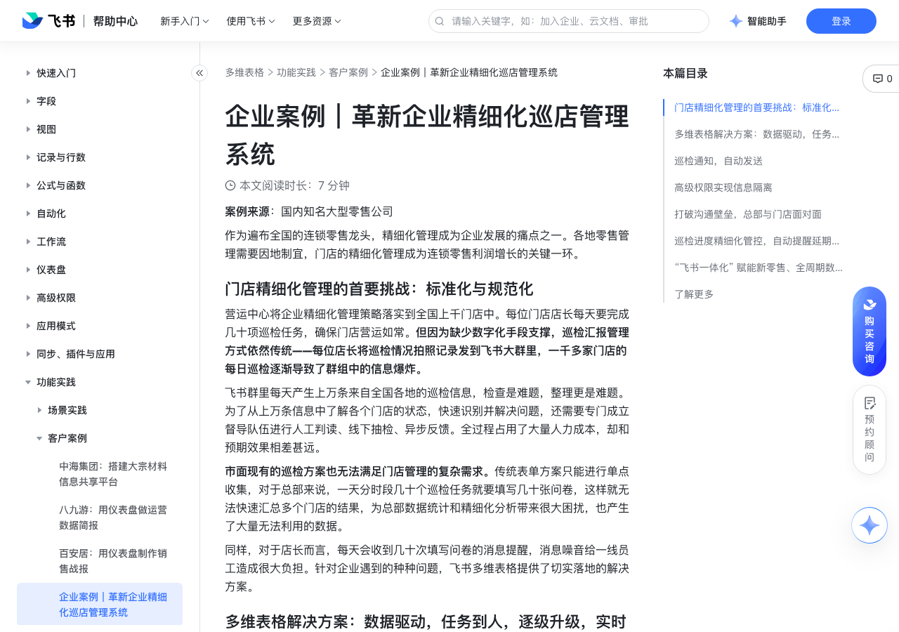

# 企业案例｜革新企业精细化巡店管理系统

> 来源：[飞书帮助中心](https://www.feishu.cn/hc/zh-CN/articles/592413737219)  
> 分类：多维表格 / 功能实践 / 客户案例  
> 抓取时间：2026-09-22T01:26:51.677Z

## 界面截图

### 文档内配图

1. 配图：https://p1-hera.feishucdn.com/tos-cn-i-jbbdkfciu3/4e8ec8b8049b4dc98c179d6dc775fc8b~tplv-jbbdkfciu3-image:0:0.image
2. 配图：https://p1-hera.feishucdn.com/tos-cn-i-jbbdkfciu3/c67637ae6ba44bdbad7dd21ab11ba2a5~tplv-jbbdkfciu3-image:0:0.image
3. 配图：https://p1-hera.feishucdn.com/tos-cn-i-jbbdkfciu3/4248d8c43a85478db8e94c0b2a536578~tplv-jbbdkfciu3-image:0:0.image
4. 配图：https://p1-hera.feishucdn.com/tos-cn-i-jbbdkfciu3/226ed576962e47ce8d267198adc3ddcb~tplv-jbbdkfciu3-image:0:0.image

## 功能定位

本页对应飞书帮助中心「多维表格 / 功能实践 / 客户案例」下的「企业案例｜革新企业精细化巡店管理系统」。以下需求描述依据官方说明文档提炼，用于指导 DuoWei 对标实现。

## 功能目标

门店精细化管理的首要挑战：标准化与规范化

## 文档结构（官方章节）

- 门店精细化管理的首要挑战：标准化与规范化​
- 多维表格解决方案：数据驱动，任务到人，逐级升级，实时响应​
- 巡检通知，自动发送​
- 高级权限实现信息隔离​
- 打破沟通壁垒，总部与门店面对面​
- 巡检进度精细化管控，自动提醒延期事项​
- “飞书一体化” 赋能新零售、全周期数字化管理​
- 了解更多​

## 详细功能说明

门店精细化管理的首要挑战：标准化与规范化

多维表格解决方案：数据驱动，任务到人，逐级升级，实时响应

客户痛点

使用飞书多维表格解决方案后

每日任务下达

多个群里 @ 全员

工作台独立入口定时定向下达任务，直接通知到具体人

门店动态同步

群中发消息，很快被淹没在对话中

工作台独立入口状态提报，后台一个表查看全部门店动态，群内信息降噪

重点事项响应

每周三由督导组汇总同步

重点事项高亮、实时同步效率高、有问题及时响应解决

数据安全管理

群中汇报，全员公开，信息泄露风险高

用多维表格高级权限进行数据隔离，一线人员仅可查看与自己相关的内容

巡检进度精细化管理

无法统计各门店是否按时推进

系统时间管控，规定事项超时未完成，系统自动筛出门店，即刻提醒店长

数据自动分析

数据分散，无法实现数据自动分析

数据随需采集，实时分析，多维度展现门店巡检完成情况，帮助总部决策判断

信息存档

原始数据无法进行归档

门店记录按区域、按天全自动归档到知识库/共享空间，事事留痕，方便总结

人力成本

占用几十人编制

启用自动化配置，系统自主运行、分发与汇总，解放人力干更有价值的事情

巡检通知，自动发送

高级权限实现信息隔离

打破沟通壁垒，总部与门店面对面

巡检进度精细化管控，自动提醒延期事项

“飞书一体化” 赋能新零售、全周期数字化管理

了解更多

客户痛点 | 旧方式 | 使用飞书多维表格解决方案后

每日任务下达 | 多个群里 @ 全员 | 工作台独立入口定时定向下达任务，直接通知到具体人

门店动态同步 | 群中发消息，很快被淹没在对话中 | 工作台独立入口状态提报，后台一个表查看全部门店动态，群内信息降噪

重点事项响应 | 每周三由督导组汇总同步 | 重点事项高亮、实时同步效率高、有问题及时响应解决

数据安全管理 | 群中汇报，全员公开，信息泄露风险高 | 用多维表格高级权限进行数据隔离，一线人员仅可查看与自己相关的内容

巡检进度精细化管理 | 无法统计各门店是否按时推进 | 系统时间管控，规定事项超时未完成，系统自动筛出门店，即刻提醒店长

数据自动分析 | 数据分散，无法实现数据自动分析 | 数据随需采集，实时分析，多维度展现门店巡检完成情况，帮助总部决策判断

信息存档 | 原始数据无法进行归档 | 门店记录按区域、按天全自动归档到知识库/共享空间，事事留痕，方便总结

人力成本 | 占用几十人编制 | 启用自动化配置，系统自主运行、分发与汇总，解放人力干更有价值的事情

## 实现要点（对标 DuoWei）

1. **入口与信息架构**：在产品中明确该能力所属模块（功能实践 / 客户案例），并保证用户可从对应导航触达。
2. **核心交互**：按上文「详细功能说明」还原主要操作路径；截图中出现的按钮、字段、面板命名尽量与飞书语义一致或可映射。
3. **数据与权限**：若文档涉及可见范围、可编辑范围、分享或高级权限，实现时需落到角色/成员模型，并保证 API/MCP 与 UI 权限一致。
4. **边界与上限**：若文档提到数量上限、格式限制、导入导出约束，需在实现与错误提示中体现。
5. **验收**：以本页截图场景为用例，完成「能打开 / 能配置 / 能保存 / 能被 Agent 读写（如适用）」四项检查。

## 原始摘录摘要

> 门店精细化管理的首要挑战：标准化与规范化 多维表格解决方案：数据驱动，任务到人，逐级升级，实时响应 客户痛点 使用飞书多维表格解决方案后 每日任务下达 多个群里 @ 全员 工作台独立入口定时定向下达任务，直接通知到具体人 门店动态同步 群中发消息，很快被淹没在对话中 工作台独立入口状态提报，后台一个表查看全部门店动态，群内信息降噪 重点事项响应 每周三由督导组汇总同步 重点事项高亮、实时同步效率高、有问题及时响应解决 数据安全管理 群中汇报，全员公开，信息泄露风险高 用多维表格高级权限进行数据隔离，一线人员仅可查看与自己相关的内容 巡检进度精细化管理 无法统计各门店是否按时推进 系统时间管控，规定事项超时未完成，系统自动筛出门店，即刻提醒店长 数据自动分析 数据分散，无法实现数据自动分析 数据随需采集，实时分析，多维度展现门店巡检完成情况，帮助总部决策判断 信息存档 原始数据无法进行归档 门店记录按区域、按天全自动归档到知识库/共享空间，事事留痕，方便总结 人力成本 占用几十人编制 启用自动化配置，系统自主运行、分发与汇总，解放人力干更有价值的事情 巡检通知，自动发送 高级权限实现信息隔离 打破沟通壁垒，总部与门店面对面 巡检进度精细化管控，自动提醒延期事项 “飞书一体化” 赋能新零售、全周期数字化管理 了解更多 客户痛点 | 旧方式 | 使用飞书多维表格解决方案后 每日任务下达 | 多个群里 @ 全员 | 工作台独立入口定时定向下达任务，直接通知到具体人 门店动态同步 | 群中发消息，很快被淹没在对话中 | 工作台独立入口状态提报，后台一个表查看全部门店动态，群内信息降噪 重点事项响应 | 每周三由督导组汇总同步 | 重点事项高亮、实时同步效率高、有问题及时响应解决 数据安全管理 | 群中汇报，全员公开，信息泄露风险高 | 用多维表格高级权限进行数据隔离，一线人员仅可查看…

## 元数据

- article_id: `7031000724825833473`
- category_id: `7225155397370363906`
- path: `/hc/zh-CN/articles/592413737219`
- extracted_text_length: 1037
