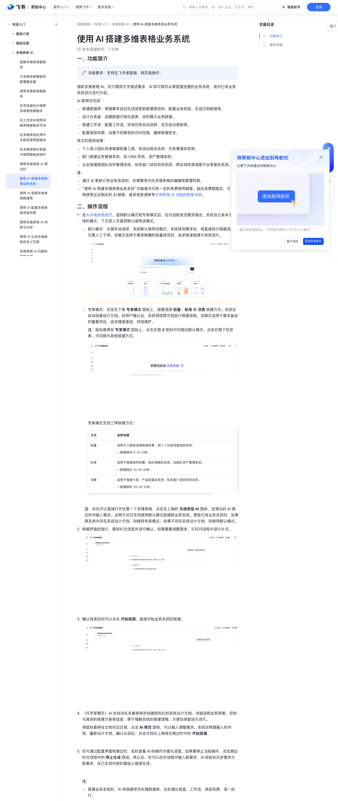

# 使用 AI 搭建多维表格业务系统

> 来源：[飞书帮助中心](https://www.feishu.cn/hc/zh-CN/articles/882125125335)  
> 分类：多维表格 / 快速入门 / 多维表格 AI  
> 抓取时间：2026-09-22T01:16:05.222Z

## 界面截图

### 文档内配图

1. 配图：https://p1-hera.feishucdn.com/tos-cn-i-jbbdkfciu3/39520cd83b3243db8f908c5ea64099b1~tplv-jbbdkfciu3-image:0:0.image
2. 配图：https://p1-hera.feishucdn.com/tos-cn-i-jbbdkfciu3/117d4559efef47699dbae6bb6ff525c9~tplv-jbbdkfciu3-image:0:0.image
3. 配图：https://p1-hera.feishucdn.com/tos-cn-i-jbbdkfciu3/ab38ed36d8b04ecb8a773d5ce0924603~tplv-jbbdkfciu3-image:0:0.image
4. 配图：https://p1-hera.feishucdn.com/tos-cn-i-jbbdkfciu3/75ce5152091742e79d95ac4c1e663bfd~tplv-jbbdkfciu3-image:0:0.image
5. 配图：https://p1-hera.feishucdn.com/tos-cn-i-jbbdkfciu3/76b0c0301a1a4266ab1d50cd268d62bb~tplv-jbbdkfciu3-image:0:0.image
6. 配图：https://p1-hera.feishucdn.com/tos-cn-i-jbbdkfciu3/4eda389ff97b49249bc96ef93f26cbab~tplv-jbbdkfciu3-image:0:0.image

## 功能定位

本页对应飞书帮助中心「多维表格 / 快速入门 / 多维表格 AI」下的「使用 AI 搭建多维表格业务系统」。以下需求描述依据官方说明文档提炼，用于指导 DuoWei 对标实现。

## 功能目标

一、功能简介

## 文档结构（官方章节）

- 一、功能简介​
- 二、操作流程​

## 详细功能说明

一、功能简介

搭建数据表：根据需求自动生成或更新数据表结构、配置业务视图、生成示例数据等。

设计仪表盘：创建数据可视化图表，实时展示业务数据。

搭建工作流：配置工作流，实现任务自动流转、状态自动更新等。

配置高级权限：设置不同角色的访问范围，确保数据安全。

个人或小团队快速搭建轻量工具，如活动报名系统、任务管理系统等。

部门搭建业务管理系统，如 CRM 系统、资产管理系统。

企业搭建跨团队协作管理系统，如多部门项目协同系统、跨区域资源调度平台等复杂系统。

通过 AI 更新已有业务系统时，你需要有对应多维表格的编辑或管理权限。

“使用 AI 搭建多维表格业务系统”功能每月均有一定的免费使用额度。超出免费额度后，可以继续使用企业购买的 AI 额度，具体信息请参考多维表格 AI 功能的额度说明。

二、操作流程

进入多维表格首页，选择默认模式或专家模式后，在对话框发送需求描述。系统会记录本次选择的模式，下次进入页面将默认使用该模式。

默认模式：无需手动选择，系统默认使用该模式。系统收到需求后，将直接执行搭建流程，无需人工干预。该模式适用于需求明确的轻量级项目，追求极速搭建与高效迭代。

250px|700px|reset

专家模式：点击左下角 专家模式 图标上，按需选择 轻量、标准 或 深度 搭建方式。系统会自动创建设计文档。经用户确认后，系统将按照文档执行搭建流程。该模式适用于需求复杂的重要项目，追求精准落地、持续维护。

注：鼠标悬停在 专家模式 图标上，点击左侧 X 图标可切换回默认模式，点击右侧下拉菜单，可切换为其他搭建方式。

专家模式支持三种搭建方式：

方式适用场景轻量适用于小型或快速搭建场景，如个人任务进度追踪系统。一般需耗时 5-10 分钟。标准适用于搭建结构完整、组织清晰的系统，如团队资产管理系统。一般需耗时 10-20 分钟。深度适用于搭建大型、产品级复杂系统，如多部门项目协同系统。一般需耗时 20-30 分钟。

适用场景

适用于小型或快速搭建场景，如个人任务进度追踪系统。一般需耗时 5-10 分钟。

适用于搭建结构完整、组织清晰的系统，如团队资产管理系统。一般需耗时 10-20 分钟。

适用于搭建大型、产品级复杂系统，如多部门项目协同系统。一般需耗时 20-30 分钟。

根据界面的指引，提供补充信息并进行确认。如果需要调整需求，可在对话框中进行补充。

确认信息后你可以点击 开始搭建，直接开始业务系统的搭建。

（仅专家模式）AI 会自动在多维表格中创建结构化的系统设计文档，详细说明业务背景、目标与具体的搭建方案等信息，便于理解系统的搭建逻辑，方便后续查阅与迭代。

将鼠标悬停在文档对应区域，点击 AI 修改 图标，可以输入调整需求。系统会根据输入的内容，重新设计文档。确认无误后，点击文档右上角或右侧边栏中的 开始搭建。

你可通过配置界面和侧边栏，实时查看 AI 的操作步骤与进度。如果要停止当前操作，点击侧边栏对话框中的 停止生成 按钮。停止后，你可以在对话框中输入新需求，AI 将结合历史需求与新需求，在已生成内容的基础上继续生成。

搭建业务系统时，AI 将按顺序先处理数据表，后处理仪表盘、工作流、高级权限，逐一执行。

如果业务系统中包含高级权限设置，系统会弹窗请求打开高级权限。

AI 完成任务后，会自动验证生成内容是否符合需求。验证通过后，你可以在 AI 侧边栏查看生成的内容并进行以下操作：

点击生成的内容，可以跳转至对应页面。例如，点击数据表相关内容，可以跳转到对应的数据表页面；点击工作流或高级权限相关内容，可以跳转到对应的配置页面。

注：AI 配置的工作流和高级权限，需在配置页面手动保存方可生效。

如果对生成内容不满意，你可以点击 撤销 按钮，撤销 AI 执行的操作，或在侧边栏中继续描述需求。

方式 | 适用场景

轻量 | 适用于小型或快速搭建场景，如个人任务进度追踪系统。一般需耗时 5-10 分钟。

标准 | 适用于搭建结构完整、组织清晰的系统，如团队资产管理系统。一般需耗时 10-20 分钟。

深度 | 适用于搭建大型、产品级复杂系统，如多部门项目协同系统。一般需耗时 20-30 分钟。

## 实现要点（对标 DuoWei）

1. **入口与信息架构**：在产品中明确该能力所属模块（快速入门 / 多维表格 AI），并保证用户可从对应导航触达。
2. **核心交互**：按上文「详细功能说明」还原主要操作路径；截图中出现的按钮、字段、面板命名尽量与飞书语义一致或可映射。
3. **数据与权限**：若文档涉及可见范围、可编辑范围、分享或高级权限，实现时需落到角色/成员模型，并保证 API/MCP 与 UI 权限一致。
4. **边界与上限**：若文档提到数量上限、格式限制、导入导出约束，需在实现与错误提示中体现。
5. **验收**：以本页截图场景为用例，完成「能打开 / 能配置 / 能保存 / 能被 Agent 读写（如适用）」四项检查。

## 原始摘录摘要

> 一、功能简介 搭建数据表：根据需求自动生成或更新数据表结构、配置业务视图、生成示例数据等。 设计仪表盘：创建数据可视化图表，实时展示业务数据。 搭建工作流：配置工作流，实现任务自动流转、状态自动更新等。 配置高级权限：设置不同角色的访问范围，确保数据安全。 个人或小团队快速搭建轻量工具，如活动报名系统、任务管理系统等。 部门搭建业务管理系统，如 CRM 系统、资产管理系统。 企业搭建跨团队协作管理系统，如多部门项目协同系统、跨区域资源调度平台等复杂系统。 通过 AI 更新已有业务系统时，你需要有对应多维表格的编辑或管理权限。 “使用 AI 搭建多维表格业务系统”功能每月均有一定的免费使用额度。超出免费额度后，可以继续使用企业购买的 AI 额度，具体信息请参考多维表格 AI 功能的额度说明。 二、操作流程 进入多维表格首页，选择默认模式或专家模式后，在对话框发送需求描述。系统会记录本次选择的模式，下次进入页面将默认使用该模式。 默认模式：无需手动选择，系统默认使用该模式。系统收到需求后，将直接执行搭建流程，无需人工干预。该模式适用于需求明确的轻量级项目，追求极速搭建与高效迭代。 250px|700px|reset 专家模式：点击左下角 专家模式 图标上，按需选择 轻量、标准 或 深度 搭建方式。系统会自动创建设计文档。经用户确认后，系统将按照文档执行搭建流程。该模式适用于需求复杂的重要项目，追求精准落地、持续维护。 注：鼠标悬停在 专家模式 图标上，点击左侧 X 图标可切换回默认模式，点击右侧下拉菜单，可切换为其他搭建方式。 专家模式支持三种搭建方式： 方式适用场景轻量适用于小型或快速搭建场景，如个人任务进度追踪系统。一般需耗时 5-10 分钟。标准适用于搭建结构完整、组织清晰的系统，如团队资产管理系统。一般需耗时 10-20 分钟。深度适用于搭建大型、产品级复杂系统，如多部…

## 元数据

- article_id: `7618165422277332166`
- category_id: `7630766419524717789`
- path: `/hc/zh-CN/articles/882125125335`
- extracted_text_length: 1731
