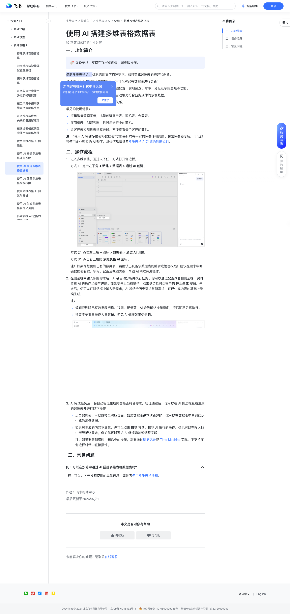

# 使用 AI 搭建多维表格数据表

> 来源：[飞书帮助中心](https://www.feishu.cn/hc/zh-CN/articles/285761536445)  
> 分类：多维表格 / 快速入门 / 多维表格 AI  
> 抓取时间：2026-09-22T01:16:06.410Z

## 界面截图

### 文档内配图

1. 配图：https://p1-hera.feishucdn.com/tos-cn-i-jbbdkfciu3/d08d22d1001941469444bf9948e8aaf3~tplv-jbbdkfciu3-image:0:0.image
2. 配图：https://p1-hera.feishucdn.com/tos-cn-i-jbbdkfciu3/4410c7dcf9af408f9b479c8bff6854c0~tplv-jbbdkfciu3-image:0:0.image

## 功能定位

本页对应飞书帮助中心「多维表格 / 快速入门 / 多维表格 AI」下的「使用 AI 搭建多维表格数据表」。以下需求描述依据官方说明文档提炼，用于指导 DuoWei 对标实现。

## 功能目标

一、功能简介

## 文档结构（官方章节）

- 一、功能简介​
- 二、操作流程​
- 三、常见问题​

## 详细功能说明

一、功能简介

自动搭建、配置数据表，进行视图配置，实现筛选、排序、分组及字段显隐等功能。

自动生成示例数据，在数据表中自动填充符合业务规律的示例数据。

自动建立数据表之间的字段关联关系。

搭建销售管理系统，批量创建客户表、商机表、合同表。

在商机表中创建视图，只显示进行中的商机。

给客户表和商机表建立关联，方便查看每个客户的商机。

二、操作流程

进入多维表格，通过以下任一方式打开侧边栏。

方式 1：点击左下角 + 新建 > 数据表 > 通过 AI 创建。

250px|700px|reset

方式 2：点击左上角 + 图标 > 数据表 > 通过 AI 创建。

方式 3：点击右上角的 多维表格 AI 图标。

注：如果你想更新已有的数据表，请确认已具备该数据表的编辑或管理权限；建议在需求中明确数据表名称、字段、记录及视图类型，帮助 AI 精准完成操作。

在侧边栏中输入你的需求后，AI 会自动分析并执行任务。你可以通过配置界面和侧边栏，实时查看 AI 的操作步骤与进度。如果要停止当前操作，点击侧边栏对话框中的 停止生成 按钮。停止后，你可以在对话框中输入新需求，AI 将结合历史需求与新需求，在已生成内容的基础上继续生成。

编辑或删除已有数据表结构、视图、记录前，AI 会先确认操作意向，待你同意后再执行。

建议不要批量操作大量数据，避免 AI 处理效果受影响。

AI 完成任务后，会自动验证生成内容是否符合需求。验证通过后，你可以在 AI 侧边栏查看生成的数据表并进行以下操作：

点击数据表，可以跳转至对应页面。如果数据表是本次新建的，你可以在数据表中看到默认生成的示例数据。

如果对生成的内容不满意，你可以点击 撤销 按钮，撤销 AI 执行的操作。你也可以在输入框中继续描述需求，例如你可以要求 AI 继续增加或调整字段。

注：如果要撤销编辑、删除类的操作，需要通过历史记录或 Time Machine 实现，不支持在侧边栏对话中直接撤销。

三、常见问题

问：可以在沙箱中通过 AI 搭建多维表格数据表吗？

答：可以。关于沙箱使用的具体信息，请参考使用多维表格沙箱。

## 实现要点（对标 DuoWei）

1. **入口与信息架构**：在产品中明确该能力所属模块（快速入门 / 多维表格 AI），并保证用户可从对应导航触达。
2. **核心交互**：按上文「详细功能说明」还原主要操作路径；截图中出现的按钮、字段、面板命名尽量与飞书语义一致或可映射。
3. **数据与权限**：若文档涉及可见范围、可编辑范围、分享或高级权限，实现时需落到角色/成员模型，并保证 API/MCP 与 UI 权限一致。
4. **边界与上限**：若文档提到数量上限、格式限制、导入导出约束，需在实现与错误提示中体现。
5. **验收**：以本页截图场景为用例，完成「能打开 / 能配置 / 能保存 / 能被 Agent 读写（如适用）」四项检查。

## 原始摘录摘要

> 一、功能简介 自动搭建、配置数据表，进行视图配置，实现筛选、排序、分组及字段显隐等功能。 自动生成示例数据，在数据表中自动填充符合业务规律的示例数据。 自动建立数据表之间的字段关联关系。 搭建销售管理系统，批量创建客户表、商机表、合同表。 在商机表中创建视图，只显示进行中的商机。 给客户表和商机表建立关联，方便查看每个客户的商机。 二、操作流程 进入多维表格，通过以下任一方式打开侧边栏。 方式 1：点击左下角 + 新建 > 数据表 > 通过 AI 创建。 250px|700px|reset 方式 2：点击左上角 + 图标 > 数据表 > 通过 AI 创建。 方式 3：点击右上角的 多维表格 AI 图标。 注：如果你想更新已有的数据表，请确认已具备该数据表的编辑或管理权限；建议在需求中明确数据表名称、字段、记录及视图类型，帮助 AI 精准完成操作。 在侧边栏中输入你的需求后，AI 会自动分析并执行任务。你可以通过配置界面和侧边栏，实时查看 AI 的操作步骤与进度。如果要停止当前操作，点击侧边栏对话框中的 停止生成 按钮。停止后，你可以在对话框中输入新需求，AI 将结合历史需求与新需求，在已生成内容的基础上继续生成。 编辑或删除已有数据表结构、视图、记录前，AI 会先确认操作意向，待你同意后再执行。 建议不要批量操作大量数据，避免 AI 处理效果受影响。 AI 完成任务后，会自动验证生成内容是否符合需求。验证通过后，你可以在 AI 侧边栏查看生成的数据表并进行以下操作： 点击数据表，可以跳转至对应页面。如果数据表是本次新建的，你可以在数据表中看到默认生成的示例数据。 如果对生成的内容不满意，你可以点击 撤销 按钮，撤销 AI 执行的操作。你也可以在输入框中继续描述需求，例如你可以要求 AI 继续增加或调整字段。 注：如果要撤销编辑、删除类的操作，需要通过历史记录或 Time M…

## 元数据

- article_id: `7618506880733727689`
- category_id: `7630766419524717789`
- path: `/hc/zh-CN/articles/285761536445`
- extracted_text_length: 888
