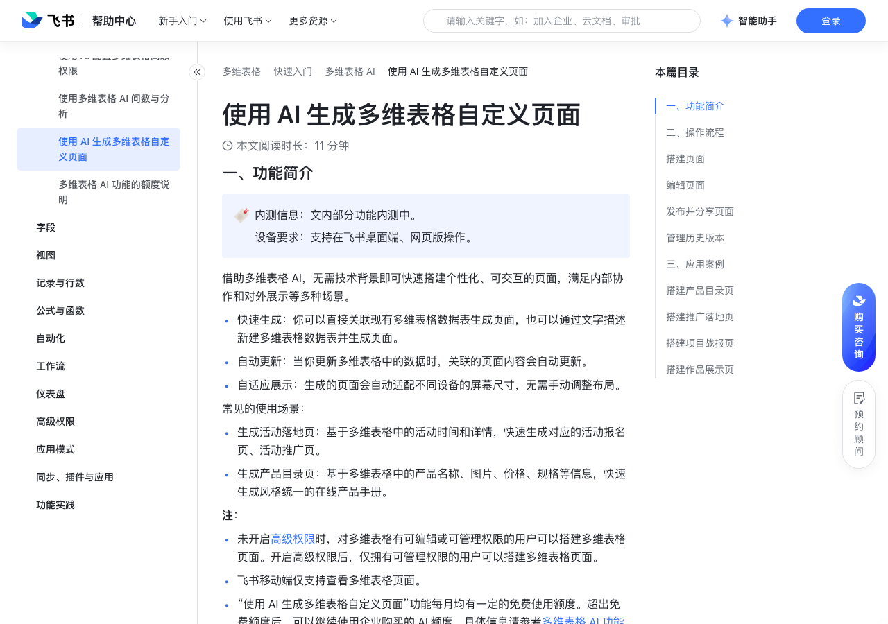

# 使用 AI 生成多维表格自定义页面

> 来源：[飞书帮助中心](https://www.feishu.cn/hc/zh-CN/articles/044954870270)  
> 分类：多维表格 / 快速入门 / 多维表格 AI  
> 抓取时间：2026-09-22T01:21:31.117Z

## 界面截图

### 文档内配图

1. 配图：https://p1-hera.feishucdn.com/tos-cn-i-jbbdkfciu3/c79f6affb4404b7c9825aff94c99c113~tplv-jbbdkfciu3-image:0:0.image
2. 配图：https://p1-hera.feishucdn.com/tos-cn-i-jbbdkfciu3/e0d00130044f4a7ebb10baea69996569~tplv-jbbdkfciu3-image:0:0.image
3. 配图：https://p1-hera.feishucdn.com/tos-cn-i-jbbdkfciu3/ccb8921aa3334236b9a3e48e2a8e11e9~tplv-jbbdkfciu3-image:0:0.image
4. 配图：https://p1-hera.feishucdn.com/tos-cn-i-jbbdkfciu3/fd3b7bced6f245a9a2a9b4187670cf35~tplv-jbbdkfciu3-image:0:0.image
5. 配图：https://p1-hera.feishucdn.com/tos-cn-i-jbbdkfciu3/056951b48d154e688b4abf705114096e~tplv-jbbdkfciu3-image:0:0.image
6. 配图：https://p1-hera.feishucdn.com/tos-cn-i-jbbdkfciu3/6dc4aab6b78d4c86a4d72b5c59dbea6c~tplv-jbbdkfciu3-image:0:0.image
7. 配图：https://p1-hera.feishucdn.com/tos-cn-i-jbbdkfciu3/0012253dfbe640c8ae565382471a1d63~tplv-jbbdkfciu3-image:0:0.image
8. 配图：https://p1-hera.feishucdn.com/tos-cn-i-jbbdkfciu3/f61389cf33a041c1b63b65847c95b97b~tplv-jbbdkfciu3-image:0:0.image
9. 配图：https://p1-hera.feishucdn.com/tos-cn-i-jbbdkfciu3/8fe05924d64b4be495a21095bdcd100c~tplv-jbbdkfciu3-image:0:0.image
10. 配图：https://p1-hera.feishucdn.com/tos-cn-i-jbbdkfciu3/812771a926c247368787ef4c1b20e2de~tplv-jbbdkfciu3-image:0:0.image
11. 配图：https://p1-hera.feishucdn.com/tos-cn-i-jbbdkfciu3/353fe4235bbe44c1963ff9be89d225fc~tplv-jbbdkfciu3-image:0:0.image
12. 配图：https://p1-hera.feishucdn.com/tos-cn-i-jbbdkfciu3/ab06ece3a58d47e28ea8685dea019d6a~tplv-jbbdkfciu3-image:0:0.image
13. 配图：https://p1-hera.feishucdn.com/tos-cn-i-jbbdkfciu3/87cfad117091465399c4c233eb0aa777~tplv-jbbdkfciu3-image:0:0.image
14. 配图：https://p1-hera.feishucdn.com/tos-cn-i-jbbdkfciu3/223e2c164a764feaa0fe52c44b20320c~tplv-jbbdkfciu3-image:0:0.image
15. 配图：https://p1-hera.feishucdn.com/tos-cn-i-jbbdkfciu3/3efbde6ec01844268b676656e5e4581f~tplv-jbbdkfciu3-image:0:0.image

## 功能定位

本页对应飞书帮助中心「多维表格 / 快速入门 / 多维表格 AI」下的「使用 AI 生成多维表格自定义页面」。以下需求描述依据官方说明文档提炼，用于指导 DuoWei 对标实现。

## 功能目标

一、功能简介

## 文档结构（官方章节）

- 一、功能简介​
- 二、操作流程​
- 搭建页面​
- 编辑页面​
- 发布并分享页面​
- 管理历史版本​
- 三、应用案例​
- 搭建产品目录页​
- 搭建推广落地页​
- 搭建项目战报页​
- 搭建作品展示页​

## 详细功能说明

一、功能简介

快速生成：你可以直接关联现有多维表格数据表生成页面，也可以通过文字描述新建多维表格数据表并生成页面。

自动更新：当你更新多维表格中的数据时，关联的页面内容会自动更新。

自适应展示：生成的页面会自动适配不同设备的屏幕尺寸，无需手动调整布局。

生成活动落地页：基于多维表格中的活动时间和详情，快速生成对应的活动报名页、活动推广页。

生成产品目录页：基于多维表格中的产品名称、图片、价格、规格等信息，快速生成风格统一的在线产品手册。

未开启高级权限时，对多维表格有可编辑或可管理权限的用户可以搭建多维表格页面。开启高级权限后，仅拥有可管理权限的用户可以搭建多维表格页面。

飞书移动端仅支持查看多维表格页面。

“使用 AI 生成多维表格自定义页面”功能每月均有一定的免费使用额度。超出免费额度后，可以继续使用企业购买的 AI 额度，具体信息请参考多维表格 AI 功能的额度说明。

二、操作流程

搭建页面

进入目标多维表格，点击左下角 + 新建 > 页面 > 通过 AI 创建，打开侧边栏。你也可以点击右上角 多维表格 AI 图标，直接打开侧边栏，选择 页面搭建 模式。

在侧边栏输入你的需求，例如“生成一个科技感强的展示页，重点突出产品图片和核心参数”。输入需求时，你可以：

关联已有数据表：通过 @ 引用数据表，关联当前多维表格内的多张数据表。

最多支持关联 20 张数据表。不支持关联通过同步数据创建的数据表。

在关联数据源前，请确保你的多维表格数据结构清晰、字段命名规范。例如，用于展示图片的列应确保单元格内为图片附件，用于分类的列应使用单选或多选标签。数据结构的规范性将直接影响 AI 的生成效果和最终页面的美观度。

创建新数据表并关联：如果当前多维表格没有任何可用数据表，系统会根据文字描述自动创建相应的数据表并与即将生成的页面进行关联。

根据界面的指引，提供补充信息并进行确认。确认需求后，AI 将自动生成页面文案、页面对应的数据表（仅在无数据表时生成），并选用合适的组件和样式搭建页面。你可以在侧边栏查看搭建方案、详细计划以及进度。

页面生成后，你可以在中间配置界面预览生成的页面。你还可以：

点击页面上方的设备图标，查看桌面端或移动端的展示效果。

（内测中）点击页面右上角的 ··· 图标，开启 跟随访问者权限统计。开启后，有管理权限的用户可以查看全部数据，其他有页面阅读权限的用户在多维表格内查看该页面时，仅能看到自己权限范围内的数据统计结果，满足企业差异化的数据查看需求。

未开启高级权限时，对多维表格有可阅读权限的用户即可阅读页面。开启高级权限后，需具备该页面阅读权限的用户才能阅读。有关多维表格页面高级权限的具体信息，请参考使用多维表格高级权限。

“跟随访问者权限统计”仅影响用户在多维表格内查看页面时的数据范围，不影响通过发布链接访问页面时的数据范围。

点击页面右上角的 ··· 图标 > 查看已关联的数据表，查看页面关联的数据表。

编辑页面

发布并分享页面

确认页面信息后，点击右上角 发布，系统会为页面生成一个唯一、永久的链接。你可以将页面的可见范围设置为 仅受邀请的人可阅读、组织内获得链接的人可阅读 或 互联网上获得链接的人可阅读，并确认发布页面。

页面发布后，通过分享链接访问页面的用户可以查看页面上的全部数据，不受“跟随访问者权限统计”或“高级权限”设置的限制。

页面发布后如果修改页面，需要再次点击右上角 发布，才可以将改动同步到已发布页面，重新发布后页面链接保持不变；页面发布后如果修改页面数据，无需重新发布，数据变更将实时同步至已发布页面。

发布页面后，你可以点击 已发布 页面，进行如下操作：

分享页面：通过飞书、二维码、微信、链接、文档快捷分享页面。

调整页面的可见范围：在谁可以查看此页面中调整页面的可见范围，并点击 更新。更新后，页面链接保持不变。

取消发布：点击 取消发布，并进行二次确认。取消发布后，页面链接会失效，页面可见范围内的用户无法再查看页面。

管理历史版本

点击页面右上角的 版本管理 图标，打开历史版本列表。

你可以通过以下任一方式预览或还原历史版本。

将鼠标悬停在任一版本上，点击右侧 ··· 图标，你可以预览或还原该版本。

250px|700px|reset

点击任一版本，直接打开版本预览页面，然后按需选择右上角 还原此版本 或 退出此版本。

还原历史版本后，点击右上角 发布，即可将该版本发布到线上。

三、应用案例

搭建产品目录页

搭建推广落地页

搭建项目战报页

搭建作品展示页

## 实现要点（对标 DuoWei）

1. **入口与信息架构**：在产品中明确该能力所属模块（快速入门 / 多维表格 AI），并保证用户可从对应导航触达。
2. **核心交互**：按上文「详细功能说明」还原主要操作路径；截图中出现的按钮、字段、面板命名尽量与飞书语义一致或可映射。
3. **数据与权限**：若文档涉及可见范围、可编辑范围、分享或高级权限，实现时需落到角色/成员模型，并保证 API/MCP 与 UI 权限一致。
4. **边界与上限**：若文档提到数量上限、格式限制、导入导出约束，需在实现与错误提示中体现。
5. **验收**：以本页截图场景为用例，完成「能打开 / 能配置 / 能保存 / 能被 Agent 读写（如适用）」四项检查。

## 原始摘录摘要

> 一、功能简介 快速生成：你可以直接关联现有多维表格数据表生成页面，也可以通过文字描述新建多维表格数据表并生成页面。 自动更新：当你更新多维表格中的数据时，关联的页面内容会自动更新。 自适应展示：生成的页面会自动适配不同设备的屏幕尺寸，无需手动调整布局。 生成活动落地页：基于多维表格中的活动时间和详情，快速生成对应的活动报名页、活动推广页。 生成产品目录页：基于多维表格中的产品名称、图片、价格、规格等信息，快速生成风格统一的在线产品手册。 未开启高级权限时，对多维表格有可编辑或可管理权限的用户可以搭建多维表格页面。开启高级权限后，仅拥有可管理权限的用户可以搭建多维表格页面。 飞书移动端仅支持查看多维表格页面。 “使用 AI 生成多维表格自定义页面”功能每月均有一定的免费使用额度。超出免费额度后，可以继续使用企业购买的 AI 额度，具体信息请参考多维表格 AI 功能的额度说明。 二、操作流程 搭建页面 进入目标多维表格，点击左下角 + 新建 > 页面 > 通过 AI 创建，打开侧边栏。你也可以点击右上角 多维表格 AI 图标，直接打开侧边栏，选择 页面搭建 模式。 在侧边栏输入你的需求，例如“生成一个科技感强的展示页，重点突出产品图片和核心参数”。输入需求时，你可以： 关联已有数据表：通过 @ 引用数据表，关联当前多维表格内的多张数据表。 最多支持关联 20 张数据表。不支持关联通过同步数据创建的数据表。 在关联数据源前，请确保你的多维表格数据结构清晰、字段命名规范。例如，用于展示图片的列应确保单元格内为图片附件，用于分类的列应使用单选或多选标签。数据结构的规范性将直接影响 AI 的生成效果和最终页面的美观度。 创建新数据表并关联：如果当前多维表格没有任何可用数据表，系统会根据文字描述自动创建相应的数据表并与即将生成的页面进行关联。 根据界面的指引，提供补充信息并进行确认。确认…

## 元数据

- article_id: `7641172572041825232`
- category_id: `7630766419524717789`
- path: `/hc/zh-CN/articles/044954870270`
- extracted_text_length: 1880
