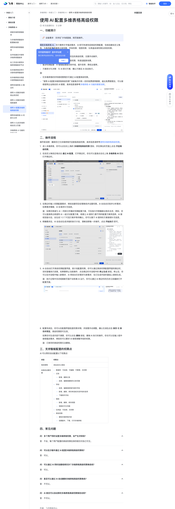

# 使用 AI 配置多维表格高级权限

> 来源：[飞书帮助中心](https://www.feishu.cn/hc/zh-CN/articles/804245947218)  
> 分类：多维表格 / 快速入门 / 多维表格 AI  
> 抓取时间：2026-09-22T01:16:07.390Z

## 界面截图

### 文档内配图

1. 配图：https://p1-hera.feishucdn.com/tos-cn-i-jbbdkfciu3/a618e8f494324e56b6a88b22e0b1cd35~tplv-jbbdkfciu3-image:0:0.image
2. 配图：https://p1-hera.feishucdn.com/tos-cn-i-jbbdkfciu3/ebed4c99121240aa80e96cf0d3bc5c0e~tplv-jbbdkfciu3-image:0:0.image
3. 配图：https://p1-hera.feishucdn.com/tos-cn-i-jbbdkfciu3/bb482b6bc0a240ff99d64654ce72247f~tplv-jbbdkfciu3-image:0:0.image
4. 配图：https://p1-hera.feishucdn.com/tos-cn-i-jbbdkfciu3/1ce9eef847b74f86b3d6ced1d965c81b~tplv-jbbdkfciu3-image:0:0.image

## 功能定位

本页对应飞书帮助中心「多维表格 / 快速入门 / 多维表格 AI」下的「使用 AI 配置多维表格高级权限」。以下需求描述依据官方说明文档提炼，用于指导 DuoWei 对标实现。

## 功能目标

一、功能简介

## 文档结构（官方章节）

- 一、功能简介​
- 二、操作流程​
- 三、支持智能配置的权限点​
- 四、常见问题​

## 详细功能说明

一、功能简介

新员工入职：一键快速配置岗位对应的高级权限，无需手动操作。

业务需求变动：灵活调整现有高级权限，快速适配新场景。

复杂权限配置：AI 智能配置复杂条件组，提升效率、降低出错率。

方案探讨与决策：与 AI 探讨方案，确认方案后 AI 自动执行。

仅多维表格的所有者或管理员可通过 AI 配置高级权限。

“使用 AI 配置多维表格高级权限”功能每月均有一定的免费使用额度。超出免费额度后，可以继续使用企业购买的 AI 额度，具体信息请参考多维表格 AI 功能的额度说明。

二、操作流程

进入多维表格，你可以点击右上角的 多维表格高级权限 图标，并在弹出的页面上点击 开启高级权限。

在自定义角色区域点击 通过 AI 配置，打开侧边栏。你也可以直接点击右上角 多维表格 AI 图标打开侧边栏。

在侧边栏输入权限配置需求，例如创建项目经理角色并设置权限。AI 会自动识别并分析需求，如果需求模糊，AI 会请求补充信息。

注：如果你希望与 AI 一同探讨并确定权限配置方案，可在指令中明确提出相关诉求。例如，你可以直接表达希望和 AI 一起讨论配置方案，或者让 AI 提供几套不同的配置方案供选择。AI 接收到指令后，会生成 1-3 个可选方案并等待确认。你可以基于 AI 提供的方案继续补充信息。

明确需求后，AI 会自动生成详细的执行计划，清晰说明每一步操作。点击 开始执行 即可。

AI 会自动打开高级权限配置界面，按计划配置权限。你可以通过高级权限配置界面和侧边栏，实时查看执行进度。如果要停止当前操作，点击侧边栏对话框中的 停止生成 按钮。停止后，你可以在对话框中输入新需求，AI 将结合历史需求与新需求，在已生成内容的基础上继续生成。

注：执行过程中关闭或刷新页面不会影响 AI 运行。你可以通过 AI 侧边栏的历史记录重新打开配置页面。

配置完成后，你可以在配置界面检查权限详情，并按需手动调整。确认无误后点击 保存 或 保存并预览，高级权限即可生效。

如果你对生成内容不满意，你可以点击 撤销 按钮，撤销 AI 执行的操作。你也可以在输入框中继续描述需求，例如你可以要求 AI 继续调整字段的权限。

注：已保存的高级权限无法撤销。

三、支持智能配置的权限点

角色管理

添加自定义角色

给角色设置权限

数据表：可阅读、可编辑、可管理、无权限记录：新增、删除记录阅读、编辑或删除的记录范围字段：阅读、编辑或新增内容的字段新增、删除、修改单选或多选字段的选项下载附件字段视图：新增、删除、修改视图视图的可见范围仪表盘：可阅读、无权限其他权限：复制多维表格内容创建副本、下载、打印多维表格

数据表：可阅读、可编辑、可管理、无权限

新增、删除记录

阅读、编辑或删除的记录范围

阅读、编辑或新增内容的字段

新增、删除、修改单选或多选字段的选项

下载附件字段

新增、删除、修改视图

视图的可见范围

仪表盘：可阅读、无权限

其他权限：

复制多维表格内容

创建副本、下载、打印多维表格

四、常见问题

问：多个用户同时设置多维表格权限，会产生冲突吗？

答：不会。每个用户配置的高级权限在保存前仅对自己可见。

问：可以在沙箱中通过 AI 配置多维表格高级权限吗？

答：可以。

问：可以通过 AI 同时创建或修改多个多维表格高级权限角色吗？

问：是否可以通过 AI 自动删除多维表格高级权限角色？

答：不可以。

问：AI 是否可以自动修改多维表格高级权限角色名称？

类型 | 权限点

角色管理 | 添加自定义角色

给角色设置权限 | 数据表：可阅读、可编辑、可管理、无权限记录：新增、删除记录阅读、编辑或删除的记录范围字段：阅读、编辑或新增内容的字段新增、删除、修改单选或多选字段的选项下载附件字段视图：新增、删除、修改视图视图的可见范围仪表盘：可阅读、无权限其他权限：复制多维表格内容创建副本、下载、打印多维表格

## 实现要点（对标 DuoWei）

1. **入口与信息架构**：在产品中明确该能力所属模块（快速入门 / 多维表格 AI），并保证用户可从对应导航触达。
2. **核心交互**：按上文「详细功能说明」还原主要操作路径；截图中出现的按钮、字段、面板命名尽量与飞书语义一致或可映射。
3. **数据与权限**：若文档涉及可见范围、可编辑范围、分享或高级权限，实现时需落到角色/成员模型，并保证 API/MCP 与 UI 权限一致。
4. **边界与上限**：若文档提到数量上限、格式限制、导入导出约束，需在实现与错误提示中体现。
5. **验收**：以本页截图场景为用例，完成「能打开 / 能配置 / 能保存 / 能被 Agent 读写（如适用）」四项检查。

## 原始摘录摘要

> 一、功能简介 新员工入职：一键快速配置岗位对应的高级权限，无需手动操作。 业务需求变动：灵活调整现有高级权限，快速适配新场景。 复杂权限配置：AI 智能配置复杂条件组，提升效率、降低出错率。 方案探讨与决策：与 AI 探讨方案，确认方案后 AI 自动执行。 仅多维表格的所有者或管理员可通过 AI 配置高级权限。 “使用 AI 配置多维表格高级权限”功能每月均有一定的免费使用额度。超出免费额度后，可以继续使用企业购买的 AI 额度，具体信息请参考多维表格 AI 功能的额度说明。 二、操作流程 进入多维表格，你可以点击右上角的 多维表格高级权限 图标，并在弹出的页面上点击 开启高级权限。 在自定义角色区域点击 通过 AI 配置，打开侧边栏。你也可以直接点击右上角 多维表格 AI 图标打开侧边栏。 在侧边栏输入权限配置需求，例如创建项目经理角色并设置权限。AI 会自动识别并分析需求，如果需求模糊，AI 会请求补充信息。 注：如果你希望与 AI 一同探讨并确定权限配置方案，可在指令中明确提出相关诉求。例如，你可以直接表达希望和 AI 一起讨论配置方案，或者让 AI 提供几套不同的配置方案供选择。AI 接收到指令后，会生成 1-3 个可选方案并等待确认。你可以基于 AI 提供的方案继续补充信息。 明确需求后，AI 会自动生成详细的执行计划，清晰说明每一步操作。点击 开始执行 即可。 AI 会自动打开高级权限配置界面，按计划配置权限。你可以通过高级权限配置界面和侧边栏，实时查看执行进度。如果要停止当前操作，点击侧边栏对话框中的 停止生成 按钮。停止后，你可以在对话框中输入新需求，AI 将结合历史需求与新需求，在已生成内容的基础上继续生成。 注：执行过程中关闭或刷新页面不会影响 AI 运行。你可以通过 AI 侧边栏的历史记录重新打开配置页面。 配置完成后，你可以在配置界面检查权限详情，并…

## 元数据

- article_id: `7618511339891526598`
- category_id: `7630766419524717789`
- path: `/hc/zh-CN/articles/804245947218`
- extracted_text_length: 1605
