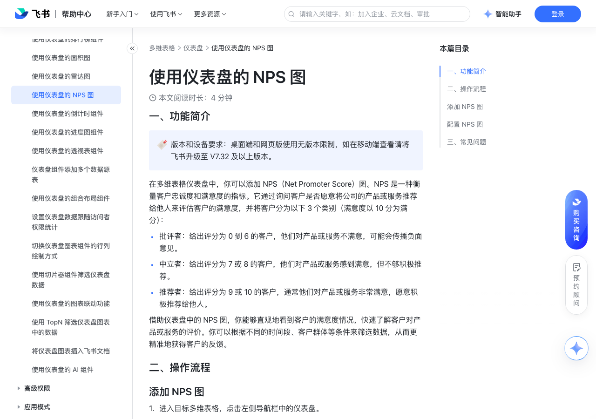

# 使用仪表盘的 NPS 图

> 来源：[飞书帮助中心](https://www.feishu.cn/hc/zh-CN/articles/432036135792)  
> 分类：多维表格 / 仪表盘  
> 抓取时间：2026-09-22T01:25:19.860Z

## 界面截图

### 文档内配图

1. 配图：https://p1-hera.feishucdn.com/tos-cn-i-jbbdkfciu3/4736c72b3e9049b9b0d9c3d5034e2b4f~tplv-jbbdkfciu3-image:0:0.image
2. 配图：https://p1-hera.feishucdn.com/tos-cn-i-jbbdkfciu3/3483aaa2712644b993c03afc6f2576cc~tplv-jbbdkfciu3-image:0:0.image
3. 配图：https://p1-hera.feishucdn.com/tos-cn-i-jbbdkfciu3/f346f6083c6e45f19d77834487dc51ba~tplv-jbbdkfciu3-image:0:0.image
4. 配图：https://p1-hera.feishucdn.com/tos-cn-i-jbbdkfciu3/15fc3158cc5c4a198f8b71051eac3573~tplv-jbbdkfciu3-image:0:0.image

## 功能定位

本页对应飞书帮助中心「多维表格 / 仪表盘」下的「使用仪表盘的 NPS 图」。以下需求描述依据官方说明文档提炼，用于指导 DuoWei 对标实现。

## 功能目标

一、功能简介

## 文档结构（官方章节）

- 一、功能简介​
- 二、操作流程​
- 添加 NPS 图​
- 配置 NPS 图​
- 三、常见问题​

## 详细功能说明

一、功能简介

批评者：给出评分为 0 到 6 的客户，他们对产品或服务不满意，可能会传播负面意见。

中立者：给出评分为 7 或 8 的客户，他们对产品或服务感到满意，但不够积极推荐。

推荐者：给出评分为 9 或 10 的客户，通常他们对产品或服务非常满意，愿意积极推荐给他人。

二、操作流程

添加 NPS 图

进入目标多维表格，点击左侧导航栏中的仪表盘。

点击仪表盘页面上方的 添加组件，在其他分类下选择 NPS 图。

配置 NPS 图

在 基础设置 标签页下，你可以进行以下配置：

数据源：可选择当前多维表格中的任一数据表，作为 NPS 图的数据源。

数据范围：可选择数据表中的任意视图作为 NPS 图的数据范围，同时你还可以设置筛选条件。

NPS 依据：可选择评分字段作为 NPS 图的计算依据。若无评分字段，则无法配置 NPS 图。

设置批评者、中立者、推荐者分值范围：可滑动按钮修改批评者、中立者、推荐者分别对应的分值范围，它们分别至少需要有一个分值。当数据源中评分字段设置分值档位少于 3 个时，则无法配置 NPS 图。

主题色：可为 NPS 图选择展示颜色。每种主题色有三种颜色配置，每种颜色分别对应批评者、中立者和推荐者。

图表选项：可勾选 数据标签（默认为勾选状态），NPS 图则会展示刻度。还可勾选 列表（默认为不勾选状态），NPS 图下则会以列表的形式展示批评者、中立者、推荐者分别对应的分值、占比和数量。

250px|700px|reset

在 自定义样式 标签页下，你可以进行以下配置：

背景：可为 NPS 图自定义背景色。

字体颜色：可为 NPS 图中的字体选择颜色。

三、常见问题

问：移动端可以使用仪表盘 NPS 图吗？

答：移动端支持查看 NPS 图，不支持新增和编辑 NPS 图。

## 实现要点（对标 DuoWei）

1. **入口与信息架构**：在产品中明确该能力所属模块（仪表盘），并保证用户可从对应导航触达。
2. **核心交互**：按上文「详细功能说明」还原主要操作路径；截图中出现的按钮、字段、面板命名尽量与飞书语义一致或可映射。
3. **数据与权限**：若文档涉及可见范围、可编辑范围、分享或高级权限，实现时需落到角色/成员模型，并保证 API/MCP 与 UI 权限一致。
4. **边界与上限**：若文档提到数量上限、格式限制、导入导出约束，需在实现与错误提示中体现。
5. **验收**：以本页截图场景为用例，完成「能打开 / 能配置 / 能保存 / 能被 Agent 读写（如适用）」四项检查。

## 原始摘录摘要

> 一、功能简介 批评者：给出评分为 0 到 6 的客户，他们对产品或服务不满意，可能会传播负面意见。 中立者：给出评分为 7 或 8 的客户，他们对产品或服务感到满意，但不够积极推荐。 推荐者：给出评分为 9 或 10 的客户，通常他们对产品或服务非常满意，愿意积极推荐给他人。 二、操作流程 添加 NPS 图 进入目标多维表格，点击左侧导航栏中的仪表盘。 点击仪表盘页面上方的 添加组件，在其他分类下选择 NPS 图。 配置 NPS 图 在 基础设置 标签页下，你可以进行以下配置： 数据源：可选择当前多维表格中的任一数据表，作为 NPS 图的数据源。 数据范围：可选择数据表中的任意视图作为 NPS 图的数据范围，同时你还可以设置筛选条件。 NPS 依据：可选择评分字段作为 NPS 图的计算依据。若无评分字段，则无法配置 NPS 图。 设置批评者、中立者、推荐者分值范围：可滑动按钮修改批评者、中立者、推荐者分别对应的分值范围，它们分别至少需要有一个分值。当数据源中评分字段设置分值档位少于 3 个时，则无法配置 NPS 图。 主题色：可为 NPS 图选择展示颜色。每种主题色有三种颜色配置，每种颜色分别对应批评者、中立者和推荐者。 图表选项：可勾选 数据标签（默认为勾选状态），NPS 图则会展示刻度。还可勾选 列表（默认为不勾选状态），NPS 图下则会以列表的形式展示批评者、中立者、推荐者分别对应的分值、占比和数量。 250px|700px|reset 在 自定义样式 标签页下，你可以进行以下配置： 背景：可为 NPS 图自定义背景色。 字体颜色：可为 NPS 图中的字体选择颜色。 三、常见问题 问：移动端可以使用仪表盘 NPS 图吗？ 答：移动端支持查看 NPS 图，不支持新增和编辑 NPS 图。

## 元数据

- article_id: `7425499384755847196`
- category_id: `7165754521875005468`
- path: `/hc/zh-CN/articles/432036135792`
- extracted_text_length: 757
