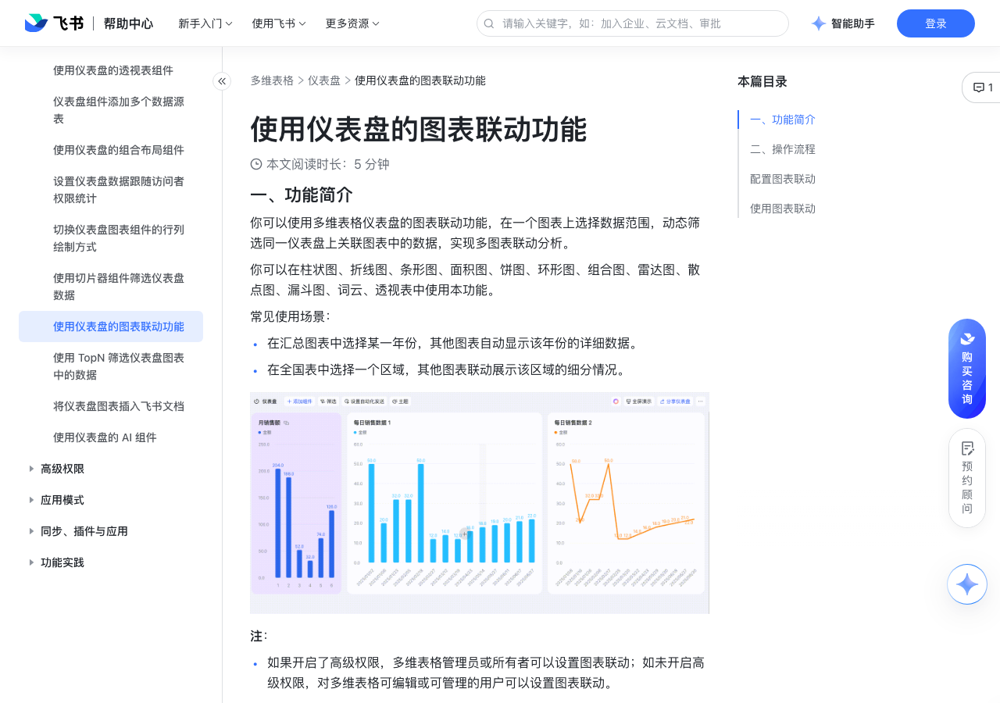

# 使用仪表盘的图表联动功能

> 来源：[飞书帮助中心](https://www.feishu.cn/hc/zh-CN/articles/743471387668)  
> 分类：多维表格 / 仪表盘  
> 抓取时间：2026-09-22T01:25:21.750Z

## 界面截图

### 文档内配图

1. 配图：https://p1-hera.feishucdn.com/tos-cn-i-jbbdkfciu3/722a3933185542c789351d85a1b5ccef~tplv-jbbdkfciu3-image:0:0.image
2. 配图：https://p1-hera.feishucdn.com/tos-cn-i-jbbdkfciu3/48177e3a23f64dc28fc6ef389aeecb14~tplv-jbbdkfciu3-image:0:0.image
3. 配图：https://p1-hera.feishucdn.com/tos-cn-i-jbbdkfciu3/1afa3e92eb4742b49be1527cfd39b2c8~tplv-jbbdkfciu3-image:0:0.image
4. 配图：https://p1-hera.feishucdn.com/tos-cn-i-jbbdkfciu3/0869102379e14ab6ad293065dd019562~tplv-jbbdkfciu3-image:0:0.image
5. 配图：https://p1-hera.feishucdn.com/tos-cn-i-jbbdkfciu3/9ebbdb4ac8b644b1b5dd4c91ab057638~tplv-jbbdkfciu3-image:0:0.image
6. 配图：https://p1-hera.feishucdn.com/tos-cn-i-jbbdkfciu3/fc9c2ad797b64b44b73c98daa6b53029~tplv-jbbdkfciu3-image:0:0.image
7. 配图：https://p1-hera.feishucdn.com/tos-cn-i-jbbdkfciu3/a5043230f8914ff1b066f9e4936c8690~tplv-jbbdkfciu3-image:0:0.image
8. 配图：https://p1-hera.feishucdn.com/tos-cn-i-jbbdkfciu3/26788dcee1584d3987d108db286ff36d~tplv-jbbdkfciu3-image:0:0.image

## 功能定位

本页对应飞书帮助中心「多维表格 / 仪表盘」下的「使用仪表盘的图表联动功能」。以下需求描述依据官方说明文档提炼，用于指导 DuoWei 对标实现。

## 功能目标

一、功能简介

## 文档结构（官方章节）

- 一、功能简介​
- 二、操作流程​
- 配置图表联动​
- 使用图表联动​

## 详细功能说明

一、功能简介

你可以使用多维表格仪表盘的图表联动功能，在一个图表上选择数据范围，动态筛选同一仪表盘上关联图表中的数据，实现多图表联动分析。

在汇总图表中选择某一年份，其他图表自动显示该年份的详细数据。

在全国表中选择一个区域，其他图表联动展示该区域的细分情况。

如果开启了高级权限，多维表格管理员或所有者可以设置图表联动；如未开启高级权限，对多维表格可编辑或可管理的用户可以设置图表联动。

对仪表盘拥有可阅读权限的用户可以使用图表联动筛选数据。

二、操作流程

配置图表联动

在多维表格左侧的导航栏中打开要配置图表联动的仪表盘，将鼠标移至要设置图表联动的图表上，点击右上角浮现的︙图标 > 配置。

在配置面板上，切换至 分析 标签页，点击图表联动右侧的 + 配置。

在左侧勾选要联动的图表。如果联动的图表与当前图表数据源不同，则在右侧继续选择联动图表中的关联字段。如果联动图表包含多个数据源，则需要为每个数据源选择关联字段。

注：当前图表中用来筛选数据的字段由系统默认指定。

点击右下角的 确认 完成设置。设置完成后，图表左上角将显示 已配置图表联动 图标。

注：配置图表时在 分析 页签下点击 图表联动 右侧的 删除 图标，即可在该图表中关闭图表联动功能。

使用图表联动

桌面端或网页端：打开仪表盘，在设置了图表联动的图表中点击一组数据，点击 图表联动，关联图表会自动筛选出相应的数据。如需取消联动，在该图表中点击空白处，或者再次点击所选数据并点击 取消联动。

移动端：打开仪表盘，在配置了图表联动的图表中点击一组数据，关联图表会自动筛选出相应的数据。如需取消联动，再次点击该数据或点击图表中的空白处即可。

## 实现要点（对标 DuoWei）

1. **入口与信息架构**：在产品中明确该能力所属模块（仪表盘），并保证用户可从对应导航触达。
2. **核心交互**：按上文「详细功能说明」还原主要操作路径；截图中出现的按钮、字段、面板命名尽量与飞书语义一致或可映射。
3. **数据与权限**：若文档涉及可见范围、可编辑范围、分享或高级权限，实现时需落到角色/成员模型，并保证 API/MCP 与 UI 权限一致。
4. **边界与上限**：若文档提到数量上限、格式限制、导入导出约束，需在实现与错误提示中体现。
5. **验收**：以本页截图场景为用例，完成「能打开 / 能配置 / 能保存 / 能被 Agent 读写（如适用）」四项检查。

## 原始摘录摘要

> 一、功能简介 你可以使用多维表格仪表盘的图表联动功能，在一个图表上选择数据范围，动态筛选同一仪表盘上关联图表中的数据，实现多图表联动分析。 在汇总图表中选择某一年份，其他图表自动显示该年份的详细数据。 在全国表中选择一个区域，其他图表联动展示该区域的细分情况。 如果开启了高级权限，多维表格管理员或所有者可以设置图表联动；如未开启高级权限，对多维表格可编辑或可管理的用户可以设置图表联动。 对仪表盘拥有可阅读权限的用户可以使用图表联动筛选数据。 二、操作流程 配置图表联动 在多维表格左侧的导航栏中打开要配置图表联动的仪表盘，将鼠标移至要设置图表联动的图表上，点击右上角浮现的︙图标 > 配置。 在配置面板上，切换至 分析 标签页，点击图表联动右侧的 + 配置。 在左侧勾选要联动的图表。如果联动的图表与当前图表数据源不同，则在右侧继续选择联动图表中的关联字段。如果联动图表包含多个数据源，则需要为每个数据源选择关联字段。 注：当前图表中用来筛选数据的字段由系统默认指定。 点击右下角的 确认 完成设置。设置完成后，图表左上角将显示 已配置图表联动 图标。 注：配置图表时在 分析 页签下点击 图表联动 右侧的 删除 图标，即可在该图表中关闭图表联动功能。 使用图表联动 桌面端或网页端：打开仪表盘，在设置了图表联动的图表中点击一组数据，点击 图表联动，关联图表会自动筛选出相应的数据。如需取消联动，在该图表中点击空白处，或者再次点击所选数据并点击 取消联动。 移动端：打开仪表盘，在配置了图表联动的图表中点击一组数据，关联图表会自动筛选出相应的数据。如需取消联动，再次点击该数据或点击图表中的空白处即可。

## 元数据

- article_id: `7563660330870669315`
- category_id: `7165754521875005468`
- path: `/hc/zh-CN/articles/743471387668`
- extracted_text_length: 703
