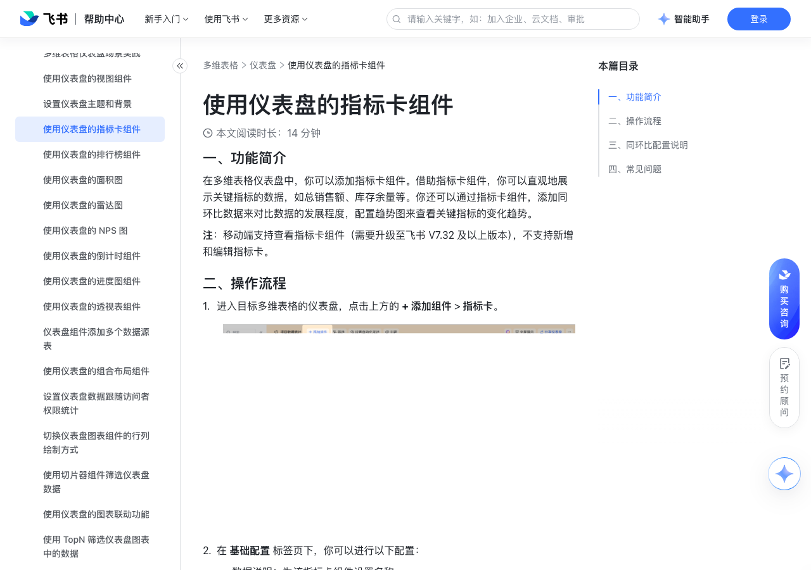

# 使用仪表盘的指标卡组件

> 来源：[飞书帮助中心](https://www.feishu.cn/hc/zh-CN/articles/440569013989)  
> 分类：多维表格 / 仪表盘  
> 抓取时间：2026-09-22T01:25:19.180Z

## 界面截图

### 文档内配图

1. 配图：https://p1-hera.feishucdn.com/tos-cn-i-jbbdkfciu3/219d7437398d4b6e92a471491d436d85~tplv-jbbdkfciu3-image:0:0.image
2. 配图：https://p1-hera.feishucdn.com/tos-cn-i-jbbdkfciu3/86d0fffb2749469d8a7fb1c8cb381651~tplv-jbbdkfciu3-image:0:0.image
3. 配图：https://p1-hera.feishucdn.com/tos-cn-i-jbbdkfciu3/8bd882e97f3b4dc1b86ce4162835811b~tplv-jbbdkfciu3-image:0:0.image

## 功能定位

本页对应飞书帮助中心「多维表格 / 仪表盘」下的「使用仪表盘的指标卡组件」。以下需求描述依据官方说明文档提炼，用于指导 DuoWei 对标实现。

## 功能目标

一、功能简介

## 文档结构（官方章节）

- 一、功能简介​
- 二、操作流程​
- 三、同环比配置说明​
- 四、常见问题​

## 详细功能说明

一、功能简介

二、操作流程

进入目标多维表格的仪表盘，点击上方的 + 添加组件 > 指标卡。

在 基础配置 标签页下，你可以进行以下配置：

数据说明：为该指标卡组件设置名称。

数据源：可选择当前多维表格中的任意数据表作为指标卡组件的数据源。指标卡将对所选数据表中的记录数或某个字段的数值进行统计。如果你使用的飞书版本开通了多数据源功能，可勾选 多数据源模式 并选择多个数据表作为数据源。

数据范围：默认统计全部数据。点击 全部数据 可以切换视图以便统计对应视图中的数据；点击 筛选 可以添加筛选条件以便统计筛选后的数据。

统计方式：默认 统计记录总数。当数据源中有数字字段，或计算结果为数字的公式字段，或有引用数字的查找引用字段时，可以选择 统计字段数值 并在 选择字段 中选择要统计的字段和计算方式。计算方式支持选择求和、最大值、最小值或平均值。

注：指标卡的“统计方式”不支持显示百分比。如需展示百分比数值，可参考下文配置同环比。

同环比：勾选后，可在指标卡组件内底部展示所统计数值的同环比变化情况。

时间依据：选择一个字段作为计算同环比的时间依据。可选数据表里类型为“日期”或“创建时间”的字段，以及类型为“公式”且 字段格式 为 日期 的字段。

时间范围：选择计算同环比时依据的时间范围。可选今天、本周、本月、本季度等，或者自定义时间范围。如选择 本周、本月、本季度 或 今年，统计范围为完整周期的数据，包括周期内未来时间的数据；如选择 本周至今、本月至今、本季度至今 或 今年至今，统计范围是当前周期到今天（含今天）的数据。

同环比描述：填写该同环比数据的名称或说明。

计算方式：默认计算 环比 数据，可选择 周同比、月同比、年同比，或者进行 自定义对比。

计算类型：默认计算 差异率，可以选择计算 差值 或 原始值。

注：有关同环比配置的具体信息，请参考本文“三、同环比配置说明”。

趋势图：勾选后，可以在指标卡组件内右下角以折线图形式展示所统计数值在指定时间范围内的变化趋势。

时间依据：选择一个字段作为绘制趋势图的时间依据，可选数据表里类型为“日期”或“创建时间”的字段，以及类型为“公式”且 字段格式 为 日期 的字段。

时间范围：选择趋势图的起始时间点，可选本周、本月、本季度等，或者自定义时间范围。

所选的时间范围内，至少需要有 2 个数据点才能使用趋势图。

如选择 本周、本月、本季度 或 今年，统计范围为完整周期的数据，包括周期内未来时间的数据；如选择 本周至今、本月至今、本季度至今 或 今年至今，统计范围是当前周期到今天（含今天）的数据。

（可选）在 自定义配置 标签页下，按需进行以下配置：

背景颜色：为指标卡组件自定义背景色。

文字颜色：为指标卡中的文字设置颜色。

字体字号：支持 自适应 或设置固定的 自定义 字号。

小数精度：仪表盘中存在小数时，可以设置显示为整数或保留几位小数。

数字格式：设置指标卡中统计数值的显示格式，例如显示为百分比、人民币、美元等。

图标样式：在 基础配置 页签中勾选 同环比 之后，可设置展示同环比数据上升、持平和下降的图标。

三、同环比配置说明

同比：周同比指当期数据与上一周的同期数据进行比较，例如本周三与上周三，反映每周的数据变化。月同比指当期数据与上一个月的同期数据进行比较，例如本月 5 号与上月 5 号，反映每月的数据变化。年同比指当期数据与去年同期数据进行比较，例如今年 8 月与去年 8 月，反映每年的数据变化。

同比差异率 = (当期数据－同期数据) ÷ 同期数 × 100%

同比差值 = 当期数据－同期数据

原始值 = 同期数据

环比：即环比变化率，是与上一个相邻统计周期的数据进行比较。例如，2024 年 9 月与 2024 年 8 月数据相比称为环比。环比聚焦短期数据波动，用于观察近期趋势变化。

环比差差异率 = (当期数据－上一期数) ÷ 上一期数 × 100%

环比差值 = 当期数据－上一期数据

原始值 = 上一期数据

自定义对比：支持根据需求自定义时间段，也就是将当前时间段的数据与某个自定义时间段相比较，以满足个性化的数据分析需求。

自定义差异率 = (当期数据－指定时间数据) ÷ 指定时间数据 × 100%

自定义差值 = 当期数据－指定时间数据

原始值 = 指定时间数据

当期时间范围

不同计算方式对应的时间范围

今天：2024/06/28

前一天：2024/06/27

一周前：2024/06/21

上月同日：2024/05/28

去年同日：2023/06/28

昨天：2024/06/27

前一天：2024/06/26

一周前：2024/06/20

上月同日：2024/05/27

去年同日：2023/06/27

本周（7 天）：2024/06/24-2024/06/30

上周（7 天）：2024/06/17-2024/06/23

去年同期（7 天）：2023/06/24-2023/06/30

本周至今（5 天）：2024/06/24-2024/06/28

上周（5 天）：2024/06/17-2024/06/21

去年同期（5 天）：2023/06/24-2023/06/30

上周：2024/06/17-2024/06/23

上上周：2024/06/10-2024/06/16

去年同期：2023/06/17-2023/06/23

本月（整月）：2024/06/01-2024/06/30

上月（整月）：2024/05/01-2024/05/31

去年同期（整月）：2023/06/01-2023/06/30

本月至今：2024/06/01- 2024/06/28

上月（非整月）：2024/05/01-2024/05/28

去年同期（非整月）：2023/06/01-2023/06/28

上月：2024/05/01- 2024/05/31

上上月：2024/04/01-2024/04/30

去年同期：2023/05/01-2023/05/31

本季度：2024/04/01-2024/06/30

上季度：2024/01/01-2024/03/31

去年同季度 :2023/04/01-2023/06/30

本季度至今：2024/04/01-2024/06/28

上季度（非整季度）：2024/01/01-2024/03/28

去年同季度 （非整季度）:2023/04/01-2023/06/28

上上季度：2023/10/01-2023/12/31

去年同季度：2023/01/01-2023/03/31

今年：2024/01/01-2024/12/31

去年：2023/01/01-2023/12/31

今年至今：2024/01/01-2024/06/28

去年（非整年）：2023/01/01-2023/06/28

前年：2022/01/01-2022/12/31

最近 7/14/30/365 天

上一个 7/14/30/365 天

最近 3 个月： 2024/04/01-2024/06/28

2024/01/01-2024/03/28

最近半年: 2024/01/01-2024/06/28

2023/06/01-2023/12/28

若今天是 2024/10/31，当选择的时间范围是 今天，计算方式选择 月同比 时，其比较时间为 2024/9/30。

若今天是 2024/03/31，选择的时间范围是 本月至今，计算方式选择 月同比 时，其比较时间范围为 2024/2/1 - 2024/2/29。

四、常见问题

问：移动端可以使用仪表盘指标卡组件吗？

答：移动端支持查看指标卡组件，不支持新增和编辑指标卡组件。

问：在配置指标卡组件时，选择的时间范围具体指的是哪段时间？

答：时间范围具体如下：时间范围描述本周至今指当前所在的这一周若今天是周三（2024/10/16），则所选范围为周一至周三（2024/10/14-2024/10/16），对比的时间段也为某周期下的周一至周三。本周指当前所在的完整的一周上周指当前所在周的上一周本月至今指当前所在月，当月 1 日至今天本月指当前所在的完整的一个月上月指当前所在月的上个月本季度至今指当前所在季度至今季度按 1 月 1 日至 3 月 31 日、4 月 1 日至 6 月 30 日、7 月 1 日至 9 月 30 日、10 月 1 日至 12 月 31 日这四个时间段进行划分。若今天在某季度中间，如今天是 7 月 29 日，则本季度范围为所在季度初至今天（7 月 1 日至 7 月 29 日），对比的时间段也为某一周期内的 7 月 1 日至 7 月 29 日。本季度指当前所在的完整的一个季度上季度指当前所在季度的上一季度今年至今指当前所在年的 1 月 1 日至今天今年指当前所在的完整的一年去年指当前所在年的上一年最近 7/14/30/365 天指过去 7/14/30/365 天（包含今天）最近 3 个月指当前所在月份的前 2 个月的 1 日至今天，如今天是 8 月 1 日，则最近 3 个月为 6 月 1 日至 8 月 1 日。最近半年指当前所在月份的前 5 个月的 1 日至今天，如今天是 8 月 1 日，则最近 6 个月为 3 月 1 日至 8 月 1 日。

问：在多维表格仪表盘中，在切片器中选择时间范围后，指标卡组件中的同环比数据可以自动更新为相应日期的比值吗？

答：不支持。

当期时间范围 | 不同计算方式对应的时间范围 | | |

| 环比 | 周同比 | 月同比 | 年同比

今天：2024/06/28 | 前一天：2024/06/27 | 一周前：2024/06/21 | 上月同日：2024/05/28 | 去年同日：2023/06/28

昨天：2024/06/27 | 前一天：2024/06/26 | 一周前：2024/06/20 | 上月同日：2024/05/27 | 去年同日：2023/06/27

本周（7 天）：2024/06/24-2024/06/30 | 上周（7 天）：2024/06/17-2024/06/23 | 上周（7 天）：2024/06/17-2024/06/23 | 不可比 | 去年同期（7 天）：2023/06/24-2023/06/30

本周至今（5 天）：2024/06/24-2024/06/28 | 上周（5 天）：2024/06/17-2024/06/21 | 上周（5 天）：2024/06/17-2024/06/21 | 不可比 | 去年同期（5 天）：2023/06/24-2023/06/30

上周：2024/06/17-2024/06/23 | 上上周：2024/06/10-2024/06/16 | 上上周：2024/06/10-2024/06/16 | 不可比 | 去年同期：2023/06/17-2023/06/23

本月（整月）：2024/06/01-2024/06/30 | 上月（整月）：2024/05/01-2024/05/31 | 不可比 | 上月（整月）：2024/05/01-2024/05/31 | 去年同期（整月）：2023/06/01-2023/06/30

本月至今：2024/06/01- 2024/06/28 | 上月（非整月）：2024/05/01-2024/05/28 | 不可比 | 上月（非整月）：2024/05/01-2024/05/28 | 去年同期（非整月）：2023/06/01-2023/06/28

上月：2024/05/01- 2024/05/31 | 上上月：2024/04/01-2024/04/30 | 不可比 | 上上月：2024/04/01-2024/04/30 | 去年同期：2023/05/01-2023/05/31

本季度：2024/04/01-2024/06/30 | 上季度：2024/01/01-2024/03/31 | 不可比 | 不可比 | 去年同季度 :2023/04/01-2023/06/30

本季度至今：2024/04/01-2024/06/28 | 上季度（非整季度）：2024/01/01-2024/03/28 | 不可比 | 不可比 | 去年同季度 （非整季度）:2023/04/01-2023/06/28

上季度：2024/01/01-2024/03/31 | 上上季度：2023/10/01-2023/12/31 | 不可比 | 不可比 | 去年同季度：2023/01/01-2023/03/31

今年：2024/01/01-2024/12/31 | 去年：2023/01/01-2023/12/31 | 不可比 | 不可比 | 去年：2023/01/01-2023/12/31

今年至今：2024/01/01-2024/06/28 | 去年（非整年）：2023/01/01-2023/06/28 | 不可比 | 不可比 | 去年（非整年）：2023/01/01-2023/06/28

去年：2023/01/01-2023/12/31 | 前年：2022/01/01-2022/12/31 | 不可比 | 不可比 | 前年：2022/01/01-2022/12/31

最近 7/14/30/365 天 | 上一个 7/14/30/365 天 | 不可比 | 不可比 | 不可比

最近 3 个月： 2024/04/01-2024/06/28 | 2024/01/01-2024/03/28 | 不可比 | 不可比 | 不可比

最近半年: 2024/01/01-2024/06/28 | 2023/06/01-2023/12/28 | 不可比 | 不可比 | 不可比

## 实现要点（对标 DuoWei）

1. **入口与信息架构**：在产品中明确该能力所属模块（仪表盘），并保证用户可从对应导航触达。
2. **核心交互**：按上文「详细功能说明」还原主要操作路径；截图中出现的按钮、字段、面板命名尽量与飞书语义一致或可映射。
3. **数据与权限**：若文档涉及可见范围、可编辑范围、分享或高级权限，实现时需落到角色/成员模型，并保证 API/MCP 与 UI 权限一致。
4. **边界与上限**：若文档提到数量上限、格式限制、导入导出约束，需在实现与错误提示中体现。
5. **验收**：以本页截图场景为用例，完成「能打开 / 能配置 / 能保存 / 能被 Agent 读写（如适用）」四项检查。

## 原始摘录摘要

> 一、功能简介 二、操作流程 进入目标多维表格的仪表盘，点击上方的 + 添加组件 > 指标卡。 在 基础配置 标签页下，你可以进行以下配置： 数据说明：为该指标卡组件设置名称。 数据源：可选择当前多维表格中的任意数据表作为指标卡组件的数据源。指标卡将对所选数据表中的记录数或某个字段的数值进行统计。如果你使用的飞书版本开通了多数据源功能，可勾选 多数据源模式 并选择多个数据表作为数据源。 数据范围：默认统计全部数据。点击 全部数据 可以切换视图以便统计对应视图中的数据；点击 筛选 可以添加筛选条件以便统计筛选后的数据。 统计方式：默认 统计记录总数。当数据源中有数字字段，或计算结果为数字的公式字段，或有引用数字的查找引用字段时，可以选择 统计字段数值 并在 选择字段 中选择要统计的字段和计算方式。计算方式支持选择求和、最大值、最小值或平均值。 注：指标卡的“统计方式”不支持显示百分比。如需展示百分比数值，可参考下文配置同环比。 同环比：勾选后，可在指标卡组件内底部展示所统计数值的同环比变化情况。 时间依据：选择一个字段作为计算同环比的时间依据。可选数据表里类型为“日期”或“创建时间”的字段，以及类型为“公式”且 字段格式 为 日期 的字段。 时间范围：选择计算同环比时依据的时间范围。可选今天、本周、本月、本季度等，或者自定义时间范围。如选择 本周、本月、本季度 或 今年，统计范围为完整周期的数据，包括周期内未来时间的数据；如选择 本周至今、本月至今、本季度至今 或 今年至今，统计范围是当前周期到今天（含今天）的数据。 同环比描述：填写该同环比数据的名称或说明。 计算方式：默认计算 环比 数据，可选择 周同比、月同比、年同比，或者进行 自定义对比。 计算类型：默认计算 差异率，可以选择计算 差值 或 原始值。 注：有关同环比配置的具体信息，请参考本文“三、同环比配置说明”。 趋势…

## 元数据

- article_id: `7425499816942944284`
- category_id: `7165754521875005468`
- path: `/hc/zh-CN/articles/440569013989`
- extracted_text_length: 5664
