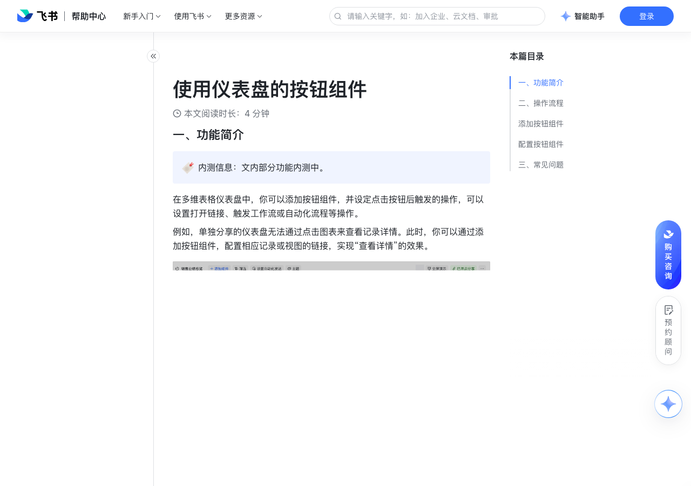

# 使用仪表盘的按钮组件

> 来源：[飞书帮助中心](https://www.feishu.cn/hc/zh-CN/articles/898935697937)  
> 分类：多维表格 / 仪表盘  
> 抓取时间：2026-09-22T01:25:16.572Z

## 界面截图

### 文档内配图

1. 配图：https://p1-hera.feishucdn.com/tos-cn-i-jbbdkfciu3/d84fbfcc4da143e184f95c2ee6462c0f~tplv-jbbdkfciu3-image:0:0.image
2. 配图：https://p1-hera.feishucdn.com/tos-cn-i-jbbdkfciu3/48813c1dbe484e3cb0518f55732800da~tplv-jbbdkfciu3-image:0:0.image
3. 配图：https://p1-hera.feishucdn.com/tos-cn-i-jbbdkfciu3/87178384276e4741898b31a9a1bcabb1~tplv-jbbdkfciu3-image:0:0.image
4. 配图：https://p1-hera.feishucdn.com/tos-cn-i-jbbdkfciu3/a38790b9b12440eea8687fe46ef35c3b~tplv-jbbdkfciu3-image:0:0.image
5. 配图：https://p1-hera.feishucdn.com/tos-cn-i-jbbdkfciu3/b51a1f68d7e44c348df2a06106d8255e~tplv-jbbdkfciu3-image:0:0.image
6. 配图：https://p1-hera.feishucdn.com/tos-cn-i-jbbdkfciu3/0ab90719850b45bea475897ac11b2f94~tplv-jbbdkfciu3-image:0:0.image

## 功能定位

本页对应飞书帮助中心「多维表格 / 仪表盘」下的「使用仪表盘的按钮组件」。以下需求描述依据官方说明文档提炼，用于指导 DuoWei 对标实现。

## 功能目标

一、功能简介

## 文档结构（官方章节）

- 一、功能简介​
- 二、操作流程​
- 添加按钮组件​
- 配置按钮组件​
- 三、常见问题​

## 详细功能说明

一、功能简介

二、操作流程

添加按钮组件

进入目标多维表格，点击左侧导航栏中的仪表盘。

点击上方的 + 添加组件，在图表分类下选择 按钮 组件。

配置按钮组件

在 基础配置 标签页下，你可以进行以下配置：

按钮文字：可以设置按钮展示的文字内容。

执行操作：可以选择 打开链接、发送记录汇总、执行自动化 或者 执行工作流。

注：执行工作流功能内测中。

“打开链接”：将需跳转的链接地址粘贴到此处，例如单条记录分享链接、视图分享链接、文档、外部链接等。点击按钮后即可跳转页面。

“发送记录汇总”：点击后会跳转至自动化流程的配置界面，自动带出在自动化消息中发送多行记录的模板，可自行补充或调整内容。有关自动化消息发送多行记录的具体信息，请参考自动化消息支持发送多行记录。

第 1 步：触发条件为“点击按钮时”，选择的按钮类型为“按钮组件”。

第 2 步为“查找记录”，筛选出符合条件的记录，并设置查找内容。

第 3 步为“发送飞书消息”，在消息内容中引用“第 2 步查找的记录｜查找到的所有记录”。

250px|700px|reset

组合字段的消息卡片示例效果如下：

执行自动化 或 执行工作流：可选择触发条件为“点击按钮时”且按钮类型为“按钮组件”的任意已启用自动化或工作流。也可以新建自动化或工作流。新建的工作流触发条件为“点击按钮时”，且按钮类型为“按钮组件”。关于工作流和自动化的具体信息，请参考使用多维表格工作流和使用多维表格自动化流程。

按钮颜色：可为按钮组件设置颜色、颜色的不透明度和背景模糊度。

按钮选项：可以通过勾选图标、图标背景、跳转箭头或圆角来自定义按钮样式。

对齐方式：可选择左对齐或居中对齐排列按钮文字、图标和跳转箭头。

在 自定义样式 标签页下，你可以进行以下配置：

字体颜色与色号：可设置按钮文字的字体颜色和字号。

边框样式：可设置按钮组件的边框颜色、边框不透明明度、边框线样式和边框粗细。

三、常见问题

问：在独立分享的仪表盘中，按钮组件是否支持点击？

答：是。

问：在将多维表格按钮组件与自动化或工作流关联时，为什么没有可选的自动化或工作流？

答：可能有以下原因：多维表格中没有以“点击按钮时”为触发条件的自动化或工作流。多维表格中以“点击按钮时”为触发条件的自动化或工作流，按钮类型是“按钮字段”而非“按钮组件”，也无法被选中。触发条件是“点击按钮时”且按钮类型是“按钮组件”，但该流程没有被启用。

问：可以对多维表格仪表盘的某个特定组件设置仅指定人员可见吗？

答：不可以。

## 实现要点（对标 DuoWei）

1. **入口与信息架构**：在产品中明确该能力所属模块（仪表盘），并保证用户可从对应导航触达。
2. **核心交互**：按上文「详细功能说明」还原主要操作路径；截图中出现的按钮、字段、面板命名尽量与飞书语义一致或可映射。
3. **数据与权限**：若文档涉及可见范围、可编辑范围、分享或高级权限，实现时需落到角色/成员模型，并保证 API/MCP 与 UI 权限一致。
4. **边界与上限**：若文档提到数量上限、格式限制、导入导出约束，需在实现与错误提示中体现。
5. **验收**：以本页截图场景为用例，完成「能打开 / 能配置 / 能保存 / 能被 Agent 读写（如适用）」四项检查。

## 原始摘录摘要

> 一、功能简介 二、操作流程 添加按钮组件 进入目标多维表格，点击左侧导航栏中的仪表盘。 点击上方的 + 添加组件，在图表分类下选择 按钮 组件。 配置按钮组件 在 基础配置 标签页下，你可以进行以下配置： 按钮文字：可以设置按钮展示的文字内容。 执行操作：可以选择 打开链接、发送记录汇总、执行自动化 或者 执行工作流。 注：执行工作流功能内测中。 “打开链接”：将需跳转的链接地址粘贴到此处，例如单条记录分享链接、视图分享链接、文档、外部链接等。点击按钮后即可跳转页面。 “发送记录汇总”：点击后会跳转至自动化流程的配置界面，自动带出在自动化消息中发送多行记录的模板，可自行补充或调整内容。有关自动化消息发送多行记录的具体信息，请参考自动化消息支持发送多行记录。 第 1 步：触发条件为“点击按钮时”，选择的按钮类型为“按钮组件”。 第 2 步为“查找记录”，筛选出符合条件的记录，并设置查找内容。 第 3 步为“发送飞书消息”，在消息内容中引用“第 2 步查找的记录｜查找到的所有记录”。 250px|700px|reset 组合字段的消息卡片示例效果如下： 执行自动化 或 执行工作流：可选择触发条件为“点击按钮时”且按钮类型为“按钮组件”的任意已启用自动化或工作流。也可以新建自动化或工作流。新建的工作流触发条件为“点击按钮时”，且按钮类型为“按钮组件”。关于工作流和自动化的具体信息，请参考使用多维表格工作流和使用多维表格自动化流程。 按钮颜色：可为按钮组件设置颜色、颜色的不透明度和背景模糊度。 按钮选项：可以通过勾选图标、图标背景、跳转箭头或圆角来自定义按钮样式。 对齐方式：可选择左对齐或居中对齐排列按钮文字、图标和跳转箭头。 在 自定义样式 标签页下，你可以进行以下配置： 字体颜色与色号：可设置按钮文字的字体颜色和字号。 边框样式：可设置按钮组件的边框颜色、边框不透明明度、边框线…

## 元数据

- article_id: `7348004451116597250`
- category_id: `7165754521875005468`
- path: `/hc/zh-CN/articles/898935697937`
- extracted_text_length: 1053
