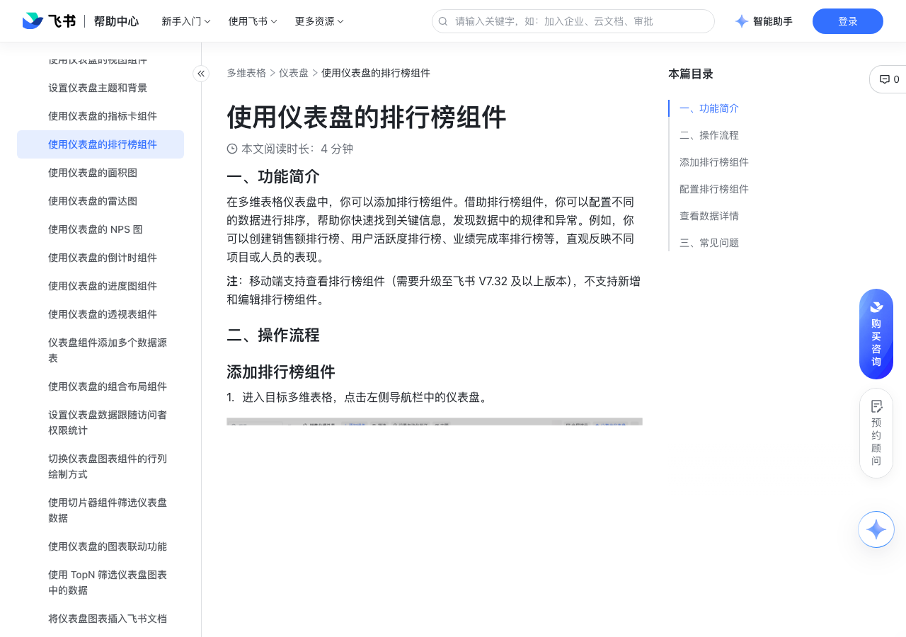

# 使用仪表盘的排行榜组件

> 来源：[飞书帮助中心](https://www.feishu.cn/hc/zh-CN/articles/713167044347)  
> 分类：多维表格 / 仪表盘  
> 抓取时间：2026-09-22T01:25:18.841Z

## 界面截图

### 文档内配图

1. 配图：https://p1-hera.feishucdn.com/tos-cn-i-jbbdkfciu3/02d7abff302f4149bda63d4d8fb646fd~tplv-jbbdkfciu3-image:0:0.image
2. 配图：https://p1-hera.feishucdn.com/tos-cn-i-jbbdkfciu3/3a1b763ff1e44f01a9e08329f98a7947~tplv-jbbdkfciu3-image:0:0.image
3. image.png：https://p1-hera.feishucdn.com/tos-cn-i-jbbdkfciu3/cf9d8528db644edf95bc83ddc0ab2823~tplv-jbbdkfciu3-png:0:0.png
4. image.png：https://p1-hera.feishucdn.com/tos-cn-i-jbbdkfciu3/d209971dbe2744f78760ca4aedda76eb~tplv-jbbdkfciu3-png:0:0.png

## 功能定位

本页对应飞书帮助中心「多维表格 / 仪表盘」下的「使用仪表盘的排行榜组件」。以下需求描述依据官方说明文档提炼，用于指导 DuoWei 对标实现。

## 功能目标

一、功能简介

## 文档结构（官方章节）

- 一、功能简介​
- 二、操作流程​
- 添加排行榜组件​
- 配置排行榜组件​
- 查看数据详情​
- 三、常见问题​

## 详细功能说明

一、功能简介

二、操作流程

添加排行榜组件

进入目标多维表格，点击左侧导航栏中的仪表盘。

在仪表盘设置页面的上方，点击 添加组件，在其他分类下选择 排行榜 组件。

配置排行榜组件

在 类型与数据 标签页下，你可以进行以下配置：

数据源：可选择当前多维表格中的任意数据表，作为排行榜组件的数据源。

数据范围：可对所选的数据源进行筛选设置，支持选择一个视图或者设置筛选范围。

排行字段：可选择用于排行的具体字段。默认选择数据源表中的首个人员类字段（包括人员、创建人、更新人和计算结果为人员的公式字段），若数据源表中不存在人员字段，则选中数据源表中的索引列字段。

排行依据：可选择 统计记录总数（默认）或 统计字段数值 作为排序依据。

统计记录总数：记录数的叠加。

统计字段数值：仅数据源表内有数字字段或公式字段时，才可以选择统计字段数值。

排序规则：可选择 正序（默认） 或 倒序 排列。

展示数量：可设定在排行榜中显示的记录数量，最多可设置展示 500 条记录。

在 自定义样式 标签页下，你可以进行以下配置：

背景：可为排行榜组件自定义背景色。

字体颜色：可为排行榜图表内的字体选择颜色。

数字格式：可设置排行统计数值的格式。

样式：可选择 奖台（默认）或 列表 作为排行榜样式。

查看数据详情

你可在数据详情中查看相关记录的详细情况，可使用搜索栏进一步搜索数据。

将鼠标光标悬停在单条记录上，点击首列中出现的 查看 图标，可查看单条记录的详情。

三、常见问题

问：移动端可以使用仪表盘排行榜组件吗？

答：移动端支持查看排行榜组件，不支持新增和编辑排行榜组件。

## 实现要点（对标 DuoWei）

1. **入口与信息架构**：在产品中明确该能力所属模块（仪表盘），并保证用户可从对应导航触达。
2. **核心交互**：按上文「详细功能说明」还原主要操作路径；截图中出现的按钮、字段、面板命名尽量与飞书语义一致或可映射。
3. **数据与权限**：若文档涉及可见范围、可编辑范围、分享或高级权限，实现时需落到角色/成员模型，并保证 API/MCP 与 UI 权限一致。
4. **边界与上限**：若文档提到数量上限、格式限制、导入导出约束，需在实现与错误提示中体现。
5. **验收**：以本页截图场景为用例，完成「能打开 / 能配置 / 能保存 / 能被 Agent 读写（如适用）」四项检查。

## 原始摘录摘要

> 一、功能简介 二、操作流程 添加排行榜组件 进入目标多维表格，点击左侧导航栏中的仪表盘。 在仪表盘设置页面的上方，点击 添加组件，在其他分类下选择 排行榜 组件。 配置排行榜组件 在 类型与数据 标签页下，你可以进行以下配置： 数据源：可选择当前多维表格中的任意数据表，作为排行榜组件的数据源。 数据范围：可对所选的数据源进行筛选设置，支持选择一个视图或者设置筛选范围。 排行字段：可选择用于排行的具体字段。默认选择数据源表中的首个人员类字段（包括人员、创建人、更新人和计算结果为人员的公式字段），若数据源表中不存在人员字段，则选中数据源表中的索引列字段。 排行依据：可选择 统计记录总数（默认）或 统计字段数值 作为排序依据。 统计记录总数：记录数的叠加。 统计字段数值：仅数据源表内有数字字段或公式字段时，才可以选择统计字段数值。 排序规则：可选择 正序（默认） 或 倒序 排列。 展示数量：可设定在排行榜中显示的记录数量，最多可设置展示 500 条记录。 在 自定义样式 标签页下，你可以进行以下配置： 背景：可为排行榜组件自定义背景色。 字体颜色：可为排行榜图表内的字体选择颜色。 数字格式：可设置排行统计数值的格式。 样式：可选择 奖台（默认）或 列表 作为排行榜样式。 查看数据详情 你可在数据详情中查看相关记录的详细情况，可使用搜索栏进一步搜索数据。 将鼠标光标悬停在单条记录上，点击首列中出现的 查看 图标，可查看单条记录的详情。 三、常见问题 问：移动端可以使用仪表盘排行榜组件吗？ 答：移动端支持查看排行榜组件，不支持新增和编辑排行榜组件。

## 元数据

- article_id: `7426677882510016516`
- category_id: `7165754521875005468`
- path: `/hc/zh-CN/articles/713167044347`
- extracted_text_length: 680
