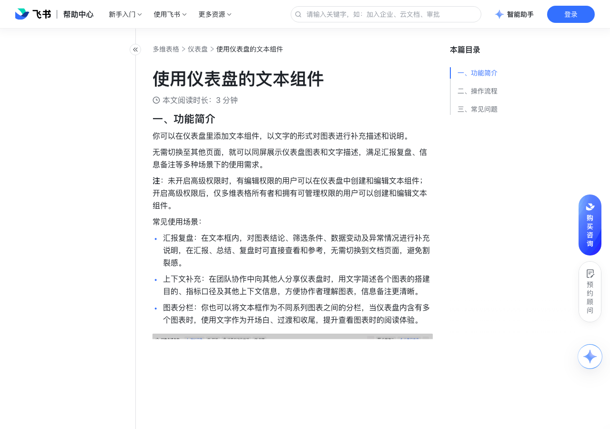

# 使用仪表盘的文本组件

> 来源：[飞书帮助中心](https://www.feishu.cn/hc/zh-CN/articles/110468700745)  
> 分类：多维表格 / 仪表盘  
> 抓取时间：2026-09-22T01:25:17.491Z

## 界面截图

### 文档内配图

1. 配图：https://p1-hera.feishucdn.com/tos-cn-i-jbbdkfciu3/5b7d937547e64d619769c6a16f3ece84~tplv-jbbdkfciu3-image:0:0.image
2. 配图：https://p1-hera.feishucdn.com/tos-cn-i-jbbdkfciu3/d0544d8616dc462d80a15038913556e9~tplv-jbbdkfciu3-image:0:0.image
3. 配图：https://p1-hera.feishucdn.com/tos-cn-i-jbbdkfciu3/062b9ef705aa4e10bc82b944bae68f75~tplv-jbbdkfciu3-image:0:0.image
4. 配图：https://p1-hera.feishucdn.com/tos-cn-i-jbbdkfciu3/356ecc65f47445c4b58ec8704868e25c~tplv-jbbdkfciu3-image:0:0.image

## 功能定位

本页对应飞书帮助中心「多维表格 / 仪表盘」下的「使用仪表盘的文本组件」。以下需求描述依据官方说明文档提炼，用于指导 DuoWei 对标实现。

## 功能目标

一、功能简介

## 文档结构（官方章节）

- 一、功能简介​
- 二、操作流程​
- 三、常见问题​

## 详细功能说明

一、功能简介

常见使用场景：

汇报复盘：在文本框内，对图表结论、筛选条件、数据变动及异常情况进行补充说明，在汇报、总结、复盘时可直接查看和参考，无需切换到文档页面，避免割裂感。

上下文补充：在团队协作中向其他人分享仪表盘时，用文字简述各个图表的搭建目的、指标口径及其他上下文信息，方便协作者理解图表，信息备注更清晰。

图表分栏：你也可以将文本框作为不同系列图表之间的分栏，当仪表盘内含有多个图表时，使用文字作为开场白、过渡和收尾，提升查看图表时的阅读体验。

二、操作流程

进入目标多维表格，点击左侧导航栏中的仪表盘。

点击上方的 + 添加组件，在图表分类下选择 文本 组件。

标题级别：可选正文、一级标题、二级标题、三级标题

对齐格式：可选左对齐、居中对齐、右对齐、顶部对齐、垂直居中、底部对齐

行间距：可选默认、1.3、1.5、2、2.5、3

字号、粗体，中划线，斜体，下划线，任务列表（勾选框形式），超链接，字体颜色，文本背景颜色，不透明度，有序列表，无序列表，引用，缩进

支持 @ 他人，可勾选是否“同时发送通知”。

支持提及云文档文件。

三、常见问题

问：文本组件内最多可以输入多少字？

答：上限为 10,000 字符。

## 实现要点（对标 DuoWei）

1. **入口与信息架构**：在产品中明确该能力所属模块（仪表盘），并保证用户可从对应导航触达。
2. **核心交互**：按上文「详细功能说明」还原主要操作路径；截图中出现的按钮、字段、面板命名尽量与飞书语义一致或可映射。
3. **数据与权限**：若文档涉及可见范围、可编辑范围、分享或高级权限，实现时需落到角色/成员模型，并保证 API/MCP 与 UI 权限一致。
4. **边界与上限**：若文档提到数量上限、格式限制、导入导出约束，需在实现与错误提示中体现。
5. **验收**：以本页截图场景为用例，完成「能打开 / 能配置 / 能保存 / 能被 Agent 读写（如适用）」四项检查。

## 原始摘录摘要

> 一、功能简介 常见使用场景： 汇报复盘：在文本框内，对图表结论、筛选条件、数据变动及异常情况进行补充说明，在汇报、总结、复盘时可直接查看和参考，无需切换到文档页面，避免割裂感。 上下文补充：在团队协作中向其他人分享仪表盘时，用文字简述各个图表的搭建目的、指标口径及其他上下文信息，方便协作者理解图表，信息备注更清晰。 图表分栏：你也可以将文本框作为不同系列图表之间的分栏，当仪表盘内含有多个图表时，使用文字作为开场白、过渡和收尾，提升查看图表时的阅读体验。 二、操作流程 进入目标多维表格，点击左侧导航栏中的仪表盘。 点击上方的 + 添加组件，在图表分类下选择 文本 组件。 标题级别：可选正文、一级标题、二级标题、三级标题 对齐格式：可选左对齐、居中对齐、右对齐、顶部对齐、垂直居中、底部对齐 行间距：可选默认、1.3、1.5、2、2.5、3 字号、粗体，中划线，斜体，下划线，任务列表（勾选框形式），超链接，字体颜色，文本背景颜色，不透明度，有序列表，无序列表，引用，缩进 支持 @ 他人，可勾选是否“同时发送通知”。 支持提及云文档文件。 三、常见问题 问：文本组件内最多可以输入多少字？ 答：上限为 10,000 字符。

## 元数据

- article_id: `7301149149523984412`
- category_id: `7165754521875005468`
- path: `/hc/zh-CN/articles/110468700745`
- extracted_text_length: 514
