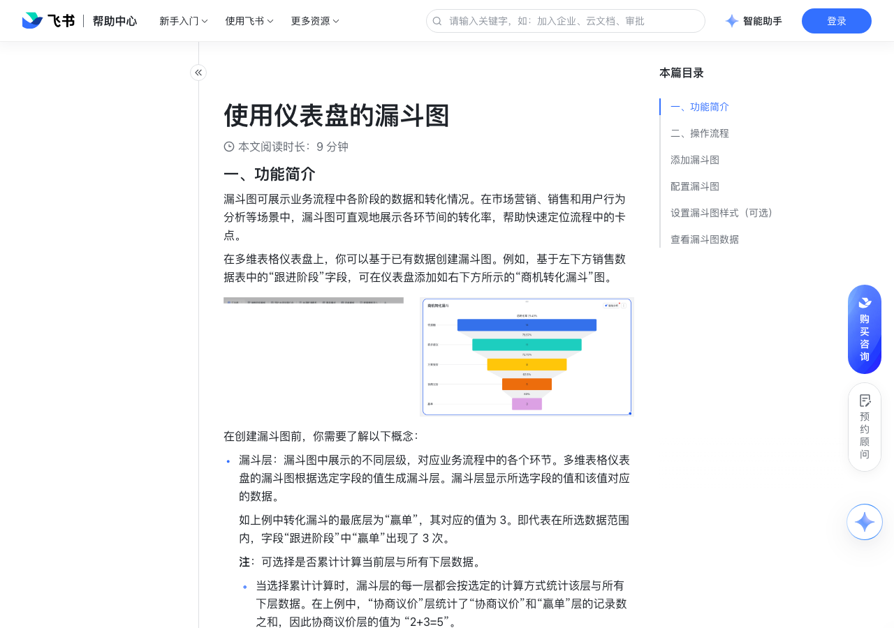

# 使用仪表盘的漏斗图

> 来源：[飞书帮助中心](https://www.feishu.cn/hc/zh-CN/articles/649065032118)  
> 分类：多维表格 / 仪表盘  
> 抓取时间：2026-09-22T01:25:14.136Z

## 界面截图

### 文档内配图

1. 配图：https://p1-hera.feishucdn.com/tos-cn-i-jbbdkfciu3/846cb01e93e2404380ee2511d587e5dd~tplv-jbbdkfciu3-image:0:0.image
2. 配图：https://p1-hera.feishucdn.com/tos-cn-i-jbbdkfciu3/bf481fab4c424fbb8bf201bcaa2bbeda~tplv-jbbdkfciu3-image:0:0.image
3. 配图：https://p1-hera.feishucdn.com/tos-cn-i-jbbdkfciu3/65ebfa6efed74ee098b21acc030d4070~tplv-jbbdkfciu3-image:0:0.image
4. 配图：https://p1-hera.feishucdn.com/tos-cn-i-jbbdkfciu3/e3cd1993c2f74de385bba7d9acbc10f1~tplv-jbbdkfciu3-image:0:0.image
5. 配图：https://p1-hera.feishucdn.com/tos-cn-i-jbbdkfciu3/949a36b4b95841dfb6c1c83e75b2fd76~tplv-jbbdkfciu3-image:0:0.image
6. 配图：https://p1-hera.feishucdn.com/tos-cn-i-jbbdkfciu3/ebd88b8ff96e4d71a4eb4b0624670f21~tplv-jbbdkfciu3-image:0:0.image
7. 配图：https://p1-hera.feishucdn.com/tos-cn-i-jbbdkfciu3/660637ba6e2f4fd7b90264c9de49a9b9~tplv-jbbdkfciu3-image:0:0.image
8. 配图：https://p1-hera.feishucdn.com/tos-cn-i-jbbdkfciu3/d832e207639e4779aca53e3c666357ef~tplv-jbbdkfciu3-image:0:0.image

## 功能定位

本页对应飞书帮助中心「多维表格 / 仪表盘」下的「使用仪表盘的漏斗图」。以下需求描述依据官方说明文档提炼，用于指导 DuoWei 对标实现。

## 功能目标

一、功能简介

## 文档结构（官方章节）

- 一、功能简介​
- 二、操作流程 ​
- 添加漏斗图​
- 配置漏斗图​
- 设置漏斗图样式（可选）​
- 查看漏斗图数据​

## 详细功能说明

一、功能简介

在创建漏斗图前，你需要了解以下概念：

漏斗层：漏斗图中展示的不同层级，对应业务流程中的各个环节。多维表格仪表盘的漏斗图根据选定字段的值生成漏斗层。漏斗层显示所选字段的值和该值对应的数据。

如上例中转化漏斗的最底层为“赢单”，其对应的值为 3。即代表在所选数据范围内，字段“跟进阶段”中“赢单”出现了 3 次。

注：可选择是否累计计算当前层与所有下层数据。

当选择累计计算时，漏斗层的每一层都会按选定的计算方式统计该层与所有下层数据。在上例中，“协商议价”层统计了“协商议价”和“赢单”层的记录数之和，因此协商议价层的值为 “2+3=5”。

当不选择累计计算时，每层将仅计算该层数据。

转化率：漏斗中一个环节与其前一环节数据的比值。在上例中“协商议价” 的值为 5，“赢单”的值为 3，因此从协商议价到赢单的转化率为 3/5，即 60%。

二、操作流程

操作说明：

在添加漏斗图前，需先确定用来生成图表的数据源。漏斗图需要基于所选数据表中的一个字段生成漏斗层。你可以选择从以下维度对数据进行统计和展示：

字段中每个值出现的次数。

数据表中其他指定字段的值。

添加漏斗图

在多维表格左侧的导航栏中点击需要创建漏斗图的仪表盘。

点击仪表盘左上角的 + 添加组件。

点击 图表 分组下的 漏斗图 组件，打开图表配置面板。

配置漏斗图

数据源：选择图表的源数据表。如果你使用的飞书版本开通了多数据源功能，可勾选 多数据源模式 启用该功能。启用后，可以在数据源选项中选择多个数据表。

数据范围：选择图表展示数据的范围。默认范围为数据表的全部数据。也可选择数据表中的任意视图，作为图表的数据范围。

如果选择 全部数据，可点击筛选栏右侧的 筛选 图标设定筛选条件。在 设置筛选条件 弹窗中，可添加多个条件。在弹窗右上角选择筛选出满足任意条件或所有条件的记录。

图表类型：选择 漏斗图 图标。

漏斗类型：选择生成 转化漏斗 或 基础漏斗。转化漏斗 将显示不同环节之间的转化率，基础漏斗 不显示转化率。

漏斗方向：选择漏斗的朝向。

主题色：选择漏斗图的主题色组合，可切换主题色组合并预览效果。

图表选项：选择图表中展示的数据和描述。可选项如下：

图例：各漏斗层的颜色图例。

漏斗层标签：选择是否展示漏斗层的名称和数据。

转化层标签：如果在 漏斗类型 中选择了 转化漏斗，则在这里选择是否展示转化率。

总转化率：漏斗中最后一层与第一层的百分比。

注：总转化率按照漏斗图中的展示顺序，而非数值大小，计算最后一层与第一层的比值。即使最后一层的数值不是所有漏斗层中最小的，也会使用该层数值进行计算。

漏斗层：设置生成漏斗层的字段和漏斗层顺序。

在下拉菜单中选择数据表中的一个字段定义漏斗层。系统将自动对数值按照降序排序。

如果勾选 汇总相同的类别，所选字段中相同的值将被归为一层。

在漏斗层列表中，可通过上下拖拽来调整漏斗层的顺序。将光标悬停于一个类别左侧的 拖拽 图标上，当光标变成手型时，单击选中该类别，上下拖拽以调整顺序。

数值：选择统计数值和计算方式。可选项如下：

统计记录总数：对选定字段中包含各个值的记录进行计数。

统计字段数值：以选定字段为基础生成漏斗层，各层以指定方式统计数据表中某一其他字段的值。

注：如选择该选项，需要在下方弹出的下拉框中选择一个字段，并在右侧选择数据的统计方式，可选项为 求和、最大值、最小值 和 平均值。

勾选是否 每层累计当前漏斗层与所有下层的数值。

设置漏斗图样式（可选）

背景：定义漏斗图的背景色。点击下拉菜单打开颜色配置面板，可通过调色盘、HEX 或 RGB 颜色代码设定背景色，还可调整背景的不透明度和模糊程度。

字体颜色和字号：点击展开 字体颜色 下的配置面板，配置字体颜色；点击字号下的 缩小 和 放大 图标，调整字体大小。

系列：设置漏斗图中漏斗层的展示样式和数据点格式。

系列样式：统一设置所有漏斗层的填充色和边框。

数据点格式：调整某一个或多个漏斗层的具体样式。在添加数据点后，可使用 数据点 下拉菜单选择漏斗层，点击 颜色 下拉菜单展开颜色配置面板。可勾选 显示漏斗层标签 和 显示总转化率，并配置标签和总转化率的样式。

转化层样式：设置转化层填充色和标签；如果勾选 显示转化层标签，可继续选择 标签位置 和 文本格式。

图例：设置 图例位置 和图例的 文本格式。

查看漏斗图数据

将鼠标光标悬停在图例上，漏斗图将高亮相应的漏斗层。点击某一图例，可以隐藏或展示某一漏斗层。

将光标悬停在漏斗层上时，将显示该层的计数或数值，以及转化率。

点击漏斗层，可在 数据详情 弹窗中查看该分类的详细数据。

点击图表右上角的 智能分析 按钮，获取对图表数据的智能分析和总结。更多关于智能分析功能的信息，请参考使用智能图表分析和仪表盘总结。

## 实现要点（对标 DuoWei）

1. **入口与信息架构**：在产品中明确该能力所属模块（仪表盘），并保证用户可从对应导航触达。
2. **核心交互**：按上文「详细功能说明」还原主要操作路径；截图中出现的按钮、字段、面板命名尽量与飞书语义一致或可映射。
3. **数据与权限**：若文档涉及可见范围、可编辑范围、分享或高级权限，实现时需落到角色/成员模型，并保证 API/MCP 与 UI 权限一致。
4. **边界与上限**：若文档提到数量上限、格式限制、导入导出约束，需在实现与错误提示中体现。
5. **验收**：以本页截图场景为用例，完成「能打开 / 能配置 / 能保存 / 能被 Agent 读写（如适用）」四项检查。

## 原始摘录摘要

> 一、功能简介 在创建漏斗图前，你需要了解以下概念： 漏斗层：漏斗图中展示的不同层级，对应业务流程中的各个环节。多维表格仪表盘的漏斗图根据选定字段的值生成漏斗层。漏斗层显示所选字段的值和该值对应的数据。 如上例中转化漏斗的最底层为“赢单”，其对应的值为 3。即代表在所选数据范围内，字段“跟进阶段”中“赢单”出现了 3 次。 注：可选择是否累计计算当前层与所有下层数据。 当选择累计计算时，漏斗层的每一层都会按选定的计算方式统计该层与所有下层数据。在上例中，“协商议价”层统计了“协商议价”和“赢单”层的记录数之和，因此协商议价层的值为 “2+3=5”。 当不选择累计计算时，每层将仅计算该层数据。 转化率：漏斗中一个环节与其前一环节数据的比值。在上例中“协商议价” 的值为 5，“赢单”的值为 3，因此从协商议价到赢单的转化率为 3/5，即 60%。 二、操作流程 操作说明： 在添加漏斗图前，需先确定用来生成图表的数据源。漏斗图需要基于所选数据表中的一个字段生成漏斗层。你可以选择从以下维度对数据进行统计和展示： 字段中每个值出现的次数。 数据表中其他指定字段的值。 添加漏斗图 在多维表格左侧的导航栏中点击需要创建漏斗图的仪表盘。 点击仪表盘左上角的 + 添加组件。 点击 图表 分组下的 漏斗图 组件，打开图表配置面板。 配置漏斗图 数据源：选择图表的源数据表。如果你使用的飞书版本开通了多数据源功能，可勾选 多数据源模式 启用该功能。启用后，可以在数据源选项中选择多个数据表。 数据范围：选择图表展示数据的范围。默认范围为数据表的全部数据。也可选择数据表中的任意视图，作为图表的数据范围。 如果选择 全部数据，可点击筛选栏右侧的 筛选 图标设定筛选条件。在 设置筛选条件 弹窗中，可添加多个条件。在弹窗右上角选择筛选出满足任意条件或所有条件的记录。 图表类型：选择 漏斗图 图标。 漏斗类型：…

## 元数据

- article_id: `7186535740116058140`
- category_id: `7165754521875005468`
- path: `/hc/zh-CN/articles/649065032118`
- extracted_text_length: 1986
