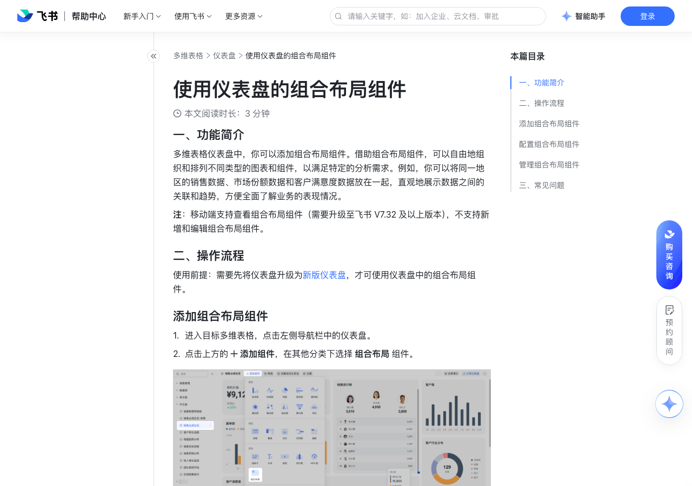

# 使用仪表盘的组合布局组件

> 来源：[飞书帮助中心](https://www.feishu.cn/hc/zh-CN/articles/479472176057)  
> 分类：多维表格 / 仪表盘  
> 抓取时间：2026-09-22T01:25:21.349Z

## 界面截图

### 文档内配图

1. 配图：https://p1-hera.feishucdn.com/tos-cn-i-jbbdkfciu3/4c109440ff654054a089fba26d693c96~tplv-jbbdkfciu3-image:0:0.image
2. 配图：https://p1-hera.feishucdn.com/tos-cn-i-jbbdkfciu3/f1f79852ba5d4397b15fdfacbe6f40e7~tplv-jbbdkfciu3-image:0:0.image
3. 配图：https://p1-hera.feishucdn.com/tos-cn-i-jbbdkfciu3/ed60440382bf4aac90c6fa6f39c3e4bf~tplv-jbbdkfciu3-image:0:0.image
4. 配图：https://p1-hera.feishucdn.com/tos-cn-i-jbbdkfciu3/2138e98f57124991abf11680f2dff111~tplv-jbbdkfciu3-image:0:0.image

## 功能定位

本页对应飞书帮助中心「多维表格 / 仪表盘」下的「使用仪表盘的组合布局组件」。以下需求描述依据官方说明文档提炼，用于指导 DuoWei 对标实现。

## 功能目标

一、功能简介

## 文档结构（官方章节）

- 一、功能简介​
- 二、操作流程​
- 添加组合布局组件​
- 配置组合布局组件​
- 管理组合布局组件​
- 三、常见问题​

## 详细功能说明

一、功能简介

二、操作流程

添加组合布局组件

进入目标多维表格，点击左侧导航栏中的仪表盘。

点击上方的 添加组件，在其他分类下选择 组合布局 组件。

配置组合布局组件

若你需要移入组合布局的子组件高度比组合布局高，那么组合布局会适应子组件的高度，组合布局会自动变高。

若你需要移入组合布局的子组件宽度比组合布局宽，那么子组件会在组合布局中换行展示。

不可将组合布局组件移入到另一个组合布局组件中。

管理组合布局组件

三、常见问题

问：在多维表格仪表盘中，为什么我会复制组合布局组件失败？

答：可能有以下 3 种原因：网络错误。没有当前仪表盘的编辑权限。复制后组件数量超过了仪表盘上限。其中，组合布局的组件数量为该组合布局内包含的子组件数量的和。

问：移动端可以使用多维表格仪表盘组合布局组件吗？

答：移动端将飞书升级至 V7.32 及以上可查看组合布局组件，不支持新增和编辑组合布局组件。

## 实现要点（对标 DuoWei）

1. **入口与信息架构**：在产品中明确该能力所属模块（仪表盘），并保证用户可从对应导航触达。
2. **核心交互**：按上文「详细功能说明」还原主要操作路径；截图中出现的按钮、字段、面板命名尽量与飞书语义一致或可映射。
3. **数据与权限**：若文档涉及可见范围、可编辑范围、分享或高级权限，实现时需落到角色/成员模型，并保证 API/MCP 与 UI 权限一致。
4. **边界与上限**：若文档提到数量上限、格式限制、导入导出约束，需在实现与错误提示中体现。
5. **验收**：以本页截图场景为用例，完成「能打开 / 能配置 / 能保存 / 能被 Agent 读写（如适用）」四项检查。

## 原始摘录摘要

> 一、功能简介 二、操作流程 添加组合布局组件 进入目标多维表格，点击左侧导航栏中的仪表盘。 点击上方的 添加组件，在其他分类下选择 组合布局 组件。 配置组合布局组件 若你需要移入组合布局的子组件高度比组合布局高，那么组合布局会适应子组件的高度，组合布局会自动变高。 若你需要移入组合布局的子组件宽度比组合布局宽，那么子组件会在组合布局中换行展示。 不可将组合布局组件移入到另一个组合布局组件中。 管理组合布局组件 三、常见问题 问：在多维表格仪表盘中，为什么我会复制组合布局组件失败？ 答：可能有以下 3 种原因：网络错误。没有当前仪表盘的编辑权限。复制后组件数量超过了仪表盘上限。其中，组合布局的组件数量为该组合布局内包含的子组件数量的和。 问：移动端可以使用多维表格仪表盘组合布局组件吗？ 答：移动端将飞书升级至 V7.32 及以上可查看组合布局组件，不支持新增和编辑组合布局组件。

## 元数据

- article_id: `7441046032915578882`
- category_id: `7165754521875005468`
- path: `/hc/zh-CN/articles/479472176057`
- extracted_text_length: 394
