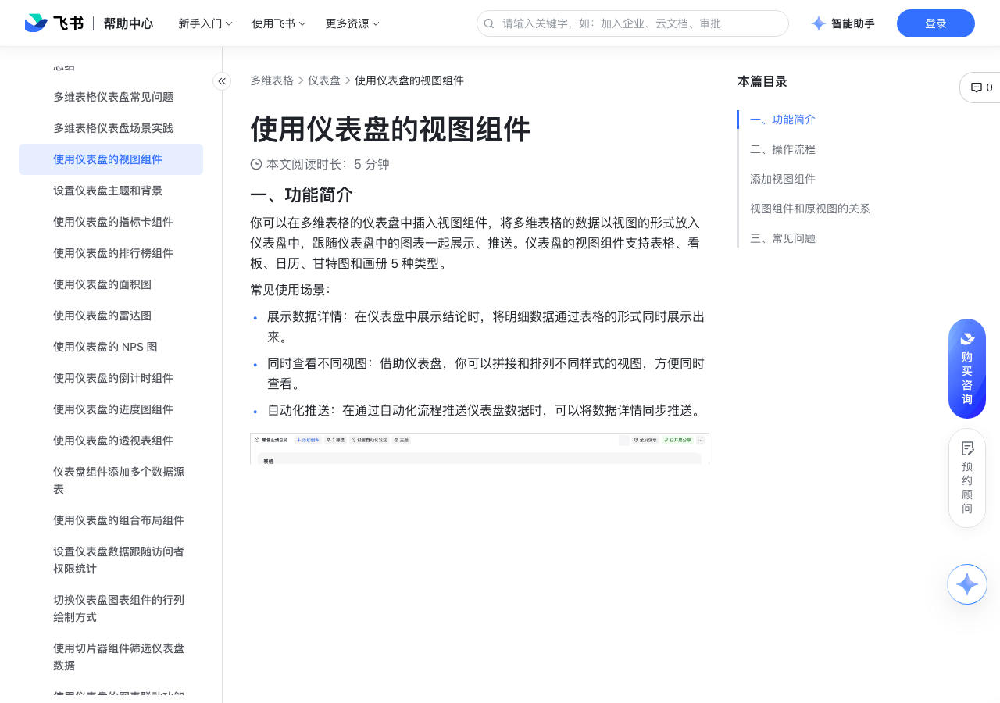

# 使用仪表盘的视图组件

> 来源：[飞书帮助中心](https://www.feishu.cn/hc/zh-CN/articles/096700620400)  
> 分类：多维表格 / 仪表盘  
> 抓取时间：2026-09-22T01:25:18.666Z

## 界面截图

### 文档内配图

1. 配图：https://p1-hera.feishucdn.com/tos-cn-i-jbbdkfciu3/1534de7e4ce64488b33f737d5a62adc3~tplv-jbbdkfciu3-image:0:0.image
2. 配图：https://p1-hera.feishucdn.com/tos-cn-i-jbbdkfciu3/ac9c29c49fc54e68aeab3c18c11b1766~tplv-jbbdkfciu3-image:0:0.image
3. 配图：https://p1-hera.feishucdn.com/tos-cn-i-jbbdkfciu3/371d6764cdb641e6b76887b977f5a227~tplv-jbbdkfciu3-image:0:0.image
4. 配图：https://p1-hera.feishucdn.com/tos-cn-i-jbbdkfciu3/b0845791ec8a45bc98d57aefa6e02379~tplv-jbbdkfciu3-image:0:0.image
5. 配图：https://p1-hera.feishucdn.com/tos-cn-i-jbbdkfciu3/82772726679a40229dd5143672c232cd~tplv-jbbdkfciu3-image:0:0.image

## 功能定位

本页对应飞书帮助中心「多维表格 / 仪表盘」下的「使用仪表盘的视图组件」。以下需求描述依据官方说明文档提炼，用于指导 DuoWei 对标实现。

## 功能目标

一、功能简介

## 文档结构（官方章节）

- 一、功能简介​
- 二、操作流程​
- 添加视图组件​
- 视图组件和原视图的关系​
- 三、常见问题​

## 详细功能说明

一、功能简介

展示数据详情：在仪表盘中展示结论时，将明细数据通过表格的形式同时展示出来。

同时查看不同视图：借助仪表盘，你可以拼接和排列不同样式的视图，方便同时查看。

自动化推送：在通过自动化流程推送仪表盘数据时，可以将数据详情同步推送。

二、操作流程

添加视图组件

进入目标多维表格，点击左侧导航栏中的仪表盘。

点击上方的 + 添加组件，在视图分类下按需选择 表格、看板、日历、甘特图 或 画册 组件。

点击添加了一个视图组件后，会弹出一个配置面板。双击面板左上角的组件名称，即可修改。

数据来源：可选择当前多维表格中的任一数据表，作为视图组件的数据源。

数据可见范围：你可以设置 可见记录 和 可见字段。

“可见记录”等同于一般视图中的“筛选”功能，你可以按照不同的字段，筛选符合条件的记录。

“可见字段”等同于一般视图中的“字段配置”，你可以设置各个字段的显隐或顺序。点击字段名称右侧的 眼睛 图标，隐藏或显示字段；拖拽字段名称左侧的 图标，可修改字段顺序。此处不支持对字段进行新增、修改或删除。

250px|700px|reset

视图类型：你可以在此处修改视图组件类型，已添加的视图组件也可以更改类型。

视图配置：根据不同的视图类型，此处的可配置项也有所不同。

表格：可配置父记录字段、分组、排序、行高。

看板：可配置分组依据、封面内容（需存在附件字段）、展示模式（常规或紧凑）、是否显示字段名、排序。

甘特图：可配置开始日期、结束日期、标题展示、颜色显示、是否仅展示工作日、分组、排序。

画册：可配置封面内容（需存在附件字段）、展示模式（常规或紧凑）、是否显示字段名、排序。

日历：可配置开始日期、结束日期、标题展示、颜色显示。

视图组件和原视图的关系

在视图组件和源视图内的单元格进行编辑操作时，二者同步变动。此处的“编辑操作”包括：新增、编辑、删除记录，新增、编辑、删除字段。例如，当你在数据表的表格视图中新增一个字段时，默认会展示在仪表盘表格视图组件的最右侧。

在对视图组件和源视图配置时，二者相互独立、互不影响。此处的“配置”包括：筛选、分组、排序、行高、列宽、字段顺序、记录顺序，以及甘特图和日历的标题展示和颜色显示等等。

如果你拥有源视图的编辑权限，那么你自动获得对应视图组件的编辑权限。

分享仪表盘时，不支持展示视图组件。将多维表格导出为 .base 格式再导入时，视图组件无法被原样保留，需重新进行配置。

三、常见问题

问：一个仪表盘中最多可以添加多少个视图组件？

答：10 个。

问：为什么我看不到别人分享视图组件？

答：如果出现“当前版本暂不支持分享此类型的图表，请访问原多维表格，或联系文档所有者”提示，可以直接访问原多维表格查看仪表盘，或者联系客服升级文档版本。

问：在仪表盘的视图组件中进行的筛选、排序、分组等操作，会影响原来的视图吗？

答：不会。在视图组件中进行的配置，仅在仪表盘中可见，不影响原本的视图。

问：如果仪表盘整体添加了筛选条件，视图组件中的数据如何展示？

答：如果仪表盘中存在全局筛选，那么视图组件中的数据也会是筛选后的结果，视图中的筛选可以叠加。

问：移动端可以使用视图组件吗？

答：移动端支持查看视图组件（需将飞书客户端升级到 V7.22 及以上），不支持新增和编辑视图组件。

## 实现要点（对标 DuoWei）

1. **入口与信息架构**：在产品中明确该能力所属模块（仪表盘），并保证用户可从对应导航触达。
2. **核心交互**：按上文「详细功能说明」还原主要操作路径；截图中出现的按钮、字段、面板命名尽量与飞书语义一致或可映射。
3. **数据与权限**：若文档涉及可见范围、可编辑范围、分享或高级权限，实现时需落到角色/成员模型，并保证 API/MCP 与 UI 权限一致。
4. **边界与上限**：若文档提到数量上限、格式限制、导入导出约束，需在实现与错误提示中体现。
5. **验收**：以本页截图场景为用例，完成「能打开 / 能配置 / 能保存 / 能被 Agent 读写（如适用）」四项检查。

## 原始摘录摘要

> 一、功能简介 展示数据详情：在仪表盘中展示结论时，将明细数据通过表格的形式同时展示出来。 同时查看不同视图：借助仪表盘，你可以拼接和排列不同样式的视图，方便同时查看。 自动化推送：在通过自动化流程推送仪表盘数据时，可以将数据详情同步推送。 二、操作流程 添加视图组件 进入目标多维表格，点击左侧导航栏中的仪表盘。 点击上方的 + 添加组件，在视图分类下按需选择 表格、看板、日历、甘特图 或 画册 组件。 点击添加了一个视图组件后，会弹出一个配置面板。双击面板左上角的组件名称，即可修改。 数据来源：可选择当前多维表格中的任一数据表，作为视图组件的数据源。 数据可见范围：你可以设置 可见记录 和 可见字段。 “可见记录”等同于一般视图中的“筛选”功能，你可以按照不同的字段，筛选符合条件的记录。 “可见字段”等同于一般视图中的“字段配置”，你可以设置各个字段的显隐或顺序。点击字段名称右侧的 眼睛 图标，隐藏或显示字段；拖拽字段名称左侧的 图标，可修改字段顺序。此处不支持对字段进行新增、修改或删除。 250px|700px|reset 视图类型：你可以在此处修改视图组件类型，已添加的视图组件也可以更改类型。 视图配置：根据不同的视图类型，此处的可配置项也有所不同。 表格：可配置父记录字段、分组、排序、行高。 看板：可配置分组依据、封面内容（需存在附件字段）、展示模式（常规或紧凑）、是否显示字段名、排序。 甘特图：可配置开始日期、结束日期、标题展示、颜色显示、是否仅展示工作日、分组、排序。 画册：可配置封面内容（需存在附件字段）、展示模式（常规或紧凑）、是否显示字段名、排序。 日历：可配置开始日期、结束日期、标题展示、颜色显示。 视图组件和原视图的关系 在视图组件和源视图内的单元格进行编辑操作时，二者同步变动。此处的“编辑操作”包括：新增、编辑、删除记录，新增、编辑、删除字段。例如，当…

## 元数据

- article_id: `7389562633017622531`
- category_id: `7165754521875005468`
- path: `/hc/zh-CN/articles/096700620400`
- extracted_text_length: 1367
