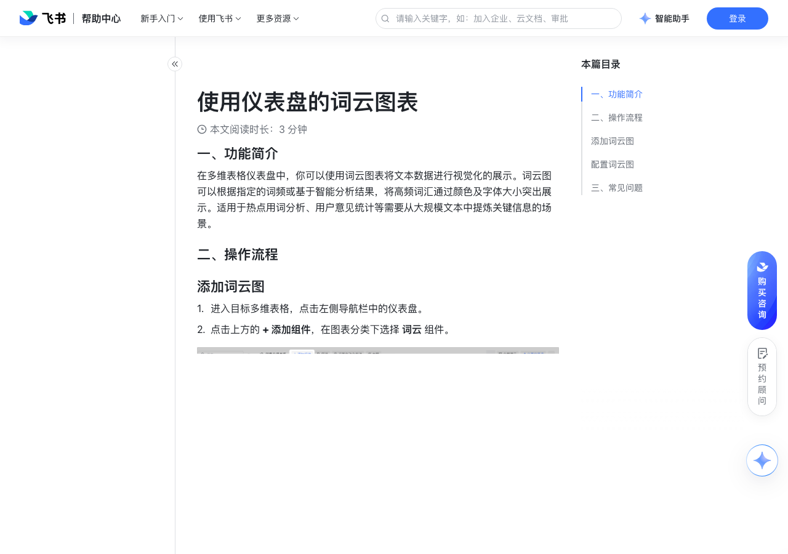

# 使用仪表盘的词云图表

> 来源：[飞书帮助中心](https://www.feishu.cn/hc/zh-CN/articles/709166668964)  
> 分类：多维表格 / 仪表盘  
> 抓取时间：2026-09-22T01:25:16.605Z

## 界面截图

### 文档内配图

1. 配图：https://p1-hera.feishucdn.com/tos-cn-i-jbbdkfciu3/5a58125aaec041babb93697bce80f148~tplv-jbbdkfciu3-image:0:0.image
2. 配图：https://p1-hera.feishucdn.com/tos-cn-i-jbbdkfciu3/14b0dee221c642929e8a3ec642f247d3~tplv-jbbdkfciu3-image:0:0.image
3. 配图：https://p1-hera.feishucdn.com/tos-cn-i-jbbdkfciu3/8e501c2b88b84fc49e5b62da6179aef7~tplv-jbbdkfciu3-image:0:0.image

## 功能定位

本页对应飞书帮助中心「多维表格 / 仪表盘」下的「使用仪表盘的词云图表」。以下需求描述依据官方说明文档提炼，用于指导 DuoWei 对标实现。

## 功能目标

一、功能简介

## 文档结构（官方章节）

- 一、功能简介​
- 二、操作流程​
- 添加词云图​
- 配置词云图​
- 三、常见问题​

## 详细功能说明

一、功能简介

二、操作流程

添加词云图

进入目标多维表格，点击左侧导航栏中的仪表盘。

点击上方的 + 添加组件，在图表分类下选择 词云 组件。

配置词云图

在 基础配置 标签页下，你可以进行以下配置：

数据源：可选择当前多维表格中的任意数据表，作为词云图表的数据源。

注：词云图表支持添加多个数据源，有关多数据源配置的具体信息，请参考仪表盘组件添加多个数据源表。

数据范围：可对所选的数据源进行筛选设置，支持选择一个视图或者设置筛选范围。

图表类型：词云图表暂无其它的展示类型，可选择适合的其它图表类型。

词云形状：可选择词云呈现的效果。目前支持云朵、五角星、心形等十余种样式。

主题色：可更换该图表中的主题颜色。

关键词字段：可选择用于统计文本关键词的字段。

注：支持自动编号、附件之外的所有字段类型。

分词方式：可以选择 自定义词频 或者 智能分词（默认）作为统计关键词数量的方式。

自定义词频：可根据关键词出现的次数，或自定义选择一个数字类型的字段（数字、进度条、货币、公式、查找引用等字段）进行统计。

智能分词：系统自动对关键词进行拆分，并根据拆分后每个词出现的次数进行统计。同时，还可以设置是否过滤常用词和不展示的具体词汇。

关键词展示个数：可设置最多展示的关键词数量。

查看词频表：点击即可查看每个关键词的词频数据。

在 自定义样式 标签页下，你可以自定义整个词云图表的背景颜色。

三、常见问题

问：词云可以统计哪些字段？

答：关键词字段支持除自动编号、附件字段外的所有字段类型；自定义词频中的词频字段支持数字、进度条、货币、公式、查找引用等所有数字类型的字段。

## 实现要点（对标 DuoWei）

1. **入口与信息架构**：在产品中明确该能力所属模块（仪表盘），并保证用户可从对应导航触达。
2. **核心交互**：按上文「详细功能说明」还原主要操作路径；截图中出现的按钮、字段、面板命名尽量与飞书语义一致或可映射。
3. **数据与权限**：若文档涉及可见范围、可编辑范围、分享或高级权限，实现时需落到角色/成员模型，并保证 API/MCP 与 UI 权限一致。
4. **边界与上限**：若文档提到数量上限、格式限制、导入导出约束，需在实现与错误提示中体现。
5. **验收**：以本页截图场景为用例，完成「能打开 / 能配置 / 能保存 / 能被 Agent 读写（如适用）」四项检查。

## 原始摘录摘要

> 一、功能简介 二、操作流程 添加词云图 进入目标多维表格，点击左侧导航栏中的仪表盘。 点击上方的 + 添加组件，在图表分类下选择 词云 组件。 配置词云图 在 基础配置 标签页下，你可以进行以下配置： 数据源：可选择当前多维表格中的任意数据表，作为词云图表的数据源。 注：词云图表支持添加多个数据源，有关多数据源配置的具体信息，请参考仪表盘组件添加多个数据源表。 数据范围：可对所选的数据源进行筛选设置，支持选择一个视图或者设置筛选范围。 图表类型：词云图表暂无其它的展示类型，可选择适合的其它图表类型。 词云形状：可选择词云呈现的效果。目前支持云朵、五角星、心形等十余种样式。 主题色：可更换该图表中的主题颜色。 关键词字段：可选择用于统计文本关键词的字段。 注：支持自动编号、附件之外的所有字段类型。 分词方式：可以选择 自定义词频 或者 智能分词（默认）作为统计关键词数量的方式。 自定义词频：可根据关键词出现的次数，或自定义选择一个数字类型的字段（数字、进度条、货币、公式、查找引用等字段）进行统计。 智能分词：系统自动对关键词进行拆分，并根据拆分后每个词出现的次数进行统计。同时，还可以设置是否过滤常用词和不展示的具体词汇。 关键词展示个数：可设置最多展示的关键词数量。 查看词频表：点击即可查看每个关键词的词频数据。 在 自定义样式 标签页下，你可以自定义整个词云图表的背景颜色。 三、常见问题 问：词云可以统计哪些字段？ 答：关键词字段支持除自动编号、附件字段外的所有字段类型；自定义词频中的词频字段支持数字、进度条、货币、公式、查找引用等所有数字类型的字段。

## 元数据

- article_id: `7220330887924301825`
- category_id: `7165754521875005468`
- path: `/hc/zh-CN/articles/709166668964`
- extracted_text_length: 687
