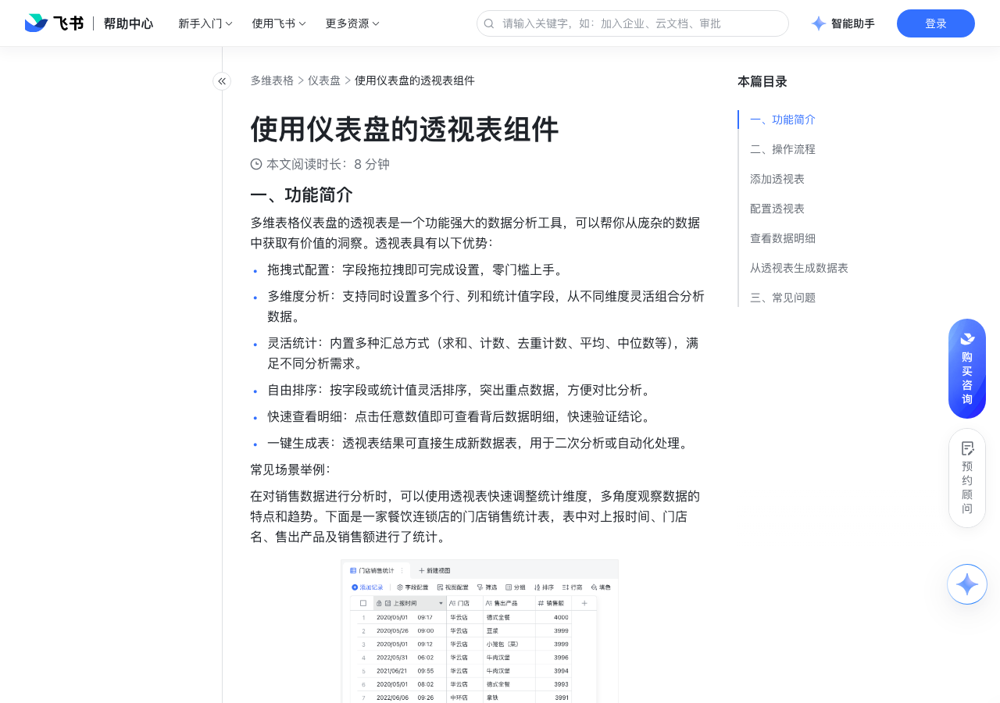

# 使用仪表盘的透视表组件

> 来源：[飞书帮助中心](https://www.feishu.cn/hc/zh-CN/articles/377639339118)  
> 分类：多维表格 / 仪表盘  
> 抓取时间：2026-09-22T01:25:20.224Z

## 界面截图

### 文档内配图

1. 配图：https://p1-hera.feishucdn.com/tos-cn-i-jbbdkfciu3/84f961180bf14fbf9b85989c91a3500c~tplv-jbbdkfciu3-image:0:0.image
2. 配图：https://p1-hera.feishucdn.com/tos-cn-i-jbbdkfciu3/5f1a3fea06be452f9c6421625cfbcb7d~tplv-jbbdkfciu3-image:0:0.image
3. 配图：https://p1-hera.feishucdn.com/tos-cn-i-jbbdkfciu3/f4af3efb15204b1da1143b56ea4d8d2a~tplv-jbbdkfciu3-image:0:0.image
4. 配图：https://p1-hera.feishucdn.com/tos-cn-i-jbbdkfciu3/91bb9c516ea44714bf99faa212d3e4a5~tplv-jbbdkfciu3-image:0:0.image
5. 配图：https://p1-hera.feishucdn.com/tos-cn-i-jbbdkfciu3/1323f24f887a4d8f9fdae9c14732ae72~tplv-jbbdkfciu3-image:0:0.image
6. 配图：https://p1-hera.feishucdn.com/tos-cn-i-jbbdkfciu3/6bd24f964ffd4123b38b7bc70c3106e0~tplv-jbbdkfciu3-image:0:0.image
7. 配图：https://p1-hera.feishucdn.com/tos-cn-i-jbbdkfciu3/4e62697fd7e3407b908e6bd058a30a50~tplv-jbbdkfciu3-image:0:0.image
8. 配图：https://p1-hera.feishucdn.com/tos-cn-i-jbbdkfciu3/298c8a1c4d8749c9b33681eb2390ea63~tplv-jbbdkfciu3-image:0:0.image
9. 配图：https://p1-hera.feishucdn.com/tos-cn-i-jbbdkfciu3/7eecc5df3d2040c8b39003b0f1c6e2c0~tplv-jbbdkfciu3-image:0:0.image
10. 配图：https://p1-hera.feishucdn.com/tos-cn-i-jbbdkfciu3/39900ee38e26414899e50f68cb2bd922~tplv-jbbdkfciu3-image:0:0.image
11. 配图：https://p1-hera.feishucdn.com/tos-cn-i-jbbdkfciu3/f48bac50b16e48c3b1acfeeff941dec2~tplv-jbbdkfciu3-image:0:0.image

## 功能定位

本页对应飞书帮助中心「多维表格 / 仪表盘」下的「使用仪表盘的透视表组件」。以下需求描述依据官方说明文档提炼，用于指导 DuoWei 对标实现。

## 功能目标

一、功能简介

## 文档结构（官方章节）

- 一、功能简介​
- 二、操作流程 ​
- 添加透视表​
- 配置透视表​
- 查看数据明细​
- 从透视表生成数据表​
- 三、常见问题​

## 详细功能说明

一、功能简介

拖拽式配置：字段拖拉拽即可完成设置，零门槛上手。

多维度分析：支持同时设置多个行、列和统计值字段，从不同维度灵活组合分析数据。

灵活统计：内置多种汇总方式（求和、计数、去重计数、平均、中位数等），满足不同分析需求。

自由排序：按字段或统计值灵活排序，突出重点数据，方便对比分析。

快速查看明细：点击任意数值即可查看背后数据明细，快速验证结论。

一键生成表：透视表结果可直接生成新数据表，用于二次分析或自动化处理。

二、操作流程

添加透视表

在多维表格左侧的导航栏中点击需要创建透视表的仪表盘。

点击仪表盘左上角的 + 添加组件。

点击 其他 分组下的 透视表 组件，打开组件配置面板。

配置透视表

数据源：选择透视表的源数据表。

数据范围：选择要统计的数据范围。默认范围为数据表的全部数据。也可选择数据表中的任意视图，作为透视表的数据范围。

如果选择 全部数据，可点击筛选栏右侧的 筛选 设定筛选条件。在 设置筛选条件 弹窗中，可添加多个条件。在弹窗右上角选择筛选出满足任意条件或所有条件的记录。

配置：将源数据表中的字段设置为透视表的行、列和统计值。

将字段添加至透视表的 行、列 和 值 列表中，支持多种添加方式：

直接从左侧 字段 中将所需字段拖拽至右侧透视表区域的相应列表中。你可以使用上方的搜索栏快速查找字段。

在左侧 字段 中勾选需要的字段，被选中的非数字类字段将被自动添加至透视表的 行 列表，数字字段将被添加至透视表的 值 列表。你可以通过拖拽调整字段在透视表中的位置。

点击 行、列 和 值 列表右侧的 + 添加 按钮，将所需字段添加至相应的列表中。

注：你可按需在 行、列 和 值 列表中添加多个字段，透视表将按字段排列顺序对数据进行分层统计。

通过拖拽的方式调整数据表行、列字段的层级关系和统计值的展示顺序。

当将日期类型的字段设置为透视表的行或列时，可以选择日期的分组方式，透视表将按照所选方式对日期及对应的统计值进行分组。将鼠标光标悬停在日期字段右侧，点击 ⋮ 图标，在 日期分组 中选择需要的分组方式。

将鼠标光标悬停在任意字段右侧，点击 ⋮ 图标，你还可以选择对字段进行重命名或将其从透视表中移除。

在数据表的 值 列表中，选择值的统计方式。

数字类型的值支持以求和、计数、去重计数、平均数、最大值、最小值或中位数方式统计。

非数字类型的值支持计数和去重计数两种统计方式。

注：透视表将自动按照行和列维度进行汇总统计，并在透视表底部和右侧生成 总计 行和 总计 列。

排序：点击 排序 下的选择框设置排序条件。你需要在每个排序条件中选择排序字段，排序依据和排序方式。

按字段设置透视表行和列的排序条件。如果添加了多个行、列字段，可对每个行、列字段进行排序。

如果只有一个行字段，则可以按照行名或以一个统计值对行进行排序。如有多个行字段，则最内层的行字段可按行名或以一个统计值为依据排序；其余行字段只能按行名排序。

如果只有一个列字段，则可以按照列名或以一个统计值对列进行排序。如有多个列字段，则最下层的列字段可按列名或以一个统计值为依据排序；其余列字段只能按列名排序。

设置完成后，点击 确定。

查看数据明细

你可在数据详情弹窗中查看相关记录的详细情况，并使用搜索栏进一步查找数据。

将鼠标光标悬停在单条记录上，点击首列中出现的 查看 图标，可查看单条记录的详情。

从透视表生成数据表

将鼠标悬停在透视表上，点击右上角浮现的 ··· 图标 > 生成数据表。

在弹窗中选择是否按小时自动同步数据至数据表，点击 生成。

你可以从多维表格左侧的导航栏打开新生成的数据表。

新数据表的数据结构与透视表一致，但不包含透视表中的行、列总计数据。

如果透视表包含多级列字段，转换后的数据表将根据透视表最底层列字段生成字段。

三、常见问题

问：在仪表盘的透视表组件中，如何以百分比形式显示统计结果？

答：不支持。但你可以在透视表的数据源表格中添加数字字段并将数字格式设置为百分比，然后在透视表组件中展示该字段。

## 实现要点（对标 DuoWei）

1. **入口与信息架构**：在产品中明确该能力所属模块（仪表盘），并保证用户可从对应导航触达。
2. **核心交互**：按上文「详细功能说明」还原主要操作路径；截图中出现的按钮、字段、面板命名尽量与飞书语义一致或可映射。
3. **数据与权限**：若文档涉及可见范围、可编辑范围、分享或高级权限，实现时需落到角色/成员模型，并保证 API/MCP 与 UI 权限一致。
4. **边界与上限**：若文档提到数量上限、格式限制、导入导出约束，需在实现与错误提示中体现。
5. **验收**：以本页截图场景为用例，完成「能打开 / 能配置 / 能保存 / 能被 Agent 读写（如适用）」四项检查。

## 原始摘录摘要

> 一、功能简介 拖拽式配置：字段拖拉拽即可完成设置，零门槛上手。 多维度分析：支持同时设置多个行、列和统计值字段，从不同维度灵活组合分析数据。 灵活统计：内置多种汇总方式（求和、计数、去重计数、平均、中位数等），满足不同分析需求。 自由排序：按字段或统计值灵活排序，突出重点数据，方便对比分析。 快速查看明细：点击任意数值即可查看背后数据明细，快速验证结论。 一键生成表：透视表结果可直接生成新数据表，用于二次分析或自动化处理。 二、操作流程 添加透视表 在多维表格左侧的导航栏中点击需要创建透视表的仪表盘。 点击仪表盘左上角的 + 添加组件。 点击 其他 分组下的 透视表 组件，打开组件配置面板。 配置透视表 数据源：选择透视表的源数据表。 数据范围：选择要统计的数据范围。默认范围为数据表的全部数据。也可选择数据表中的任意视图，作为透视表的数据范围。 如果选择 全部数据，可点击筛选栏右侧的 筛选 设定筛选条件。在 设置筛选条件 弹窗中，可添加多个条件。在弹窗右上角选择筛选出满足任意条件或所有条件的记录。 配置：将源数据表中的字段设置为透视表的行、列和统计值。 将字段添加至透视表的 行、列 和 值 列表中，支持多种添加方式： 直接从左侧 字段 中将所需字段拖拽至右侧透视表区域的相应列表中。你可以使用上方的搜索栏快速查找字段。 在左侧 字段 中勾选需要的字段，被选中的非数字类字段将被自动添加至透视表的 行 列表，数字字段将被添加至透视表的 值 列表。你可以通过拖拽调整字段在透视表中的位置。 点击 行、列 和 值 列表右侧的 + 添加 按钮，将所需字段添加至相应的列表中。 注：你可按需在 行、列 和 值 列表中添加多个字段，透视表将按字段排列顺序对数据进行分层统计。 通过拖拽的方式调整数据表行、列字段的层级关系和统计值的展示顺序。 当将日期类型的字段设置为透视表的行或列时，可以选择日期…

## 元数据

- article_id: `7483468507497431042`
- category_id: `7165754521875005468`
- path: `/hc/zh-CN/articles/377639339118`
- extracted_text_length: 1669
