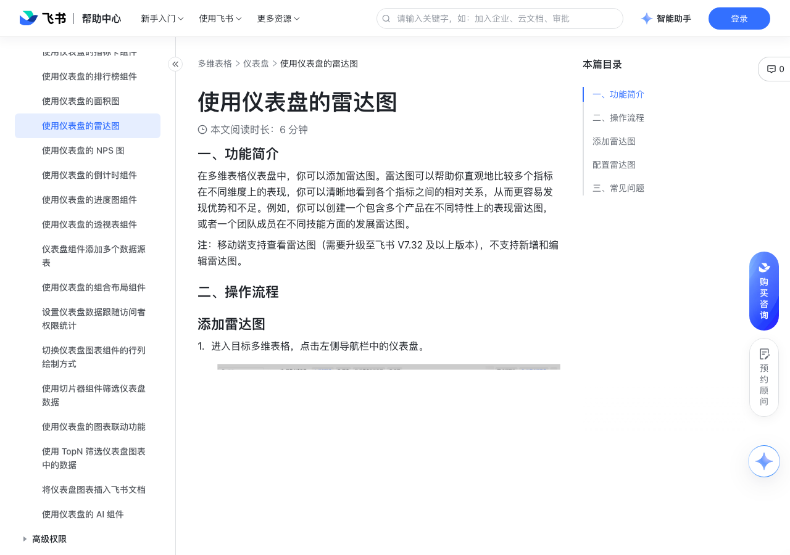

# 使用仪表盘的雷达图

> 来源：[飞书帮助中心](https://www.feishu.cn/hc/zh-CN/articles/761433047614)  
> 分类：多维表格 / 仪表盘  
> 抓取时间：2026-09-22T01:25:19.833Z

## 界面截图

### 文档内配图

1. 配图：https://p1-hera.feishucdn.com/tos-cn-i-jbbdkfciu3/42e7d63e7f4a463e832db6b13a68b0d4~tplv-jbbdkfciu3-image:0:0.image
2. 配图：https://p1-hera.feishucdn.com/tos-cn-i-jbbdkfciu3/fceca2c132d04664a1a26c2156724c3a~tplv-jbbdkfciu3-image:0:0.image
3. 配图：https://p1-hera.feishucdn.com/tos-cn-i-jbbdkfciu3/c1a7f800c710478c86e6878b82ee83ae~tplv-jbbdkfciu3-image:0:0.image
4. 配图：https://p1-hera.feishucdn.com/tos-cn-i-jbbdkfciu3/2c6c4bcf92f84eef97a0c3eb39bb3526~tplv-jbbdkfciu3-image:0:0.image
5. 配图：https://p1-hera.feishucdn.com/tos-cn-i-jbbdkfciu3/e9b555040c0344bd81698a80c8bf8ec5~tplv-jbbdkfciu3-image:0:0.image
6. 配图：https://p1-hera.feishucdn.com/tos-cn-i-jbbdkfciu3/ddb14d08e20b4052b93600f204547a61~tplv-jbbdkfciu3-image:0:0.image
7. 配图：https://p1-hera.feishucdn.com/tos-cn-i-jbbdkfciu3/947aab27b8be40da9aec685daa71400d~tplv-jbbdkfciu3-image:0:0.image

## 功能定位

本页对应飞书帮助中心「多维表格 / 仪表盘」下的「使用仪表盘的雷达图」。以下需求描述依据官方说明文档提炼，用于指导 DuoWei 对标实现。

## 功能目标

一、功能简介

## 文档结构（官方章节）

- 一、功能简介​
- 二、操作流程​
- 添加雷达图​
- 配置雷达图​
- 三、常见问题​

## 详细功能说明

一、功能简介

二、操作流程

添加雷达图

进入目标多维表格，点击左侧导航栏中的仪表盘。

点击上方的 添加组件，在图表分类下选择 雷达图。

配置雷达图

在 类型与数据 标签页下，你可以进行以下配置：

数据源：可选择当前多维表格中的任意数据表，作为雷达图的数据源。如果你使用的飞书版本开通了多数据源功能，可勾选 多数据源模式 启用该功能。启用后，可以在数据源选项中选择多个数据表。

数据范围：可对所选的数据源进行筛选设置，支持选择一个视图或者设置筛选范围。

图表类型：可选填充雷达图（默认）、雷达图或者带数据标记的雷达图。这 3 种不同的雷达图类型仅样式和配置上略有不同。

主题色：可更换该图表中的主题颜色。

雷达图形状：可选圆形（默认）或多边形。

颜色填充：如果图表类型选择的是填充雷达图则默认勾选，若你取消勾选则图表类型自动切换为雷达图。

连接线平滑：默认不勾选。

图表选项：可勾选图例、数据标签、轴标签、网络线、轴线，使其在图表中展示。

数据映射：可选 以字段为类别 或者 以记录聚合为类别 作为雷达图的定量指标。

类别轴：当选择以字段类别为数据映射时，默认添加前 5 个数字字段为类别轴，点击类别轴右侧的 ⋮ 图标可以进行修改字段、移除字段、上移字段、下移字段操作。当选择以记录聚合为类别为数据映射时，可选择展示数据的字段。

数值轴（系列）：

当选择以字段类别为数据映射时，可选择一个非类别轴的字段作为数值轴。

当选择以记录聚合为类别为数据映射时，可选择 统计记录总数（默认）或 统计字段数值。

统计记录总数：记录数的叠加。

统计字段数值：仅数据源表内有数字字段或公式字段时，才可以选择统计字段数值。计算方式支持选择求和、最大值、最小值或平均值。

分组聚合：勾选后会按规则将数据集合划分为不同“小组”，然后在这些小组内进行数据处理，具体信息请参考使用多维表格仪表盘。

在 自定义样式 标签页下，你可以进行以下配置：

背景：可自定义整个雷达图的背景颜色。

字体颜色与字号：可设置雷达图中所有文本的颜色与字体大小。

系列：系列指分组聚合的每一个数据模块，若未分组聚合则仅有一个系列。可设置系列样式、数据点格式和数据标签。

系列样式：可设置每个系列的填充颜色、边框等。

数据点格式：可用来标记这一组系列中的重点数据（如最大值或最小值等）。

显示数据标签：勾选后可设置标签的内容、展示位置、文本格式等。

图例：可设置图例的展示位置、文本格式。

类别轴：可设置是否展示类别轴的标签与轴线，并调整标签的展示角度和文本格式。

数值轴：可设置是否展示数值轴的标签和轴线，并调整标签的展示角度和文本格式，自定义纵轴的最小值和最大值。

网格线与刻度线标记：可设置类别轴的网格线与数值轴的网格线和刻度线的形状、颜色、粗细。

三、常见问题

问：移动端可以使用仪表盘雷达图吗？

答：移动端支持查看雷达图，不支持新增和编辑雷达图。

## 实现要点（对标 DuoWei）

1. **入口与信息架构**：在产品中明确该能力所属模块（仪表盘），并保证用户可从对应导航触达。
2. **核心交互**：按上文「详细功能说明」还原主要操作路径；截图中出现的按钮、字段、面板命名尽量与飞书语义一致或可映射。
3. **数据与权限**：若文档涉及可见范围、可编辑范围、分享或高级权限，实现时需落到角色/成员模型，并保证 API/MCP 与 UI 权限一致。
4. **边界与上限**：若文档提到数量上限、格式限制、导入导出约束，需在实现与错误提示中体现。
5. **验收**：以本页截图场景为用例，完成「能打开 / 能配置 / 能保存 / 能被 Agent 读写（如适用）」四项检查。

## 原始摘录摘要

> 一、功能简介 二、操作流程 添加雷达图 进入目标多维表格，点击左侧导航栏中的仪表盘。 点击上方的 添加组件，在图表分类下选择 雷达图。 配置雷达图 在 类型与数据 标签页下，你可以进行以下配置： 数据源：可选择当前多维表格中的任意数据表，作为雷达图的数据源。如果你使用的飞书版本开通了多数据源功能，可勾选 多数据源模式 启用该功能。启用后，可以在数据源选项中选择多个数据表。 数据范围：可对所选的数据源进行筛选设置，支持选择一个视图或者设置筛选范围。 图表类型：可选填充雷达图（默认）、雷达图或者带数据标记的雷达图。这 3 种不同的雷达图类型仅样式和配置上略有不同。 主题色：可更换该图表中的主题颜色。 雷达图形状：可选圆形（默认）或多边形。 颜色填充：如果图表类型选择的是填充雷达图则默认勾选，若你取消勾选则图表类型自动切换为雷达图。 连接线平滑：默认不勾选。 图表选项：可勾选图例、数据标签、轴标签、网络线、轴线，使其在图表中展示。 数据映射：可选 以字段为类别 或者 以记录聚合为类别 作为雷达图的定量指标。 类别轴：当选择以字段类别为数据映射时，默认添加前 5 个数字字段为类别轴，点击类别轴右侧的 ⋮ 图标可以进行修改字段、移除字段、上移字段、下移字段操作。当选择以记录聚合为类别为数据映射时，可选择展示数据的字段。 数值轴（系列）： 当选择以字段类别为数据映射时，可选择一个非类别轴的字段作为数值轴。 当选择以记录聚合为类别为数据映射时，可选择 统计记录总数（默认）或 统计字段数值。 统计记录总数：记录数的叠加。 统计字段数值：仅数据源表内有数字字段或公式字段时，才可以选择统计字段数值。计算方式支持选择求和、最大值、最小值或平均值。 分组聚合：勾选后会按规则将数据集合划分为不同“小组”，然后在这些小组内进行数据处理，具体信息请参考使用多维表格仪表盘。 在 自定义样式 标签页下，你可…

## 元数据

- article_id: `7425499113594454017`
- category_id: `7165754521875005468`
- path: `/hc/zh-CN/articles/761433047614`
- extracted_text_length: 1202
