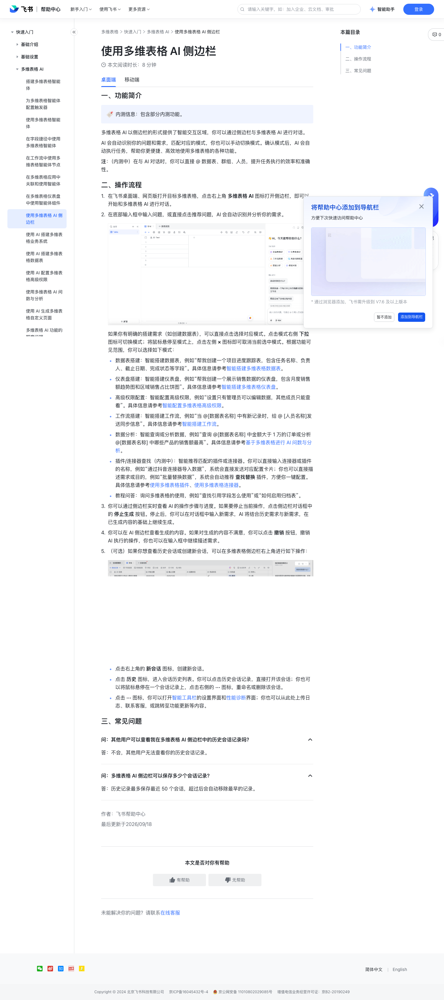

# 使用多维表格 AI 侧边栏

> 来源：[飞书帮助中心](https://www.feishu.cn/hc/zh-CN/articles/032159388252)  
> 分类：多维表格 / 快速入门 / 多维表格 AI  
> 抓取时间：2026-09-22T01:16:05.532Z

## 界面截图

### 文档内配图

1. 配图：https://p1-hera.feishucdn.com/tos-cn-i-jbbdkfciu3/f2163331d8d34b67a69997a337f503e0~tplv-jbbdkfciu3-image:0:0.image
2. 配图：https://p1-hera.feishucdn.com/tos-cn-i-jbbdkfciu3/2f1d46c6a85b4c1783ca1fd73b609920~tplv-jbbdkfciu3-image:0:0.image

## 功能定位

本页对应飞书帮助中心「多维表格 / 快速入门 / 多维表格 AI」下的「使用多维表格 AI 侧边栏」。以下需求描述依据官方说明文档提炼，用于指导 DuoWei 对标实现。

## 功能目标

一、功能简介

## 文档结构（官方章节）

- 一、功能简介​
- 二、操作流程​
- 三、常见问题​

## 详细功能说明

一、功能简介

二、操作流程

在飞书桌面端、网页版打开目标多维表格，点击右上角 多维表格 AI 图标打开侧边栏，即可以开始和多维表格 AI 进行对话。

在底部输入框中输入问题，或直接点击推荐问题，AI 会自动识别并分析你的需求。

250px|700px|reset

如果你有明确的搭建需求（如创建数据表），可以直接点击选择对应模式。点击模式右侧 下拉 图标可切换模式；将鼠标悬停至模式上，点击左侧 × 图标即可取消当前选中模式。根据功能可见范围，你可以选择如下模式：

数据表搭建：智能搭建数据表，例如“帮我创建一个项目进度跟踪表，包含任务名称、负责人、截止日期、完成状态等字段”。具体信息请参考智能搭建多维表格数据表。

仪表盘搭建：智能搭建仪表盘，例如“帮我创建一个展示销售数据的仪表盘，包含月度销售额趋势图和区域销售占比饼图”。具体信息请参考智能搭建多维表格仪表盘。

高级权限配置：智能配置高级权限，例如“设置只有管理员可以编辑数据，其他成员只能查看”。具体信息请参考智能配置多维表格高级权限。

工作流搭建：智能搭建工作流，例如“当 @[数据表名称] 中有新记录时，给 @ [人员名称]发送同步信息”。具体信息请参考智能搭建工作流。

数据分析：智能查询或分析数据，例如“查询 @[数据表名称] 中金额大于 1 万的订单或分析 @[数据表名称] 中哪些产品的销售额最高”。具体信息请参考基于多维表格进行 AI 问数与分析。

插件/连接器查找（内测中）：智能推荐匹配的插件或连接器。你可以直接输入连接器或插件的名称，例如“通过抖音连接器导入数据”，系统会直接发送对应配置卡片；你也可以直接描述需求或目的，例如“批量替换数据”，系统会自动推荐 查找替换 插件，方便你一键配置。具体信息请参考使用多维表格插件、使用多维表格连接器。

教程问答：询问多维表格的使用，例如“查找引用字段怎么使用”或“如何启用归档表”。

你可以通过侧边栏实时查看 AI 的操作步骤与进度。如果要停止当前操作，点击侧边栏对话框中的 停止生成 按钮。停止后，你可以在对话框中输入新需求，AI 将结合历史需求与新需求，在已生成内容的基础上继续生成。

你可以在 AI 侧边栏查看生成的内容。如果对生成的内容不满意，你可以点击 撤销 按钮，撤销 AI 执行的操作，你也可以在输入框中继续描述需求。

（可选）如果你想查看历史会话或创建新会话，可以在多维表格侧边栏右上角进行如下操作：

点击右上角的 新会话 图标，创建新会话。

点击 历史 图标，进入会话历史列表。你可以点击历史会话记录，直接打开该会话；你也可以将鼠标悬停在一个会话记录上，点击右侧的 ··· 图标，重命名或删除该会话。

点击 ··· 图标，你可以打开智能工具栏的设置界面和性能诊断界面；你也可以从此处上传日志、联系客服，或跳转至功能更新等内容。

三、常见问题

问：其他用户可以查看我在多维表格 AI 侧边栏中的历史会话记录吗？

问：多维表格 AI 侧边栏可以保存多少个会话记录？

答：不会，其他用户无法查看你的历史会话记录。

答：历史记录最多保存最近 50 个会话，超过后会自动移除最早的记录。

## 实现要点（对标 DuoWei）

1. **入口与信息架构**：在产品中明确该能力所属模块（快速入门 / 多维表格 AI），并保证用户可从对应导航触达。
2. **核心交互**：按上文「详细功能说明」还原主要操作路径；截图中出现的按钮、字段、面板命名尽量与飞书语义一致或可映射。
3. **数据与权限**：若文档涉及可见范围、可编辑范围、分享或高级权限，实现时需落到角色/成员模型，并保证 API/MCP 与 UI 权限一致。
4. **边界与上限**：若文档提到数量上限、格式限制、导入导出约束，需在实现与错误提示中体现。
5. **验收**：以本页截图场景为用例，完成「能打开 / 能配置 / 能保存 / 能被 Agent 读写（如适用）」四项检查。

## 原始摘录摘要

> 一、功能简介 二、操作流程 在飞书桌面端、网页版打开目标多维表格，点击右上角 多维表格 AI 图标打开侧边栏，即可以开始和多维表格 AI 进行对话。 在底部输入框中输入问题，或直接点击推荐问题，AI 会自动识别并分析你的需求。 250px|700px|reset 如果你有明确的搭建需求（如创建数据表），可以直接点击选择对应模式。点击模式右侧 下拉 图标可切换模式；将鼠标悬停至模式上，点击左侧 × 图标即可取消当前选中模式。根据功能可见范围，你可以选择如下模式： 数据表搭建：智能搭建数据表，例如“帮我创建一个项目进度跟踪表，包含任务名称、负责人、截止日期、完成状态等字段”。具体信息请参考智能搭建多维表格数据表。 仪表盘搭建：智能搭建仪表盘，例如“帮我创建一个展示销售数据的仪表盘，包含月度销售额趋势图和区域销售占比饼图”。具体信息请参考智能搭建多维表格仪表盘。 高级权限配置：智能配置高级权限，例如“设置只有管理员可以编辑数据，其他成员只能查看”。具体信息请参考智能配置多维表格高级权限。 工作流搭建：智能搭建工作流，例如“当 @[数据表名称] 中有新记录时，给 @ [人员名称]发送同步信息”。具体信息请参考智能搭建工作流。 数据分析：智能查询或分析数据，例如“查询 @[数据表名称] 中金额大于 1 万的订单或分析 @[数据表名称] 中哪些产品的销售额最高”。具体信息请参考基于多维表格进行 AI 问数与分析。 插件/连接器查找（内测中）：智能推荐匹配的插件或连接器。你可以直接输入连接器或插件的名称，例如“通过抖音连接器导入数据”，系统会直接发送对应配置卡片；你也可以直接描述需求或目的，例如“批量替换数据”，系统会自动推荐 查找替换 插件，方便你一键配置。具体信息请参考使用多维表格插件、使用多维表格连接器。 教程问答：询问多维表格的使用，例如“查找引用字段怎么使用”或“如何启用归档表…

## 元数据

- article_id: `7554000345895092252`
- category_id: `7630766419524717789`
- path: `/hc/zh-CN/articles/032159388252`
- extracted_text_length: 1308
