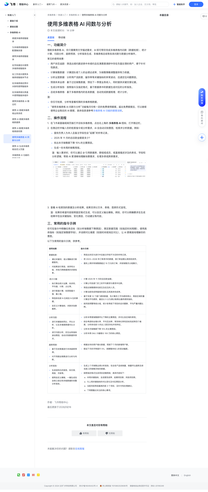

# 使用多维表格 AI 问数与分析

> 来源：[飞书帮助中心](https://www.feishu.cn/hc/zh-CN/articles/777652685061)  
> 分类：多维表格 / 快速入门 / 多维表格 AI  
> 抓取时间：2026-09-22T01:16:08.213Z

## 界面截图

### 文档内配图

1. 配图：https://p1-hera.feishucdn.com/tos-cn-i-jbbdkfciu3/72e1abf26d954dd7b208759e2580aaed~tplv-jbbdkfciu3-image:0:0.image

## 功能定位

本页对应飞书帮助中心「多维表格 / 快速入门 / 多维表格 AI」下的「使用多维表格 AI 问数与分析」。以下需求描述依据官方说明文档提炼，用于指导 DuoWei 对标实现。

## 功能目标

一、功能简介

## 文档结构（官方章节）

- 一、功能简介​
- 二、操作流程​
- 三、常用的指令示例​

## 详细功能说明

一、功能简介

用户状态追踪：筛选出续约跟进表中未续约且在满意度调研中存在负面反馈的用户，便于针对性跟进。

计算销售数据：计算团队或个人的业绩达成率，为销售策略调整提供有力依据。

分析运营数据：分析用户活跃度、留存率等关键指标的异常波动，迅速定位问题原因。

预测未来业绩：基于过往销售数据，预估下一季度业务收入，同时提供关键支撑论据。

生成分析报告：按照指令及指定格式，基于数据表中的数据生成对应的分析报告。

总结多维表格：基于多维表格内的各类数据，自动完成数据梳理、统计分析。

你仅可检索、分析有查看权限的多维表格数据。

“使用多维表格 AI 问数与分析”功能每月均有一定的免费使用额度。超出免费额度后，可以继续使用企业购买的 AI 额度，具体信息请参考多维表格 AI 功能的额度说明。

二、操作流程

在飞书桌面端或网页版打开目标多维表格，点击右上角的 多维表格 AI 图标，打开侧边栏。

在侧边栏中输入你的检索指令或分析需求，AI 会自动识别意图，检索并分析数据。例如：

查找负责人为本人且备注字段包含“延期”的所有记录。

2025 年 11 月的总回款金额是多少？

找出本月销售额下降 15% 的主要原因。

生成一份本周的销售周报。

查看 AI 检索到的数据及分析结果。结果支持以文本、表格、图表形式呈现。

注：如果你希望内容按照固定格式生成，可以自定义输出模板。例如，你可以明确要求在生成结果中包含关键指标、变化原因、行动建议等内容。

三、常用的指令示例

使用场景

指令示例

数据检索：通过关键词、语义理解进行数据查找。对结果进行筛选、排序和分组，并执行跨数据表的关联检索。

通过关键词、语义理解进行数据查找。

对结果进行筛选、排序和分组，并执行跨数据表的关联检索。

筛选出状态为进行中且备注字段不为空的所有记录。将 2023—2026 年订单表中的数据，按订单金额从高到低排序。查找上周所有销售额超过 10 万元的订单，并按销售员分组展示。

筛选出状态为进行中且备注字段不为空的所有记录。

将 2023—2026 年订单表中的数据，按订单金额从高到低排序。

查找上周所有销售额超过 10 万元的订单，并按销售员分组展示。

统计计算：执行聚合统计运算，如求和、平均值、计数、占比等。进行极值计算，如获取最大值、最小值。筛选排名前 N 位或后 N 位的数据。自定义计算指标，关联多张数据表。

执行聚合统计运算，如求和、平均值、计数、占比等。

进行极值计算，如获取最大值、最小值。

筛选排名前 N 位或后 N 位的数据。

自定义计算指标，关联多张数据表。

计算 2025 年 11 月的总回款金额。计算公司各部门员工的平均薪资与薪资中位数。筛选出销售额排名前五及后五的人员。计算当前完成率最高的团队及其具体完成率。基于年度 12 个部门绩效数据，先计算员工平均绩效得分，再按区域权重计算总平均绩效，最后以 5 分为满分制得出最终绩效指标。按风险预警等级分组，统计各等级下项目的总问题数、平均严重问题比例。

计算 2025 年 11 月的总回款金额。

计算公司各部门员工的平均薪资与薪资中位数。

筛选出销售额排名前五及后五的人员。

计算当前完成率最高的团队及其具体完成率。

基于年度 12 个部门绩效数据，先计算员工平均绩效得分，再按区域权重计算总平均绩效，最后以 5 分为满分制得出最终绩效指标。

按风险预警等级分组，统计各等级下项目的总问题数、平均严重问题比例。

分析归因：进行关键指标同比、环比分析，以及多维度数据对比分析。进行归因分析，定位业务指标波动原因，自动识别数据异常点。

进行关键指标同比、环比分析，以及多维度数据对比分析。

进行归因分析，定位业务指标波动原因，自动识别数据异常点。

分析本季度销售额环比下降的主要原因，并对比各区域的表现。综合考虑粉丝增长率、平均互动率、带货转化率和目标完成率四个维度，分析排名前 5 的达人是否存在共性特征。分析本月销售额下降 15% 的主要原因。分析本周 DAU 大幅增长 100 万的核心原因。

分析本季度销售额环比下降的主要原因，并对比各区域的表现。

综合考虑粉丝增长率、平均互动率、带货转化率和目标完成率四个维度，分析排名前 5 的达人是否存在共性特征。

分析本月销售额下降 15% 的主要原因。

分析本周 DAU 大幅增长 100 万的核心原因。

趋势预测：基于历史数据进行未来趋势预测。对不同假设情景进行分析与判断。

基于历史数据进行未来趋势预测。

对不同假设情景进行分析与判断。

根据去年的用户增长数据，预测下个月的新增用户数。假设下月好评率提升 5%，测算整体收入的变动幅度。

根据去年的用户增长数据，预测下个月的新增用户数。

假设下月好评率提升 5%，测算整体收入的变动幅度。

分析报告：生成结构化的报告，如日报、周报、月报等。使用自定义模板，一键生成包含核心结论和详细数据的完整分析报告。

生成结构化的报告，如日报、周报、月报等。

使用自定义模板，一键生成包含核心结论和详细数据的完整分析报告。

生成上个月销售业绩分析报告，包含各产品线销量、销量环比趋势及排名前三的销售员相关数据。按照指定格式生成项目进展周报，具体内容如下：本周关键指标，含进度完成率、延期项目数、风险项目数。与上周关键指标的对比变化及对应原因分析。当前风险等级最高的前 3 个项目，及针对性处理建议。下周需重点关注的核心事项。

生成上个月销售业绩分析报告，包含各产品线销量、销量环比趋势及排名前三的销售员相关数据。

按照指定格式生成项目进展周报，具体内容如下：

本周关键指标，含进度完成率、延期项目数、风险项目数。

与上周关键指标的对比变化及对应原因分析。

当前风险等级最高的前 3 个项目，及针对性处理建议。

下周需重点关注的核心事项。

使用场景 | 指令示例

数据检索：通过关键词、语义理解进行数据查找。对结果进行筛选、排序和分组，并执行跨数据表的关联检索。 | 筛选出状态为进行中且备注字段不为空的所有记录。将 2023—2026 年订单表中的数据，按订单金额从高到低排序。查找上周所有销售额超过 10 万元的订单，并按销售员分组展示。

统计计算：执行聚合统计运算，如求和、平均值、计数、占比等。进行极值计算，如获取最大值、最小值。筛选排名前 N 位或后 N 位的数据。自定义计算指标，关联多张数据表。 | 计算 2025 年 11 月的总回款金额。计算公司各部门员工的平均薪资与薪资中位数。筛选出销售额排名前五及后五的人员。计算当前完成率最高的团队及其具体完成率。基于年度 12 个部门绩效数据，先计算员工平均绩效得分，再按区域权重计算总平均绩效，最后以 5 分为满分制得出最终绩效指标。按风险预警等级分组，统计各等级下项目的总问题数、平均严重问题比例。

分析归因：进行关键指标同比、环比分析，以及多维度数据对比分析。进行归因分析，定位业务指标波动原因，自动识别数据异常点。 | 分析本季度销售额环比下降的主要原因，并对比各区域的表现。综合考虑粉丝增长率、平均互动率、带货转化率和目标完成率四个维度，分析排名前 5 的达人是否存在共性特征。分析本月销售额下降 15% 的主要原因。分析本周 DAU 大幅增长 100 万的核心原因。

趋势预测：基于历史数据进行未来趋势预测。对不同假设情景进行分析与判断。 | 根据去年的用户增长数据，预测下个月的新增用户数。假设下月好评率提升 5%，测算整体收入的变动幅度。

分析报告：生成结构化的报告，如日报、周报、月报等。使用自定义模板，一键生成包含核心结论和详细数据的完整分析报告。 | 生成上个月销售业绩分析报告，包含各产品线销量、销量环比趋势及排名前三的销售员相关数据。按照指定格式生成项目进展周报，具体内容如下：本周关键指标，含进度完成率、延期项目数、风险项目数。与上周关键指标的对比变化及对应原因分析。当前风险等级最高的前 3 个项目，及针对性处理建议。下周需重点关注的核心事项。

## 实现要点（对标 DuoWei）

1. **入口与信息架构**：在产品中明确该能力所属模块（快速入门 / 多维表格 AI），并保证用户可从对应导航触达。
2. **核心交互**：按上文「详细功能说明」还原主要操作路径；截图中出现的按钮、字段、面板命名尽量与飞书语义一致或可映射。
3. **数据与权限**：若文档涉及可见范围、可编辑范围、分享或高级权限，实现时需落到角色/成员模型，并保证 API/MCP 与 UI 权限一致。
4. **边界与上限**：若文档提到数量上限、格式限制、导入导出约束，需在实现与错误提示中体现。
5. **验收**：以本页截图场景为用例，完成「能打开 / 能配置 / 能保存 / 能被 Agent 读写（如适用）」四项检查。

## 原始摘录摘要

> 一、功能简介 用户状态追踪：筛选出续约跟进表中未续约且在满意度调研中存在负面反馈的用户，便于针对性跟进。 计算销售数据：计算团队或个人的业绩达成率，为销售策略调整提供有力依据。 分析运营数据：分析用户活跃度、留存率等关键指标的异常波动，迅速定位问题原因。 预测未来业绩：基于过往销售数据，预估下一季度业务收入，同时提供关键支撑论据。 生成分析报告：按照指令及指定格式，基于数据表中的数据生成对应的分析报告。 总结多维表格：基于多维表格内的各类数据，自动完成数据梳理、统计分析。 你仅可检索、分析有查看权限的多维表格数据。 “使用多维表格 AI 问数与分析”功能每月均有一定的免费使用额度。超出免费额度后，可以继续使用企业购买的 AI 额度，具体信息请参考多维表格 AI 功能的额度说明。 二、操作流程 在飞书桌面端或网页版打开目标多维表格，点击右上角的 多维表格 AI 图标，打开侧边栏。 在侧边栏中输入你的检索指令或分析需求，AI 会自动识别意图，检索并分析数据。例如： 查找负责人为本人且备注字段包含“延期”的所有记录。 2025 年 11 月的总回款金额是多少？ 找出本月销售额下降 15% 的主要原因。 生成一份本周的销售周报。 查看 AI 检索到的数据及分析结果。结果支持以文本、表格、图表形式呈现。 注：如果你希望内容按照固定格式生成，可以自定义输出模板。例如，你可以明确要求在生成结果中包含关键指标、变化原因、行动建议等内容。 三、常用的指令示例 使用场景 指令示例 数据检索：通过关键词、语义理解进行数据查找。对结果进行筛选、排序和分组，并执行跨数据表的关联检索。 通过关键词、语义理解进行数据查找。 对结果进行筛选、排序和分组，并执行跨数据表的关联检索。 筛选出状态为进行中且备注字段不为空的所有记录。将 2023—2026 年订单表中的数据，按订单金额从高到低排序。查找上周所有销…

## 元数据

- article_id: `7630750966450572235`
- category_id: `7630766419524717789`
- path: `/hc/zh-CN/articles/777652685061`
- extracted_text_length: 3288
