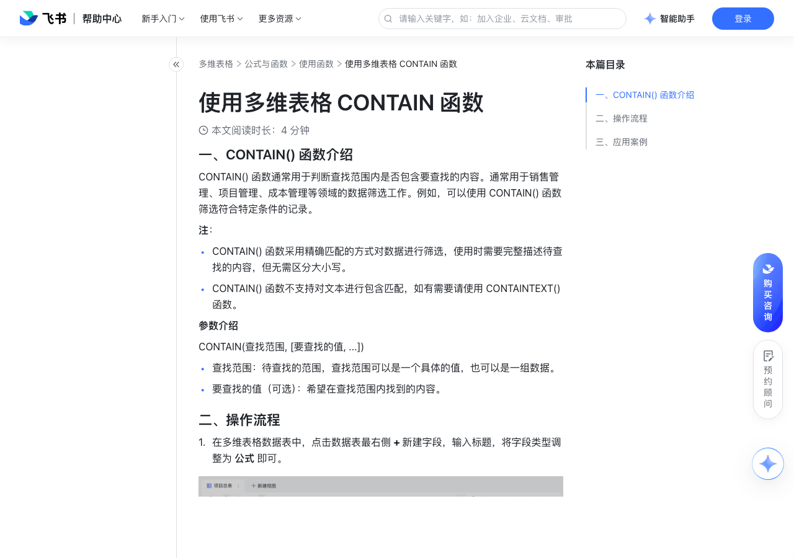

# 使用多维表格 CONTAIN 函数

> 来源：[飞书帮助中心](https://www.feishu.cn/hc/zh-CN/articles/733886010176)  
> 分类：多维表格 / 公式与函数 / 使用函数  
> 抓取时间：2026-09-22T01:23:49.697Z

## 界面截图

### 文档内配图

1. 配图：https://p1-hera.feishucdn.com/tos-cn-i-jbbdkfciu3/339ae71fa4a24883be88e8367aba4386~tplv-jbbdkfciu3-image:0:0.image
2. 配图：https://p1-hera.feishucdn.com/tos-cn-i-jbbdkfciu3/e290fa8c37e94a1f97207b93f2266714~tplv-jbbdkfciu3-image:0:0.image
3. 配图：https://p1-hera.feishucdn.com/tos-cn-i-jbbdkfciu3/a3ecedec51154617a72859e334081525~tplv-jbbdkfciu3-image:0:0.image
4. 配图：https://p1-hera.feishucdn.com/tos-cn-i-jbbdkfciu3/aba79217b711435886f6e58f40d2c5ab~tplv-jbbdkfciu3-image:0:0.image
5. 配图：https://p1-hera.feishucdn.com/tos-cn-i-jbbdkfciu3/3dc29150dcd8433e924cbf8c10cada32~tplv-jbbdkfciu3-image:0:0.image
6. 配图：https://p1-hera.feishucdn.com/tos-cn-i-jbbdkfciu3/c85c29bdb7774f3081a4a36675c26118~tplv-jbbdkfciu3-image:0:0.image
7. 配图：https://p1-hera.feishucdn.com/tos-cn-i-jbbdkfciu3/d37bf37e6ac441dfb811aea51a56e49a~tplv-jbbdkfciu3-image:0:0.image

## 功能定位

本页对应飞书帮助中心「多维表格 / 公式与函数 / 使用函数」下的「使用多维表格 CONTAIN 函数」。以下需求描述依据官方说明文档提炼，用于指导 DuoWei 对标实现。

## 功能目标

一、CONTAIN() 函数介绍

## 文档结构（官方章节）

- 一、CONTAIN() 函数介绍​
- 二、操作流程​
- 三、应用案例​
- 判断多个包含关系​
- 样本报告交付进度​

## 详细功能说明

一、CONTAIN() 函数介绍

CONTAIN() 函数采用精确匹配的方式对数据进行筛选，使用时需要完整描述待查找的内容，但无需区分大小写。

CONTAIN() 函数不支持对文本进行包含匹配，如有需要请使用 CONTAINTEXT() 函数。

查找范围：待查找的范围，查找范围可以是一个具体的值，也可以是一组数据。

要查找的值（可选）：希望在查找范围内找到的内容。

二、操作流程

在多维表格数据表中，点击数据表最右侧 + 新建字段，输入标题，将字段类型调整为 公式 即可。

在公式编辑器内，输入 CONTAIN() 函数，选择需要执行操作的数据表或字段，设置相应的筛选条件即可。

例如，如果你想查阅销售报表中包含“紧固件螺栓”的产品销售明细，可以采用 CONTAIN([销售产品类别],"紧固件螺栓") 函数公式，如下图显示，通过 CONTAIN() 函数筛选符合条件的产品记录。

三、应用案例

判断多个包含关系

样本报告交付进度

## 实现要点（对标 DuoWei）

1. **入口与信息架构**：在产品中明确该能力所属模块（公式与函数 / 使用函数），并保证用户可从对应导航触达。
2. **核心交互**：按上文「详细功能说明」还原主要操作路径；截图中出现的按钮、字段、面板命名尽量与飞书语义一致或可映射。
3. **数据与权限**：若文档涉及可见范围、可编辑范围、分享或高级权限，实现时需落到角色/成员模型，并保证 API/MCP 与 UI 权限一致。
4. **边界与上限**：若文档提到数量上限、格式限制、导入导出约束，需在实现与错误提示中体现。
5. **验收**：以本页截图场景为用例，完成「能打开 / 能配置 / 能保存 / 能被 Agent 读写（如适用）」四项检查。

## 原始摘录摘要

> 一、CONTAIN() 函数介绍 CONTAIN() 函数采用精确匹配的方式对数据进行筛选，使用时需要完整描述待查找的内容，但无需区分大小写。 CONTAIN() 函数不支持对文本进行包含匹配，如有需要请使用 CONTAINTEXT() 函数。 查找范围：待查找的范围，查找范围可以是一个具体的值，也可以是一组数据。 要查找的值（可选）：希望在查找范围内找到的内容。 二、操作流程 在多维表格数据表中，点击数据表最右侧 + 新建字段，输入标题，将字段类型调整为 公式 即可。 在公式编辑器内，输入 CONTAIN() 函数，选择需要执行操作的数据表或字段，设置相应的筛选条件即可。 例如，如果你想查阅销售报表中包含“紧固件螺栓”的产品销售明细，可以采用 CONTAIN([销售产品类别],"紧固件螺栓") 函数公式，如下图显示，通过 CONTAIN() 函数筛选符合条件的产品记录。 三、应用案例 判断多个包含关系 样本报告交付进度

## 元数据

- article_id: `7122020844267896833`
- category_id: `7082597162537730049`
- path: `/hc/zh-CN/articles/733886010176`
- extracted_text_length: 416
