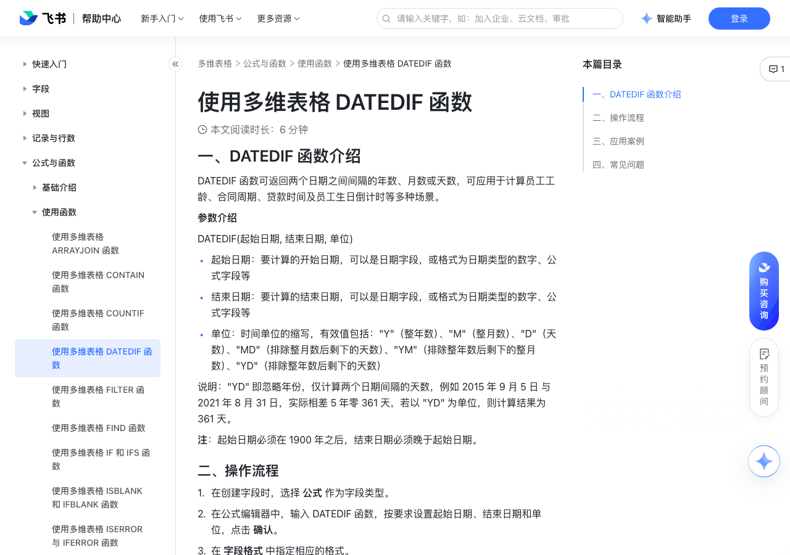

# 使用多维表格 DATEDIF 函数

> 来源：[飞书帮助中心](https://www.feishu.cn/hc/zh-CN/articles/467269708396)  
> 分类：多维表格 / 公式与函数 / 使用函数  
> 抓取时间：2026-09-22T01:23:51.554Z

## 界面截图

### 文档内配图

1. 配图：https://p1-hera.feishucdn.com/tos-cn-i-jbbdkfciu3/fc8aadd7b608498b8c1a673122f1da36~tplv-jbbdkfciu3-image:0:0.image
2. 配图：https://p1-hera.feishucdn.com/tos-cn-i-jbbdkfciu3/d7cc0620ea2c44babbd946531f1a4834~tplv-jbbdkfciu3-image:0:0.image
3. 配图：https://p1-hera.feishucdn.com/tos-cn-i-jbbdkfciu3/f15a93cd178f4e3881017deec7f79319~tplv-jbbdkfciu3-image:0:0.image
4. 配图：https://p1-hera.feishucdn.com/tos-cn-i-jbbdkfciu3/d2ce10e92b0544e48c20cfd47343a0ad~tplv-jbbdkfciu3-image:0:0.image

## 功能定位

本页对应飞书帮助中心「多维表格 / 公式与函数 / 使用函数」下的「使用多维表格 DATEDIF 函数」。以下需求描述依据官方说明文档提炼，用于指导 DuoWei 对标实现。

## 功能目标

一、DATEDIF 函数介绍

## 文档结构（官方章节）

- 一、DATEDIF 函数介绍​
- 二、操作流程​
- 三、应用案例​
- 四、常见问题​

## 详细功能说明

一、DATEDIF 函数介绍

起始日期：要计算的开始日期，可以是日期字段，或格式为日期类型的数字、公式字段等

结束日期：要计算的结束日期，可以是日期字段，或格式为日期类型的数字、公式字段等

单位：时间单位的缩写，有效值包括："Y"（整年数）、"M"（整月数）、"D"（天数）、"MD"（排除整月数后剩下的天数）、"YM"（排除整年数后剩下的整月数）、"YD"（排除整年数后剩下的天数）

二、操作流程

在创建字段时，选择 公式 作为字段类型。

在公式编辑器中，输入 DATEDIF 函数，按要求设置起始日期、结束日期和单位，点击 确认。

在 字段格式 中指定相应的格式。

三、应用案例

计算合同剩余天数

设置员工生日提醒

计算员工工龄及薪酬

四、常见问题

问：函数和函数中的参数是否要区分大小写？

答：不区分，大小写均可。

问：使用 DATEDIF 函数时返回值显示为 "#NUM!" 怎么办？

答：若使用函数计算过程中出现返回值为"#NUM!" ，可参考以下方面进行检查：检查 DATEDIF 函数的参数中结束时间是否早于开始时间。在与其他函数配套使用进行运算时，需注意过程中获得的返回值类型，如案例三中使用 RIGHT 函数获得小数点后一位的数字时，其返回结果类型为字符串，若要进行运算，需先将其类型转化为数字。

## 实现要点（对标 DuoWei）

1. **入口与信息架构**：在产品中明确该能力所属模块（公式与函数 / 使用函数），并保证用户可从对应导航触达。
2. **核心交互**：按上文「详细功能说明」还原主要操作路径；截图中出现的按钮、字段、面板命名尽量与飞书语义一致或可映射。
3. **数据与权限**：若文档涉及可见范围、可编辑范围、分享或高级权限，实现时需落到角色/成员模型，并保证 API/MCP 与 UI 权限一致。
4. **边界与上限**：若文档提到数量上限、格式限制、导入导出约束，需在实现与错误提示中体现。
5. **验收**：以本页截图场景为用例，完成「能打开 / 能配置 / 能保存 / 能被 Agent 读写（如适用）」四项检查。

## 原始摘录摘要

> 一、DATEDIF 函数介绍 起始日期：要计算的开始日期，可以是日期字段，或格式为日期类型的数字、公式字段等 结束日期：要计算的结束日期，可以是日期字段，或格式为日期类型的数字、公式字段等 单位：时间单位的缩写，有效值包括："Y"（整年数）、"M"（整月数）、"D"（天数）、"MD"（排除整月数后剩下的天数）、"YM"（排除整年数后剩下的整月数）、"YD"（排除整年数后剩下的天数） 二、操作流程 在创建字段时，选择 公式 作为字段类型。 在公式编辑器中，输入 DATEDIF 函数，按要求设置起始日期、结束日期和单位，点击 确认。 在 字段格式 中指定相应的格式。 三、应用案例 计算合同剩余天数 设置员工生日提醒 计算员工工龄及薪酬 四、常见问题 问：函数和函数中的参数是否要区分大小写？ 答：不区分，大小写均可。 问：使用 DATEDIF 函数时返回值显示为 "#NUM!" 怎么办？ 答：若使用函数计算过程中出现返回值为"#NUM!" ，可参考以下方面进行检查：检查 DATEDIF 函数的参数中结束时间是否早于开始时间。在与其他函数配套使用进行运算时，需注意过程中获得的返回值类型，如案例三中使用 RIGHT 函数获得小数点后一位的数字时，其返回结果类型为字符串，若要进行运算，需先将其类型转化为数字。

## 元数据

- article_id: `7314137556671709212`
- category_id: `7082597162537730049`
- path: `/hc/zh-CN/articles/467269708396`
- extracted_text_length: 557
