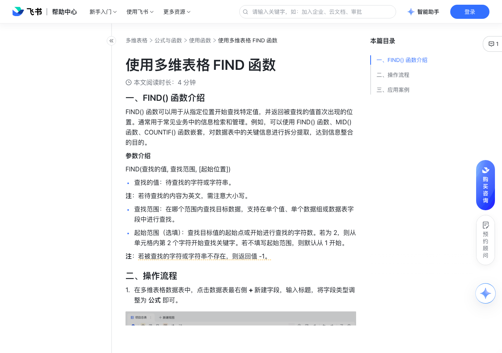

# 使用多维表格 FIND 函数

> 来源：[飞书帮助中心](https://www.feishu.cn/hc/zh-CN/articles/867795567278)  
> 分类：多维表格 / 公式与函数 / 使用函数  
> 抓取时间：2026-09-22T01:23:51.704Z

## 界面截图

### 文档内配图

1. 配图：https://p1-hera.feishucdn.com/tos-cn-i-jbbdkfciu3/c9f0dbf4bd2248729b7bcc8008971dd0~tplv-jbbdkfciu3-image:0:0.image
2. 配图：https://p1-hera.feishucdn.com/tos-cn-i-jbbdkfciu3/e6b4d95fb0a945d1a1b82841338554d7~tplv-jbbdkfciu3-image:0:0.image
3. 配图：https://p1-hera.feishucdn.com/tos-cn-i-jbbdkfciu3/3d6d754510bb4396921f0affa2acdb16~tplv-jbbdkfciu3-image:0:0.image
4. 配图：https://p1-hera.feishucdn.com/tos-cn-i-jbbdkfciu3/d747c2cfcfb5457fbb662b0518063821~tplv-jbbdkfciu3-image:0:0.image
5. 配图：https://p1-hera.feishucdn.com/tos-cn-i-jbbdkfciu3/42e7d47f9a8a4c039b84d3aeba6d726e~tplv-jbbdkfciu3-image:0:0.image

## 功能定位

本页对应飞书帮助中心「多维表格 / 公式与函数 / 使用函数」下的「使用多维表格 FIND 函数」。以下需求描述依据官方说明文档提炼，用于指导 DuoWei 对标实现。

## 功能目标

一、FIND() 函数介绍

## 文档结构（官方章节）

- 一、FIND() 函数介绍​
- 二、操作流程​
- 三、应用案例​
- 拆分和提取信息​
- 统计符合条件的数据​

## 详细功能说明

一、FIND() 函数介绍

查找的值：待查找的字符或字符串。

查找范围：在哪个范围内查找目标数据，支持在单个值、单个数据组或数据表字段中进行查找。

起始范围（选填）：查找目标值的起始点或开始进行查找的字符数。若为 2，则从单元格内第 2 个字符开始查找关键字。若不填写起始范围，则默认从 1 开始。

二、操作流程

在多维表格数据表中，点击数据表最右侧 + 新建字段，输入标题，将字段类型调整为 公式 即可。

在公式编辑器内，输入 FIND() 函数，选择待查找的值和查找范围即可。

例如，在统计人员信息时，想将邮箱中的用户名提取出来，保留邮箱中的主机域名。可以采用 LEFT([邮箱地址],find（"@"，[邮箱地址]，1）-1) 函数公式，如下图显示，通过 FIND() 函数查找邮箱地址中的 @ 符号，然后通过 LEFT() 函数返回 @ 符号左侧的值，即可找到所有邮箱的用户名。

三、应用案例

拆分和提取信息

统计符合条件的数据

## 实现要点（对标 DuoWei）

1. **入口与信息架构**：在产品中明确该能力所属模块（公式与函数 / 使用函数），并保证用户可从对应导航触达。
2. **核心交互**：按上文「详细功能说明」还原主要操作路径；截图中出现的按钮、字段、面板命名尽量与飞书语义一致或可映射。
3. **数据与权限**：若文档涉及可见范围、可编辑范围、分享或高级权限，实现时需落到角色/成员模型，并保证 API/MCP 与 UI 权限一致。
4. **边界与上限**：若文档提到数量上限、格式限制、导入导出约束，需在实现与错误提示中体现。
5. **验收**：以本页截图场景为用例，完成「能打开 / 能配置 / 能保存 / 能被 Agent 读写（如适用）」四项检查。

## 原始摘录摘要

> 一、FIND() 函数介绍 查找的值：待查找的字符或字符串。 查找范围：在哪个范围内查找目标数据，支持在单个值、单个数据组或数据表字段中进行查找。 起始范围（选填）：查找目标值的起始点或开始进行查找的字符数。若为 2，则从单元格内第 2 个字符开始查找关键字。若不填写起始范围，则默认从 1 开始。 二、操作流程 在多维表格数据表中，点击数据表最右侧 + 新建字段，输入标题，将字段类型调整为 公式 即可。 在公式编辑器内，输入 FIND() 函数，选择待查找的值和查找范围即可。 例如，在统计人员信息时，想将邮箱中的用户名提取出来，保留邮箱中的主机域名。可以采用 LEFT([邮箱地址],find（"@"，[邮箱地址]，1）-1) 函数公式，如下图显示，通过 FIND() 函数查找邮箱地址中的 @ 符号，然后通过 LEFT() 函数返回 @ 符号左侧的值，即可找到所有邮箱的用户名。 三、应用案例 拆分和提取信息 统计符合条件的数据

## 元数据

- article_id: `7086405672912519196`
- category_id: `7082597162537730049`
- path: `/hc/zh-CN/articles/867795567278`
- extracted_text_length: 418
