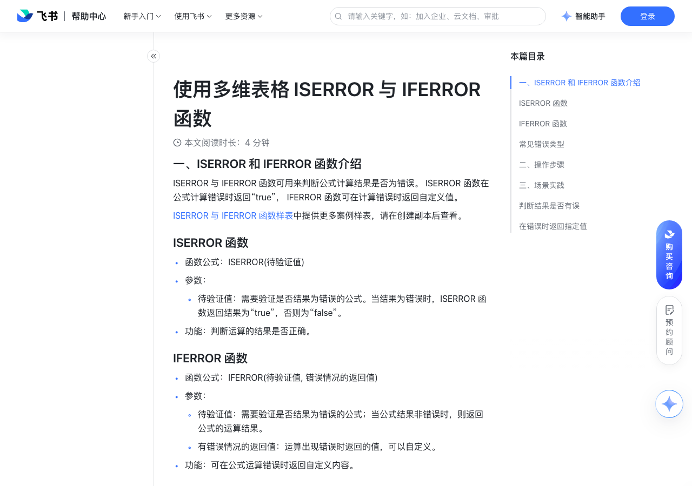

# 使用多维表格 ISERROR 与 IFERROR 函数

> 来源：[飞书帮助中心](https://www.feishu.cn/hc/zh-CN/articles/899637880266)  
> 分类：多维表格 / 公式与函数 / 使用函数  
> 抓取时间：2026-09-22T01:23:53.374Z

## 界面截图

### 文档内配图

1. 配图：https://p1-hera.feishucdn.com/tos-cn-i-jbbdkfciu3/837cbba37cae4bc8bed3de440af077d2~tplv-jbbdkfciu3-image:0:0.image
2. 配图：https://p1-hera.feishucdn.com/tos-cn-i-jbbdkfciu3/fe4da9be245c4ca4bc538fca815400cf~tplv-jbbdkfciu3-image:0:0.image

## 功能定位

本页对应飞书帮助中心「多维表格 / 公式与函数 / 使用函数」下的「使用多维表格 ISERROR 与 IFERROR 函数」。以下需求描述依据官方说明文档提炼，用于指导 DuoWei 对标实现。

## 功能目标

一、ISERROR 和 IFERROR 函数介绍

## 文档结构（官方章节）

- 一、ISERROR 和 IFERROR 函数介绍​
- ISERROR 函数​
- IFERROR 函数​
- 常见错误类型​
- 二、操作步骤 ​
- 三、场景实践​
- 判断结果是否有误​
- 在错误时返回指定值​

## 详细功能说明

一、ISERROR 和 IFERROR 函数介绍

ISERROR 与 IFERROR 函数可用来判断公式计算结果是否为错误。 ISERROR 函数在公式计算错误时返回“true”， IFERROR 函数可在计算错误时返回自定义值。

ISERROR 与 IFERROR 函数样表中提供更多案例样表，请在创建副本后查看。

ISERROR 函数

函数公式：ISERROR(待验证值)

待验证值：需要验证是否结果为错误的公式。当结果为错误时，ISERROR 函数返回结果为“true”，否则为“false”。

功能：判断运算的结果是否正确。

IFERROR 函数

函数公式：IFERROR(待验证值, 错误情况的返回值)

待验证值：需要验证是否结果为错误的公式；当公式结果非错误时，则返回公式的运算结果。

有错误情况的返回值：运算出现错误时返回的值，可以自定义。

功能：可在公式运算错误时返回自定义内容。

常见错误类型

错误类型

错误说明

#N/A

数据缺失

#VALUE!

输入公式的方式错误或参与计算的数值错误

#REF!

引用的数值错误，如复制了被删除的字段内容或内容不存在

#DIV/0!

除数为 0 而导致的错误（除数不能为 0）

#NUM!

当公式或函数中某个数字有问题时产生错误值

#NAME？

出现了不能识别的内容

#NULL!

使用了不正确的区域运算符或不正确的数值引用

二、操作步骤

打开多维表格文件，在左侧的导航栏中打开需要使用的数据表。

点击数据表字段名最右侧的 + 图标新增字段，输入字段名，在字段类型中选择 公式。要编辑已创建的公式字段，可双击该字段的字段名。

点击公式内容编辑框，输入要使用的公式，在公式中添加 IFERROR 或 ISERROR 函数。

完成编辑后，点击 确定。

三、场景实践

判断结果是否有误

场景：根据总价和数量计算单价，通过 ISERROR 函数判断运算是否返回错误。

公式：ISERROR([总价]/[数量])

在错误时返回指定值

场景：当根据总价和数量计算单价时，可以通过使用 IFERROR 找出其中的错误数据，并返回指定值“数据有误”。

公式：IFERROR([总价]/[数量],"数据有误")

错误类型 | 错误说明

#N/A | 数据缺失

#VALUE! | 输入公式的方式错误或参与计算的数值错误

#REF! | 引用的数值错误，如复制了被删除的字段内容或内容不存在

#DIV/0! | 除数为 0 而导致的错误（除数不能为 0）

#NUM! | 当公式或函数中某个数字有问题时产生错误值

#NAME？ | 出现了不能识别的内容

#NULL! | 使用了不正确的区域运算符或不正确的数值引用

## 实现要点（对标 DuoWei）

1. **入口与信息架构**：在产品中明确该能力所属模块（公式与函数 / 使用函数），并保证用户可从对应导航触达。
2. **核心交互**：按上文「详细功能说明」还原主要操作路径；截图中出现的按钮、字段、面板命名尽量与飞书语义一致或可映射。
3. **数据与权限**：若文档涉及可见范围、可编辑范围、分享或高级权限，实现时需落到角色/成员模型，并保证 API/MCP 与 UI 权限一致。
4. **边界与上限**：若文档提到数量上限、格式限制、导入导出约束，需在实现与错误提示中体现。
5. **验收**：以本页截图场景为用例，完成「能打开 / 能配置 / 能保存 / 能被 Agent 读写（如适用）」四项检查。

## 原始摘录摘要

> 一、ISERROR 和 IFERROR 函数介绍 ISERROR 与 IFERROR 函数可用来判断公式计算结果是否为错误。 ISERROR 函数在公式计算错误时返回“true”， IFERROR 函数可在计算错误时返回自定义值。 ISERROR 与 IFERROR 函数样表中提供更多案例样表，请在创建副本后查看。 ISERROR 函数 函数公式：ISERROR(待验证值) 待验证值：需要验证是否结果为错误的公式。当结果为错误时，ISERROR 函数返回结果为“true”，否则为“false”。 功能：判断运算的结果是否正确。 IFERROR 函数 函数公式：IFERROR(待验证值, 错误情况的返回值) 待验证值：需要验证是否结果为错误的公式；当公式结果非错误时，则返回公式的运算结果。 有错误情况的返回值：运算出现错误时返回的值，可以自定义。 功能：可在公式运算错误时返回自定义内容。 常见错误类型 错误类型 错误说明 #N/A 数据缺失 #VALUE! 输入公式的方式错误或参与计算的数值错误 #REF! 引用的数值错误，如复制了被删除的字段内容或内容不存在 #DIV/0! 除数为 0 而导致的错误（除数不能为 0） #NUM! 当公式或函数中某个数字有问题时产生错误值 #NAME？ 出现了不能识别的内容 #NULL! 使用了不正确的区域运算符或不正确的数值引用 二、操作步骤 打开多维表格文件，在左侧的导航栏中打开需要使用的数据表。 点击数据表字段名最右侧的 + 图标新增字段，输入字段名，在字段类型中选择 公式。要编辑已创建的公式字段，可双击该字段的字段名。 点击公式内容编辑框，输入要使用的公式，在公式中添加 IFERROR 或 ISERROR 函数。 完成编辑后，点击 确定。 三、场景实践 判断结果是否有误 场景：根据总价和数量计算单价，通过 ISERROR 函数判断运算…

## 元数据

- article_id: `7070758507284283393`
- category_id: `7082597162537730049`
- path: `/hc/zh-CN/articles/899637880266`
- extracted_text_length: 1125
