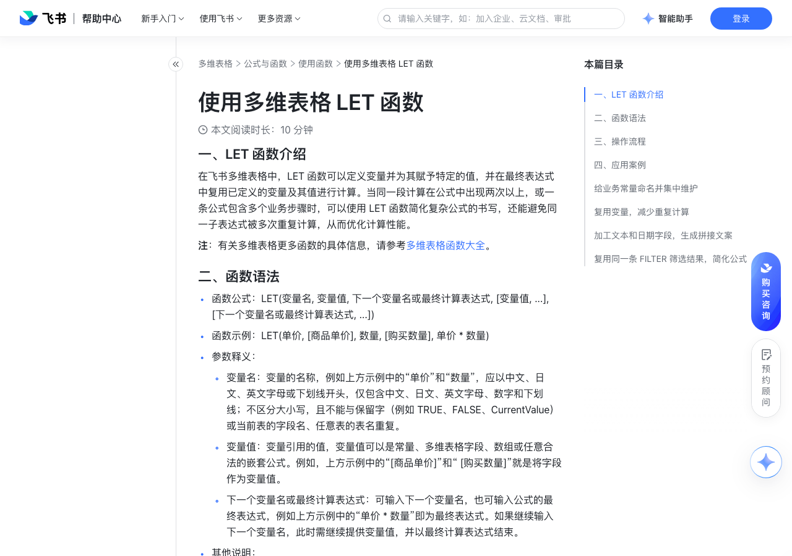

# 使用多维表格 LET 函数

> 来源：[飞书帮助中心](https://www.feishu.cn/hc/zh-CN/articles/150215132000)  
> 分类：多维表格 / 公式与函数 / 使用函数  
> 抓取时间：2026-09-22T01:23:56.328Z

## 界面截图

### 文档内配图

1. 配图：https://p1-hera.feishucdn.com/tos-cn-i-jbbdkfciu3/ed7a26cb40eb404ea4b3464a4e15e4cc~tplv-jbbdkfciu3-image:0:0.image
2. 配图：https://p1-hera.feishucdn.com/tos-cn-i-jbbdkfciu3/e72969a1fbd441e38474cad8e4e0005a~tplv-jbbdkfciu3-image:0:0.image
3. 配图：https://p1-hera.feishucdn.com/tos-cn-i-jbbdkfciu3/796556227ea646b3bb2573c58023db07~tplv-jbbdkfciu3-image:0:0.image
4. 配图：https://p1-hera.feishucdn.com/tos-cn-i-jbbdkfciu3/c410064c4ff24bb3a472b28ebe832862~tplv-jbbdkfciu3-image:0:0.image
5. 配图：https://p1-hera.feishucdn.com/tos-cn-i-jbbdkfciu3/178e02c7b7a8449594f68e38d0938b46~tplv-jbbdkfciu3-image:0:0.image

## 功能定位

本页对应飞书帮助中心「多维表格 / 公式与函数 / 使用函数」下的「使用多维表格 LET 函数」。以下需求描述依据官方说明文档提炼，用于指导 DuoWei 对标实现。

## 功能目标

一、LET 函数介绍

## 文档结构（官方章节）

- 一、LET 函数介绍 ​
- 二、函数语法​
- 三、操作流程​
- 四、应用案例​
- 给业务常量命名并集中维护​
- 复用变量，减少重复计算​
- 加工文本和日期字段，生成拼接文案​
- 复用同一条 FILTER 筛选结果，简化公式​

## 详细功能说明

一、LET 函数介绍

二、函数语法

函数公式：LET(变量名, 变量值, 下一个变量名或最终计算表达式, [变量值, ...], [下一个变量名或最终计算表达式, ...])

函数示例：LET(单价, [商品单价], 数量, [购买数量], 单价 * 数量)

参数释义：

变量名：变量的名称，例如上方示例中的“单价”和“数量”，应以中文、日文、英文字母或下划线开头，仅包含中文、日文、英文字母、数字和下划线；不区分大小写，且不能与保留字（例如 TRUE、FALSE、CurrentValue）或当前表的字段名、任意表的表名重复。

变量值：变量引用的值，变量值可以是常量、多维表格字段、数组或任意合法的嵌套公式。例如，上方示例中的“[商品单价]”和“ [购买数量]”就是将字段作为变量值。

下一个变量名或最终计算表达式：可输入下一个变量名，也可输入公式的最终表达式，例如上方示例中的“单价 * 数量”即为最终表达式。如果继续输入下一个变量名，此时需继续提供变量值，并以最终计算表达式结束。

其他说明：

除最终表达式外，变量必须按“变量名,变量值”成对出现。最后一个参数必须为最终表达式，参数总数必须为奇数。

最少需要 1 组变量（即变量名和变量值）加 1 个最终表达式，最多支持 126 组变量加 1 个最终表达式。

按定义顺序引用变量，即在第 n 个变量值中引用时，只能引用之前已经定义过的变量（变量 1 至变量 n-1）；最终表达式可引用全部变量。

变量名仅在当前的 LET 函数中生效，不会创建新的字段，也不会影响其他公式。

同一个 LET 函数中，同一层级的变量名不得重复，但嵌套的子表达式中的变量可以与上层变量重复，并在子表达式中覆盖上层变量。例如，正确写法是 LET(x, 10, y, LET(x, 20, x + 5), x + y)，错误写法是 LET(x, 10, x, 20, x + 5)。

在 LET 函数中嵌套 FILTER 函数时，支持直接将 FILTER(表,条件).[字段] 的筛选结果作为变量值；不支持先将 FILTER(表,条件) 的记录列表绑定为变量，再将“变量.[字段]”作为其他变量的值或用在最终表达式中。例如，正确写法是 LET(及格名单, FILTER(表 1, 表 1.[分数] > 60).[姓名])，及格名单))，错误写法为 LET(及格名单, FILTER(表 1, 表 1.[分数] > 60), 及格名单.[姓名])。

返回值：返回最后一个参数（即最终表达式）的计算结果。返回值的类型与最终表达式一致，可以是数值、文本、日期、复选框、字段引用或列表。若返回错误信息，常见原因如下。

#VALUE!

参数总数低于下限或超出上限。参数总数为偶数，例如某个变量名没有对应的变量值，或缺少最终表达式。同一级 LET 函数中的变量名有重复。

参数总数低于下限或超出上限。

参数总数为偶数，例如某个变量名没有对应的变量值，或缺少最终表达式。

同一级 LET 函数中的变量名有重复。

#NAME?

变量命名不符合要求，例如与函数名或保留词重复。最终表达式里引用了未定义的变量名。后面的变量引用了前面尚未定义的变量名，不符合向前引用的要求。同一级 LET 函数中的变量名有重复。

变量命名不符合要求，例如与函数名或保留词重复。

最终表达式里引用了未定义的变量名。

后面的变量引用了前面尚未定义的变量名，不符合向前引用的要求。

三、操作流程

打开多维表格数据表。

点击数据表字段名最右侧的 + 图标新增字段，选择 公式 作为字段类型。你也可以双击已创建公式字段的字段名，对该公式字段进行编辑。具体信息请参考多维表格公式字段概述。

点击公式内容下的 编辑公式 图标，输入含有 LET 函数的公式，点击 确认。

注：如需快速编辑已创建的公式字段，可双击该字段下的任意单元格打开公式编辑器。

四、应用案例

给业务常量命名并集中维护

场景：需要根据订单金额和配送地区计算运费。满 199 免邮，否则收取 12 元基础运费；偏远地区另加 8 元。

公式：LET(免邮门槛, 199, 基础运费, 12, 偏远附加费, 8, IF([订单金额] >= 免邮门槛, 0, 基础运费 + IF([偏远地区], 偏远附加费, 0)))

说明：使用 LET 函数可以给业务常量清晰命名。如果不使用 LET 函数，公式可以写为 IF([订单金额] >= 199, 0, 12 + IF([偏远地区], 8, 0))，但命名不够清晰，需要结合语境猜测数字含义。

复用变量，减少重复计算

场景：计算订单实付金额，订单小计超过 1,000 时减免 10%，最终计算结果保留两位小数。

公式：LET(小计, [单价] * [数量], 折扣, IF(小计 > 1000, 小计 * 0.1, 0), ROUND(小计 - 折扣, 2))

说明：如果不使用 LET 函数，表达式“[单价] * [数量]”会在同一条公式中重复出现。使用 LET 函数后，只需要定义一次“小计”变量。后续调整折扣门槛或折扣比例时，只需修改对应变量值即可。

加工文本和日期字段，生成拼接文案

场景：根据“出生日期”字段计算年龄，并拼接成“年龄：N 岁”的展示文案。

公式：LET(生日, [出生日期],今天, TODAY(),年龄, DATEDIF(生日, 今天, "Y"),CONCATENATE("年龄：", TEXT(年龄, "0"), " 岁"))

说明：先定义“生日”变量，变量值为 [出生日期] 字段的值；然后定义“今天”变量，变量值为当前日期；再定义“年龄”变量，变量值为出生日期距今的整年数；最终用 CONCATENATE 和 TEXT 将年龄拼接为文本“年龄：N 岁”。

复用同一条 FILTER 筛选结果，简化公式

场景：需要在公式中进行多重筛选，例如需要筛出金额大于 1,000 的大单客户，并进行大单客户数量预警。如果大单客户数达到或超出 10 人时，判断需要增加跟进人手，否则视为人手充足。

公式：LET(大单客户, [订单表].FILTER(CurrentValue.[金额] > 1000).[客户].LISTCOMBINE().UNIQUE(), 客户数, COUNTA(大单客户), "大单客户：" & 大单客户 & "；" & IF(客户数 >= 10, "需增加跟进人手", "跟进人手充足"))

说明：先定义“大单客户”变量，变量值为金额大于 1,000 的所有订单涉及的去重客户列表；然后定义“客户数”变量，变量值为大单客户列表中的非空单元格个数。最终用 & 符号拼接成文本字符串，例如“大单客户：客户 A、客户 B；需增加跟进人手”。

返回值 | 原因

#VALUE! | 参数总数低于下限或超出上限。参数总数为偶数，例如某个变量名没有对应的变量值，或缺少最终表达式。同一级 LET 函数中的变量名有重复。

#NAME? | 变量命名不符合要求，例如与函数名或保留词重复。最终表达式里引用了未定义的变量名。后面的变量引用了前面尚未定义的变量名，不符合向前引用的要求。同一级 LET 函数中的变量名有重复。

## 实现要点（对标 DuoWei）

1. **入口与信息架构**：在产品中明确该能力所属模块（公式与函数 / 使用函数），并保证用户可从对应导航触达。
2. **核心交互**：按上文「详细功能说明」还原主要操作路径；截图中出现的按钮、字段、面板命名尽量与飞书语义一致或可映射。
3. **数据与权限**：若文档涉及可见范围、可编辑范围、分享或高级权限，实现时需落到角色/成员模型，并保证 API/MCP 与 UI 权限一致。
4. **边界与上限**：若文档提到数量上限、格式限制、导入导出约束，需在实现与错误提示中体现。
5. **验收**：以本页截图场景为用例，完成「能打开 / 能配置 / 能保存 / 能被 Agent 读写（如适用）」四项检查。

## 原始摘录摘要

> 一、LET 函数介绍 二、函数语法 函数公式：LET(变量名, 变量值, 下一个变量名或最终计算表达式, [变量值, ...], [下一个变量名或最终计算表达式, ...]) 函数示例：LET(单价, [商品单价], 数量, [购买数量], 单价 * 数量) 参数释义： 变量名：变量的名称，例如上方示例中的“单价”和“数量”，应以中文、日文、英文字母或下划线开头，仅包含中文、日文、英文字母、数字和下划线；不区分大小写，且不能与保留字（例如 TRUE、FALSE、CurrentValue）或当前表的字段名、任意表的表名重复。 变量值：变量引用的值，变量值可以是常量、多维表格字段、数组或任意合法的嵌套公式。例如，上方示例中的“[商品单价]”和“ [购买数量]”就是将字段作为变量值。 下一个变量名或最终计算表达式：可输入下一个变量名，也可输入公式的最终表达式，例如上方示例中的“单价 * 数量”即为最终表达式。如果继续输入下一个变量名，此时需继续提供变量值，并以最终计算表达式结束。 其他说明： 除最终表达式外，变量必须按“变量名,变量值”成对出现。最后一个参数必须为最终表达式，参数总数必须为奇数。 最少需要 1 组变量（即变量名和变量值）加 1 个最终表达式，最多支持 126 组变量加 1 个最终表达式。 按定义顺序引用变量，即在第 n 个变量值中引用时，只能引用之前已经定义过的变量（变量 1 至变量 n-1）；最终表达式可引用全部变量。 变量名仅在当前的 LET 函数中生效，不会创建新的字段，也不会影响其他公式。 同一个 LET 函数中，同一层级的变量名不得重复，但嵌套的子表达式中的变量可以与上层变量重复，并在子表达式中覆盖上层变量。例如，正确写法是 LET(x, 10, y, LET(x, 20, x + 5), x + y)，错误写法是 LET(x, 10, x, 20, x…

## 元数据

- article_id: `7672616787212585932`
- category_id: `7082597162537730049`
- path: `/hc/zh-CN/articles/150215132000`
- extracted_text_length: 2966
