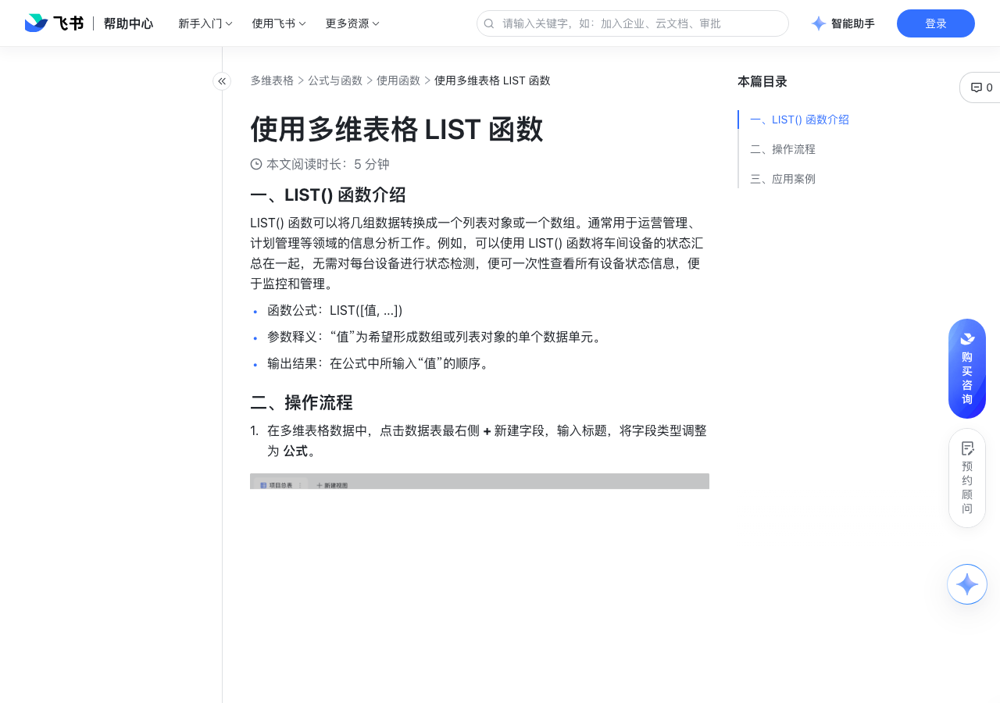

# 使用多维表格 LIST 函数

> 来源：[飞书帮助中心](https://www.feishu.cn/hc/zh-CN/articles/494463442119)  
> 分类：多维表格 / 公式与函数 / 使用函数  
> 抓取时间：2026-09-22T01:23:54.062Z

## 界面截图

### 文档内配图

1. 配图：https://p1-hera.feishucdn.com/tos-cn-i-jbbdkfciu3/0416e5b623d241a98b22531fec8b58a6~tplv-jbbdkfciu3-image:0:0.image
2. 配图：https://p1-hera.feishucdn.com/tos-cn-i-jbbdkfciu3/45c4faab21b64689a34723e0830906d8~tplv-jbbdkfciu3-image:0:0.image
3. 配图：https://p1-hera.feishucdn.com/tos-cn-i-jbbdkfciu3/fab4b489e7b54622af410dcfa1386cd9~tplv-jbbdkfciu3-image:0:0.image
4. 配图：https://p1-hera.feishucdn.com/tos-cn-i-jbbdkfciu3/f51ea75f6ed7410fad8ff0cc5c1045e4~tplv-jbbdkfciu3-image:0:0.image
5. 配图：https://p1-hera.feishucdn.com/tos-cn-i-jbbdkfciu3/915397b8b99d44178e456001e88ae9f8~tplv-jbbdkfciu3-image:0:0.image
6. 配图：https://p1-hera.feishucdn.com/tos-cn-i-jbbdkfciu3/e3647cef684445828f0bd3fe4b836eef~tplv-jbbdkfciu3-image:0:0.image
7. 配图：https://p1-hera.feishucdn.com/tos-cn-i-jbbdkfciu3/bdb36649ec5547ba88eda8094ca4d5dc~tplv-jbbdkfciu3-image:0:0.image
8. 配图：https://p1-hera.feishucdn.com/tos-cn-i-jbbdkfciu3/e36aa18558924e3f8451cde1428c1d4e~tplv-jbbdkfciu3-image:0:0.image
9. 配图：https://p1-hera.feishucdn.com/tos-cn-i-jbbdkfciu3/f6cba467b2fa4c64adcc0e889092d6cb~tplv-jbbdkfciu3-image:0:0.image

## 功能定位

本页对应飞书帮助中心「多维表格 / 公式与函数 / 使用函数」下的「使用多维表格 LIST 函数」。以下需求描述依据官方说明文档提炼，用于指导 DuoWei 对标实现。

## 功能目标

一、LIST() 函数介绍

## 文档结构（官方章节）

- 一、LIST() 函数介绍​
- 二、操作流程​
- 三、应用案例​
- 设备点检​
- 报告交付​

## 详细功能说明

一、LIST() 函数介绍

LIST() 函数可以将几组数据转换成一个列表对象或一个数组。通常用于运营管理、计划管理等领域的信息分析工作。例如，可以使用 LIST() 函数将车间设备的状态汇总在一起，无需对每台设备进行状态检测，便可一次性查看所有设备状态信息，便于监控和管理。

函数公式：LIST([值, ...])

参数释义：“值”为希望形成数组或列表对象的单个数据单元。

输出结果：在公式中所输入“值”的顺序。

二、操作流程

在多维表格数据中，点击数据表最右侧 + 新建字段，输入标题，将字段类型调整为 公式。

在公式编辑器内，输入 LIST() 函数，选择需要执行操作的数据表或字段。

三、应用案例

设备点检

报告交付

## 实现要点（对标 DuoWei）

1. **入口与信息架构**：在产品中明确该能力所属模块（公式与函数 / 使用函数），并保证用户可从对应导航触达。
2. **核心交互**：按上文「详细功能说明」还原主要操作路径；截图中出现的按钮、字段、面板命名尽量与飞书语义一致或可映射。
3. **数据与权限**：若文档涉及可见范围、可编辑范围、分享或高级权限，实现时需落到角色/成员模型，并保证 API/MCP 与 UI 权限一致。
4. **边界与上限**：若文档提到数量上限、格式限制、导入导出约束，需在实现与错误提示中体现。
5. **验收**：以本页截图场景为用例，完成「能打开 / 能配置 / 能保存 / 能被 Agent 读写（如适用）」四项检查。

## 原始摘录摘要

> 一、LIST() 函数介绍 LIST() 函数可以将几组数据转换成一个列表对象或一个数组。通常用于运营管理、计划管理等领域的信息分析工作。例如，可以使用 LIST() 函数将车间设备的状态汇总在一起，无需对每台设备进行状态检测，便可一次性查看所有设备状态信息，便于监控和管理。 函数公式：LIST([值, ...]) 参数释义：“值”为希望形成数组或列表对象的单个数据单元。 输出结果：在公式中所输入“值”的顺序。 二、操作流程 在多维表格数据中，点击数据表最右侧 + 新建字段，输入标题，将字段类型调整为 公式。 在公式编辑器内，输入 LIST() 函数，选择需要执行操作的数据表或字段。 三、应用案例 设备点检 报告交付

## 元数据

- article_id: `7122019870925012993`
- category_id: `7082597162537730049`
- path: `/hc/zh-CN/articles/494463442119`
- extracted_text_length: 312
