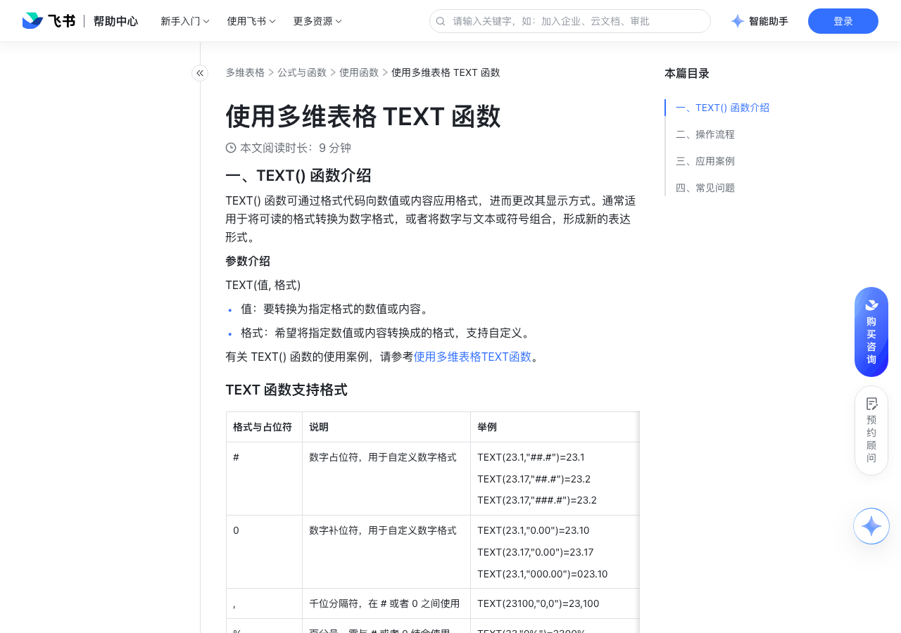

# 使用多维表格 TEXT 函数

> 来源：[飞书帮助中心](https://www.feishu.cn/hc/zh-CN/articles/878122832412)  
> 分类：多维表格 / 公式与函数 / 使用函数  
> 抓取时间：2026-09-22T01:23:54.766Z

## 界面截图

### 文档内配图

1. 配图：https://p1-hera.feishucdn.com/tos-cn-i-jbbdkfciu3/86f7eea2c69d4a4596bad4dfc2747fd5~tplv-jbbdkfciu3-image:0:0.image
2. 配图：https://p1-hera.feishucdn.com/tos-cn-i-jbbdkfciu3/1eff74a436544637abe41ed3c6ff2d60~tplv-jbbdkfciu3-image:0:0.image
3. 配图：https://p1-hera.feishucdn.com/tos-cn-i-jbbdkfciu3/14d1733772e247778c9261d6346ddc62~tplv-jbbdkfciu3-image:0:0.image
4. 配图：https://p1-hera.feishucdn.com/tos-cn-i-jbbdkfciu3/b77fdbecc2cf4e389cc4a9c6fe4f4039~tplv-jbbdkfciu3-image:0:0.image
5. 配图：https://p1-hera.feishucdn.com/tos-cn-i-jbbdkfciu3/e589efa1fb4240c394cf3ae761d9098f~tplv-jbbdkfciu3-image:0:0.image
6. 配图：https://p1-hera.feishucdn.com/tos-cn-i-jbbdkfciu3/84e17808f6c74859a410e45d4f9c465b~tplv-jbbdkfciu3-image:0:0.image
7. 配图：https://p1-hera.feishucdn.com/tos-cn-i-jbbdkfciu3/4df5e128f87140069da3aa20bac44fcc~tplv-jbbdkfciu3-image:0:0.image
8. 配图：https://p1-hera.feishucdn.com/tos-cn-i-jbbdkfciu3/f231fafd2fbd4a168f8d4ad278afdbda~tplv-jbbdkfciu3-image:0:0.image

## 功能定位

本页对应飞书帮助中心「多维表格 / 公式与函数 / 使用函数」下的「使用多维表格 TEXT 函数」。以下需求描述依据官方说明文档提炼，用于指导 DuoWei 对标实现。

## 功能目标

一、TEXT() 函数介绍

## 文档结构（官方章节）

- 一、TEXT() 函数介绍​
- TEXT 函数支持格式​
- 二、操作流程​
- 三、应用案例​
- 将日期与文本拼接在一起 ​
- 计算工时并用小时和分钟表示 ​
- 统一不同类型的文本格式 ​
- 提取身份证中的出生日期 ​
- 以小时为单位计算两个日期差​
- 四、常见问题​

## 详细功能说明

一、TEXT() 函数介绍

TEXT() 函数可通过格式代码向数值或内容应用格式，进而更改其显示方式。通常适用于将可读的格式转换为数字格式，或者将数字与文本或符号组合，形成新的表达形式。

值：要转换为指定格式的数值或内容。

格式：希望将指定数值或内容转换成的格式，支持自定义。

TEXT 函数支持格式

格式与占位符

数字占位符，用于自定义数字格式

TEXT(23.1,"##.#")=23.1 TEXT(23.17,"##.#")=23.2 TEXT(23.17,"###.#")=23.2

数字补位符，用于自定义数字格式

TEXT(23.1,"0.00")=23.10 TEXT(23.17,"0.00")=23.17TEXT(23.1,"000.00")=023.10

千位分隔符，在 # 或者 0 之间使用

TEXT(23100,"0,0")=23,100

百分号，需与 # 或者 0 结合使用

TEXT(23,"0%")=2300%

YYYY

年份全称

TEXT("2022-4-15","YYYY")=2022 TEXT("2022-4-15","YYYY年")=2022年

年份缩写

TEXT("2022-4-15","YY")=22 TEXT("2022-4-15","YY年")=22年 TEXT("2022-4-15","Y")=22

月份全称

TEXT("2022-4-15","MMM")=4月

月份数字全写

TEXT("2022-4-15","YYYY/MM")=2022/04 TEXT("2022-4-15","MM月")=04月

月份数字简写

TEXT("2022-4-15","M")=4 TEXT("2022-4-15","M月")=4月

TEXT("2022-4-1","DD")=01 TEXT("2022-4-1","DD日")=01日

TEXT("2022-4-1","D")=1 TEXT("2022-4-1","D日")=1日

DDDD

星期全称

TEXT("2022-4-1","DDDD")=星期五

星期简称

TEXT("2022-4-1","DDD")=周五

TEXT("17:30","hh")=17

TEXT("17:30","hh:mm")=17:30

TEXT("17:30:29","ss")=29

二、操作流程

在多维表格数据表中，点击数据表最右侧 + 新建字段，输入标题，将字段类型调整为 公式 即可。

在公式编辑器内，输入 TEXT() 函数，选择需要执行操作的数据表或字段，输入希望转换的格式即可。

例如，在销售报表中，业务员希望用日期作为销售合同代码，可以采用 TEXT([销售日期],"YYMMDD") 函数公式。如下图显示，通过函数将原本的日期格式调整为所需的格式。

三、应用案例

0.5x

0.75x

1.5x

将日期与文本拼接在一起

计算工时并用小时和分钟表示

统一不同类型的文本格式

提取身份证中的出生日期

以小时为单位计算两个日期差

四、常见问题

问：如果运算后的函数返回值既含有日期又含有时间 [yyyy-mm-dd hh:mm]，如何调整使其仅有日期 [yyyy-mm-dd]？

答：方法 1：可以使用 TEXT() 函数进行格式转换，新建公式字段，输入函数 TEXT([待调整的返回值],"YYYY-MM-DD") 即可。方法 2：双击当前公式字段，选择 字段格式 为日期，在 日期格式 处调整为所需的格式即可。

问：为什么多维表格 TEXT() 函数计算出来的结果为数字时，在其他函数中计算会出错？

答：TEXT() 函数计算出来的结果属于文本格式，你可以通过 SUM() 或者 ABS() 函数将计算结果变成数据后，进行引用或计算。 250px|700px|reset

问：多维表格 TEXT() 函数支持哪些自定义格式？

答：常见格式请见下表；格式与占位符 说明 举例 # 数字占位符，用于自定义数字格式 TEXT(23.1,"##.#")=23.1 TEXT(23.17,"##.#")=23.2 0 数字补位符，用于自定义数字格式 TEXT(23.1,"0.00")=23.10 TEXT(23.17,"0.00")=23.17 , 千位分隔符，在 # 或者 0 之间使用 TEXT(23100,"0,0")=23,100 % 百分号，需与 # 或者 0 结合使用 TEXT(23,"0%")=2300% YYYY 年份全称 TEXT("2022-4-15","YYYY")=2022 TEXT("2022-4-15","YYYY年")=2022年 YY 年份缩写 TEXT("2022-4-15","YY")=22 TEXT("2022-4-15","YY年")=22年 MMM 月份全称 TEXT("2022-4-15","MMM")=4月 MM 月份数字全写 TEXT("2022-4-15","YYYY/MM")=2022/04 TEXT("2022-4-15","MM月")=04月 M 月份数字简写 TEXT("2022-4-15","M")=4 TEXT("2022-4-15","M月")=4月 DD 日全写 TEXT("2022-4-1","DD")=01 TEXT("2022-4-1","DD日")=01日 D 日简写 TEXT("2022-4-1","D")=1 TEXT("2022-4-1","D日")=1日 DDDD 星期全称 TEXT("2022-4-1","DDDD")=星期五 DDD 星期简称 TEXT("2022-4-1","DDD")=周五 hh 小时 TEXT("17:30","hh")=17 mm 分钟 TEXT("17:30","hh:mm")=17:30 ss 秒钟 TEXT("17:30:29","ss")=29

格式与占位符 | 说明 | 举例

# | 数字占位符，用于自定义数字格式 | TEXT(23.1,"##.#")=23.1 TEXT(23.17,"##.#")=23.2 TEXT(23.17,"###.#")=23.2

0 | 数字补位符，用于自定义数字格式 | TEXT(23.1,"0.00")=23.10 TEXT(23.17,"0.00")=23.17TEXT(23.1,"000.00")=023.10

, | 千位分隔符，在 # 或者 0 之间使用 | TEXT(23100,"0,0")=23,100

% | 百分号，需与 # 或者 0 结合使用 | TEXT(23,"0%")=2300%

YYYY | 年份全称 | TEXT("2022-4-15","YYYY")=2022 TEXT("2022-4-15","YYYY年")=2022年

YY | 年份缩写 | TEXT("2022-4-15","YY")=22 TEXT("2022-4-15","YY年")=22年 TEXT("2022-4-15","Y")=22

MMM | 月份全称 | TEXT("2022-4-15","MMM")=4月

MM | 月份数字全写 | TEXT("2022-4-15","YYYY/MM")=2022/04 TEXT("2022-4-15","MM月")=04月

M | 月份数字简写 | TEXT("2022-4-15","M")=4 TEXT("2022-4-15","M月")=4月

DD | 日全写 | TEXT("2022-4-1","DD")=01 TEXT("2022-4-1","DD日")=01日

D | 日简写 | TEXT("2022-4-1","D")=1 TEXT("2022-4-1","D日")=1日

DDDD | 星期全称 | TEXT("2022-4-1","DDDD")=星期五

DDD | 星期简称 | TEXT("2022-4-1","DDD")=周五

hh | 小时 | TEXT("17:30","hh")=17

mm | 分钟 | TEXT("17:30","hh:mm")=17:30

ss | 秒钟 | TEXT("17:30:29","ss")=29

## 实现要点（对标 DuoWei）

1. **入口与信息架构**：在产品中明确该能力所属模块（公式与函数 / 使用函数），并保证用户可从对应导航触达。
2. **核心交互**：按上文「详细功能说明」还原主要操作路径；截图中出现的按钮、字段、面板命名尽量与飞书语义一致或可映射。
3. **数据与权限**：若文档涉及可见范围、可编辑范围、分享或高级权限，实现时需落到角色/成员模型，并保证 API/MCP 与 UI 权限一致。
4. **边界与上限**：若文档提到数量上限、格式限制、导入导出约束，需在实现与错误提示中体现。
5. **验收**：以本页截图场景为用例，完成「能打开 / 能配置 / 能保存 / 能被 Agent 读写（如适用）」四项检查。

## 原始摘录摘要

> 一、TEXT() 函数介绍 TEXT() 函数可通过格式代码向数值或内容应用格式，进而更改其显示方式。通常适用于将可读的格式转换为数字格式，或者将数字与文本或符号组合，形成新的表达形式。 值：要转换为指定格式的数值或内容。 格式：希望将指定数值或内容转换成的格式，支持自定义。 TEXT 函数支持格式 格式与占位符 数字占位符，用于自定义数字格式 TEXT(23.1,"##.#")=23.1 TEXT(23.17,"##.#")=23.2 TEXT(23.17,"###.#")=23.2 数字补位符，用于自定义数字格式 TEXT(23.1,"0.00")=23.10 TEXT(23.17,"0.00")=23.17TEXT(23.1,"000.00")=023.10 千位分隔符，在 # 或者 0 之间使用 TEXT(23100,"0,0")=23,100 百分号，需与 # 或者 0 结合使用 TEXT(23,"0%")=2300% YYYY 年份全称 TEXT("2022-4-15","YYYY")=2022 TEXT("2022-4-15","YYYY年")=2022年 年份缩写 TEXT("2022-4-15","YY")=22 TEXT("2022-4-15","YY年")=22年 TEXT("2022-4-15","Y")=22 月份全称 TEXT("2022-4-15","MMM")=4月 月份数字全写 TEXT("2022-4-15","YYYY/MM")=2022/04 TEXT("2022-4-15","MM月")=04月 月份数字简写 TEXT("2022-4-15","M")=4 TEXT("2022-4-15","M月")=4月 TEXT("2022-4-1","DD")=01 TEXT("2022-4-1","DD日")=01日 TEXT("2022-…

## 元数据

- article_id: `7070757975413030914`
- category_id: `7082597162537730049`
- path: `/hc/zh-CN/articles/878122832412`
- extracted_text_length: 3393
