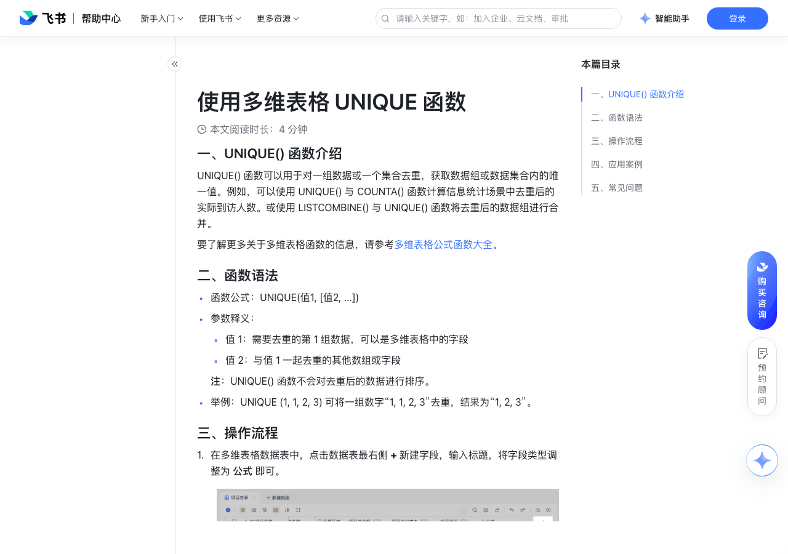

# 使用多维表格 UNIQUE 函数

> 来源：[飞书帮助中心](https://www.feishu.cn/hc/zh-CN/articles/094296730015)  
> 分类：多维表格 / 公式与函数 / 使用函数  
> 抓取时间：2026-09-22T01:23:55.148Z

## 界面截图

### 文档内配图

1. 配图：https://p1-hera.feishucdn.com/tos-cn-i-jbbdkfciu3/5b31f28755374088a34d15260e32b730~tplv-jbbdkfciu3-image:0:0.image
2. 配图：https://p1-hera.feishucdn.com/tos-cn-i-jbbdkfciu3/086744cd462c4e65bcb3f867122b3df5~tplv-jbbdkfciu3-image:0:0.image
3. 配图：https://p1-hera.feishucdn.com/tos-cn-i-jbbdkfciu3/fa97fefef4104910b530d06547b58a7a~tplv-jbbdkfciu3-image:0:0.image
4. 配图：https://p1-hera.feishucdn.com/tos-cn-i-jbbdkfciu3/2de4fea85ea3478482aab01edb399e68~tplv-jbbdkfciu3-image:0:0.image
5. 配图：https://p1-hera.feishucdn.com/tos-cn-i-jbbdkfciu3/26e313b7b5cd47209f4dd40226e12c30~tplv-jbbdkfciu3-image:0:0.image

## 功能定位

本页对应飞书帮助中心「多维表格 / 公式与函数 / 使用函数」下的「使用多维表格 UNIQUE 函数」。以下需求描述依据官方说明文档提炼，用于指导 DuoWei 对标实现。

## 功能目标

一、UNIQUE() 函数介绍

## 文档结构（官方章节）

- 一、UNIQUE() 函数介绍​
- 二、函数语法 ​
- 三、操作流程​
- 四、应用案例​
- 五、常见问题​

## 详细功能说明

一、UNIQUE() 函数介绍

二、函数语法

函数公式：UNIQUE(值1, [值2, ...])

参数释义：

值 1：需要去重的第 1 组数据，可以是多维表格中的字段

值 2：与值 1 一起去重的其他数组或字段

注：UNIQUE() 函数不会对去重后的数据进行排序。

举例：UNIQUE (1, 1, 2, 3) 可将一组数字“1, 1, 2, 3”去重，结果为“1, 2, 3”。

三、操作流程

在多维表格数据表中，点击数据表最右侧 + 新建字段，输入标题，将字段类型调整为 公式 即可。

在公式编辑器内输入 UNIQUE() 函数，选择需要执行操作的数据表或字段即可。

例如，如果你在录入货品清单的时候有重复录入的情况，现在需要一份无重复货品的货品明细，可以采用 UNIQUE([数据表].[货品列表]) 函数公式，如下图显示，返回值为去除重复后的货品明细。

四、应用案例

场景：在客户信息管理中，统计每天录入的客户信息数。“客户信息管理表”中汇总了销售成员通过表单录入的所有客户信息。需要在“每日信息录入数”数据表中根据公司名称统计每天录入了多少非重复的公司数量。

公式：UNIQUE([客户信息管理].FILTER(CurrentValue.[录入日期]=[日期]).[公司名称]).COUNTA()

说明：通过 FILTER() 函数查找并统计在“客户信息管理表”中每一天录入的公司名称。使用 UNIQUE() 函数对公司名称进行去重，然后通过 COUNTA() 函数统计数量。

五、常见问题

问：如何将 UNIQUE() 函数计算后返回的数据组拆分至多个多维表格字段中？

答：可以通过“文本拆分多列插件”将文本字段拆分成多个字段，有关插件的具体信息，请参考使用多维表格插件。

## 实现要点（对标 DuoWei）

1. **入口与信息架构**：在产品中明确该能力所属模块（公式与函数 / 使用函数），并保证用户可从对应导航触达。
2. **核心交互**：按上文「详细功能说明」还原主要操作路径；截图中出现的按钮、字段、面板命名尽量与飞书语义一致或可映射。
3. **数据与权限**：若文档涉及可见范围、可编辑范围、分享或高级权限，实现时需落到角色/成员模型，并保证 API/MCP 与 UI 权限一致。
4. **边界与上限**：若文档提到数量上限、格式限制、导入导出约束，需在实现与错误提示中体现。
5. **验收**：以本页截图场景为用例，完成「能打开 / 能配置 / 能保存 / 能被 Agent 读写（如适用）」四项检查。

## 原始摘录摘要

> 一、UNIQUE() 函数介绍 二、函数语法 函数公式：UNIQUE(值1, [值2, ...]) 参数释义： 值 1：需要去重的第 1 组数据，可以是多维表格中的字段 值 2：与值 1 一起去重的其他数组或字段 注：UNIQUE() 函数不会对去重后的数据进行排序。 举例：UNIQUE (1, 1, 2, 3) 可将一组数字“1, 1, 2, 3”去重，结果为“1, 2, 3”。 三、操作流程 在多维表格数据表中，点击数据表最右侧 + 新建字段，输入标题，将字段类型调整为 公式 即可。 在公式编辑器内输入 UNIQUE() 函数，选择需要执行操作的数据表或字段即可。 例如，如果你在录入货品清单的时候有重复录入的情况，现在需要一份无重复货品的货品明细，可以采用 UNIQUE([数据表].[货品列表]) 函数公式，如下图显示，返回值为去除重复后的货品明细。 四、应用案例 场景：在客户信息管理中，统计每天录入的客户信息数。“客户信息管理表”中汇总了销售成员通过表单录入的所有客户信息。需要在“每日信息录入数”数据表中根据公司名称统计每天录入了多少非重复的公司数量。 公式：UNIQUE([客户信息管理].FILTER(CurrentValue.[录入日期]=[日期]).[公司名称]).COUNTA() 说明：通过 FILTER() 函数查找并统计在“客户信息管理表”中每一天录入的公司名称。使用 UNIQUE() 函数对公司名称进行去重，然后通过 COUNTA() 函数统计数量。 五、常见问题 问：如何将 UNIQUE() 函数计算后返回的数据组拆分至多个多维表格字段中？ 答：可以通过“文本拆分多列插件”将文本字段拆分成多个字段，有关插件的具体信息，请参考使用多维表格插件。

## 元数据

- article_id: `7139782303126945794`
- category_id: `7082597162537730049`
- path: `/hc/zh-CN/articles/094296730015`
- extracted_text_length: 744
