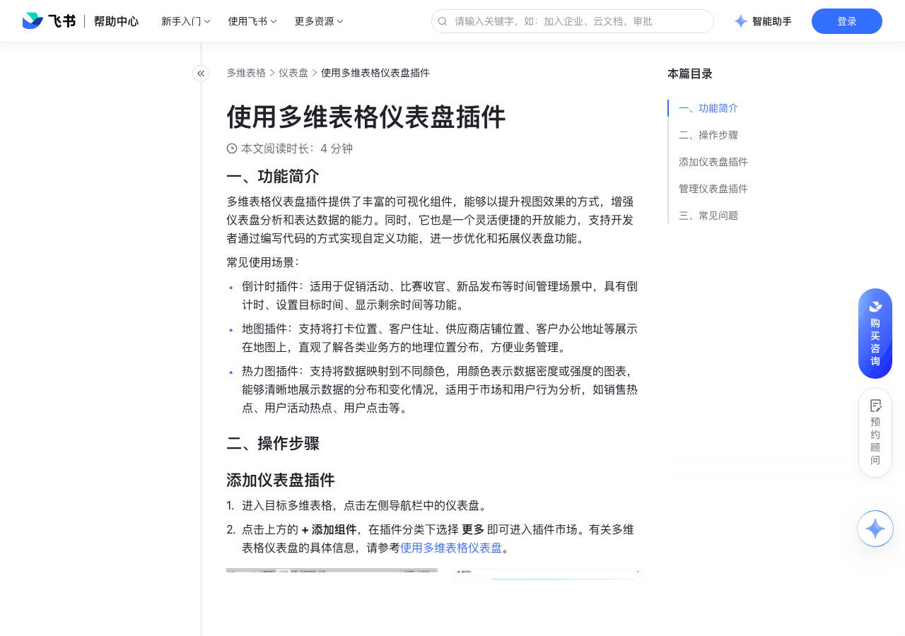

# 使用多维表格仪表盘插件

> 来源：[飞书帮助中心](https://www.feishu.cn/hc/zh-CN/articles/334679868124)  
> 分类：多维表格 / 仪表盘  
> 抓取时间：2026-09-22T01:25:17.283Z

## 界面截图

### 文档内配图

1. 配图：https://p1-hera.feishucdn.com/tos-cn-i-jbbdkfciu3/11d77dfa86dd4bc891b78c6d3dfd6e47~tplv-jbbdkfciu3-image:0:0.image
2. 配图：https://p1-hera.feishucdn.com/tos-cn-i-jbbdkfciu3/30ef2bc2c1e9401ab6effe7611f4ad4b~tplv-jbbdkfciu3-image:0:0.image
3. 配图：https://p1-hera.feishucdn.com/tos-cn-i-jbbdkfciu3/9cc7b9c6e2844c9fb4dd0a3affb527fa~tplv-jbbdkfciu3-image:0:0.image
4. 配图：https://p1-hera.feishucdn.com/tos-cn-i-jbbdkfciu3/f28c1195f2c0458e9915426c062d7269~tplv-jbbdkfciu3-image:0:0.image
5. 配图：https://p1-hera.feishucdn.com/tos-cn-i-jbbdkfciu3/4b7daf3d0d6c4bafa10217ce669d63f8~tplv-jbbdkfciu3-image:0:0.image

## 功能定位

本页对应飞书帮助中心「多维表格 / 仪表盘」下的「使用多维表格仪表盘插件」。以下需求描述依据官方说明文档提炼，用于指导 DuoWei 对标实现。

## 功能目标

一、功能简介

## 文档结构（官方章节）

- 一、功能简介​
- 二、操作步骤​
- 添加仪表盘插件​
- 管理仪表盘插件​
- 三、常见问题​

## 详细功能说明

一、功能简介

倒计时插件：适用于促销活动、比赛收官、新品发布等时间管理场景中，具有倒计时、设置目标时间、显示剩余时间等功能。

地图插件：支持将打卡位置、客户住址、供应商店铺位置、客户办公地址等展示在地图上，直观了解各类业务方的地理位置分布，方便业务管理。

热力图插件：支持将数据映射到不同颜色，用颜色表示数据密度或强度的图表，能够清晰地展示数据的分布和变化情况，适用于市场和用户行为分析，如销售热点、用户活动热点、用户点击等。

二、操作步骤

添加仪表盘插件

进入目标多维表格，点击左侧导航栏中的仪表盘。

点击上方的 + 添加组件，在插件分类下选择 更多 即可进入插件市场。有关多维表格仪表盘的具体信息，请参考使用多维表格仪表盘。

在插件市场中选择所需的插件，点击 使用 按钮，进入插件设置页面。按要求完成设置，点击 确定 即可。

管理仪表盘插件

三、常见问题

问：如何自己新增自定义插件？

答：打开多维表格仪表盘，点击界面上方 + 添加组件 图标，选择 插件 > 更多 进入插件市场。在右上角点击 添加自定义插件 图标，填写 服务地址，后点击 确定 即可。点击插件市场右上角的 开发资源 图标，即可查看开发指南、获取授权码或查看源代码。250px|700px|reset

问：多维表格仪表盘中是否支持重复添加同一个插件？

答：支持。

问：谁可以在多维表格中添加插件？

答：未开启高级权限时，拥有对数据表可编辑、可管理权限的用户可以添加插件。开启高级权限时，仅拥有对数据表可管理权限的用户可以添加插件。

问：是否支持调整仪表盘内插件的大小？

答：支持。有关多维表格仪表盘的具体信息，请参考使用多维表格仪表盘。

问：通过链接独立分享的仪表盘，是否能展示仪表盘插件？

答：暂不支持展示。

## 实现要点（对标 DuoWei）

1. **入口与信息架构**：在产品中明确该能力所属模块（仪表盘），并保证用户可从对应导航触达。
2. **核心交互**：按上文「详细功能说明」还原主要操作路径；截图中出现的按钮、字段、面板命名尽量与飞书语义一致或可映射。
3. **数据与权限**：若文档涉及可见范围、可编辑范围、分享或高级权限，实现时需落到角色/成员模型，并保证 API/MCP 与 UI 权限一致。
4. **边界与上限**：若文档提到数量上限、格式限制、导入导出约束，需在实现与错误提示中体现。
5. **验收**：以本页截图场景为用例，完成「能打开 / 能配置 / 能保存 / 能被 Agent 读写（如适用）」四项检查。

## 原始摘录摘要

> 一、功能简介 倒计时插件：适用于促销活动、比赛收官、新品发布等时间管理场景中，具有倒计时、设置目标时间、显示剩余时间等功能。 地图插件：支持将打卡位置、客户住址、供应商店铺位置、客户办公地址等展示在地图上，直观了解各类业务方的地理位置分布，方便业务管理。 热力图插件：支持将数据映射到不同颜色，用颜色表示数据密度或强度的图表，能够清晰地展示数据的分布和变化情况，适用于市场和用户行为分析，如销售热点、用户活动热点、用户点击等。 二、操作步骤 添加仪表盘插件 进入目标多维表格，点击左侧导航栏中的仪表盘。 点击上方的 + 添加组件，在插件分类下选择 更多 即可进入插件市场。有关多维表格仪表盘的具体信息，请参考使用多维表格仪表盘。 在插件市场中选择所需的插件，点击 使用 按钮，进入插件设置页面。按要求完成设置，点击 确定 即可。 管理仪表盘插件 三、常见问题 问：如何自己新增自定义插件？ 答：打开多维表格仪表盘，点击界面上方 + 添加组件 图标，选择 插件 > 更多 进入插件市场。在右上角点击 添加自定义插件 图标，填写 服务地址，后点击 确定 即可。点击插件市场右上角的 开发资源 图标，即可查看开发指南、获取授权码或查看源代码。250px|700px|reset 问：多维表格仪表盘中是否支持重复添加同一个插件？ 答：支持。 问：谁可以在多维表格中添加插件？ 答：未开启高级权限时，拥有对数据表可编辑、可管理权限的用户可以添加插件。开启高级权限时，仅拥有对数据表可管理权限的用户可以添加插件。 问：是否支持调整仪表盘内插件的大小？ 答：支持。有关多维表格仪表盘的具体信息，请参考使用多维表格仪表盘。 问：通过链接独立分享的仪表盘，是否能展示仪表盘插件？ 答：暂不支持展示。

## 元数据

- article_id: `7377234895925608450`
- category_id: `7165754521875005468`
- path: `/hc/zh-CN/articles/334679868124`
- extracted_text_length: 740
