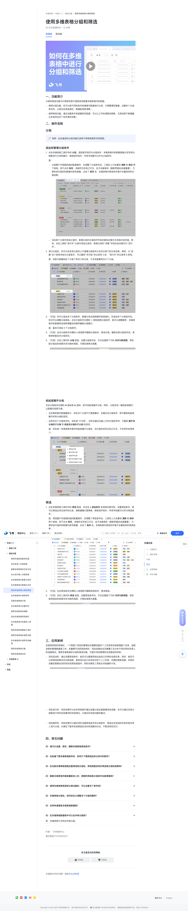

# 使用多维表格分组和筛选

> 来源：[飞书帮助中心](https://www.feishu.cn/hc/zh-CN/articles/360049067904)  
> 分类：多维表格 / 快速入门 / 基础设置  
> 抓取时间：2026-09-22T00:55:56.891Z

## 界面截图

### 文档内配图

1. 配图：https://p1-hera.feishucdn.com/tos-cn-i-jbbdkfciu3/202e446b7562477bbe379ce58df3a996~tplv-jbbdkfciu3-image:0:0.image
2. 配图：https://p1-hera.feishucdn.com/tos-cn-i-jbbdkfciu3/78f9de92356b49908099b968c409d17a~tplv-jbbdkfciu3-image:0:0.image
3. 配图：https://p1-hera.feishucdn.com/tos-cn-i-jbbdkfciu3/7b12ebb9f0e44ffaa677d6c7a24fd778~tplv-jbbdkfciu3-image:0:0.image
4. 配图：https://p1-hera.feishucdn.com/tos-cn-i-jbbdkfciu3/01ae391feaeb435fba79197784b3df15~tplv-jbbdkfciu3-image:0:0.image
5. 配图：https://p1-hera.feishucdn.com/tos-cn-i-jbbdkfciu3/1d063490e0d1453e835ab8b4b63309d3~tplv-jbbdkfciu3-image:0:0.image
6. 配图：https://p1-hera.feishucdn.com/tos-cn-i-jbbdkfciu3/5f1daa7b949f45ce83fef4b387dcd545~tplv-jbbdkfciu3-image:0:0.image
7. 配图：https://p1-hera.feishucdn.com/tos-cn-i-jbbdkfciu3/238cc2a9d1e34395a8036c665a5dfc39~tplv-jbbdkfciu3-image:0:0.image
8. 配图：https://p1-hera.feishucdn.com/tos-cn-i-jbbdkfciu3/d7deb2e144d4416caa37cb0ae709c909~tplv-jbbdkfciu3-image:0:0.image
9. 配图：https://p1-hera.feishucdn.com/tos-cn-i-jbbdkfciu3/c15fd1549b2746a8970202b24ead7073~tplv-jbbdkfciu3-image:0:0.image
10. 配图：https://p1-hera.feishucdn.com/tos-cn-i-jbbdkfciu3/6fccf99e67b0489793f36edd45819be0~tplv-jbbdkfciu3-image:0:0.image

## 功能定位

本页对应飞书帮助中心「多维表格 / 快速入门 / 基础设置」下的「使用多维表格分组和筛选」。以下需求描述依据官方说明文档提炼，用于指导 DuoWei 对标实现。

## 功能目标

播放 00:00 / 00:00 直播 00:00 进入全屏 1x 0.5x0.75x1x1.5x2x 点击按住可拖动视频

## 文档结构（官方章节）

- 一、功能简介​
- 二、操作流程​
- 分组​
- 添加和管理分组条件​
- 收起或展开分组​
- 筛选​
- 三、应用案例​
- 四、常见问题​

## 详细功能说明

播放 00:00 / 00:00 直播 00:00 进入全屏 1x 0.5x0.75x1x1.5x2x 点击按住可拖动视频

0.5x

0.75x

1.5x

一、功能简介

使用分组功能，你可以按不同的条件和维度对数据进行分类，方便整理和查看。设置多个分组条件时，分组也会逐层细化，数据脉络更清晰。

使用筛选功能，通过设置条件来查看特定数据，可以让工作处理更加聚焦，尤其适用于数据量过多或存在多个协作者的场景。

二、操作流程

添加和管理分组条件

点击多维表格工具栏中的 分组，选择某字段作为分组条件，多维表格中的数据就能以该字段为维度进行分类和展示。除按钮字段外，所有字段都可以作为分组条件。

分组属于对视图的临时配置操作，在调整了分组条件后，工具栏上方会看到 清除 和 保存 两个按钮。若不点击 保存，该操作仅你自己可见，且不会被保存（刷新界面后会被重置），方便你进行临时的数据归类和查看。点击了 保存 后，多维表格内其他协作者才会看到你的分组结果。

250px|700px|reset

当在某个分组中添加记录时，新增记录的分组条件字段会被自动填充为该组对应的值。例如，当在上例的“进行中”分组中添加记录时，新增记录的“进展”字段会自动填充为“进行中”。

进行分组后，你可以在各条记录的上方查看分组条件以及该分组下的记录总数。例如，以“进展”这个单选字段为分组条件，可以看到“未开始”的记录有 3 条，“进行中”的记录有 6 条等。

注：目前只能看到各个分组下有多少条记录，不支持查看有多少个分组。

（可选）你可以添加多个分组条件，数据分类会按照顺序逐层细化。在添加多个分组条件后，你还可以调整分组层级。点击分组条件左侧的 图标拖拽分组条件，就可以调整顺序，多维表格中的数据将会按照调整后的顺序重新分组展示。

注：最多可添加 3 个分组条件。

（可选）点击分组条件右侧的 × 按钮即可删除分组条件、取消分组。删除全部分组条件后，表格将恢复至未分组状态。

（可选）点击工具栏的 分组 按钮，设置分组条件后，可点击面板下方的 另存为新视图，将目前分组后的结果另存为新的视图，方便后续再次查看。

收起或展开分组

当多维表格内数据量较大、存在多个分组不方便查看时，右键点击分组条件，即可看到收起或展开所有分组的选项。

当存在多个分组条件时，会形成“子分组”。当你右键点击最上方的分组条件时，可看到 展开该分组的子分组 和 收起该分组的子分组 的选项。

注：你在某一多维表格中操作收起或展开分组后，该分组的状态仅自己可见，不会同步给其他人。

点击多维表格工具栏中的 筛选 按钮，并点击 + 添加条件 来选择任意字段、设置筛选条件，就可以筛选出符合条件的记录，使数据展示更聚焦。除按钮字段外，所有字段都可以作为筛选条件。

注：筛选属于对视图的临时配置操作，在调整了筛选条件后，工具栏上方会看到 清除 和 保存 两个按钮。若不点击 保存，该操作仅你自己可见，且不会被保存（刷新界面后会被重置），方便你进行临时的数据归类和查看。点击了 保存 后，多维表格内其他协作者才会看到你的筛选结果。

（可选）你可以添加多个筛选条件，并选择展示符合以下所有条件或任一条件的筛选结果。

（可选）点击筛选条件右侧的 × 按钮即可删除筛选条件、取消筛选。

（可选）点击工具栏的 筛选 按钮，设置筛选条件后，可点击面板下方的 另存为新视图，将目前筛选后的结果另存为新的视图，方便后续再次查看。

三、应用案例

项目启动时：通过设置筛选条件，组员可以精准筛选出由自己负责的全部任务。同时，组员可以将筛选结果另存为新视图，使其成为自己在项目中的个人工作表，并随时更新进展。所有的进展变更都会实时同步到其他视图中，同时也降低了其他无关数据的干扰。

项目进行时：项目经理可以在甘特视图中通过设置分组全面掌握项目进展，也可以通过多层分组跟进不同优先级事项的完成情况，以便及时发现问题并解决。

项目尾声时：项目经理可以通过同时设置筛选条件和分组条件，筛选出未完成的任务并按负责人进行分组，以便在了解未完成原因后及时找到解决办法，不耽误项目交付。

四、常见问题

问：谁可以设置、修改、删除多维表格筛选条件？

问：在批量下载多维表格附件时，如何只下载筛选后的记录中的附件？

问：在当前多维表格视图设置筛选或分组后，其他视图会同步筛选或分组的结果吗？

问：刷新多维表格页面或重新进入时，视图的筛选或分组条件会被清除吗？

若你未点击 保存，所有的筛选和分组操作均为临时操作，不会同步给其他协作者、也不会被保存。如果你此时刷新页面或关闭页面重新进入，那么你之前所做的筛选和分组动作会被清除。

如果你点击了 保存，那么再次进入页面时，会为你保留上次所做的配置。

问：使用多维表格筛选和分组功能时，可以设置多个条件吗？

问：多维表格分组后，如何自定义调整多个分组的顺序？

问：怎样快速搜索多维表格数据表？

答：要快速搜索多维表格的数据表，可以点击多维表格右上角的 查找 图标，或使用快捷键 Ctrl + F (Windows) / Command + F (Mac) 打开搜索栏，再输入关键词进行搜索。

问：在多维表格数据表中可以合并单元格吗？

桌面端移动端更多

00:00

进入全屏

0.5x0.75x1x1.5x2x

点击按住可拖动视频

一、功能简介分组和筛选功能可以帮助你更方便高效地查看多维表格内的数据。使用分组功能，你可以按不同的条件和维度对数据进行分类，方便整理和查看。设置多个分组条件时，分组也会逐层细化，数据脉络更清晰。使用筛选功能，通过设置条件来查看特定数据，可以让工作处理更加聚焦，尤其适用于数据量过多或存在多个协作者的场景。二、操作流程分组🔖说明：此处描述的分组功能仅适用于表格视图和甘特视图。添加和管理分组条件点击多维表格工具栏中的 分组，选择某字段作为分组条件，多维表格中的数据就能以该字段为维度进行分类和展示。除按钮字段外，所有字段都可以作为分组条件。注：分组属于对视图的临时配置操作，在调整了分组条件后，工具栏上方会看到 清除 和 保存 两个按钮。若不点击 保存，该操作仅你自己可见，且不会被保存（刷新界面后会被重置），方便你进行临时的数据归类和查看。点击了 保存 后，多维表格内其他协作者才会看到你的分组结果。250px|700px|reset当在某个分组中添加记录时，新增记录的分组条件字段会被自动填充为该组对应的值。例如，当在上例的“进行中”分组中添加记录时，新增记录的“进展”字段会自动填充为“进行中”。进行分组后，你可以在各条记录的上方查看分组条件以及该分组下的记录总数。例如，以“进展”这个单选字段为分组条件，可以看到“未开始”的记录有 3 条，“进行中”的记录有 6 条等。注：目前只能看到各个分组下有多少条记录，不支持查看有多少个分组。250px|700px|reset（可选）你可以添加多个分组条件，数据分类会按照顺序逐层细化。在添加多个分组条件后，你还可以调整分组层级。点击分组条件左侧的

图标拖拽分组条件，就可以调整顺序，多维表格中的数据将会按照调整后的顺序重新分组展示。注：最多可添加 3 个分组条件。（可选）点击分组条件右侧的 × 按钮即可删除分组条件、取消分组。删除全部分组条件后，表格将恢复至未分组状态。（可选）点击工具栏的 分组 按钮，设置分组条件后，可点击面板下方的 另存为新视图，将目前分组后的结果另存为新的视图，方便后续再次查看。250px|700px|reset收起或展开分组点击分组条件左侧的

图标，即可收起或展开分组。同时，分组支持一键收起或展开，让数据归类更方便。当多维表格内数据量较大、存在多个分组不方便查看时，右键点击分组条件，即可看到收起或展开所有分组的选项。当存在多个分组条件时，会形成“子分组”。当你右键点击最上方的分组条件时，可看到 展开该分组的子分组 和 收起该分组的子分组 的选项。注：你在某一多维表格中操作收起或展开分组后，该分组的状态仅自己可见，不会同步给其他人。250px|700px|reset筛选点击多维表格工具栏中的 筛选 按钮，并点击 + 添加条件 来选择任意字段、设置筛选条件，就可以筛选出符合条件的记录，使数据展示更聚焦。除按钮字段外，所有字段都可以作为筛选条件。注：筛选属于对视图的临时配置操作，在调整了筛选条件后，工具栏上方会看到 清除 和 保存 两个按钮。若不点击 保存，该操作仅你自己可见，且不会被保存（刷新界面后会被重置），方便你进行临时的数据归类和查看。点击了 保存 后，多维表格内其他协作者才会看到你的筛选结果。（可选）你可以添加多个筛选条件，并选择展示符合以下所有条件或任一条件的筛选结果。250px|700px|reset（可选）点击筛选条件右侧的 × 按钮即可删除筛选条件、取消筛选。（可选）点击工具栏的 筛选 按钮，设置筛选条件后，可点击面板下方的 另存为新视图，将目前筛选后的结果另存为新的视图，方便后续再次查看。250px|700px|reset三、应用案例在使用传统的表格时，一个跨部门项目的管理往往需要创建多个工作表来完成梳理部门任务、追踪进度和管理数据等工作。在重要节点即将到来时，项目经理往往还需要汇总分析不同任务和负责人的进展情况。使用多维表格的分组和筛选功能，可提升项目管理和任务跟进的效率。项目启动时：通过设置筛选条件，组员可以精准筛选出由自己负责的全部任务。同时，组员可以将筛选结果另存为新视图，使其成为自己在项目中的个人工作表，并随时更新进展。所有的进展变更都会实时同步到其他视图中，同时也降低了其他无关数据的干扰。250px|700px|reset项目进行时：项目经理可以在甘特视图中通过设置分组全面掌握项目进展，也可以通过多层分组跟进不同优先级事项的完成情况，以便及时发现问题并解决。 250px|700px|reset项目尾声时：项目经理可以通过同时设置筛选条件和分组条件，筛选出未完成的任务并按负责人进行分组，以便在了解未完成原因后及时找到解决办法，不耽误项目交付。250px|700px|reset四、常见问题问：谁可以设置、修改、删除多维表格筛选条件？答：未开启高级权限时，多维表格所有者、拥有可管理权限和拥有可编辑权限的用户都可以设置、修改或删除筛选条件。开启高级权限时，多维表格所有者和拥有可管理权限的用户可以设置、修改或删除筛选条件；拥有可编辑权限的用户仅可以对自己可编辑范围内的字段设置筛选条件。注：当视图被锁定时，所有人都不能进行筛选设置。问：在批量下载多维表格附件时，如何只下载筛选后的记录中的附件？答：你需要先点击 保存，保存筛选条件后，再右键点击附件字段并选择 批量下载附件。如果不点击 保存，批量下载的附件仍会是筛选前的全部附件，而不是筛选后的内容。250px|700px|reset问：在当前多维表格视图设置筛选或分组后，其他视图会同步筛选或分组的结果吗？答：不会。筛选和分组的结果均仅在当前视图中显示，不会在不同视图间同步。问：刷新多维表格页面或重新进入时，视图的筛选或分组条件会被清除吗？答：这取决于你是否点击了 保存。若你未点击 保存，所有的筛选和分组操作均为临时操作，不会同步给其他协作者、也不会被保存。如果你此时刷新页面或关闭页面重新进入，那么你之前所做的筛选和分组动作会被清除。如果你点击了 保存，那么再次进入页面时，会为你保留上次所做的配置。问：使用多维表格筛选和分组功能时，可以设置多个条件吗？答：可以。问：多维表格分组后，如何自定义调整多个分组的顺序？答：目前多维表格的分组暂不支持自定义调整分组顺序。如果所选分组的字段是单选或多选类型，那么分组顺序是根据字段中选项的顺序而定，你可以通过调整选项的顺序来自定义分组的顺序。问：怎样快速搜索多维表格数据表？答：要快速搜索多维表格的数据表，可以点击多维表格右上角的 查找 图标，或使用快捷键 Ctrl + F (Windows) / Command + F (Mac) 打开搜索栏，再输入关键词进行搜索。问：在多维表格数据表中可以合并单元格吗？答：多维表格不支持合并单元格。

## 实现要点（对标 DuoWei）

1. **入口与信息架构**：在产品中明确该能力所属模块（快速入门 / 基础设置），并保证用户可从对应导航触达。
2. **核心交互**：按上文「详细功能说明」还原主要操作路径；截图中出现的按钮、字段、面板命名尽量与飞书语义一致或可映射。
3. **数据与权限**：若文档涉及可见范围、可编辑范围、分享或高级权限，实现时需落到角色/成员模型，并保证 API/MCP 与 UI 权限一致。
4. **边界与上限**：若文档提到数量上限、格式限制、导入导出约束，需在实现与错误提示中体现。
5. **验收**：以本页截图场景为用例，完成「能打开 / 能配置 / 能保存 / 能被 Agent 读写（如适用）」四项检查。

## 原始摘录摘要

> 播放 00:00 / 00:00 直播 00:00 进入全屏 1x 0.5x0.75x1x1.5x2x 点击按住可拖动视频 0.5x 0.75x 1.5x 一、功能简介 使用分组功能，你可以按不同的条件和维度对数据进行分类，方便整理和查看。设置多个分组条件时，分组也会逐层细化，数据脉络更清晰。 使用筛选功能，通过设置条件来查看特定数据，可以让工作处理更加聚焦，尤其适用于数据量过多或存在多个协作者的场景。 二、操作流程 添加和管理分组条件 点击多维表格工具栏中的 分组，选择某字段作为分组条件，多维表格中的数据就能以该字段为维度进行分类和展示。除按钮字段外，所有字段都可以作为分组条件。 分组属于对视图的临时配置操作，在调整了分组条件后，工具栏上方会看到 清除 和 保存 两个按钮。若不点击 保存，该操作仅你自己可见，且不会被保存（刷新界面后会被重置），方便你进行临时的数据归类和查看。点击了 保存 后，多维表格内其他协作者才会看到你的分组结果。 250px|700px|reset 当在某个分组中添加记录时，新增记录的分组条件字段会被自动填充为该组对应的值。例如，当在上例的“进行中”分组中添加记录时，新增记录的“进展”字段会自动填充为“进行中”。 进行分组后，你可以在各条记录的上方查看分组条件以及该分组下的记录总数。例如，以“进展”这个单选字段为分组条件，可以看到“未开始”的记录有 3 条，“进行中”的记录有 6 条等。 注：目前只能看到各个分组下有多少条记录，不支持查看有多少个分组。 （可选）你可以添加多个分组条件，数据分类会按照顺序逐层细化。在添加多个分组条件后，你还可以调整分组层级。点击分组条件左侧的 图标拖拽分组条件，就可以调整顺序，多维表格中的数据将会按照调整后的顺序重新分组展示。 注：最多可添加 3 个分组条件。 （可选）点击分组条件右侧的 × 按钮即可删除分组条件、取消…

## 元数据

- article_id: `6933484149026127873`
- category_id: `7225072576895254530`
- path: `/hc/zh-CN/articles/360049067904`
- extracted_text_length: 3485
