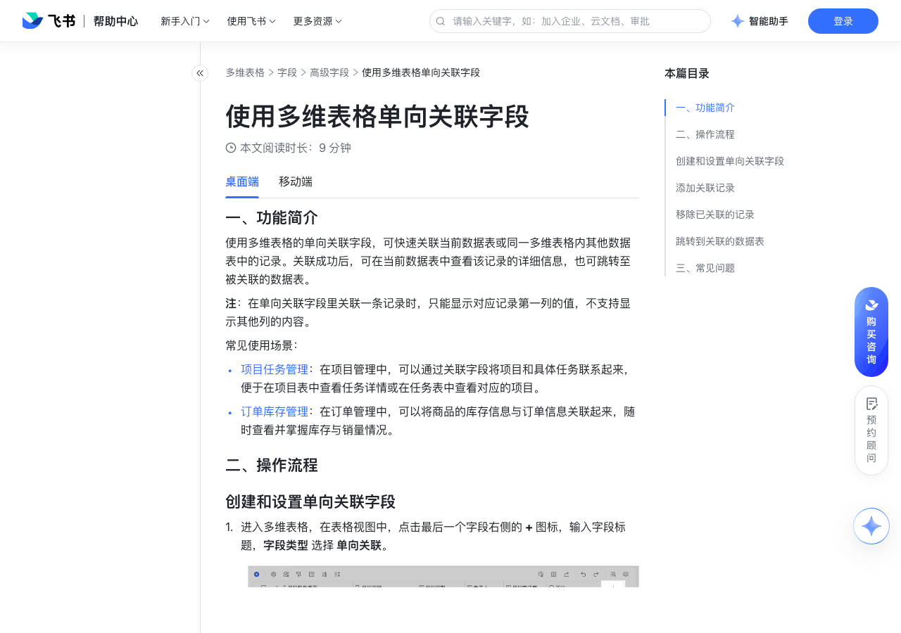

# 使用多维表格单向关联字段

> 来源：[飞书帮助中心](https://www.feishu.cn/hc/zh-CN/articles/361914682520)  
> 分类：多维表格 / 字段 / 高级字段  
> 抓取时间：2026-09-22T01:21:39.967Z

## 界面截图

### 文档内配图

1. 配图：https://p1-hera.feishucdn.com/tos-cn-i-jbbdkfciu3/3dd340144e194c1997f2a11f3ce507cd~tplv-jbbdkfciu3-image:0:0.image
2. 配图：https://p1-hera.feishucdn.com/tos-cn-i-jbbdkfciu3/a0d6bd5ad5ab47d8b3b4ce76426b7a1f~tplv-jbbdkfciu3-image:0:0.image
3. 配图：https://p1-hera.feishucdn.com/tos-cn-i-jbbdkfciu3/a29bba11f7704226847f04db7c89dbc9~tplv-jbbdkfciu3-image:0:0.image
4. 配图：https://p1-hera.feishucdn.com/tos-cn-i-jbbdkfciu3/5abbcc455c924331a15de25682697ca7~tplv-jbbdkfciu3-image:0:0.image
5. 配图：https://p1-hera.feishucdn.com/tos-cn-i-jbbdkfciu3/3a4d8b70ea8e414493cf45292e88d6ae~tplv-jbbdkfciu3-image:0:0.image
6. 配图：https://p1-hera.feishucdn.com/tos-cn-i-jbbdkfciu3/c8194f885d1344778a4194894df58804~tplv-jbbdkfciu3-image:0:0.image
7. 配图：https://p1-hera.feishucdn.com/tos-cn-i-jbbdkfciu3/980fdc01a7884d24a407e20f6cea9155~tplv-jbbdkfciu3-image:0:0.image
8. 配图：https://p1-hera.feishucdn.com/tos-cn-i-jbbdkfciu3/504fa40a2acf40f1a1d72b25092ec7c8~tplv-jbbdkfciu3-image:0:0.image

## 功能定位

本页对应飞书帮助中心「多维表格 / 字段 / 高级字段」下的「使用多维表格单向关联字段」。以下需求描述依据官方说明文档提炼，用于指导 DuoWei 对标实现。

## 功能目标

一、功能简介

## 文档结构（官方章节）

- 一、功能简介​
- 二、操作流程​
- 创建和设置单向关联字段 ​
- 添加关联记录​
- 关联已有记录 ​
- 新建记录并关联​
- 移除已关联的记录​
- 跳转到关联的数据表 ​
- 三、常见问题​

## 详细功能说明

一、功能简介

项目任务管理：在项目管理中，可以通过关联字段将项目和具体任务联系起来，便于在项目表中查看任务详情或在任务表中查看对应的项目。

订单库存管理：在订单管理中，可以将商品的库存信息与订单信息关联起来，随时查看并掌握库存与销量情况。

二、操作流程

创建和设置单向关联字段

进入多维表格，在表格视图中，点击最后一个字段右侧的 + 图标，输入字段标题，字段类型 选择 单向关联。

在字段的配置面板中选择要关联的数据表。只能选择同一个多维表格内的数据表。

设置 可关联的数据范围，可选择 所有记录 或 指定记录。若选择 指定记录，你可添加筛选条件对 关联的数据表 中的记录进行筛选，让协作者在关联时只能看到符合条件的记录。

（可选）勾选 允许添加多个记录，勾选后可在一个单元格中关联多行数据。

设置完成后，点击 确定。

添加关联记录

关联已有记录

进入多维表格，双击单向关联字段的单元格，弹窗中会展示被关联数据表中符合上方设置的 可关联的数据范围 的记录。

找到并勾选要关联的记录，点击 确认。添加完成后，该单元格内将显示所关联记录的索引列内容（首列内容）。 在记录列表上方的搜索栏中输入关键词可以快速查找记录。

新建记录并关联

进入多维表格，双击单向关联字段的单元格，在弹窗中点击左下方的 + 添加记录 按钮。

在打开的空白记录卡片中填写信息，填写完成后点击卡片右上角的 图标。弹窗中的记录表中会显示新增的记录并默认勾选该记录。

确认无误后点击右下角 确认 按钮。

移除已关联的记录

跳转到关联的数据表

进入多维表格，双击单向关联字段的字段名称，在字段设置的面板中，点击 关联的数据表 处数据表名称右侧的 跳转到关联数据表 图标。

进入多维表格，双击单向关联字段的单元格，添加关联记录时，搜索框上方会显示被关联数据表的名称。点击即可跳转。

进入多维表格，查看关联的记录详情时，关联记录卡片的顶部标题行下会显示关联的数据表名称，点击数据表名称即可跳转。

三、常见问题

问：我可以在一个单元格里添加多个关联记录吗？

答：可以，在字段配置的面板中勾选 允许添加多个记录 即可。

## 实现要点（对标 DuoWei）

1. **入口与信息架构**：在产品中明确该能力所属模块（字段 / 高级字段），并保证用户可从对应导航触达。
2. **核心交互**：按上文「详细功能说明」还原主要操作路径；截图中出现的按钮、字段、面板命名尽量与飞书语义一致或可映射。
3. **数据与权限**：若文档涉及可见范围、可编辑范围、分享或高级权限，实现时需落到角色/成员模型，并保证 API/MCP 与 UI 权限一致。
4. **边界与上限**：若文档提到数量上限、格式限制、导入导出约束，需在实现与错误提示中体现。
5. **验收**：以本页截图场景为用例，完成「能打开 / 能配置 / 能保存 / 能被 Agent 读写（如适用）」四项检查。

## 原始摘录摘要

> 一、功能简介 项目任务管理：在项目管理中，可以通过关联字段将项目和具体任务联系起来，便于在项目表中查看任务详情或在任务表中查看对应的项目。 订单库存管理：在订单管理中，可以将商品的库存信息与订单信息关联起来，随时查看并掌握库存与销量情况。 二、操作流程 创建和设置单向关联字段 进入多维表格，在表格视图中，点击最后一个字段右侧的 + 图标，输入字段标题，字段类型 选择 单向关联。 在字段的配置面板中选择要关联的数据表。只能选择同一个多维表格内的数据表。 设置 可关联的数据范围，可选择 所有记录 或 指定记录。若选择 指定记录，你可添加筛选条件对 关联的数据表 中的记录进行筛选，让协作者在关联时只能看到符合条件的记录。 （可选）勾选 允许添加多个记录，勾选后可在一个单元格中关联多行数据。 设置完成后，点击 确定。 添加关联记录 关联已有记录 进入多维表格，双击单向关联字段的单元格，弹窗中会展示被关联数据表中符合上方设置的 可关联的数据范围 的记录。 找到并勾选要关联的记录，点击 确认。添加完成后，该单元格内将显示所关联记录的索引列内容（首列内容）。 在记录列表上方的搜索栏中输入关键词可以快速查找记录。 新建记录并关联 进入多维表格，双击单向关联字段的单元格，在弹窗中点击左下方的 + 添加记录 按钮。 在打开的空白记录卡片中填写信息，填写完成后点击卡片右上角的 图标。弹窗中的记录表中会显示新增的记录并默认勾选该记录。 确认无误后点击右下角 确认 按钮。 移除已关联的记录 跳转到关联的数据表 进入多维表格，双击单向关联字段的字段名称，在字段设置的面板中，点击 关联的数据表 处数据表名称右侧的 跳转到关联数据表 图标。 进入多维表格，双击单向关联字段的单元格，添加关联记录时，搜索框上方会显示被关联数据表的名称。点击即可跳转。 进入多维表格，查看关联的记录详情时，关联记录卡片的顶部标题…

## 元数据

- article_id: `6966919037095821340`
- category_id: `7187723536738435074`
- path: `/hc/zh-CN/articles/361914682520`
- extracted_text_length: 886
