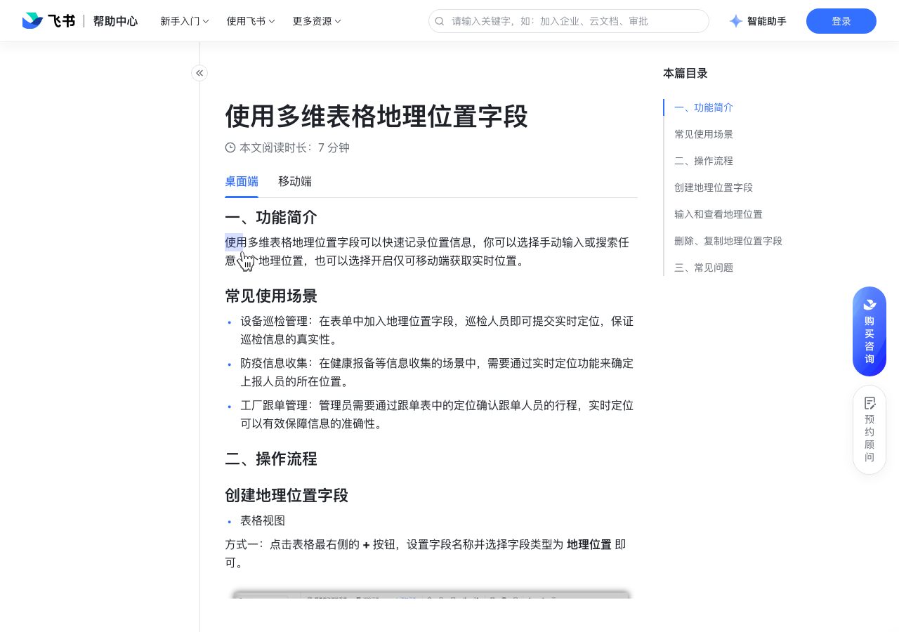

# 使用多维表格地理位置字段

> 来源：[飞书帮助中心](https://www.feishu.cn/hc/zh-CN/articles/603868481939)  
> 分类：多维表格 / 字段 / 业务字段  
> 抓取时间：2026-09-22T01:21:40.388Z

## 界面截图

### 文档内配图

1. 配图：https://p1-hera.feishucdn.com/tos-cn-i-jbbdkfciu3/8e45316a740f4b31b7dc6445e66e494c~tplv-jbbdkfciu3-image:0:0.image
2. 配图：https://p1-hera.feishucdn.com/tos-cn-i-jbbdkfciu3/cd07216143a746239032250d07f72c94~tplv-jbbdkfciu3-image:0:0.image
3. 配图：https://p1-hera.feishucdn.com/tos-cn-i-jbbdkfciu3/71da6a5641bf4093a069dec88d56e682~tplv-jbbdkfciu3-image:0:0.image
4. 配图：https://p1-hera.feishucdn.com/tos-cn-i-jbbdkfciu3/5faf8ac4cb7b4907ac61be58882be266~tplv-jbbdkfciu3-image:0:0.image
5. 配图：https://p1-hera.feishucdn.com/tos-cn-i-jbbdkfciu3/1427ed901e1845f3ad83eeabffc2afa8~tplv-jbbdkfciu3-image:0:0.image
6. 配图：https://p1-hera.feishucdn.com/tos-cn-i-jbbdkfciu3/71ed0aa2170e426aa2165f03e3023af3~tplv-jbbdkfciu3-image:0:0.image
7. image.png：https://p1-hera.feishucdn.com/tos-cn-i-jbbdkfciu3/cd230b17a5ec4516bed4d98718102493~tplv-jbbdkfciu3-image:0:0.image
8. 配图：https://p1-hera.feishucdn.com/tos-cn-i-jbbdkfciu3/cf725a8b3ae749d3879d1fdf7f894357~tplv-jbbdkfciu3-image:0:0.image

## 功能定位

本页对应飞书帮助中心「多维表格 / 字段 / 业务字段」下的「使用多维表格地理位置字段」。以下需求描述依据官方说明文档提炼，用于指导 DuoWei 对标实现。

## 功能目标

一、功能简介

## 文档结构（官方章节）

- 一、功能简介​
- 常见使用场景​
- 二、操作流程​
- 创建地理位置字段​
- 输入和查看地理位置​
- 删除、复制地理位置字段​
- 三、常见问题​

## 详细功能说明

一、功能简介

常见使用场景

设备巡检管理：在表单中加入地理位置字段，巡检人员即可提交实时定位，保证巡检信息的真实性。

防疫信息收集：在健康报备等信息收集的场景中，需要通过实时定位功能来确定上报人员的所在位置。

工厂跟单管理：管理员需要通过跟单表中的定位确认跟单人员的行程，实时定位可以有效保障信息的准确性。

二、操作流程

创建地理位置字段

表格视图

表单视图

看板、画册 & 甘特视图

输入和查看地理位置

从地图中选择任意位置：

新建一个地理位置字段，在输入方式处选择 可输入任意地理位置，点击 确定。

注：此处不支持选择境外或海上地理位置。

双击需要输入地理位置信息的单元格，从地图中选择地理位置，或者输入关键词搜索要输入的位置。

点击地理位置的文本，即可在地图中查看所在位置。

从移动端获取实时定位

新建一个地理位置字段，在输入方式处选择 仅允许移动端实时定位，点击 确定。

打开手机，展开记录卡片找到地理位置字段，点击 获取当前位置 即可。

删除、复制地理位置字段

三、常见问题

问：同一个单元格可以导入多个地理位置吗？

问：切换地理位置的输入方式后，是否会影响我已经输入的信息？

答：不能。

答：不会。

## 实现要点（对标 DuoWei）

1. **入口与信息架构**：在产品中明确该能力所属模块（字段 / 业务字段），并保证用户可从对应导航触达。
2. **核心交互**：按上文「详细功能说明」还原主要操作路径；截图中出现的按钮、字段、面板命名尽量与飞书语义一致或可映射。
3. **数据与权限**：若文档涉及可见范围、可编辑范围、分享或高级权限，实现时需落到角色/成员模型，并保证 API/MCP 与 UI 权限一致。
4. **边界与上限**：若文档提到数量上限、格式限制、导入导出约束，需在实现与错误提示中体现。
5. **验收**：以本页截图场景为用例，完成「能打开 / 能配置 / 能保存 / 能被 Agent 读写（如适用）」四项检查。

## 原始摘录摘要

> 一、功能简介 常见使用场景 设备巡检管理：在表单中加入地理位置字段，巡检人员即可提交实时定位，保证巡检信息的真实性。 防疫信息收集：在健康报备等信息收集的场景中，需要通过实时定位功能来确定上报人员的所在位置。 工厂跟单管理：管理员需要通过跟单表中的定位确认跟单人员的行程，实时定位可以有效保障信息的准确性。 二、操作流程 创建地理位置字段 表格视图 表单视图 看板、画册 & 甘特视图 输入和查看地理位置 从地图中选择任意位置： 新建一个地理位置字段，在输入方式处选择 可输入任意地理位置，点击 确定。 注：此处不支持选择境外或海上地理位置。 双击需要输入地理位置信息的单元格，从地图中选择地理位置，或者输入关键词搜索要输入的位置。 点击地理位置的文本，即可在地图中查看所在位置。 从移动端获取实时定位 新建一个地理位置字段，在输入方式处选择 仅允许移动端实时定位，点击 确定。 打开手机，展开记录卡片找到地理位置字段，点击 获取当前位置 即可。 删除、复制地理位置字段 三、常见问题 问：同一个单元格可以导入多个地理位置吗？ 问：切换地理位置的输入方式后，是否会影响我已经输入的信息？ 答：不能。 答：不会。

## 元数据

- article_id: `7135007051901812737`
- category_id: `7187723341653000220`
- path: `/hc/zh-CN/articles/603868481939`
- extracted_text_length: 505
