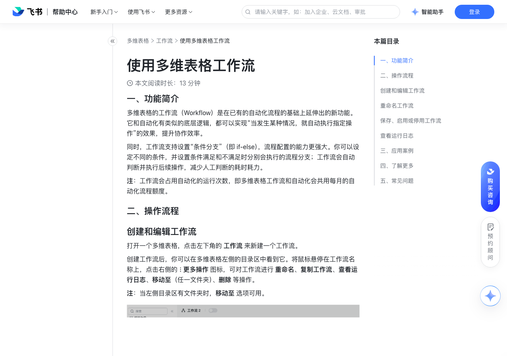

# 使用多维表格工作流

> 来源：[飞书帮助中心](https://www.feishu.cn/hc/zh-CN/articles/170735237222)  
> 分类：多维表格 / 工作流  
> 抓取时间：2026-09-22T01:24:05.513Z

## 界面截图

### 文档内配图

1. 配图：https://p1-hera.feishucdn.com/tos-cn-i-jbbdkfciu3/6f3a8f44cecf48bc915366db872e4995~tplv-jbbdkfciu3-image:0:0.image
2. 配图：https://p1-hera.feishucdn.com/tos-cn-i-jbbdkfciu3/0ee24a3a451a4667913a7fd116a47d21~tplv-jbbdkfciu3-image:0:0.image
3. 配图：https://p1-hera.feishucdn.com/tos-cn-i-jbbdkfciu3/4f5dd2bf9f674e508397cadcda4ed275~tplv-jbbdkfciu3-image:0:0.image
4. 配图：https://p1-hera.feishucdn.com/tos-cn-i-jbbdkfciu3/2d1b02fdbdc241e8ae7a101520c6cf1e~tplv-jbbdkfciu3-image:0:0.image
5. 配图：https://p1-hera.feishucdn.com/tos-cn-i-jbbdkfciu3/a212c5c64fd641998f1fc032d02ac8a9~tplv-jbbdkfciu3-image:0:0.image
6. 配图：https://p1-hera.feishucdn.com/tos-cn-i-jbbdkfciu3/cef85d79214f4cfe9e63c49b4bc1da41~tplv-jbbdkfciu3-image:0:0.image
7. 配图：https://p1-hera.feishucdn.com/tos-cn-i-jbbdkfciu3/2faf588f0db1484486df5daa46d86f02~tplv-jbbdkfciu3-image:0:0.image
8. 配图：https://p1-hera.feishucdn.com/tos-cn-i-jbbdkfciu3/e13327d0ab734bc6b747703eded412ff~tplv-jbbdkfciu3-image:0:0.image
9. 配图：https://p1-hera.feishucdn.com/tos-cn-i-jbbdkfciu3/7fc81e1d75fb496598e7e216507350fa~tplv-jbbdkfciu3-image:0:0.image
10. 配图：https://p1-hera.feishucdn.com/tos-cn-i-jbbdkfciu3/778fb2a68ae6401b92e496bb1890b816~tplv-jbbdkfciu3-image:0:0.image
11. 配图：https://p1-hera.feishucdn.com/tos-cn-i-jbbdkfciu3/549f1df0be864d93a64e4eac69bb9fb8~tplv-jbbdkfciu3-image:0:0.image
12. 配图：https://p1-hera.feishucdn.com/tos-cn-i-jbbdkfciu3/a8836e84904547c283c8f3fa4566a572~tplv-jbbdkfciu3-image:0:0.image
13. 配图：https://p1-hera.feishucdn.com/tos-cn-i-jbbdkfciu3/89b29cd5ae6f446faaeadcb657a56ea7~tplv-jbbdkfciu3-image:0:0.image
14. 配图：https://p1-hera.feishucdn.com/tos-cn-i-jbbdkfciu3/308bb1917fa94afc8c9ffa9b9e9ffca1~tplv-jbbdkfciu3-image:0:0.image
15. 配图：https://p1-hera.feishucdn.com/tos-cn-i-jbbdkfciu3/607e0edab8da4734b8a967935772c2c8~tplv-jbbdkfciu3-image:0:0.image
16. 配图：https://p1-hera.feishucdn.com/tos-cn-i-jbbdkfciu3/580a9b9c6799445b891b8a1f24837e43~tplv-jbbdkfciu3-image:0:0.image
17. 配图：https://p1-hera.feishucdn.com/tos-cn-i-jbbdkfciu3/1c7a73589291420594d969d6d5ca42d2~tplv-jbbdkfciu3-image:0:0.image

## 功能定位

本页对应飞书帮助中心「多维表格 / 工作流」下的「使用多维表格工作流」。以下需求描述依据官方说明文档提炼，用于指导 DuoWei 对标实现。

## 功能目标

一、功能简介

## 文档结构（官方章节）

- 一、功能简介​
- 二、操作流程​
- 创建和编辑工作流​
- 选择触发条件​
- 选择执行操作​
- 创建或插入节点​
- 界面缩放和拖拽​
- 拖拽节点更改顺序​
- 重命名工作流​
- 保存、启用或停用工作流​
- 查看运行日志​
- 三、应用案例​
- 自动归档已完成任务相关记录​
- 四、了解更多​
- 五、常见问题​

## 详细功能说明

一、功能简介

二、操作流程

创建和编辑工作流

选择触发条件

将鼠标悬停在触发条件的名称上，点击 重命名 按钮，可对当前的节点名称进行自定义命名，方便辨识和管理。

点击右侧的 更换触发器类型 图标，可快捷切换。

点击最右侧的 × 图标，可关闭当前设置界面。

注：你所做的设置都会自动保存，点击关闭后不会清空已进行的配置。

你可以对触发条件的节点进行 重命名，方便进行区分和管理。

也可以点击 更换节点类型，便捷地切换触发条件。

选择执行操作

不支持“AI 更新记录”。

不支持调用自动化插件。

将鼠标悬停在执行操作的名称上，点击 重命名 按钮，可对当前的节点名称进行自定义命名，方便辨识和管理。

点击右侧的 更换操作类型 图标，可快捷切换执行操作。

可以对执行操作的节点进行 重命名，方便进行区分和管理。

可以点击 更换节点类型，便捷地切换执行操作。

注：“条件判断”不支持更换节点类型。

点击 创建副本，会在当前节点的下方插入一个完全相同的节点。

注：“条件判断”不支持创建副本。

点击 删除，可删除当前节点。节点删除后无法恢复。

创建或插入节点

界面缩放和拖拽

界面拖拽：点击界面右下角的 小手 图标，你的光标也会变成一个小手的形状，此时将鼠标悬停在画布的空白区域，按住鼠标左键即可进行界面拖拽。

界面缩放：你可以点击界面右下角的 放大 和 缩小 的图标来对页面进行缩放。除此之外，还可以通过快捷键（Windows: Ctrl + 加号 和 Ctrl + 减号，或 Ctrl + 鼠标滚轮；Mac：Command + 加号 和 Command + 减号，或 Command + 鼠标滚轮）来进行缩放。如有电脑触控板也可以使用双指缩放。

界面自适应：点击最右侧的 自适应屏幕 图标，可根据当前界面大小一键调整位置，方便查看全部节点。

拖拽节点更改顺序

“触发条件”节点不支持拖拽。

当你移动一个 条件判断 节点时，其下方 满足 和 不满足 两条分支下的所有节点都会跟随移动；如果移动的目标位置后面还有其他节点，那么后面的节点会自动被移动到“满足”分支下。

重命名工作流

保存、启用或停用工作流

在工作流未启用时：

你设置的节点配置都会自动保存，但不会自动被启用。

首次配置好工作流后，你可以点击工作流名称右侧的开关，来保存并开启工作流；也可以直接点击画布右上角的 保存并启用 按钮，二者的效果相同。

若你想要停用工作流，点击关闭工作流名称右侧的开关，即可停用工作流。

在工作流已启用时：

如果对已启用的工作流进行了重新编辑，必须点击右上角的 保存并启用，新配置才会生效。

如果你没有点击 保存并启用 就离开了当前工作流的页面（例如切换到数据表、仪表盘或其他工作流），那么所做的编辑将不会被保存。

查看运行日志

三、应用案例

自动归档已完成任务相关记录

创建两张数据表：分别存放进行中的任务（下称 A 表）和已完成的任务（下称 B 表）。两表中需要同步的字段应使用相同或兼容的字段类型（如文本字段“任务名称”、人员字段“负责人”、日期字段“截止日期”、单选字段“任务状态”、附件字段“资料”等）。在 A 表中新增一个复选框字段“已归档”，默认不勾选。

搭建工作流：

选择触发条件 新增/修改的记录满足条件时：为当 A 表中任务状态变为“已完成”且已归档字段未勾选时，触发工作流。

添加 新增记录 操作：数据表选择 B 表，字段值直接引用触发条件的记录中对应的值。

添加 修改记录 操作：数据表选择 A 表，将“已归档”字段设置为勾选状态。

注：你可以通过多维表格归档表功能，自动将 A 表中已勾选“已归档”的记录归档。

保存并启用流程。

四、了解更多

五、常见问题

问：对工作流所做的编辑是否会自动保存？

答：当工作流未启用时，你设置的节点配置都会自动保存，但不会自动被启用。即使你点击关闭了某个节点的配置界面，或是切换到其他页面（如数据表、仪表盘、其他工作流等），编辑动作也都会被保存，不会丢失。当工作流已启用时：在当前的工作流界面内，进行的编辑会自动保存，但不会被自动启用。你必须点击右上角的 保存并启用，新配置才会生效。如果你没有点击 保存并启用 就离开了当前工作流的页面（例如切换到数据表、仪表盘或其他工作流），并在弹窗中确认放弃修改，那么所做的编辑将不会被保存。

## 实现要点（对标 DuoWei）

1. **入口与信息架构**：在产品中明确该能力所属模块（工作流），并保证用户可从对应导航触达。
2. **核心交互**：按上文「详细功能说明」还原主要操作路径；截图中出现的按钮、字段、面板命名尽量与飞书语义一致或可映射。
3. **数据与权限**：若文档涉及可见范围、可编辑范围、分享或高级权限，实现时需落到角色/成员模型，并保证 API/MCP 与 UI 权限一致。
4. **边界与上限**：若文档提到数量上限、格式限制、导入导出约束，需在实现与错误提示中体现。
5. **验收**：以本页截图场景为用例，完成「能打开 / 能配置 / 能保存 / 能被 Agent 读写（如适用）」四项检查。

## 原始摘录摘要

> 一、功能简介 二、操作流程 创建和编辑工作流 选择触发条件 将鼠标悬停在触发条件的名称上，点击 重命名 按钮，可对当前的节点名称进行自定义命名，方便辨识和管理。 点击右侧的 更换触发器类型 图标，可快捷切换。 点击最右侧的 × 图标，可关闭当前设置界面。 注：你所做的设置都会自动保存，点击关闭后不会清空已进行的配置。 你可以对触发条件的节点进行 重命名，方便进行区分和管理。 也可以点击 更换节点类型，便捷地切换触发条件。 选择执行操作 不支持“AI 更新记录”。 不支持调用自动化插件。 将鼠标悬停在执行操作的名称上，点击 重命名 按钮，可对当前的节点名称进行自定义命名，方便辨识和管理。 点击右侧的 更换操作类型 图标，可快捷切换执行操作。 可以对执行操作的节点进行 重命名，方便进行区分和管理。 可以点击 更换节点类型，便捷地切换执行操作。 注：“条件判断”不支持更换节点类型。 点击 创建副本，会在当前节点的下方插入一个完全相同的节点。 注：“条件判断”不支持创建副本。 点击 删除，可删除当前节点。节点删除后无法恢复。 创建或插入节点 界面缩放和拖拽 界面拖拽：点击界面右下角的 小手 图标，你的光标也会变成一个小手的形状，此时将鼠标悬停在画布的空白区域，按住鼠标左键即可进行界面拖拽。 界面缩放：你可以点击界面右下角的 放大 和 缩小 的图标来对页面进行缩放。除此之外，还可以通过快捷键（Windows: Ctrl + 加号 和 Ctrl + 减号，或 Ctrl + 鼠标滚轮；Mac：Command + 加号 和 Command + 减号，或 Command + 鼠标滚轮）来进行缩放。如有电脑触控板也可以使用双指缩放。 界面自适应：点击最右侧的 自适应屏幕 图标，可根据当前界面大小一键调整位置，方便查看全部节点。 拖拽节点更改顺序 “触发条件”节点不支持拖拽。 当你移动一个 条件…

## 元数据

- article_id: `7408825864090550275`
- category_id: `7415964452380049412`
- path: `/hc/zh-CN/articles/170735237222`
- extracted_text_length: 1785
