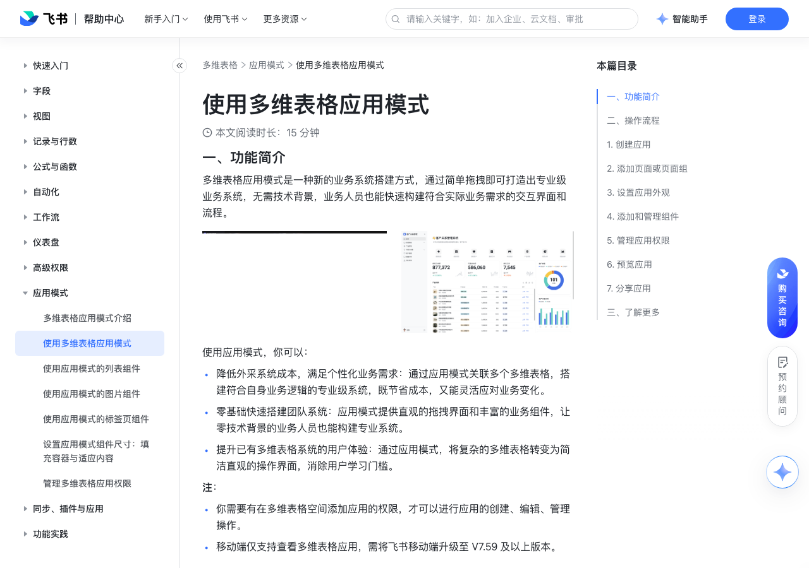

# 使用多维表格应用模式

> 来源：[飞书帮助中心](https://www.feishu.cn/hc/zh-CN/articles/474779587401)  
> 分类：多维表格 / 应用模式  
> 抓取时间：2026-09-22T01:26:32.504Z

## 界面截图

### 文档内配图

1. 配图：https://p1-hera.feishucdn.com/tos-cn-i-jbbdkfciu3/2f4db892bcf14018a6df2ddbe0ac6f62~tplv-jbbdkfciu3-image:0:0.image
2. 配图：https://p1-hera.feishucdn.com/tos-cn-i-jbbdkfciu3/f2ef48252de146ad806ffaac25ccd8a4~tplv-jbbdkfciu3-image:0:0.image
3. 配图：https://p1-hera.feishucdn.com/tos-cn-i-jbbdkfciu3/1e657695298d4a138c0e3f15836fc6b2~tplv-jbbdkfciu3-image:0:0.image
4. 配图：https://p1-hera.feishucdn.com/tos-cn-i-jbbdkfciu3/e6e3528fd7b449ed81bee15d8350af0d~tplv-jbbdkfciu3-image:0:0.image
5. 配图：https://p1-hera.feishucdn.com/tos-cn-i-jbbdkfciu3/1a8a83f99347411e9eb560b64a71cb37~tplv-jbbdkfciu3-image:0:0.image
6. 配图：https://p1-hera.feishucdn.com/tos-cn-i-jbbdkfciu3/8f32bf6c70b74eb7b6babb2be3c4e1f6~tplv-jbbdkfciu3-image:0:0.image
7. 配图：https://p1-hera.feishucdn.com/tos-cn-i-jbbdkfciu3/0065218118ce47a6941d60efeb7dda9c~tplv-jbbdkfciu3-image:0:0.image
8. 配图：https://p1-hera.feishucdn.com/tos-cn-i-jbbdkfciu3/02887d9ddbf242448925ae9099a756b6~tplv-jbbdkfciu3-image:0:0.image
9. 配图：https://p1-hera.feishucdn.com/tos-cn-i-jbbdkfciu3/3fbc3e038fd64be4b7c45093cf5edf26~tplv-jbbdkfciu3-image:0:0.image
10. 配图：https://p1-hera.feishucdn.com/tos-cn-i-jbbdkfciu3/cea65d5a1a1d4a94a7a0b9d34ec7e187~tplv-jbbdkfciu3-image:0:0.image
11. 配图：https://p1-hera.feishucdn.com/tos-cn-i-jbbdkfciu3/b2235486f10b43aab941541cdb75b5d2~tplv-jbbdkfciu3-image:0:0.image
12. 配图：https://p1-hera.feishucdn.com/tos-cn-i-jbbdkfciu3/7c3eb0b4bebd46638927d8891db7906f~tplv-jbbdkfciu3-image:0:0.image
13. 配图：https://p1-hera.feishucdn.com/tos-cn-i-jbbdkfciu3/056ce7c6d9a845a5b9e42f84e2fa466d~tplv-jbbdkfciu3-image:0:0.image
14. 配图：https://p1-hera.feishucdn.com/tos-cn-i-jbbdkfciu3/4bda97f7d88740a584c88eab9babe526~tplv-jbbdkfciu3-image:0:0.image
15. 配图：https://p1-hera.feishucdn.com/tos-cn-i-jbbdkfciu3/b578faf760d447619328d4ab45ac69ed~tplv-jbbdkfciu3-image:0:0.image

## 功能定位

本页对应飞书帮助中心「多维表格 / 应用模式」下的「使用多维表格应用模式」。以下需求描述依据官方说明文档提炼，用于指导 DuoWei 对标实现。

## 功能目标

一、功能简介

## 文档结构（官方章节）

- 一、功能简介​
- 二、操作流程​
- 创建应用​
- 创建无数据的应用​
- 基于已有多维表格创建带数据的应用​
- 添加页面或页面组​
- 设置应用外观​
- 添加和管理组件​
- 新增组件​
- 调整组件在页面上的布局​
- 支持的组件类型​
- 管理应用权限​
- 预览应用​
- 分享应用​
- 三、了解更多​

## 详细功能说明

一、功能简介

降低外采系统成本，满足个性化业务需求：通过应用模式关联多个多维表格，搭建符合自身业务逻辑的专业级系统，既节省成本，又能灵活应对业务变化。

零基础快速搭建团队系统：应用模式提供直观的拖拽界面和丰富的业务组件，让零技术背景的业务人员也能构建专业系统。

提升已有多维表格系统的用户体验：通过应用模式，将复杂的多维表格转变为简洁直观的操作界面，消除用户学习门槛。

你需要有在多维表格空间添加应用的权限，才可以进行应用的创建、编辑、管理操作。

移动端仅支持查看多维表格应用，需将飞书移动端升级至 V7.59 及以上版本。

二、操作流程

创建应用

创建无数据的应用

基于已有多维表格创建带数据的应用

直接导入数据表中的视图：将多维表格数据表中第一个非表单视图、非个人视图直接导入为对应的视图组件和切片器组件。最多导入前 20 张数据表的数据。

直接导入仪表盘页面：将多维表格中的新版仪表盘直接导入为应用页面，保留源仪表盘的排版布局、样式以及组件配置。最多导入前 20 个仪表盘的全部组件。

注：如果部分仪表盘导入失败，可进入多维表格对应的仪表盘，点击右上角的 ··· 图标进行升级，升级后重新创建应用即可。

不同的生成场景

需满足的权限

如果当前多维表格有所属空间

系统会直接在多维表格所属空间中创建应用。

多维表格权限：未开启高级权限时，需要有多维表格的编辑权限；开启高级权限时，需要有多维表格的管理权限。空间权限：需要有在当前多维表格空间添加应用的权限。

多维表格权限：未开启高级权限时，需要有多维表格的编辑权限；开启高级权限时，需要有多维表格的管理权限。

空间权限：需要有在当前多维表格空间添加应用的权限。

如果不满足在所属空间直接创建应用的权限，或所属空间的云文档数已达到 2,000 上限，系统会自动生成一个无数据的应用。

多维表格权限：未开启高级权限时，需要有多维表格的编辑权限；开启高级权限时，需要有多维表格的管理权限。空间权限：需要在企业管理员设置的“可以新建多维表格空间”的人员范围内。

空间权限：需要在企业管理员设置的“可以新建多维表格空间”的人员范围内。

如果当前多维表格没有所属空间，系统会自动创建一个新空间，并将多维表格和生成的应用添加进新空间。

多维表格及所在位置权限：当前多维表格的管理权限及其所在位置的移动权限。具体信息请参考使用多维表格空间。空间权限：需要在企业管理员设置的“可以新建多维表格空间”的人员范围内。

多维表格及所在位置权限：当前多维表格的管理权限及其所在位置的移动权限。具体信息请参考使用多维表格空间。

添加页面或页面组

添加新页面或页面组：

如果使用侧边导航，在侧边导航栏中点击 + 新建，选择 页面 或 页面组。将鼠标悬停在页面组上，点击右侧的 + 图标，可在页面组下新建页面。

如果使用顶部导航，在顶部导航栏中点击 + 图标，选择 页面 或 页面组。点击一个页面组 > + 新建页面 可在页面组下新建页面。如需将某个页面移出页面组，需要将导航布局切换至侧边导航，然后将对应的页面直接拖拽出页面组。

在导航栏中双击页面或页面组，可修改名称。

点击页面右侧的 更多 图标，你还可以更改页面图标、复制或移动页面，或将其删除。

通过拖拽来调整页面在导航栏中的顺序。

设置应用外观

在应用配置界面的右上角，点击 画板 图标。

在 外观设置 侧边栏中，配置以下选项：

导航布局：可选侧边导航或顶部导航。

主题：选择应用的主题样式，系统预置了六套主题配色，你可按业务场景选择合适的应用主题。

背景：定制应用的颜色和背景图片。

添加和管理组件

新增组件

要添加组件，在画布左下角点击 + 添加组件，选择要添加的组件，即可开始配置组件。如果画布上还没有组件，你可以直接点击画布上展示的组件卡片，开始创建组件。

要复用当前多维表格空间中其他多维表格内的已有组件，在页面上点击 + 添加组件 > 添加已有组件，选择对应组件即可。

调整组件在页面上的布局

支持的组件类型

组件类型

列表组件

基于多维表格的源数据表，在应用中以列表形式定制化展示数据。支持的列表种类包括：普通列表、详情列表、卡片列表、聚合列表和折叠列表。具体信息请参考使用应用模式的列表组件。注：应用的单个页面内最多支持添加 10 个列表组件；应用的所有页面内列表组件的累计上限为 200。

图表组件

支持多维表格仪表盘中所有图表组件。具体信息请参考使用多维表格仪表盘。

视图组件

支持添加表格、看板、日历、甘特图和画册视图。具体信息请参考使用多维表格仪表盘的视图组件。注：应用的单个页面内最多支持添加 10 个视图组件。

其他组件

支持多维表格仪表盘中所有“其他类”组件，具体信息请参考多维表格仪表盘的相关文章。此外还支持以下组件：图片：可在页面中添加图片元素并自定义图片的展示样式，具体信息请参考使用应用模式的图片组件。标签页：可在单个页面中添加标签页，对页面中元素进行结构化布局，满足复杂页面的设计需求。具体信息请参考使用应用模式的标签页组件。注：应用的单个页面内最多支持添加 10 个透视表组件和 20 个切片器组件。

图片：可在页面中添加图片元素并自定义图片的展示样式，具体信息请参考使用应用模式的图片组件。

标签页：可在单个页面中添加标签页，对页面中元素进行结构化布局，满足复杂页面的设计需求。具体信息请参考使用应用模式的标签页组件。

插件组件

支持丰富的应用插件，已覆盖多维表格仪表盘中的部分插件能力。如果有额外的插件场景需求，可以使用自定义插件。在添加组件页面选择 插件 > 更多 进入插件市场，点击左下角 添加自定义插件，填写 服务地址 后确定即可。注：点击插件市场左下角的 开发资源 图标，可以查看自定义插件开发指南。应用的单个页面内最多支持添加 10 个插件组件。

点击插件市场左下角的 开发资源 图标，可以查看自定义插件开发指南。

应用的单个页面内最多支持添加 10 个插件组件。

管理应用权限

应用所有者或具有管理员权限的用户可管理应用权限。

应用内的权限分配独立于应用所引用的源多维表格中的权限设置。即用户在应用内对于引用数据的权限可能与其在源数据表中的权限不同。

预览应用

你可以切换用户，预览不同用户授权角色下看到的应用页面和数据操作范围。

你还可以在右上角切换全屏预览。

分享应用

管理协作者：添加和管理应用的协作者。

注：如果在权限设置中选择了 不允许通过分享授权，则在此处邀请的协作者将不具备对应的权限。你需要在 应用权限 中，将用户添加至对应角色中进行赋权。

设置应用的分享范围：设置应用是否可以被组织中所有成员查看、编辑或搜索。

复制应用分享链接或二维码：有权限的用户，将可使用链接或二维码打开应用的浏览模式，如果有可管理权限可点击左上角的 编辑 图标，进入编辑模式。

更多权限设置：配置“谁可以管理协作者”“谁可以复制内容”等权限设置。

三、了解更多

不同的生成场景 | | 需满足的权限

如果当前多维表格有所属空间 | 系统会直接在多维表格所属空间中创建应用。 | 多维表格权限：未开启高级权限时，需要有多维表格的编辑权限；开启高级权限时，需要有多维表格的管理权限。空间权限：需要有在当前多维表格空间添加应用的权限。

| 如果不满足在所属空间直接创建应用的权限，或所属空间的云文档数已达到 2,000 上限，系统会自动生成一个无数据的应用。 | 多维表格权限：未开启高级权限时，需要有多维表格的编辑权限；开启高级权限时，需要有多维表格的管理权限。空间权限：需要在企业管理员设置的“可以新建多维表格空间”的人员范围内。

如果当前多维表格没有所属空间，系统会自动创建一个新空间，并将多维表格和生成的应用添加进新空间。 | | 多维表格及所在位置权限：当前多维表格的管理权限及其所在位置的移动权限。具体信息请参考使用多维表格空间。空间权限：需要在企业管理员设置的“可以新建多维表格空间”的人员范围内。

组件类型 | 说明

列表组件 | 基于多维表格的源数据表，在应用中以列表形式定制化展示数据。支持的列表种类包括：普通列表、详情列表、卡片列表、聚合列表和折叠列表。具体信息请参考使用应用模式的列表组件。注：应用的单个页面内最多支持添加 10 个列表组件；应用的所有页面内列表组件的累计上限为 200。

图表组件 | 支持多维表格仪表盘中所有图表组件。具体信息请参考使用多维表格仪表盘。

视图组件 | 支持添加表格、看板、日历、甘特图和画册视图。具体信息请参考使用多维表格仪表盘的视图组件。注：应用的单个页面内最多支持添加 10 个视图组件。

其他组件 | 支持多维表格仪表盘中所有“其他类”组件，具体信息请参考多维表格仪表盘的相关文章。此外还支持以下组件：图片：可在页面中添加图片元素并自定义图片的展示样式，具体信息请参考使用应用模式的图片组件。标签页：可在单个页面中添加标签页，对页面中元素进行结构化布局，满足复杂页面的设计需求。具体信息请参考使用应用模式的标签页组件。注：应用的单个页面内最多支持添加 10 个透视表组件和 20 个切片器组件。

插件组件 | 支持丰富的应用插件，已覆盖多维表格仪表盘中的部分插件能力。如果有额外的插件场景需求，可以使用自定义插件。在添加组件页面选择 插件 > 更多 进入插件市场，点击左下角 添加自定义插件，填写 服务地址 后确定即可。注：点击插件市场左下角的 开发资源 图标，可以查看自定义插件开发指南。应用的单个页面内最多支持添加 10 个插件组件。

## 实现要点（对标 DuoWei）

1. **入口与信息架构**：在产品中明确该能力所属模块（应用模式），并保证用户可从对应导航触达。
2. **核心交互**：按上文「详细功能说明」还原主要操作路径；截图中出现的按钮、字段、面板命名尽量与飞书语义一致或可映射。
3. **数据与权限**：若文档涉及可见范围、可编辑范围、分享或高级权限，实现时需落到角色/成员模型，并保证 API/MCP 与 UI 权限一致。
4. **边界与上限**：若文档提到数量上限、格式限制、导入导出约束，需在实现与错误提示中体现。
5. **验收**：以本页截图场景为用例，完成「能打开 / 能配置 / 能保存 / 能被 Agent 读写（如适用）」四项检查。

## 原始摘录摘要

> 一、功能简介 降低外采系统成本，满足个性化业务需求：通过应用模式关联多个多维表格，搭建符合自身业务逻辑的专业级系统，既节省成本，又能灵活应对业务变化。 零基础快速搭建团队系统：应用模式提供直观的拖拽界面和丰富的业务组件，让零技术背景的业务人员也能构建专业系统。 提升已有多维表格系统的用户体验：通过应用模式，将复杂的多维表格转变为简洁直观的操作界面，消除用户学习门槛。 你需要有在多维表格空间添加应用的权限，才可以进行应用的创建、编辑、管理操作。 移动端仅支持查看多维表格应用，需将飞书移动端升级至 V7.59 及以上版本。 二、操作流程 创建应用 创建无数据的应用 基于已有多维表格创建带数据的应用 直接导入数据表中的视图：将多维表格数据表中第一个非表单视图、非个人视图直接导入为对应的视图组件和切片器组件。最多导入前 20 张数据表的数据。 直接导入仪表盘页面：将多维表格中的新版仪表盘直接导入为应用页面，保留源仪表盘的排版布局、样式以及组件配置。最多导入前 20 个仪表盘的全部组件。 注：如果部分仪表盘导入失败，可进入多维表格对应的仪表盘，点击右上角的 ··· 图标进行升级，升级后重新创建应用即可。 不同的生成场景 需满足的权限 如果当前多维表格有所属空间 系统会直接在多维表格所属空间中创建应用。 多维表格权限：未开启高级权限时，需要有多维表格的编辑权限；开启高级权限时，需要有多维表格的管理权限。空间权限：需要有在当前多维表格空间添加应用的权限。 多维表格权限：未开启高级权限时，需要有多维表格的编辑权限；开启高级权限时，需要有多维表格的管理权限。 空间权限：需要有在当前多维表格空间添加应用的权限。 如果不满足在所属空间直接创建应用的权限，或所属空间的云文档数已达到 2,000 上限，系统会自动生成一个无数据的应用。 多维表格权限：未开启高级权限时，需要有多维表格的编辑权限；开启高…

## 元数据

- article_id: `7540974795050352668`
- category_id: `7550306356478574620`
- path: `/hc/zh-CN/articles/474779587401`
- extracted_text_length: 3915
