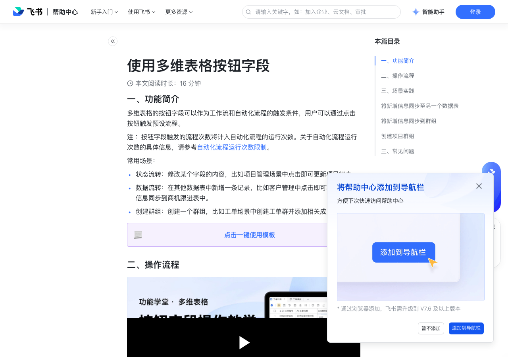

# 使用多维表格按钮字段

> 来源：[飞书帮助中心](https://www.feishu.cn/hc/zh-CN/articles/339066898695)  
> 分类：多维表格 / 字段 / 业务字段  
> 抓取时间：2026-09-22T01:21:35.543Z

## 界面截图

### 文档内配图

1. 配图：https://p1-hera.feishucdn.com/tos-cn-i-jbbdkfciu3/78b1c5dd2f77456fb4bebb91e4849ff1~tplv-jbbdkfciu3-image:0:0.image
2. 配图：https://p1-hera.feishucdn.com/tos-cn-i-jbbdkfciu3/f8c7ffcb666d495ea8f197ed911fa68a~tplv-jbbdkfciu3-image:0:0.image

## 功能定位

本页对应飞书帮助中心「多维表格 / 字段 / 业务字段」下的「使用多维表格按钮字段」。以下需求描述依据官方说明文档提炼，用于指导 DuoWei 对标实现。

## 功能目标

一、功能简介

## 文档结构（官方章节）

- 一、功能简介 ​
- 二、操作流程​
- 三、场景实践​
- 将新增信息同步至另一个数据表 ​
- 将新增信息同步到群组 ​
- 创建项目群组 ​
- 三、常见问题​

## 详细功能说明

一、功能简介

状态流转：修改某个字段的内容，比如项目管理场景中点击即可更新项目状态。

数据流转：在其他数据表中新增一条记录，比如客户管理中点击即可将客户线索信息同步到商机跟进表中。

创建群组：创建一个群组，比如工单场景中创建工单群并添加相关成员进群。

二、操作流程

0.5x

0.75x

1.5x

00:00 按钮字段介绍

00:33 点击按钮后创建群组

01:27 点击按钮后发送飞书消息

02:04 点击按钮后添加一条记录

打开多维表格数据表，点击表格右上角的 + 图标。输入字段标题，选择 按钮 字段类型。

设置按钮上显示的文字和颜色。

选择并设置点击按钮后执行的操作，打开 执行操作 菜单，可选以下操作：

使用推荐的模板，快捷创建发送通知、一键拉群、创建日程，或创建任务的自动化流程。

打开详情/打开链接/打开表单：设置点击按钮后，打开该条记录的记录详情页、特定链接或表单。

新建自动化或工作流：选择 执行自动化 > + 新建自动化，或 执行工作流 > + 新建工作流。关于可执行操作的具体信息，请参考自动化流程触发条件与执行操作一览。

关联已有的自定义自动化或工作流：选择 执行自动化 或 执行工作流，选择已有的自动化或工作流。有关如何在自动化或工作流中设置“点击按钮时”作为触发条件，请参考设置点击按钮为触发条件。

注：如果自动化或工作流的触发类型为 点击按钮时 且按钮类型应为 按钮字段，则该自动化或工作流中所选的按钮字段所在的数据表必须和当前配置的按钮所在的数据表一致，才能关联。

（可选）你可以在选项下方查看操作示意图，点击右侧的 跳转 图标打开自动化或工作流配置界面，还可以点击 ··· 图标，查看运行日志或将操作解绑。

（可选）勾选 开启“确认弹窗” 并设置设置弹窗标题、内容及确认按钮显示的文字。勾选后，协作者点击按钮后需要在弹窗中确认操作。

完成设置后，点击 确定。

三、场景实践

将新增信息同步至另一个数据表

场景：对客户信息管理表中收集到的客户信息进行筛选，如符合要求，则点击按钮将该条记录同步到商机管理表中。

在 客户信息管理 表中新建一个按钮字段 新增商机 ，在执行操作中，选择 执行自动化 > + 新建自动化。在自动化设置中，选择 新增记录 作为要执行的操作。

进入自动化流程设置页面，在要执行的操作中，选择 商机管理表 作为要新增记录的数据表，并设置新增记录的内容。

保存并启用流程。

点击 新增商机 按钮即可将新增的客户信息记录同步到商机管理表中。

将新增信息同步到群组

场景：当新增客户信息时，将新增的信息及时同步到群组，由相应的成员跟进。

在客户信息管理表中新建一个按钮字段 同步信息 ，选择 发送飞书消息 作为要执行的操作。

进入自动化流程设置页面，在要执行的操作中，设置消息接收群组、消息内容、跳转按钮等。关于发送消息操作的具体信息，请参考在自动化中使用不同身份发送消息。

点击 同步信息 按钮即可将相应的信息发送到目标群组。

创建项目群组

场景：将客户线索转化到商机表后，可点击按钮一键创建客户跟进项目群，并将新建的群组添加到商机管理表中。

在客户信息管理表中新建一个按钮字段 同步信息 ，在执行操作中，选择 执行自动化 > + 新建自动化。在自动化设置中，选择 发送飞书消息 作为要执行的操作。

进入自动化流程设置页面，在要执行的操作中，设置群名称、成员、群组等。

继续添加 修改记录内容 操作 ，将上一步中创建的群组记录添加到群组字段中。

点击 建群 按钮即可创建一个飞书群组并将新创建的群同步至 项目群 字段。其他成员后续也能通过群组字段快速加入项目群组。

三、常见问题

问：多维表格按钮字段的执行是如何计算到自动化流程的运行次数中的？

答：一个按钮字段对应一个自动化流程，你可在一个流程中添加多个执行操作，每点击一次按钮并成功触发操作算为一次运行。

问：多维表格按钮字段支持哪些操作？

答：按钮字段支持自动化和工作流中的所有操作。关于自动化流程和工作流支持操作的具体信息，请参考自动化流程触发条件与执行操作一览和使用多维表格工作流。

问：多维表格按钮字段支持复制吗？

答：支持。当前仅支持复制字段的标题、文本和颜色，无法复制执行的操作。

问：谁可以配置、点击多维表格按钮字段？

答：按钮的配置、点击权限请见下表。 操作所需权限配置按钮字段 未开启高级权限时，多维表格所有者、可管理、可编辑权限的用户能配置按钮字段。 开启高级权限后，仅多维表格所有者、可管理权限的用户能配置按钮字段，有数据表可编辑权限的用户可以查看配置页面，但不能编辑或修改按钮字段的配置。 点击按钮字段 按钮为可点击状态时，所有能看到按钮字段的用户均可点击按钮。

问：如何知道哪些用户点击了多维表格中的按钮字段？

答：你可以通过设置自动化流程的方式，将触发条件设置为“点击按钮时”，执行操作设置为“修改记录”，把点击按钮的“触发人”记录在一个单独的人员字段中。需注意，通过此种方法修改的人员字段只会展示最近一次点击按钮的用户，不能展示所有点击过按钮的用户。你可以通过查询该条记录的历史记录，来查看所有点击过此按钮的人。 250px|700px|reset

问：如何设置让多维表格中的按钮只能点击一次？

答：字段中的按钮和仪表盘中的按钮组件不支持设置为只能点击一次。工作流和自动化中的消息卡片底部按钮可以设置为点击后禁止再次点击，具体信息请参考在工作流和自动化中发送消息。

问：在多维表格按钮字段中，如何实现点击按钮后在表单中修改按钮所在行的记录？

答：不支持。

## 实现要点（对标 DuoWei）

1. **入口与信息架构**：在产品中明确该能力所属模块（字段 / 业务字段），并保证用户可从对应导航触达。
2. **核心交互**：按上文「详细功能说明」还原主要操作路径；截图中出现的按钮、字段、面板命名尽量与飞书语义一致或可映射。
3. **数据与权限**：若文档涉及可见范围、可编辑范围、分享或高级权限，实现时需落到角色/成员模型，并保证 API/MCP 与 UI 权限一致。
4. **边界与上限**：若文档提到数量上限、格式限制、导入导出约束，需在实现与错误提示中体现。
5. **验收**：以本页截图场景为用例，完成「能打开 / 能配置 / 能保存 / 能被 Agent 读写（如适用）」四项检查。

## 原始摘录摘要

> 一、功能简介 状态流转：修改某个字段的内容，比如项目管理场景中点击即可更新项目状态。 数据流转：在其他数据表中新增一条记录，比如客户管理中点击即可将客户线索信息同步到商机跟进表中。 创建群组：创建一个群组，比如工单场景中创建工单群并添加相关成员进群。 二、操作流程 0.5x 0.75x 1.5x 00:00 按钮字段介绍 00:33 点击按钮后创建群组 01:27 点击按钮后发送飞书消息 02:04 点击按钮后添加一条记录 打开多维表格数据表，点击表格右上角的 + 图标。输入字段标题，选择 按钮 字段类型。 设置按钮上显示的文字和颜色。 选择并设置点击按钮后执行的操作，打开 执行操作 菜单，可选以下操作： 使用推荐的模板，快捷创建发送通知、一键拉群、创建日程，或创建任务的自动化流程。 打开详情/打开链接/打开表单：设置点击按钮后，打开该条记录的记录详情页、特定链接或表单。 新建自动化或工作流：选择 执行自动化 > + 新建自动化，或 执行工作流 > + 新建工作流。关于可执行操作的具体信息，请参考自动化流程触发条件与执行操作一览。 关联已有的自定义自动化或工作流：选择 执行自动化 或 执行工作流，选择已有的自动化或工作流。有关如何在自动化或工作流中设置“点击按钮时”作为触发条件，请参考设置点击按钮为触发条件。 注：如果自动化或工作流的触发类型为 点击按钮时 且按钮类型应为 按钮字段，则该自动化或工作流中所选的按钮字段所在的数据表必须和当前配置的按钮所在的数据表一致，才能关联。 （可选）你可以在选项下方查看操作示意图，点击右侧的 跳转 图标打开自动化或工作流配置界面，还可以点击 ··· 图标，查看运行日志或将操作解绑。 （可选）勾选 开启“确认弹窗” 并设置设置弹窗标题、内容及确认按钮显示的文字。勾选后，协作者点击按钮后需要在弹窗中确认操作。 完成设置后，点击 确定。 三、场…

## 元数据

- article_id: `7202812048601153537`
- category_id: `7187723341653000220`
- path: `/hc/zh-CN/articles/339066898695`
- extracted_text_length: 2293
