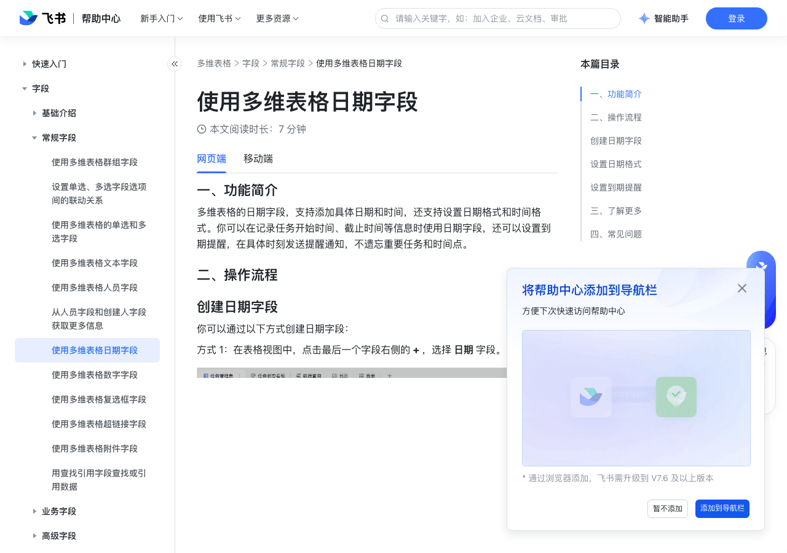

# 使用多维表格日期字段

> 来源：[飞书帮助中心](https://www.feishu.cn/hc/zh-CN/articles/360049067920)  
> 分类：多维表格 / 字段 / 常规字段  
> 抓取时间：2026-09-22T01:21:35.436Z

## 界面截图

### 文档内配图

1. 配图：https://p1-hera.feishucdn.com/tos-cn-i-jbbdkfciu3/f1ae49871d5745869657f4fa7c663f4e~tplv-jbbdkfciu3-image:0:0.image
2. 配图：https://p1-hera.feishucdn.com/tos-cn-i-jbbdkfciu3/343a4ff7d2ac4cc4931efa1f4b5ff2ef~tplv-jbbdkfciu3-image:0:0.image
3. 配图：https://p1-hera.feishucdn.com/tos-cn-i-jbbdkfciu3/b318397e71bc4ef3ae5b8381f7671ba5~tplv-jbbdkfciu3-image:0:0.image
4. 配图：https://p1-hera.feishucdn.com/tos-cn-i-jbbdkfciu3/372c5a4e3f7f467983e77c275de30b37~tplv-jbbdkfciu3-image:0:0.image
5. 配图：https://p1-hera.feishucdn.com/tos-cn-i-jbbdkfciu3/589c01ba8a5d4a4fa4358b85517202e1~tplv-jbbdkfciu3-image:0:0.image
6. 配图：https://p1-hera.feishucdn.com/tos-cn-i-jbbdkfciu3/02ce6c6a393e4b0ba9e6da79994c91f6~tplv-jbbdkfciu3-image:0:0.image
7. 配图：https://p1-hera.feishucdn.com/tos-cn-i-jbbdkfciu3/45c4698a9e374215bc9675f0cf76ec5f~tplv-jbbdkfciu3-image:0:0.image
8. 配图：https://p1-hera.feishucdn.com/tos-cn-i-jbbdkfciu3/a39ed5d51bd546f78d7028b6d5b45228~tplv-jbbdkfciu3-image:0:0.image
9. 配图：https://p1-hera.feishucdn.com/tos-cn-i-jbbdkfciu3/d9cc0155877d4deb9b32675a4086d9c2~tplv-jbbdkfciu3-image:0:0.image
10. 多维表格视频课按钮.png：https://p1-hera.feishucdn.com/tos-cn-i-jbbdkfciu3/d5d154be65374b32991860604d648ee6~tplv-jbbdkfciu3-image:0:0.image

## 功能定位

本页对应飞书帮助中心「多维表格 / 字段 / 常规字段」下的「使用多维表格日期字段」。以下需求描述依据官方说明文档提炼，用于指导 DuoWei 对标实现。

## 功能目标

一、功能简介

## 文档结构（官方章节）

- 一、功能简介​
- 二、操作流程​
- 创建日期字段​
- 设置日期格式​
- 设置到期提醒​
- 三、了解更多​
- 四、常见问题​

## 详细功能说明

一、功能简介

二、操作流程

创建日期字段

设置日期格式

设置到期提醒

设置提醒时间：

如果你的日期字段中不含有具体时间，则默认是当天 9 点进行提醒，也可以选择提前一段时间进行提醒。你还可以勾选 设置具体时间，进一步设置具体的时间点（支持手动输入），以及何时提醒（比如“事件发生时”或“提前 5 分钟”等等）。

如果你的日期字段中有具体的时间（时、分），那么在开启到期提醒后，会默认勾选 设置具体时间，且“时间”为当前单元格填写的时间。

设置提醒人员：

开启到期提醒后，提醒人员默认是打开此开关的用户，你可以点击 修改 进行更多设置。

点击 修改 后，你可以进一步选择 提醒某个人 或 提醒某个人员字段的人。选择 提醒某个人 时，你可以搜索自己的内外部联系人；选择 提醒某个人员字段的人 时，你可以选择当前数据表内的人员字段，不支持选择创建人字段和修改人字段。

三、了解更多

四、常见问题

问：我能在哪些字段中使用到期提醒？

问：到期提醒可以提醒哪些人？

问：被提醒人将在哪里收到提醒？

问：在多维表格的数字或日期字段中，如何实现拖拽下拉时单元格中的数字或日期按照一定规律递增或递减？

问：如何在多维表格的日期字段中设置仅展示年月，不展示具体日期？

问：可以在多维表格日期字段中选择多个日期吗？

问：在多维表格日期字段中可以设置可选的日期范围吗？

答：只有日期字段才能设置到期提醒。

答：目前支持提醒你的所有内外部联系人。

答：被提醒人将在客户端内收到“云文档助手”的消息提醒。

答：当多维表格的字段类型为数字或日期时，在同一列的两个连续单元格中手动输入数字或日期，选中这两个单元格并下拉拖拽，系统将根据这两个单元格的间隔规律自动填充后续单元格。注：如果按此步骤操作无效，可以清空两个连续单元格中的内容后，重新手动输入数据并重试。

答：不支持。

## 实现要点（对标 DuoWei）

1. **入口与信息架构**：在产品中明确该能力所属模块（字段 / 常规字段），并保证用户可从对应导航触达。
2. **核心交互**：按上文「详细功能说明」还原主要操作路径；截图中出现的按钮、字段、面板命名尽量与飞书语义一致或可映射。
3. **数据与权限**：若文档涉及可见范围、可编辑范围、分享或高级权限，实现时需落到角色/成员模型，并保证 API/MCP 与 UI 权限一致。
4. **边界与上限**：若文档提到数量上限、格式限制、导入导出约束，需在实现与错误提示中体现。
5. **验收**：以本页截图场景为用例，完成「能打开 / 能配置 / 能保存 / 能被 Agent 读写（如适用）」四项检查。

## 原始摘录摘要

> 一、功能简介 二、操作流程 创建日期字段 设置日期格式 设置到期提醒 设置提醒时间： 如果你的日期字段中不含有具体时间，则默认是当天 9 点进行提醒，也可以选择提前一段时间进行提醒。你还可以勾选 设置具体时间，进一步设置具体的时间点（支持手动输入），以及何时提醒（比如“事件发生时”或“提前 5 分钟”等等）。 如果你的日期字段中有具体的时间（时、分），那么在开启到期提醒后，会默认勾选 设置具体时间，且“时间”为当前单元格填写的时间。 设置提醒人员： 开启到期提醒后，提醒人员默认是打开此开关的用户，你可以点击 修改 进行更多设置。 点击 修改 后，你可以进一步选择 提醒某个人 或 提醒某个人员字段的人。选择 提醒某个人 时，你可以搜索自己的内外部联系人；选择 提醒某个人员字段的人 时，你可以选择当前数据表内的人员字段，不支持选择创建人字段和修改人字段。 三、了解更多 四、常见问题 问：我能在哪些字段中使用到期提醒？ 问：到期提醒可以提醒哪些人？ 问：被提醒人将在哪里收到提醒？ 问：在多维表格的数字或日期字段中，如何实现拖拽下拉时单元格中的数字或日期按照一定规律递增或递减？ 问：如何在多维表格的日期字段中设置仅展示年月，不展示具体日期？ 问：可以在多维表格日期字段中选择多个日期吗？ 问：在多维表格日期字段中可以设置可选的日期范围吗？ 答：只有日期字段才能设置到期提醒。 答：目前支持提醒你的所有内外部联系人。 答：被提醒人将在客户端内收到“云文档助手”的消息提醒。 答：当多维表格的字段类型为数字或日期时，在同一列的两个连续单元格中手动输入数字或日期，选中这两个单元格并下拉拖拽，系统将根据这两个单元格的间隔规律自动填充后续单元格。注：如果按此步骤操作无效，可以清空两个连续单元格中的内容后，重新手动输入数据并重试。 答：不支持。

## 元数据

- article_id: `6933484146295603201`
- category_id: `7187711716854464540`
- path: `/hc/zh-CN/articles/360049067920`
- extracted_text_length: 772
