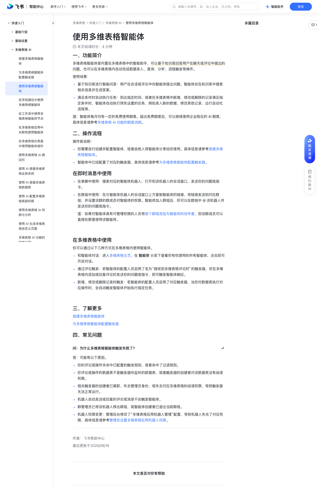

# 使用多维表格智能体

> 来源：[飞书帮助中心](https://www.feishu.cn/hc/zh-CN/articles/982143631606)  
> 分类：多维表格 / 快速入门 / 多维表格 AI  
> 抓取时间：2026-09-22T01:16:00.190Z

## 界面截图

### 文档内配图

1. 配图：https://p1-hera.feishucdn.com/tos-cn-i-jbbdkfciu3/9f2cbd92cad3421fb909785e769ba67c~tplv-jbbdkfciu3-image:0:0.image
2. 配图：https://p1-hera.feishucdn.com/tos-cn-i-jbbdkfciu3/03e9fac7112c47e499a96288043a87f6~tplv-jbbdkfciu3-image:0:0.image
3. 配图：https://p1-hera.feishucdn.com/tos-cn-i-jbbdkfciu3/eb7bab1fa874444694e8e4c44efbf566~tplv-jbbdkfciu3-image:0:0.image

## 功能定位

本页对应飞书帮助中心「多维表格 / 快速入门 / 多维表格 AI」下的「使用多维表格智能体」。以下需求描述依据官方说明文档提炼，用于指导 DuoWei 对标实现。

## 功能目标

一、功能简介

## 文档结构（官方章节）

- 一、功能简介​
- 二、操作流程​
- 在即时消息中使用​
- 在多维表格中使用​
- 三、了解更多​
- 四、常见问题​

## 详细功能说明

一、功能简介

基于知识库进行智能问答：用户在会话或评论中向智能体提出问题，智能体会在知识库中搜索相关信息并生成答案。

满足条件时自动执行任务：到达指定时间，或者在多维表格中新增、修改或删除的记录满足指定条件时，智能体自动执行预先设置的任务，例如录入新的数据、修改其他记录、运行自动化流程等。

二、操作流程

你需要自行创建并配置智能体，或者由他人将智能体分享给你使用。具体信息请参考搭建多维表格智能体。

智能体中已经配置了对应的触发器，具体信息请参考为多维表格智能体配置触发器。

在即时消息中使用

在单聊中使用：搜索对应的智能体机器人，打开和该机器人的会话窗口，发送你的问题或指令。

在群组中使用：在与智能体机器人的会话窗口上方复制智能体的链接，将链接发送到对应群组，并设置该群的群成员对智能体的权限。智能体加入群组后，你可以在群组中 @ 该机器人并发送你的问题或指令。

注：如果对智能体具有可管理权限的人员将某个群组添加为智能体的协作者，则该群成员可以直接在群里使用该智能体。

在多维表格中使用

和智能体对话：进入多维表格主页，在 智能体 分类下查看你有权使用的所有智能体，点击即可开启对话。

通过评论触发：若智能体的配置人员启用了名为“接收到多维表格评论时”的触发器，你在多维表格内添加或回复评论时发送你的问题或指令，即可触发智能体响应。

新增、修改或删除记录时触发：若智能体的配置人员启用了对应触发器，当你对数据表执行对应操作时，会自动触发智能体开始执行指定任务。

三、了解更多

四、常见问题

问：为什么多维表格智能体触发失败了？

答：可能有以下原因。你的评论或操作未命中已配置的触发规则，或者命中了过滤规则。你评论或操作的数据表不是触发器所监听的数据表，或者触发器的创建者对该数据表没有阅读权限。相关触发器的创建者已离职、失去管理员身份，或失去对应多维表格的阅读权限，导致触发器无法正常运行。机器人自动发送或回复的评论或消息不会触发智能体。群管理员已将该机器人移出群组，或智能体创建者已退出当前群组。机器人权限变更：管理后台修改了“多维表格应用机器人管理”配置，导致机器人失去了对应权限，具体信息请参考管理员设置多维表格应用机器人权限。

## 实现要点（对标 DuoWei）

1. **入口与信息架构**：在产品中明确该能力所属模块（快速入门 / 多维表格 AI），并保证用户可从对应导航触达。
2. **核心交互**：按上文「详细功能说明」还原主要操作路径；截图中出现的按钮、字段、面板命名尽量与飞书语义一致或可映射。
3. **数据与权限**：若文档涉及可见范围、可编辑范围、分享或高级权限，实现时需落到角色/成员模型，并保证 API/MCP 与 UI 权限一致。
4. **边界与上限**：若文档提到数量上限、格式限制、导入导出约束，需在实现与错误提示中体现。
5. **验收**：以本页截图场景为用例，完成「能打开 / 能配置 / 能保存 / 能被 Agent 读写（如适用）」四项检查。

## 原始摘录摘要

> 一、功能简介 基于知识库进行智能问答：用户在会话或评论中向智能体提出问题，智能体会在知识库中搜索相关信息并生成答案。 满足条件时自动执行任务：到达指定时间，或者在多维表格中新增、修改或删除的记录满足指定条件时，智能体自动执行预先设置的任务，例如录入新的数据、修改其他记录、运行自动化流程等。 二、操作流程 你需要自行创建并配置智能体，或者由他人将智能体分享给你使用。具体信息请参考搭建多维表格智能体。 智能体中已经配置了对应的触发器，具体信息请参考为多维表格智能体配置触发器。 在即时消息中使用 在单聊中使用：搜索对应的智能体机器人，打开和该机器人的会话窗口，发送你的问题或指令。 在群组中使用：在与智能体机器人的会话窗口上方复制智能体的链接，将链接发送到对应群组，并设置该群的群成员对智能体的权限。智能体加入群组后，你可以在群组中 @ 该机器人并发送你的问题或指令。 注：如果对智能体具有可管理权限的人员将某个群组添加为智能体的协作者，则该群成员可以直接在群里使用该智能体。 在多维表格中使用 和智能体对话：进入多维表格主页，在 智能体 分类下查看你有权使用的所有智能体，点击即可开启对话。 通过评论触发：若智能体的配置人员启用了名为“接收到多维表格评论时”的触发器，你在多维表格内添加或回复评论时发送你的问题或指令，即可触发智能体响应。 新增、修改或删除记录时触发：若智能体的配置人员启用了对应触发器，当你对数据表执行对应操作时，会自动触发智能体开始执行指定任务。 三、了解更多 四、常见问题 问：为什么多维表格智能体触发失败了？ 答：可能有以下原因。你的评论或操作未命中已配置的触发规则，或者命中了过滤规则。你评论或操作的数据表不是触发器所监听的数据表，或者触发器的创建者对该数据表没有阅读权限。相关触发器的创建者已离职、失去管理员身份，或失去对应多维表格的阅读权限，导致触发器无法正常运行。机…

## 元数据

- article_id: `7639646217827323066`
- category_id: `7630766419524717789`
- path: `/hc/zh-CN/articles/982143631606`
- extracted_text_length: 921
