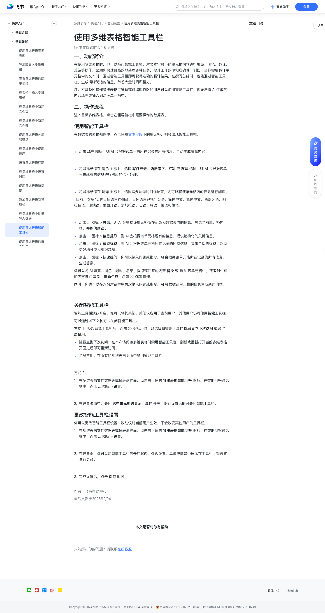

# 使用多维表格智能工具栏

> 来源：[飞书帮助中心](https://www.feishu.cn/hc/zh-CN/articles/908472182177)  
> 分类：多维表格 / 快速入门 / 基础设置  
> 抓取时间：2026-09-22T01:16:00.491Z

## 界面截图

### 文档内配图

1. 配图：https://p1-hera.feishucdn.com/tos-cn-i-jbbdkfciu3/56435bbf2ed149d1b2db9f3843f5153f~tplv-jbbdkfciu3-image:0:0.image
2. 配图：https://p1-hera.feishucdn.com/tos-cn-i-jbbdkfciu3/ca9f6ee928ac4699be4911444db7c0e3~tplv-jbbdkfciu3-image:0:0.image
3. 配图：https://p1-hera.feishucdn.com/tos-cn-i-jbbdkfciu3/57be047293604fff869def99d3635365~tplv-jbbdkfciu3-image:0:0.image
4. 配图：https://p1-hera.feishucdn.com/tos-cn-i-jbbdkfciu3/b76aad56e25f4956a22ca921bd8b3c87~tplv-jbbdkfciu3-image:0:0.image
5. 配图：https://p1-hera.feishucdn.com/tos-cn-i-jbbdkfciu3/a1c447e148ce47a6806b9f5ef256d039~tplv-jbbdkfciu3-image:0:0.image
6. 配图：https://p1-hera.feishucdn.com/tos-cn-i-jbbdkfciu3/fa15b35950734341b6cac98587c6872f~tplv-jbbdkfciu3-image:0:0.image
7. 配图：https://p1-hera.feishucdn.com/tos-cn-i-jbbdkfciu3/62af5d71f5454d919257d0c67044b919~tplv-jbbdkfciu3-image:0:0.image
8. 配图：https://p1-hera.feishucdn.com/tos-cn-i-jbbdkfciu3/edf34d76d53e496a861e1f34eeb72666~tplv-jbbdkfciu3-image:0:0.image
9. 配图：https://p1-hera.feishucdn.com/tos-cn-i-jbbdkfciu3/b695491d45114b5caf46809b5929b7d6~tplv-jbbdkfciu3-image:0:0.image
10. 配图：https://p1-hera.feishucdn.com/tos-cn-i-jbbdkfciu3/42be87aeb4d8470bba56810750156194~tplv-jbbdkfciu3-image:0:0.image
11. 配图：https://p1-hera.feishucdn.com/tos-cn-i-jbbdkfciu3/3b08390b1f5f4c73acb8b929ec86a376~tplv-jbbdkfciu3-image:0:0.image
12. 配图：https://p1-hera.feishucdn.com/tos-cn-i-jbbdkfciu3/588ff0c86267435b8d040e7a6df6060c~tplv-jbbdkfciu3-image:0:0.image
13. 配图：https://p1-hera.feishucdn.com/tos-cn-i-jbbdkfciu3/92c936e923d946b7b43e3cbc799fb55a~tplv-jbbdkfciu3-image:0:0.image
14. 配图：https://p1-hera.feishucdn.com/tos-cn-i-jbbdkfciu3/fbfb7b81742c470c8e6dce14c37ad270~tplv-jbbdkfciu3-image:0:0.image

## 功能定位

本页对应飞书帮助中心「多维表格 / 快速入门 / 基础设置」下的「使用多维表格智能工具栏」。以下需求描述依据官方说明文档提炼，用于指导 DuoWei 对标实现。

## 功能目标

一、功能简介

## 文档结构（官方章节）

- 一、功能简介​
- 二、操作流程​
- 使用智能工具栏​
- 关闭智能工具栏​
- 更改智能工具栏设置​

## 详细功能说明

一、功能简介

二、操作流程

使用智能工具栏

点击 填充 图标，则 AI 会根据该单元格所在记录的所有信息，自动生成填充内容。

将鼠标悬停在 润色 图标上，选择 写作改进、语法修正、扩写 或 缩写 选项，则 AI 会根据该单元格现有的信息进行对应的优化处理。

将鼠标悬停在 翻译 图标上，选择需要翻译的目标语言，则可以将该单元格内的信息进行翻译。

点击 … 图标 > 总结，则 AI 会根据该单元格所在记录和数据表内的信息，总结当前单元格内容，并提供建议。

点击 … 图标 > 信息提取，则 AI 会根据该单元格现有的信息，提供结构化的关键信息。

点击 … 图标 > 智能标签，则 AI 会根据该单元格所在记录的所有信息，提供合适的标签，帮助更好地分类和组织数据。

点击 … 图标 > 快速提问，你可以输入问题或指令，AI 会根据该单元格所在记录的所有信息，生成答案。

关闭智能工具栏

隐藏直到下次访问：在本次访问该多维表格时禁用智能工具栏，刷新或重新打开当前多维表格页面之后即可重新访问。

全局禁用：在所有的多维表格页面中禁用智能工具栏。

在多维表格文件数据表或仪表盘界面，点击右下角的 多维表格智能问答 图标。在智能问答对话框中，点击 … 图标 > 设置。

在设置弹窗中，关闭 选中单元格时显示工具栏 开关，保存设置后即可关闭智能工具栏。

更改智能工具栏设置

在设置页，你可以对智能工具栏的开启状态、外观设置、具体技能是否展示在工具栏上等设置进行更改。

完成设置后，点击 保存 即可。

## 实现要点（对标 DuoWei）

1. **入口与信息架构**：在产品中明确该能力所属模块（快速入门 / 基础设置），并保证用户可从对应导航触达。
2. **核心交互**：按上文「详细功能说明」还原主要操作路径；截图中出现的按钮、字段、面板命名尽量与飞书语义一致或可映射。
3. **数据与权限**：若文档涉及可见范围、可编辑范围、分享或高级权限，实现时需落到角色/成员模型，并保证 API/MCP 与 UI 权限一致。
4. **边界与上限**：若文档提到数量上限、格式限制、导入导出约束，需在实现与错误提示中体现。
5. **验收**：以本页截图场景为用例，完成「能打开 / 能配置 / 能保存 / 能被 Agent 读写（如适用）」四项检查。

## 原始摘录摘要

> 一、功能简介 二、操作流程 使用智能工具栏 点击 填充 图标，则 AI 会根据该单元格所在记录的所有信息，自动生成填充内容。 将鼠标悬停在 润色 图标上，选择 写作改进、语法修正、扩写 或 缩写 选项，则 AI 会根据该单元格现有的信息进行对应的优化处理。 将鼠标悬停在 翻译 图标上，选择需要翻译的目标语言，则可以将该单元格内的信息进行翻译。 点击 … 图标 > 总结，则 AI 会根据该单元格所在记录和数据表内的信息，总结当前单元格内容，并提供建议。 点击 … 图标 > 信息提取，则 AI 会根据该单元格现有的信息，提供结构化的关键信息。 点击 … 图标 > 智能标签，则 AI 会根据该单元格所在记录的所有信息，提供合适的标签，帮助更好地分类和组织数据。 点击 … 图标 > 快速提问，你可以输入问题或指令，AI 会根据该单元格所在记录的所有信息，生成答案。 关闭智能工具栏 隐藏直到下次访问：在本次访问该多维表格时禁用智能工具栏，刷新或重新打开当前多维表格页面之后即可重新访问。 全局禁用：在所有的多维表格页面中禁用智能工具栏。 在多维表格文件数据表或仪表盘界面，点击右下角的 多维表格智能问答 图标。在智能问答对话框中，点击 … 图标 > 设置。 在设置弹窗中，关闭 选中单元格时显示工具栏 开关，保存设置后即可关闭智能工具栏。 更改智能工具栏设置 在设置页，你可以对智能工具栏的开启状态、外观设置、具体技能是否展示在工具栏上等设置进行更改。 完成设置后，点击 保存 即可。

## 元数据

- article_id: `7441930118350061569`
- category_id: `7225072576895254530`
- path: `/hc/zh-CN/articles/908472182177`
- extracted_text_length: 643
