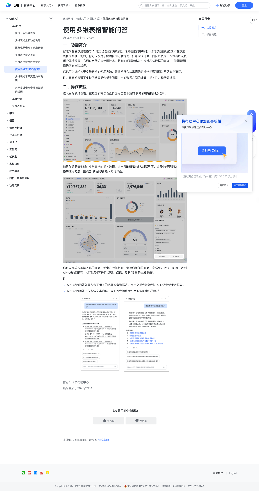

# 使用多维表格智能问答

> 来源：[飞书帮助中心](https://www.feishu.cn/hc/zh-CN/articles/160903213116)  
> 分类：多维表格 / 快速入门 / 基础介绍  
> 抓取时间：2026-09-22T00:46:12.648Z

## 界面截图

### 文档内配图

1. 配图：https://p1-hera.feishucdn.com/tos-cn-i-jbbdkfciu3/b2acbd2ef3d7414983087e02873ea968~tplv-jbbdkfciu3-image:0:0.image
2. 配图：https://p1-hera.feishucdn.com/tos-cn-i-jbbdkfciu3/92327cb7f8b443b0b2d6c0327b73265d~tplv-jbbdkfciu3-image:0:0.image
3. 配图：https://p1-hera.feishucdn.com/tos-cn-i-jbbdkfciu3/721db8db05954f2f8500f267662108ca~tplv-jbbdkfciu3-image:0:0.image
4. 配图：https://p1-hera.feishucdn.com/tos-cn-i-jbbdkfciu3/79e6b94304d04fa9ae484661e18db3e4~tplv-jbbdkfciu3-image:0:0.image

## 功能定位

本页对应飞书帮助中心「多维表格 / 快速入门 / 基础介绍」下的「使用多维表格智能问答」。以下需求描述依据官方说明文档提炼，用于指导 DuoWei 对标实现。

## 功能目标

一、功能简介

## 文档结构（官方章节）

- 一、功能简介​
- 二、操作流程​

## 详细功能说明

一、功能简介

二、操作流程

AI 生成的回答如果包含了相关的记录或者数据表，点击之后会跳转到对应的记录或者数据表。

AI 生成的回答不仅包含文本内容，同时也会提供所引用的帮助中心的链接。

一、功能简介智能问答是多维表格与 AI 能力结合的问答功能。借助智能问答功能，你可以便捷地查询所在多维表格的数据，例如，你可以快速了解项目的进展情况、任务完成进度、团队成员的工作负荷以及资源分配情况等。它通过自然语言处理技术，将你的问题转化为对多维表格数据的查询，并以清晰易懂的方式呈现给你。你也可以询问关于多维表格的使用方法，智能问答会给出明确的操作步骤和相关帮助文档链接。注：智能问答暂不支持回答数据分析类问题，比如数据之间的计算、相关性、趋势分析等。二、操作流程进入目标多维表格，在数据表或仪表盘界面点击右下角的 多维表格智能问答 图标。250px|700px|reset如果你想要查询所在多维表格的相关数据，点击 智能查询 进入对话界面。如果你想要查询多维表格的使用方法，则点击 教程问答 进入对话界面。250px|700px|reset你可以在输入框输入你的问题，或者在猜你想问中选择你想问的问题，发送至对话框中即可。收到 AI 生成的回答后，你可以对其进行 点赞、点踩、复制 和 重新生成 操作。注：AI 生成的回答如果包含了相关的记录或者数据表，点击之后会跳转到对应的记录或者数据表。AI 生成的回答不仅包含文本内容，同时也会提供所引用的帮助中心的链接。250px|700px|reset250px|700px|reset

## 实现要点（对标 DuoWei）

1. **入口与信息架构**：在产品中明确该能力所属模块（快速入门 / 基础介绍），并保证用户可从对应导航触达。
2. **核心交互**：按上文「详细功能说明」还原主要操作路径；截图中出现的按钮、字段、面板命名尽量与飞书语义一致或可映射。
3. **数据与权限**：若文档涉及可见范围、可编辑范围、分享或高级权限，实现时需落到角色/成员模型，并保证 API/MCP 与 UI 权限一致。
4. **边界与上限**：若文档提到数量上限、格式限制、导入导出约束，需在实现与错误提示中体现。
5. **验收**：以本页截图场景为用例，完成「能打开 / 能配置 / 能保存 / 能被 Agent 读写（如适用）」四项检查。

## 原始摘录摘要

> 一、功能简介 二、操作流程 AI 生成的回答如果包含了相关的记录或者数据表，点击之后会跳转到对应的记录或者数据表。 AI 生成的回答不仅包含文本内容，同时也会提供所引用的帮助中心的链接。 一、功能简介智能问答是多维表格与 AI 能力结合的问答功能。借助智能问答功能，你可以便捷地查询所在多维表格的数据，例如，你可以快速了解项目的进展情况、任务完成进度、团队成员的工作负荷以及资源分配情况等。它通过自然语言处理技术，将你的问题转化为对多维表格数据的查询，并以清晰易懂的方式呈现给你。你也可以询问关于多维表格的使用方法，智能问答会给出明确的操作步骤和相关帮助文档链接。注：智能问答暂不支持回答数据分析类问题，比如数据之间的计算、相关性、趋势分析等。二、操作流程进入目标多维表格，在数据表或仪表盘界面点击右下角的 多维表格智能问答 图标。250px|700px|reset如果你想要查询所在多维表格的相关数据，点击 智能查询 进入对话界面。如果你想要查询多维表格的使用方法，则点击 教程问答 进入对话界面。250px|700px|reset你可以在输入框输入你的问题，或者在猜你想问中选择你想问的问题，发送至对话框中即可。收到 AI 生成的回答后，你可以对其进行 点赞、点踩、复制 和 重新生成 操作。注：AI 生成的回答如果包含了相关的记录或者数据表，点击之后会跳转到对应的记录或者数据表。AI 生成的回答不仅包含文本内容，同时也会提供所引用的帮助中心的链接。250px|700px|reset250px|700px|reset

## 元数据

- article_id: `7430715121103470595`
- category_id: `7225072370607013890`
- path: `/hc/zh-CN/articles/160903213116`
- extracted_text_length: 568
