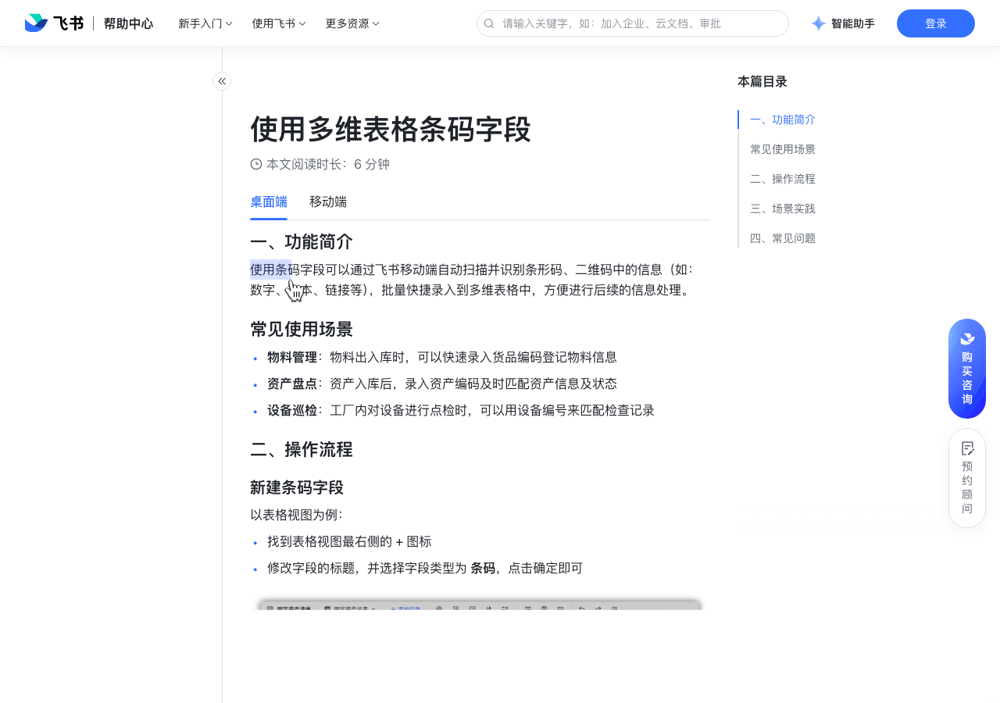

# 使用多维表格条码字段

> 来源：[飞书帮助中心](https://www.feishu.cn/hc/zh-CN/articles/193772731228)  
> 分类：多维表格 / 字段 / 业务字段  
> 抓取时间：2026-09-22T01:21:40.061Z

## 界面截图

### 文档内配图

1. 配图：https://p1-hera.feishucdn.com/tos-cn-i-jbbdkfciu3/7a0716ff1de84992a99137f80fec7689~tplv-jbbdkfciu3-image:0:0.image
2. 配图：https://p1-hera.feishucdn.com/tos-cn-i-jbbdkfciu3/36c3c7d6d4694a4a9a19f47ec29dac06~tplv-jbbdkfciu3-image:0:0.image
3. 配图：https://p1-hera.feishucdn.com/tos-cn-i-jbbdkfciu3/21f843ce0d4749d0b8374e13689de36d~tplv-jbbdkfciu3-image:0:0.image
4. 配图：https://p1-hera.feishucdn.com/tos-cn-i-jbbdkfciu3/fe602e509af244fda065bcfa7f791818~tplv-jbbdkfciu3-image:0:0.image
5. 配图：https://p1-hera.feishucdn.com/tos-cn-i-jbbdkfciu3/bee1ddbe7b2f4e9395c4c23c5fc7d5fa~tplv-jbbdkfciu3-image:0:0.image

## 功能定位

本页对应飞书帮助中心「多维表格 / 字段 / 业务字段」下的「使用多维表格条码字段」。以下需求描述依据官方说明文档提炼，用于指导 DuoWei 对标实现。

## 功能目标

一、功能简介

## 文档结构（官方章节）

- 一、功能简介​
- 常见使用场景​
- 二、操作流程​
- 新建条码字段​
- 设置条码录入方式​
- 录入条码信息​
- 复制、删除条码字段​
- 三、场景实践​
- 四、常见问题​

## 详细功能说明

一、功能简介

常见使用场景

物料管理：物料出入库时，可以快速录入货品编码登记物料信息

资产盘点：资产入库后，录入资产编码及时匹配资产信息及状态

设备巡检：工厂内对设备进行点检时，可以用设备编号来匹配检查记录

二、操作流程

新建条码字段

找到表格视图最右侧的 + 图标

修改字段的标题，并选择字段类型为 条码，点击确定即可

设置条码录入方式

双击条码字段的名称，选择是否勾选 仅可通过移动端扫码录入

录入条码信息

未开启 仅可通过移动端扫码录入 时，既可以从移动端扫码录入，也可以直接点击单元格手动输入和修改的相应的条码信息

开启 仅可通过移动端扫码录入 时，仅能通过移动端扫码或识别照片中的条码信息

复制、删除条码字段

三、场景实践

新建一个条码字段，采购人员通过移动端扫码快速录入物品的序列号

通过辅助字段，如单选字段和自动编号字段对设备进行简单的分类编号

利用公式字段为每个物品生成编号

生成编号后，可以根据需要结合第三方工具批量生成条形码或二维码

四、常见问题

问：同一个单元格可以同时输入多个条码信息吗？

问：我能根据表格中的编码信息生成条形码或二维码吗？

问：当前我可以通过哪些方法录入条码信息？

手动输入条码信息

从移动端扫码录入

问：条码字段支持录入哪些类型的信息？

问：移动端使用该功能是否有版本限制？

答：手动输入时，你可录入多个条码信息；通过移动端扫码录入时，每个单元格仅能录入一个条码信息。

答：暂不支持，敬请期待。可通过第三方工具批量生成条码或二维码。

答：当前支持以下 2 种方法录入：手动输入条码信息从移动端扫码录入

答：当前支持文本、链接、数字类型的信息，但不支持@人员。

答：使用此功能，需将飞书移动端升级至 V5.25 及以上版本。通过分享获得的表单不受此版本限制。

## 实现要点（对标 DuoWei）

1. **入口与信息架构**：在产品中明确该能力所属模块（字段 / 业务字段），并保证用户可从对应导航触达。
2. **核心交互**：按上文「详细功能说明」还原主要操作路径；截图中出现的按钮、字段、面板命名尽量与飞书语义一致或可映射。
3. **数据与权限**：若文档涉及可见范围、可编辑范围、分享或高级权限，实现时需落到角色/成员模型，并保证 API/MCP 与 UI 权限一致。
4. **边界与上限**：若文档提到数量上限、格式限制、导入导出约束，需在实现与错误提示中体现。
5. **验收**：以本页截图场景为用例，完成「能打开 / 能配置 / 能保存 / 能被 Agent 读写（如适用）」四项检查。

## 原始摘录摘要

> 一、功能简介 常见使用场景 物料管理：物料出入库时，可以快速录入货品编码登记物料信息 资产盘点：资产入库后，录入资产编码及时匹配资产信息及状态 设备巡检：工厂内对设备进行点检时，可以用设备编号来匹配检查记录 二、操作流程 新建条码字段 找到表格视图最右侧的 + 图标 修改字段的标题，并选择字段类型为 条码，点击确定即可 设置条码录入方式 双击条码字段的名称，选择是否勾选 仅可通过移动端扫码录入 录入条码信息 未开启 仅可通过移动端扫码录入 时，既可以从移动端扫码录入，也可以直接点击单元格手动输入和修改的相应的条码信息 开启 仅可通过移动端扫码录入 时，仅能通过移动端扫码或识别照片中的条码信息 复制、删除条码字段 三、场景实践 新建一个条码字段，采购人员通过移动端扫码快速录入物品的序列号 通过辅助字段，如单选字段和自动编号字段对设备进行简单的分类编号 利用公式字段为每个物品生成编号 生成编号后，可以根据需要结合第三方工具批量生成条形码或二维码 四、常见问题 问：同一个单元格可以同时输入多个条码信息吗？ 问：我能根据表格中的编码信息生成条形码或二维码吗？ 问：当前我可以通过哪些方法录入条码信息？ 手动输入条码信息 从移动端扫码录入 问：条码字段支持录入哪些类型的信息？ 问：移动端使用该功能是否有版本限制？ 答：手动输入时，你可录入多个条码信息；通过移动端扫码录入时，每个单元格仅能录入一个条码信息。 答：暂不支持，敬请期待。可通过第三方工具批量生成条码或二维码。 答：当前支持以下 2 种方法录入：手动输入条码信息从移动端扫码录入 答：当前支持文本、链接、数字类型的信息，但不支持@人员。 答：使用此功能，需将飞书移动端升级至 V5.25 及以上版本。通过分享获得的表单不受此版本限制。

## 元数据

- article_id: `7163192206965129244`
- category_id: `7187723341653000220`
- path: `/hc/zh-CN/articles/193772731228`
- extracted_text_length: 750
