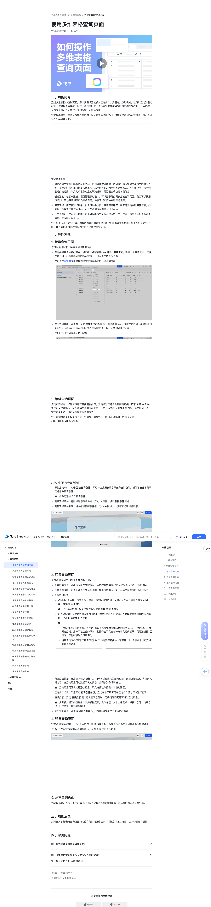

# 使用多维表格查询页面

> 来源：[飞书帮助中心](https://www.feishu.cn/hc/zh-CN/articles/401851310424)  
> 分类：多维表格 / 快速入门 / 基础设置  
> 抓取时间：2026-09-22T00:46:17.821Z

## 界面截图

### 文档内配图

1. 配图：https://p1-hera.feishucdn.com/tos-cn-i-jbbdkfciu3/2f4e70d098594c14b0de9e38a6191baa~tplv-jbbdkfciu3-image:0:0.image
2. 配图：https://p1-hera.feishucdn.com/tos-cn-i-jbbdkfciu3/0809f5082de4467592ac1fb0371273c4~tplv-jbbdkfciu3-image:0:0.image
3. 配图：https://p1-hera.feishucdn.com/tos-cn-i-jbbdkfciu3/53db459be36545d88b4e60b5edea809b~tplv-jbbdkfciu3-image:0:0.image
4. 配图：https://p1-hera.feishucdn.com/tos-cn-i-jbbdkfciu3/a764c8e2569e4dc4be7c5950ac19c34e~tplv-jbbdkfciu3-image:0:0.image
5. 配图：https://p1-hera.feishucdn.com/tos-cn-i-jbbdkfciu3/7be9f38d3c864b739093d18f7caf51e3~tplv-jbbdkfciu3-image:0:0.image
6. 配图：https://p1-hera.feishucdn.com/tos-cn-i-jbbdkfciu3/f2f5bbd965774eca9b92d4984c551a26~tplv-jbbdkfciu3-image:0:0.image
7. 配图：https://p1-hera.feishucdn.com/tos-cn-i-jbbdkfciu3/dcd169aca8fa477f8d54d2a5fe01c3ad~tplv-jbbdkfciu3-image:0:0.image
8. 配图：https://p1-hera.feishucdn.com/tos-cn-i-jbbdkfciu3/d6303f633672474ca10b0790183dbff9~tplv-jbbdkfciu3-image:0:0.image
9. 配图：https://p1-hera.feishucdn.com/tos-cn-i-jbbdkfciu3/0d517e4bd8624d48b82bcc6adeb5a6fd~tplv-jbbdkfciu3-image:0:0.image
10. 配图：https://p1-hera.feishucdn.com/tos-cn-i-jbbdkfciu3/41577a193b224691bfa104b9b16c7ce9~tplv-jbbdkfciu3-image:0:0.image

## 功能定位

本页对应飞书帮助中心「多维表格 / 快速入门 / 基础设置」下的「使用多维表格查询页面」。以下需求描述依据官方说明文档提炼，用于指导 DuoWei 对标实现。

## 功能目标

播放 00:00 / 01:40 直播 00:00 进入全屏 1x 0.5x0.75x1x1.5x2x 点击按住可拖动视频

## 文档结构（官方章节）

- ​
    
    
    
    
      
       
       
      
    
      
  

    
    
  

  

    
    
    
      
      
    
    
  

  

     播放
    
    00:00
    /
    01:40
    直播
    
      
    
      
        
      
      
        
          
        
        
      
      00:00
      
      
    
    
    
      
      
    
    
  

  

     
    进入全屏
    
    
    
      
      
  
  

  
  

  
  

      
        
        
          
        
      
    
    
    
   
    
    1x
   0.5x0.75x1x1.5x2x
    
    
   
    
    
   
    
    
      
      
       
    点击按住可拖动视频
    
      
      
        
          
        
      
      
      
  

  

      ​​
- 一、功能简介​
- 二、操作流程​
- 新建查询页面​
- 编辑查询页面​
- 设置查询页面​
- 预览查询页面​
- 分享查询页面​
- 三、功能反馈​
- 四、常见问题​

## 详细功能说明

播放 00:00 / 01:40 直播 00:00 进入全屏 1x 0.5x0.75x1x1.5x2x 点击按住可拖动视频

0.5x

0.75x

1.5x

一、功能简介

常见使用场景：

填写表单后查询已填写信息的状态：例如查询考试成绩、活动报名情况和提交反馈后的解决进度。表单管理者可以根据填写结果来生成查询页面，无需分享原数据表，就可以让填写者查询已提交的记录，以及此条记录对应的解决进度、是否报名成功等字段信息。

任务派发：在客户跟进、项目管理等过程中，可以基于任务列表生成查询页面。员工可以根据“跟进人”字段查询到自己负责的任务，并在查询页面中更新任务进度。

库存查询：库存管理场景中，员工可以根据货号查询商品库存，在查询页面更新库存信息。如果输入货号未找到对应商品，可以在查询页面中录入此件商品。

订单查询：订单管理场景中，员工可以根据单号查询对应的订单，在查询结果页直接更新订单信息、完成新订单录入。

二、操作流程

新建查询页面

在需要被查询的数据表中，点击视图名称右侧的 + 图标 > 查询页面，新建一个查询页面。这种方式适用于已有需要分享的查询数据，一键点击生成查询页面。

注：通过连接器同步数据创建的数据表不支持新建查询页面。

在飞书问卷中，点击右上角的 生成查询页面 图标，创建查询页面。这种方式适用于希望让填写者在提交问卷后可以查询到自己提交的问卷结果、以及后续的处理状态等。

注：旧版飞书问卷不支持此功能。

编辑查询页面

添加查询条件：点击 添加查询条件，即可勾选数据表的字段作为查询条件。附件和按钮字段不支持作为查询条件。

注：最多可添加 6 个查询条件。

删除查询条件：将鼠标悬停在条件框上方的 ··· 图标，点击 删除条件 图标。

调整查询条件顺序：将鼠标悬停在条件框上方的 ··· 图标，长按即可拖动调整顺序。

设置查询页面

查看数据来源：查看页面所在的数据表，点击右侧的 链接 图标可在新标签页打开该数据表。

设置查询范围：设置允许查询的记录范围。如果选择指定记录，可添加条件来限定查询范围。

查询权限设置：

访问者可见字段：设置查询者对查询结果字段的权限，可以将各个字段分别设置为 可阅读、可编辑 或 不可见。

注：飞书基础版用户仅支持将字段设置为 可阅读 或 不可见。

谁可以查询：支持将范围选择为 组织内获得链接的人 可查询、互联网上获得链接的人 可查询、以及 仅指定成员 可查询。

“互联网上获得链接的人可查询”的设置会受到原多维表格的分享权限、文档密级、文档所在空间、用户所在企业的限制。若操作者不具有对外分享文档的权限，则无法设置“互联网上获得链接的人可查询”。

当查询页面的“谁可以查询”设置为“互联网获得链接的人可查询”时，任意版本均不支持编辑查询结果。

允许添加数据：开启 允许添加数据 后，用户可以在查询的结果页面中直接添加数据，方便录入新内容。在查询结果页对数据所做的新增，会同步到多维表格内。

注：查询结果页面仅支持添加记录，不支持修改数据表中字段的配置。

查询条件必填：如果开启 查询条件必填，查询者必须填写所有查询条件后才可以进行查询。

模糊搜索：开启 模糊搜索 后，输入查询条件时，无需精确匹配即可得出查询结果。

注：只有输入框类的查询条件支持模糊搜索，具体包括：文本、超链接、邮箱、条码、电话号码、地理位置、自动编号字段。

关闭对外查询：点击 关闭对外查询 后，收到链接的用户无法再进行查询。

预览查询页面

分享查询页面

三、功能反馈

四、常见问题

00:00

01:40

进入全屏

0.5x0.75x1x1.5x2x

点击按住可拖动视频

一、功能简介通过多维表格的查询页面，用户只需设置或输入查询条件，无需进入多维表格，就可以查询到指定数据，信息检索更便捷。同时，你还可以进一步设置对查询结果的新增和编辑的权限，让用户在一个页面上就可以完成对记录的编辑、新增等操作。如果你不希望分享整个数据表的数据，但又希望其他用户可以根据条件查询特定数据时，就可以创建并分享查询页面。250px|700px|reset常见使用场景：填写表单后查询已填写信息的状态：例如查询考试成绩、活动报名情况和提交反馈后的解决进度。表单管理者可以根据填写结果来生成查询页面，无需分享原数据表，就可以让填写者查询已提交的记录，以及此条记录对应的解决进度、是否报名成功等字段信息。任务派发：在客户跟进、项目管理等过程中，可以基于任务列表生成查询页面。员工可以根据“跟进人”字段查询到自己负责的任务，并在查询页面中更新任务进度。库存查询：库存管理场景中，员工可以根据货号查询商品库存，在查询页面更新库存信息。如果输入货号未找到对应商品，可以在查询页面中录入此件商品。订单查询：订单管理场景中，员工可以根据单号查询对应的订单，在查询结果页直接更新订单信息、完成新订单录入。注：如果未开启高级权限，拥有数据表可编辑权限的用户可以新建查询页面。如果开启了高级权限，拥有数据表可管理权限的用户可以新建查询页面。二、操作流程新建查询页面你可以通过以下 2 种方式创建查询页面：在需要被查询的数据表中，点击视图名称右侧的 + 图标 > 查询页面，新建一个查询页面。这种方式适用于已有需要分享的查询数据，一键点击生成查询页面。注：通过连接器同步数据创建的数据表不支持新建查询页面。250px|700px|reset在飞书问卷中，点击右上角的 生成查询页面 图标，创建查询页面。这种方式适用于希望让填写者在提交问卷后可以查询到自己提交的问卷结果、以及后续的处理状态等。注：旧版飞书问卷不支持此功能。250px|700px|reset编辑查询页面点击页面标题、描述区域即可直接编辑内容。页面描述支持自动识别超链接，按下 Shift + Enter 快捷键可快速换行。鼠标悬浮在查询页面背景处，右下角会显示 更换背景 图标，点击即可上传、替换背景图片，自定义专属查询页面样式。注：查询页背景图仅支持上传一张图片。图片大小不能超过 20 MB，格式仅支持 .jpg、.jpeg、.png、.heif。250px|700px|reset此外，你可以修改查询条件：添加查询条件：点击 添加查询条件，即可勾选数据表的字段作为查询条件。附件和按钮字段不支持作为查询条件。注：最多可添加 6 个查询条件。删除查询条件：将鼠标悬停在条件框上方的 ··· 图标，点击 删除条件 图标。调整查询条件顺序：将鼠标悬停在条件框上方的 ··· 图标，长按即可拖动调整顺序。250px|700px|reset设置查询页面点击查询页面右上角的 设置 图标，你可以：查看数据来源：查看页面所在的数据表，点击右侧的 链接 图标可在新标签页打开该数据表。设置查询范围：设置允许查询的记录范围。如果选择指定记录，可添加条件来限定查询范围。查询权限设置：访问者可见字段：设置查询者对查询结果字段的权限，可以将各个字段分别设置为 可阅读、可编辑 或 不可见。注：飞书基础版用户仅支持将字段设置为 可阅读 或 不可见。谁可以查询：支持将范围选择为 组织内获得链接的人 可查询、互联网上获得链接的人 可查询、以及 仅指定成员 可查询。注：“互联网上获得链接的人可查询”的设置会受到原多维表格的分享权限、文档密级、文档所在空间、用户所在企业的限制。若操作者不具有对外分享文档的权限，则无法设置“互联网上获得链接的人可查询”。当查询页面的“谁可以查询”设置为“互联网获得链接的人可查询”时，任意版本均不支持编辑查询结果。250px|700px|reset250px|700px|reset允许添加数据：开启 允许添加数据 后，用户可以在查询的结果页面中直接添加数据，方便录入新内容。在查询结果页对数据所做的新增，会同步到多维表格内。注：查询结果页面仅支持添加记录，不支持修改数据表中字段的配置。 查询条件必填：如果开启 查询条件必填，查询者必须填写所有查询条件后才可以进行查询。模糊搜索：开启 模糊搜索 后，输入查询条件时，无需精确匹配即可得出查询结果。注：只有输入框类的查询条件支持模糊搜索，具体包括：文本、超链接、邮箱、条码、电话号码、地理位置、自动编号字段。关闭对外查询：点击 关闭对外查询 后，收到链接的用户无法再进行查询。预览查询页面完成查询页面配置后，你可以点击右上角的 预览 图标，查看查询页面在移动端和桌面端的效果。你也可以在编辑页面输入查询条件后，点击 查询 预览查询结果。250px|700px|reset分享查询页面完成预览后，点击右上角的 发布 按钮，你可以通过复制链接或下载二维码的方式进行分享。250px|700px|reset三、功能反馈如果你对多维表格查询页面的功能有任何问题或建议，可扫描下方二维码，加入群聊进行反馈。250px|700px|reset四、常见问题

## 实现要点（对标 DuoWei）

1. **入口与信息架构**：在产品中明确该能力所属模块（快速入门 / 基础设置），并保证用户可从对应导航触达。
2. **核心交互**：按上文「详细功能说明」还原主要操作路径；截图中出现的按钮、字段、面板命名尽量与飞书语义一致或可映射。
3. **数据与权限**：若文档涉及可见范围、可编辑范围、分享或高级权限，实现时需落到角色/成员模型，并保证 API/MCP 与 UI 权限一致。
4. **边界与上限**：若文档提到数量上限、格式限制、导入导出约束，需在实现与错误提示中体现。
5. **验收**：以本页截图场景为用例，完成「能打开 / 能配置 / 能保存 / 能被 Agent 读写（如适用）」四项检查。

## 原始摘录摘要

> 播放 00:00 / 01:40 直播 00:00 进入全屏 1x 0.5x0.75x1x1.5x2x 点击按住可拖动视频 0.5x 0.75x 1.5x 一、功能简介 常见使用场景： 填写表单后查询已填写信息的状态：例如查询考试成绩、活动报名情况和提交反馈后的解决进度。表单管理者可以根据填写结果来生成查询页面，无需分享原数据表，就可以让填写者查询已提交的记录，以及此条记录对应的解决进度、是否报名成功等字段信息。 任务派发：在客户跟进、项目管理等过程中，可以基于任务列表生成查询页面。员工可以根据“跟进人”字段查询到自己负责的任务，并在查询页面中更新任务进度。 库存查询：库存管理场景中，员工可以根据货号查询商品库存，在查询页面更新库存信息。如果输入货号未找到对应商品，可以在查询页面中录入此件商品。 订单查询：订单管理场景中，员工可以根据单号查询对应的订单，在查询结果页直接更新订单信息、完成新订单录入。 二、操作流程 新建查询页面 在需要被查询的数据表中，点击视图名称右侧的 + 图标 > 查询页面，新建一个查询页面。这种方式适用于已有需要分享的查询数据，一键点击生成查询页面。 注：通过连接器同步数据创建的数据表不支持新建查询页面。 在飞书问卷中，点击右上角的 生成查询页面 图标，创建查询页面。这种方式适用于希望让填写者在提交问卷后可以查询到自己提交的问卷结果、以及后续的处理状态等。 注：旧版飞书问卷不支持此功能。 编辑查询页面 添加查询条件：点击 添加查询条件，即可勾选数据表的字段作为查询条件。附件和按钮字段不支持作为查询条件。 注：最多可添加 6 个查询条件。 删除查询条件：将鼠标悬停在条件框上方的 ··· 图标，点击 删除条件 图标。 调整查询条件顺序：将鼠标悬停在条件框上方的 ··· 图标，长按即可拖动调整顺序。 设置查询页面 查看数据来源：查看页面所在的数据表，点击右侧…

## 元数据

- article_id: `7306488208559407106`
- category_id: `7225072576895254530`
- path: `/hc/zh-CN/articles/401851310424`
- extracted_text_length: 2662
