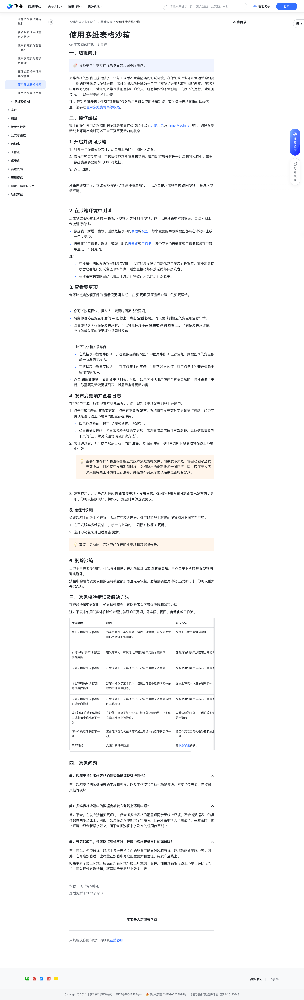

# 使用多维表格沙箱

> 来源：[飞书帮助中心](https://www.feishu.cn/hc/zh-CN/articles/629612259790)  
> 分类：多维表格 / 快速入门 / 基础设置  
> 抓取时间：2026-09-22T01:16:01.264Z

## 界面截图

### 文档内配图

1. 配图：https://p1-hera.feishucdn.com/tos-cn-i-jbbdkfciu3/d04d4023f23949029a01d99821661a4b~tplv-jbbdkfciu3-image:0:0.image
2. 配图：https://p1-hera.feishucdn.com/tos-cn-i-jbbdkfciu3/4639bd1cac7241eea64fa30459ce52d2~tplv-jbbdkfciu3-image:0:0.image
3. 配图：https://p1-hera.feishucdn.com/tos-cn-i-jbbdkfciu3/2f5823f1ee024a228c48cc66cb7de1aa~tplv-jbbdkfciu3-image:0:0.image
4. 配图：https://p1-hera.feishucdn.com/tos-cn-i-jbbdkfciu3/dc5eab07c8944317ba65809b50484aa3~tplv-jbbdkfciu3-image:0:0.image
5. 配图：https://p1-hera.feishucdn.com/tos-cn-i-jbbdkfciu3/2aca3807f33740c593b43ba3c43fbeea~tplv-jbbdkfciu3-image:0:0.image

## 功能定位

本页对应飞书帮助中心「多维表格 / 快速入门 / 基础设置」下的「使用多维表格沙箱」。以下需求描述依据官方说明文档提炼，用于指导 DuoWei 对标实现。

## 功能目标

一、功能简介

## 文档结构（官方章节）

- 一、功能简介​
- 二、操作流程​
- 开启并访问沙箱​
- 在沙箱环境中测试​
- 查看变更项​
- 发布变更项并查看日志​
- 更新沙箱​
- 删除沙箱​
- 三、常见校验错误及解决方法​
- 四、常见问题​

## 详细功能说明

一、功能简介

二、操作流程

开启并访问沙箱

打开一个多维表格文件，点击右上角的 ··· 图标 > 沙箱。

选择沙箱复制范围：可选择仅复制多维表格结构，或自动将部分数据一并复制到沙箱中。每张数据表最多复制前 1,000 行数据。

点击 创建。

在沙箱环境中测试

数据表：新增、编辑、删除数据表中的字段或视图，每个变更的字段或视图都将在沙箱中生成一个变更项。

自动化和工作流：新增、编辑、删除自动化或工作流，每个变更的自动化或工作流都将在沙箱中生成一个变更项。

在沙箱中测试发送飞书消息节点时，会将消息发送给自动化或工作流的设置者，而非消息接收者或群组；测试发送邮件节点，则会直接将邮件发送给邮件接收者。

在沙箱中触发的自动化和工作流运行将被计入总的运行次数中。

查看变更项

你可以按照模块、操作人、变更时间筛选变更项。

将鼠标悬停在变更项后的 ··· 图标上，点击 查看 按钮，可以跳转到相应的变更项查看详情。

当变更项之间存在依赖关系时，可以将鼠标悬停在 依赖项 列的 查看 上，查看依赖关系详情。存在依赖关系的变更项必须同时发布。

在数据表中新增字段 A，并在该数据表的视图 1 中使用字段 A 进行分组，则视图 1 的变更依赖于新增的字段 A。

在数据表中新增字段 A，并在工作流 1 的节点中引用字段 A 的值，则工作流 1 的变更依赖于新增的字段 A。

点击 刷新变更项 可刷新变更项列表。例如，如果有其他用户在你查看变更项时，对沙箱做了更新，你需要刷新变更项列表，以显示全部更新内容。

发布变更项并查看日志

点击沙箱顶部的 查看变更项，点击右下角的 发布。系统将在发布前对变更项进行校验，验证变更项是否与线上环境中的配置存在冲突。

如果通过验证，将显示“校验通过，待发布”。

如果未通过校验，将显示校验失败的变更项。你需要修复错误并再次验证，具体信息请参考下文的“三、常见校验错误及解决方法”。

验证通过后，你可以再次点击右下角的 发布。发布成功后，沙箱中的所有变更项将在线上环境中生效。

发布成功后，点击沙箱顶部的 查看变更项 > 发布日志，你可以使用发布日志查看已发布的变更项。你可以按照模块、操作人、变更时间筛选变更项。

更新沙箱

在正式版本多维表格中，点击右上角的 ··· 图标 > 沙箱 > 更新。

选择沙箱复制范围后点击 更新。

删除沙箱

三、常见校验错误及解决方法

错误提示

解决方法

线上环境缺失该 [实体]

沙箱中修改了某个实体。但线上环境中，在校验发生前已经将该实体删除。

在线上环境中恢复该实体。

沙箱环境 [实体] 的变更项有更新

在发布期间，有其他用户在沙箱中更新了该实体。

在变更项列表中点击右上角的 刷新变更项。

沙箱环境缺失该 [实体]

在发布期间，有其他用户在沙箱中删除了该实体。

线上环境缺失该 [实体] 的其他依赖项

沙箱中修改了某个实体，但线上环境中已将该实体依赖的其他实体删除。

在线上环境中恢复依赖的实体。

沙箱环境缺失该 [实体] 的其他依赖项

在发布期间，有其他用户在沙箱中删除了该实体依赖的其他实体。

该 [实体] 的其他依赖项在线上和沙箱环境不一致

在沙箱中修改了某个实体，该实体依赖的另一个实体在线上环境中被修改。

查看依赖的实体，并保证该实体在沙箱和线上环境中是一致的。

[实体] 的启停状态不一致

工作流或自动化在沙箱和线上环境中的启停状态不一致。

将工作流或自动化在沙箱和线上环境的启停状态调整一致。

未知错误

无法判断具体原因

需联系客服解决。

四、常见问题

问：沙箱支持对多维表格的哪些功能模块进行测试？

答：沙箱支持测试数据表的字段和视图，以及工作流和自动化功能模块。不支持仪表盘、连接器、文档等模块。

问：多维表格沙箱中的数据会被发布到线上环境中吗？

答：不会。在发布沙箱变更项时，仅会将多维表格的配置项同步至线上环境，不会将数据表中的具体数据同步至线上。例如，如果在沙箱中新增了字段 A，且在沙箱中填入了测试值。在发布时，线上环境中只会新增字段 A，而不会将沙箱中字段 A 的值同步至线上

问：开启沙箱后，还可以继续修改线上环境中多维表格文件的配置吗？

答：可以，但修改线上环境中多维表格文件的配置可能导致沙箱与线上环境的配置出现冲突。因此，在开启沙箱后，应尽量在沙箱中完成配置更新和验证，再发布至线上。如果更新了线上环境，应保证沙箱环境与线上环境的一致性。如果沙箱相较线上环境已经比较陈旧，可以通过更新沙箱，将其同步至与线上版本一致。

错误提示 | 原因 | 解决方法

线上环境缺失该 [实体] | 沙箱中修改了某个实体。但线上环境中，在校验发生前已经将该实体删除。 | 在线上环境中恢复该实体。

沙箱环境 [实体] 的变更项有更新 | 在发布期间，有其他用户在沙箱中更新了该实体。 | 在变更项列表中点击右上角的 刷新变更项。

沙箱环境缺失该 [实体] | 在发布期间，有其他用户在沙箱中删除了该实体。 | 在变更项列表中点击右上角的 刷新变更项。

线上环境缺失该 [实体] 的其他依赖项 | 沙箱中修改了某个实体，但线上环境中已将该实体依赖的其他实体删除。 | 在线上环境中恢复依赖的实体。

沙箱环境缺失该 [实体] 的其他依赖项 | 在发布期间，有其他用户在沙箱中删除了该实体依赖的其他实体。 | 在变更项列表中点击右上角的 刷新变更项。

该 [实体] 的其他依赖项在线上和沙箱环境不一致 | 在沙箱中修改了某个实体，该实体依赖的另一个实体在线上环境中被修改。 | 查看依赖的实体，并保证该实体在沙箱和线上环境中是一致的。

[实体] 的启停状态不一致 | 工作流或自动化在沙箱和线上环境中的启停状态不一致。 | 将工作流或自动化在沙箱和线上环境的启停状态调整一致。

未知错误 | 无法判断具体原因 | 需联系客服解决。

## 实现要点（对标 DuoWei）

1. **入口与信息架构**：在产品中明确该能力所属模块（快速入门 / 基础设置），并保证用户可从对应导航触达。
2. **核心交互**：按上文「详细功能说明」还原主要操作路径；截图中出现的按钮、字段、面板命名尽量与飞书语义一致或可映射。
3. **数据与权限**：若文档涉及可见范围、可编辑范围、分享或高级权限，实现时需落到角色/成员模型，并保证 API/MCP 与 UI 权限一致。
4. **边界与上限**：若文档提到数量上限、格式限制、导入导出约束，需在实现与错误提示中体现。
5. **验收**：以本页截图场景为用例，完成「能打开 / 能配置 / 能保存 / 能被 Agent 读写（如适用）」四项检查。

## 原始摘录摘要

> 一、功能简介 二、操作流程 开启并访问沙箱 打开一个多维表格文件，点击右上角的 ··· 图标 > 沙箱。 选择沙箱复制范围：可选择仅复制多维表格结构，或自动将部分数据一并复制到沙箱中。每张数据表最多复制前 1,000 行数据。 点击 创建。 在沙箱环境中测试 数据表：新增、编辑、删除数据表中的字段或视图，每个变更的字段或视图都将在沙箱中生成一个变更项。 自动化和工作流：新增、编辑、删除自动化或工作流，每个变更的自动化或工作流都将在沙箱中生成一个变更项。 在沙箱中测试发送飞书消息节点时，会将消息发送给自动化或工作流的设置者，而非消息接收者或群组；测试发送邮件节点，则会直接将邮件发送给邮件接收者。 在沙箱中触发的自动化和工作流运行将被计入总的运行次数中。 查看变更项 你可以按照模块、操作人、变更时间筛选变更项。 将鼠标悬停在变更项后的 ··· 图标上，点击 查看 按钮，可以跳转到相应的变更项查看详情。 当变更项之间存在依赖关系时，可以将鼠标悬停在 依赖项 列的 查看 上，查看依赖关系详情。存在依赖关系的变更项必须同时发布。 在数据表中新增字段 A，并在该数据表的视图 1 中使用字段 A 进行分组，则视图 1 的变更依赖于新增的字段 A。 在数据表中新增字段 A，并在工作流 1 的节点中引用字段 A 的值，则工作流 1 的变更依赖于新增的字段 A。 点击 刷新变更项 可刷新变更项列表。例如，如果有其他用户在你查看变更项时，对沙箱做了更新，你需要刷新变更项列表，以显示全部更新内容。 发布变更项并查看日志 点击沙箱顶部的 查看变更项，点击右下角的 发布。系统将在发布前对变更项进行校验，验证变更项是否与线上环境中的配置存在冲突。 如果通过验证，将显示“校验通过，待发布”。 如果未通过校验，将显示校验失败的变更项。你需要修复错误并再次验证，具体信息请参考下文的“三、常见校验错误及解决方法…

## 元数据

- article_id: `7536069177958744092`
- category_id: `7225072576895254530`
- path: `/hc/zh-CN/articles/629612259790`
- extracted_text_length: 2403
