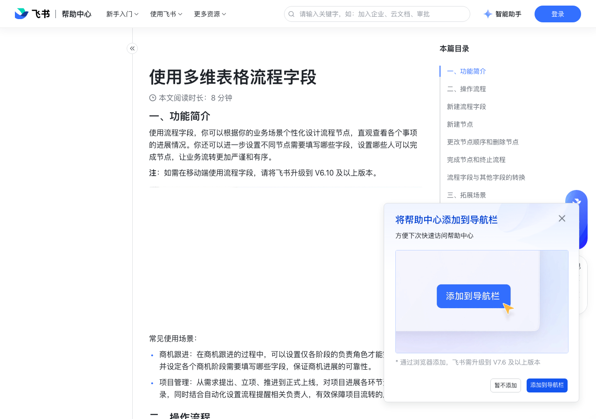

# 使用多维表格流程字段

> 来源：[飞书帮助中心](https://www.feishu.cn/hc/zh-CN/articles/127551385673)  
> 分类：多维表格 / 字段 / 业务字段  
> 抓取时间：2026-09-22T01:21:35.643Z

## 界面截图

### 文档内配图

1. 配图：https://p1-hera.feishucdn.com/tos-cn-i-jbbdkfciu3/720b2665ca1e4f04b7a33a9f69a550ce~tplv-jbbdkfciu3-image:0:0.image
2. 配图：https://p1-hera.feishucdn.com/tos-cn-i-jbbdkfciu3/37557b35cac04960a2a37dac59530f64~tplv-jbbdkfciu3-image:0:0.image
3. 配图：https://p1-hera.feishucdn.com/tos-cn-i-jbbdkfciu3/1440171954ba4394a417642d3459aef1~tplv-jbbdkfciu3-image:0:0.image
4. 配图：https://p1-hera.feishucdn.com/tos-cn-i-jbbdkfciu3/f26fa6569ea84503b5ebc6943ac1a2df~tplv-jbbdkfciu3-image:0:0.image
5. 配图：https://p1-hera.feishucdn.com/tos-cn-i-jbbdkfciu3/d99b65292bec43538ff69ed5d22aed22~tplv-jbbdkfciu3-image:0:0.image
6. 配图：https://p1-hera.feishucdn.com/tos-cn-i-jbbdkfciu3/3acd32fdd1454b28831f7f98ef5601b1~tplv-jbbdkfciu3-image:0:0.image
7. 配图：https://p1-hera.feishucdn.com/tos-cn-i-jbbdkfciu3/5d978bfc64c54c7f810fe3379462b6ec~tplv-jbbdkfciu3-image:0:0.image
8. 配图：https://p1-hera.feishucdn.com/tos-cn-i-jbbdkfciu3/20f361ac8f1d407abf71506345fa2c60~tplv-jbbdkfciu3-image:0:0.image
9. 配图：https://p1-hera.feishucdn.com/tos-cn-i-jbbdkfciu3/29f73cf75a3d41c4b7e02304c4876b31~tplv-jbbdkfciu3-image:0:0.image
10. 配图：https://p1-hera.feishucdn.com/tos-cn-i-jbbdkfciu3/d7a778bb1ea34bdf9f9c47da4c91c961~tplv-jbbdkfciu3-image:0:0.image
11. 配图：https://p1-hera.feishucdn.com/tos-cn-i-jbbdkfciu3/d13248d4e1a444bb9d3a5f05fe536fa6~tplv-jbbdkfciu3-image:0:0.image
12. 配图：https://p1-hera.feishucdn.com/tos-cn-i-jbbdkfciu3/4961e7386a854cf6bf5f130f1395a2a2~tplv-jbbdkfciu3-image:0:0.image
13. 配图：https://p1-hera.feishucdn.com/tos-cn-i-jbbdkfciu3/057a226565fd422fb231edcd4d6a7f91~tplv-jbbdkfciu3-image:0:0.image
14. 配图：https://p1-hera.feishucdn.com/tos-cn-i-jbbdkfciu3/464f59a9851b43e483c2f33635463969~tplv-jbbdkfciu3-image:0:0.image
15. 配图：https://p1-hera.feishucdn.com/tos-cn-i-jbbdkfciu3/ed3d740091a3437298f6baf0bfb2d92e~tplv-jbbdkfciu3-image:0:0.image

## 功能定位

本页对应飞书帮助中心「多维表格 / 字段 / 业务字段」下的「使用多维表格流程字段」。以下需求描述依据官方说明文档提炼，用于指导 DuoWei 对标实现。

## 功能目标

一、功能简介

## 文档结构（官方章节）

- 一、功能简介​
- 二、操作流程​
- 新建流程字段​
- 新建节点​
- 更改节点顺序和删除节点​
- 完成节点和终止流程​
- 流程字段与其他字段的转换​
- 三、拓展场景​
- 记录重要节点的完成时间​
- 自动展示项目的进展百分比​
- 四、常见问题​

## 详细功能说明

一、功能简介

常见使用场景：

商机跟进：在商机跟进的过程中，可以设置仅各阶段的负责角色才能完成节点，并设定各个商机阶段需要填写哪些字段，保证商机进展的可靠性。

项目管理：从需求提出、立项、推进到正式上线，对项目进展各环节进行跟踪记录，同时结合自动化设置流程提醒相关负责人，有效保障项目流转的严谨性。

二、操作流程

新建流程字段

节点名称：必填项，个性化设置各个节点的名称。你可以通过双击节点输入名称，在下方文本框内填写，或右键点击节点后选择 重命名，来填写或更改节点名称。

节点颜色：点击节点名称右侧的图标，或右键点击节点后选择 背景颜色，来设置节点颜色。

谁可以完成该节点：必填项，可设置为“可编辑当前字段的所有人”，或是选择数据表中的一个人员字段。

注：除了设置的指定人员可完成节点之外，拥有可管理权限的用户可以完成所有节点。

完成节点需填写字段：数据表内的字段均可作为选项，还可以设置哪些字段为必填。

注：不支持设置为必填的字段包括：公式、查找引用、按钮、创建人、创建时间、修改人、最后更新时间、由人员字段拓展出的通讯录信息。

新建节点

更改节点顺序和删除节点

更改节点顺序：你可以长按某个节点并拖拽，来更改节点的先后顺序。

“完成节点需填写字段”内的字段顺序，同样支持拖拽修改。

删除节点：右键点击节点，选择 删除。

完成节点和终止流程

流程字段与其他字段的转换

三、拓展场景

记录重要节点的完成时间

新建一个日期字段，用于记录节点的完成时间。

设置自动化流程的触发条件为“修改记录时”，选择关注的字段为流程字段（商机状态），变更为等于“合同签订”节点已完成时。

设置执行操作为“修改记录”，选择第 1 步修改的记录，选择日期字段并写入“操作执行时间”。

运行自动化流程即可。

自动展示项目的进展百分比

四、常见问题

问：一个多维表格流程字段可以设置多少个节点？

答：最多可以设置 10 个节点。

问：谁可以进行多维表格流程节点配置？

答：若未开启多维表格高级权限，拥有可编辑权限的用户可以进行节点配置；若开启了高级权限，拥有可管理权限的用户可以进行节点配置。

问：在多维表格中，如何批量复制并粘贴字段？

答：选中多个字段后，你可以使用快捷键 Ctrl + C（Win）或 ⌘ + C（Mac）复制，用 Ctrl + V（Win）或 ⌘ + V（Mac）粘贴。粘贴时需确保已创建好相同类型、相同数量的空白字段。

## 实现要点（对标 DuoWei）

1. **入口与信息架构**：在产品中明确该能力所属模块（字段 / 业务字段），并保证用户可从对应导航触达。
2. **核心交互**：按上文「详细功能说明」还原主要操作路径；截图中出现的按钮、字段、面板命名尽量与飞书语义一致或可映射。
3. **数据与权限**：若文档涉及可见范围、可编辑范围、分享或高级权限，实现时需落到角色/成员模型，并保证 API/MCP 与 UI 权限一致。
4. **边界与上限**：若文档提到数量上限、格式限制、导入导出约束，需在实现与错误提示中体现。
5. **验收**：以本页截图场景为用例，完成「能打开 / 能配置 / 能保存 / 能被 Agent 读写（如适用）」四项检查。

## 原始摘录摘要

> 一、功能简介 常见使用场景： 商机跟进：在商机跟进的过程中，可以设置仅各阶段的负责角色才能完成节点，并设定各个商机阶段需要填写哪些字段，保证商机进展的可靠性。 项目管理：从需求提出、立项、推进到正式上线，对项目进展各环节进行跟踪记录，同时结合自动化设置流程提醒相关负责人，有效保障项目流转的严谨性。 二、操作流程 新建流程字段 节点名称：必填项，个性化设置各个节点的名称。你可以通过双击节点输入名称，在下方文本框内填写，或右键点击节点后选择 重命名，来填写或更改节点名称。 节点颜色：点击节点名称右侧的图标，或右键点击节点后选择 背景颜色，来设置节点颜色。 谁可以完成该节点：必填项，可设置为“可编辑当前字段的所有人”，或是选择数据表中的一个人员字段。 注：除了设置的指定人员可完成节点之外，拥有可管理权限的用户可以完成所有节点。 完成节点需填写字段：数据表内的字段均可作为选项，还可以设置哪些字段为必填。 注：不支持设置为必填的字段包括：公式、查找引用、按钮、创建人、创建时间、修改人、最后更新时间、由人员字段拓展出的通讯录信息。 新建节点 更改节点顺序和删除节点 更改节点顺序：你可以长按某个节点并拖拽，来更改节点的先后顺序。 “完成节点需填写字段”内的字段顺序，同样支持拖拽修改。 删除节点：右键点击节点，选择 删除。 完成节点和终止流程 流程字段与其他字段的转换 三、拓展场景 记录重要节点的完成时间 新建一个日期字段，用于记录节点的完成时间。 设置自动化流程的触发条件为“修改记录时”，选择关注的字段为流程字段（商机状态），变更为等于“合同签订”节点已完成时。 设置执行操作为“修改记录”，选择第 1 步修改的记录，选择日期字段并写入“操作执行时间”。 运行自动化流程即可。 自动展示项目的进展百分比 四、常见问题 问：一个多维表格流程字段可以设置多少个节点？ 答：最多可以设置 10 个节…

## 元数据

- article_id: `7260374735972204572`
- category_id: `7187723341653000220`
- path: `/hc/zh-CN/articles/127551385673`
- extracted_text_length: 1009
